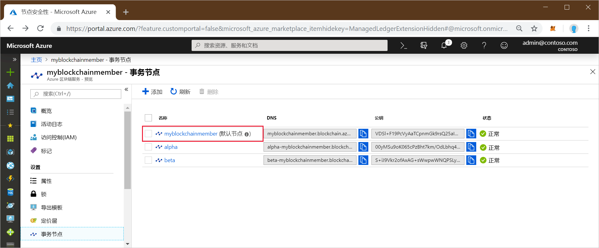
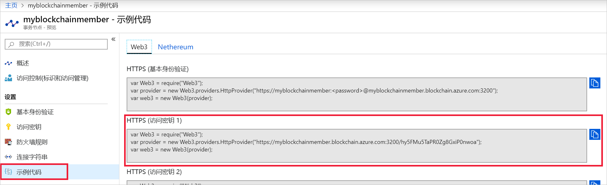

# <a name="quickstart-use-truffle-to-connect-to-a-an-azure-blockchain-service-network"></a>快速入门：使用 Truffle 连接到 Azure 区块链服务网络

Truffle 是一个区块链开发环境，可以用来连接到 Azure 区块链服务节点。

[!INCLUDE [quickstarts-free-trial-note](../../../includes/quickstarts-free-trial-note.md)]

## <a name="prerequisites"></a>先决条件

* [创建 Azure 区块链成员](create-member.md)
* Truffle 要求安装多个工具，包括 [Node.js](https://nodejs.org)、[Git](https://git-scm.com/book/en/v2/Getting-Started-Installing-Git) 和 [Truffle](https://github.com/trufflesuite/truffle)。

    若要快速在 Windows 10 上进行安装，请为 Unix Bash shell 终端安装 [Ubuntu on Windows](https://www.microsoft.com/p/ubuntu/9nblggh4msv6)，然后安装 [Truffle](https://github.com/trufflesuite/truffle)。 Ubuntu on Windows 分发版包括 Node.js 和 Git。

## <a name="create-truffle-project"></a>创建 Truffle 项目

1. 打开一个 Bash shell 终端。
1. 将目录更改为你要在其中创建 Truffle 项目目录的位置。 例如，

    ``` bash
    cd /mnt/c
    ```

1. 为该项目创建一个目录并将路径更改为新目录。 例如，

    ``` bash
    mkdir truffledemo
    cd truffledemo
    ```

1. 在项目文件夹中安装 Ethereum JavaScript API web3。 当前需要 web3 版本 1.0.0-beta.37。

    ``` bash
    npm install web3@1.0.0-beta.37
    ```

    在安装过程中可能会收到 npm 警告。

1. 初始化 Truffle 项目。

    ``` bash
    truffle init
    ```

1. 启动 Truffle 的交互式开发控制台。

    ``` bash
    truffle develop
    ```

    Truffle 会创建一个本地开发区块链，并提供一个交互式控制台。

## <a name="connect-to-transaction-node"></a>连接到事务节点

我们将使用 Web3 连接到事务节点。 可以从 Azure 门户获取 Web3 连接字符串。

1. 登录到 [Azure 门户](https://portal.azure.com)。
1. 导航到你的 Azure 区块链服务成员。 选择“事务节点”和默认事务节点链接。

    

1. 选择“示例代码”>“Web3”。
1. 从“HTTPS(访问密钥 1)”中复制 JavaScript。 你需要将此代码用于 Truffle 的交互式开发控制台。

    

1. 将上一步中的 JavaScript 代码粘贴到 Truffle 交互式开发控制台。 该代码将创建连接到你的 Azure 区块链服务事务节点的一个 web3 对象。

    示例输出：

    ```bash
    truffle(develop)> var Web3 = require("Web3");
    truffle(develop)> var provider = new Web3.providers.HttpProvider("https://myblockchainmember.blockchain.azure.com:3200/hy5FMu5TaPR0Zg8GxiPwned");
    truffle(develop)> var web3 = new Web3(provider);
    truffle(develop)>
     ```

    你可以调用 **web3** 对象上的方法来与事务节点进行交互。

1. 调用 **getBlockNumber** 方法来返回当前的块编号。

    ```bash
    web3.eth.getBlockNumber();
    ```

    示例输出：

    ```bash
    truffle(develop)> web3.eth.getBlockNumber();
    18567
    ```
1. 退出 Truffle 开发控制台。

    ```bash
    .exit
    ```

## <a name="next-steps"></a>后续步骤

在本快速入门中，你创建了一个 Truffle 项目来连接到你的 Azure 区块链服务默认事务节点。

请尝试下一教程，以使用 Truffle 来向你的联盟区块链网络发送事务。

> [!div class="nextstepaction"]
> [发送事务](send-transaction.md)