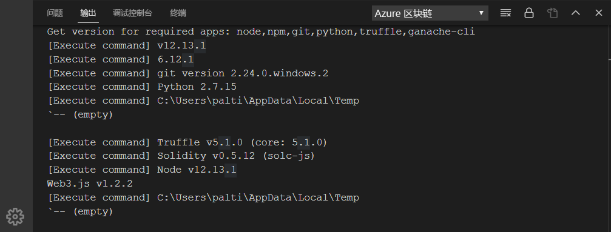
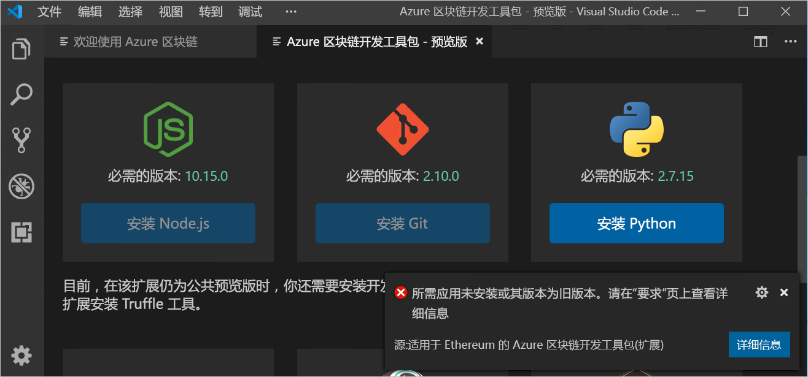
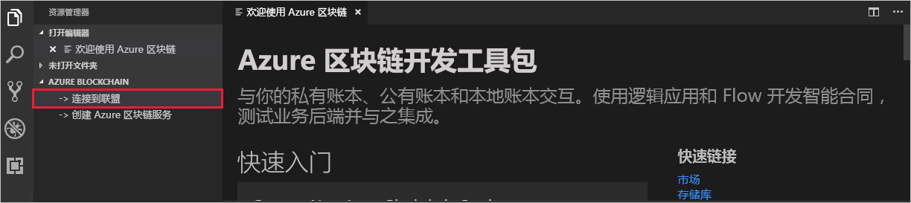
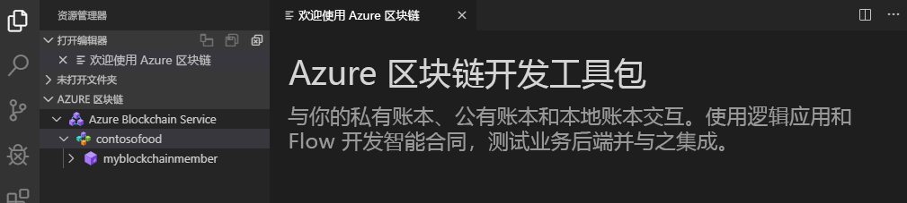

# 快速入门：使用 Visual Studio Code 连接到 Azure 区块链服务联盟网络

在本快速入门中，将安装适用于 Ethereum 的 Azure 区块链开发工具包 Visual Studio Code (VS Code) 扩展并使用它附加到 Azure 区块链服务上的联盟。 Azure 区块链开发工具包简化了在 Ethereum 区块链账本上创建、连接、生成和部署智能合同的方式。

[!INCLUDE [quickstarts-free-trial-note](../../../includes/quickstarts-free-trial-note.md)]

## 先决条件

* 完整[快速入门：使用 Azure 门户创建区块链成员](create-member.md)或[快速入门：通过 Azure CLI 创建 Azure 区块链服务区块链成员](create-member-cli.md)
* [Visual Studio Code](https://code.visualstudio.com/Download)
* [适用于 Ethereum 的 Azure 区块链开发工具包扩展](https://marketplace.visualstudio.com/items?itemName=AzBlockchain.azure-blockchain)
* [Node.js 10.15.x 或更高版本](https://nodejs.org/download)
* [Git 2.10.x 或更高版本](https://git-scm.com)
* [Python 2.7.15](https://www.python.org/downloads/release/python-2715/) 将 python.exe 添加到路径中。 Azure 区块链开发工具包需要路径中的 Python 版本 2.7.15。
* [Truffle 5.0.0](https://www.trufflesuite.com/docs/truffle/getting-started/installation)
* [Ganache CLI 6.0.0](https://github.com/trufflesuite/ganache-cli)

在 Windows 上，node-gyp 模块需要使用已安装的 C++ 编译器。 可以使用 MSBuild 工具：

* 如果安装了 Visual Studio 2017，则将 npm 配置为通过命令 `npm config set msvs_version 2017 -g` 使用 MSBuild 工具
* 如果安装了 Visual Studio 2019，则为 npm 设置 MSBuild 工具路径。 例如： `npm config set msbuild_path "C:\Program Files (x86)\Microsoft Visual Studio\2019\Community\MSBuild\Current\Bin\MSBuild.exe"`
* 如果都不是，则在提升的*以管理员身份运行*命令外壳中，使用 `npm install --global windows-build-tools` 安装独立的 VS Build 工具。

有关 node-gyp 的详细信息，请参阅 [GitHub 上的 node-gyp 存储库](https://github.com/node-gyp)。

### 验证 Azure 区块链开发工具包环境

Azure 区块链开发工具包将验证你的开发环境是否符合先决条件。 若要验证开发环境：

在 VS Code 命令面板中选择“Azure 区块链:  显示欢迎页”。

Azure 区块链开发工具包将运行一个验证脚本，完成验证大约需要一分钟时间。 可以选择“终端”>“新建终端”来查看输出。  在终端菜单栏中选择“输出”选项卡，并从下拉列表中选择“Azure 区块链”。   如果验证成功，将出现下图所示的信息：

 如果缺少所需的工具，名为“Azure 区块链开发工具包 - 预览版”的新选项卡会列出所需的工具及其下载链接  。

在继续此快速入门之前，请安装任何缺少的必备组件。

## 连接到联盟成员

可以使用 Azure 区块链开发工具包 VS Code 扩展连接到联盟成员。 连接到联盟后，可以编译、生成智能合同并将其部署到 Azure 区块链服务联盟成员。

如果无权访问 Azure 区块链服务联盟成员，请根据以下教程中所述满足先决条件：[快速入门：使用 Azure 门户创建区块链成员](create-member.md)或[快速入门：通过 Azure CLI 创建 Azure 区块链服务区块链成员](create-member-cli.md)。

1. 在 VS Code 的资源管理器窗格中，展开“Azure 区块链”扩展  。
1. 选择“连接到联盟”。 

   

    如果系统提示你进行 Azure 身份验证，请遵照提示使用浏览器进行身份验证。
1. 在命令面板下拉列表中选择“连接到 Azure 区块链服务联盟”。 
1. 选择与 Azure 区块链服务联盟成员相关联的订阅和资源组。
1. 从列表中选择你的联盟。

VS Code 资源管理器侧栏中列出了联盟和区块链成员。

## 后续步骤

在本快速入门中，你已使用适用于 Ethereum 的 Azure 区块链开发工具包 VS Code 扩展附加到 Azure 区块链服务上的联盟。 尝试下一个教程，使用适用于 Ethereum 的 Azure 区块链开发工具包通过事务创建、生成、部署和执行智能合同函数。

> [!div class="nextstepaction"]
> [在 Azure 区块链服务中创建、生成和部署智能合同](send-transaction.md)