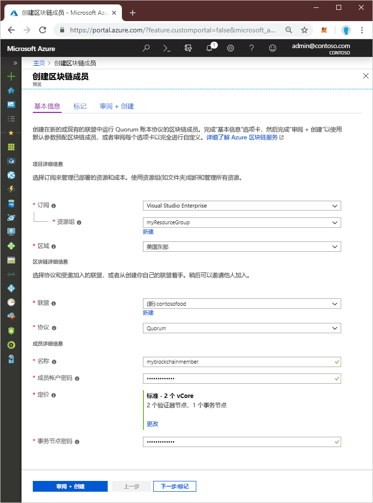
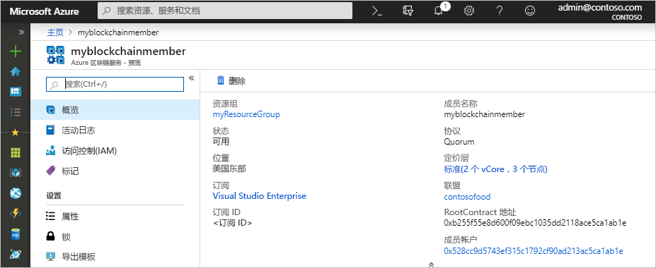

# 快速入门：使用 Azure 门户创建 Azure 区块链服务

Azure 区块链服务是一个区块链平台，可以用来在智能合同中执行你的业务逻辑。 本快速入门展示了如何开始使用 Azure 门户创建托管账本。

[!INCLUDE [quickstarts-free-trial-note](../../../includes/quickstarts-free-trial-note.md)]

## 创建托管账本

创建 Azure 区块链服务时，会使用定义好的一组计算和存储资源。

1. 登录到 [Azure 门户](https://portal.azure.com)。
1. 在 Azure 门户的左上角选择“创建资源”。 
1. 选择“区块链” > “Azure 区块链服务”。  
1. 创建模板。

    

    设置 | 说明
    --------|------------
    区块链成员 | 选择用于标识 Azure 区块链服务成员的唯一名称。 区块链成员名称只能包含小写字母和数字。 第一个字符必须是字母。 值长度必须介于 2 到 20 个字符之间。
    订阅 | 选择要用于你的服务的 Azure 订阅。 如果有多个订阅，请选择要计费的资源所在的订阅。
    资源组 | 新的资源组名称，或订阅中的现有资源组。
    区域 | 对于联盟的所有成员，位置必须相同。
    成员帐户密码 | 成员帐户密码用于加密为你的成员创建的 Ethereum 帐户的私钥。 你使用成员帐户和成员帐户密码进行联盟管理。
    联盟名称 | 对于新联盟，请输入唯一的名称。 如果通过某个计划加入联盟，则该值是你要加入的联盟。
    说明 | 联盟的说明。
    协议 |  预览版支持仲裁协议。
    定价 | 新服务的节点配置。 选择“标准”  。 默认设置是 2 个验证器节点和 1 个事务节点。
    事务节点密码 | 成员的默认事务节点的密码。 连接到区块链成员的默认事务节点公共终结点时，请使用密码进行基本身份验证。

1. 选择“创建”  来预配服务。 预配大约需要 10 分钟。
1. 若要监视部署过程，请在工具栏上选择“通知”。 
1. 在部署后，导航到你的区块链成员。

选择“概述”  ，你可以查看你的服务的基本信息，包括 RootContract 地址和成员帐户。

## 清理资源

你可以将所创建的成员用于下一快速入门或教程。 当不再需要这些资源时，可以通过删除使用 Azure 区块链服务创建的 `myResourceGroup` 资源组来删除这些资源。

若要删除资源组，请执行以下操作：

1. 在 Azure 门户中，导航至左侧导航窗格中的“资源组”  ，然后选择要删除的资源组。
2. 选择“删除资源组”  。 输入资源组名称确认删除并选择“删除”  。

## 后续步骤

> [!div class="nextstepaction"]
> [使用 MetaMask 进行连接并部署智能合同](connect-metamask.md)