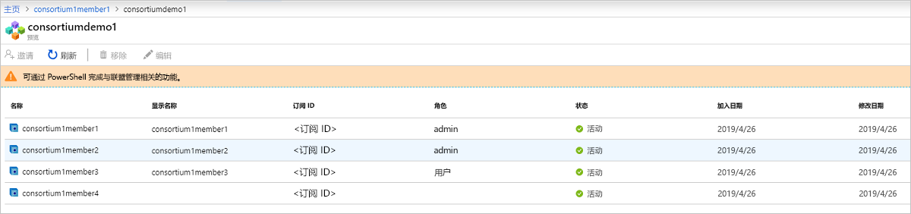

# 什么是 Azure 区块链服务？

Azure 区块链服务是一项完全托管的账本服务，使用户能够在 Azure 中大规模扩展和运营区块链网络。 通过为基础结构管理和区块链网络治理提供统一控制，Azure 区块链服务提供：

* 简单的网络部署和操作
* 内置联盟管理
* 使用常用的开发工具开发智能合同

Azure 区块链服务旨在支持多种账本协议。 当前，该服务使用[伊斯坦布尔拜占庭容错 (IBFT)](https://github.com/jpmorganchase/quorum/wiki/Quorum-Consensus) 共识机制为 Ethereum [Quorum](https://www.goquorum.com/) 账本提供支持。

这些功能几乎都不需要进行任何管理，并且都是在不另外收费的情况下提供的。 可以专注于应用开发和业务逻辑，而不是分配时间和资源来管理虚拟机和基础结构。 此外，可以继续开发应用程序，使用自己选择的开放源代码工具和平台即可交付解决方案，而无需学习新技能。

## 网络部署和操作

可通过 Azure门户、Azure CLI 或使用 Azure 区块链扩展通过 Visual Studio Code 来完成 Azure 区块链服务的部署。 简化了部署，包括预配置事务和验证器节点，用于安全隔离的 Azure 虚拟网络以及服务托管的存储。  此外，在部署新的区块链成员时，用户也可以创建或加入联盟。  联盟使不同 Azure 订阅中的多个参与方能够实现在共享区块链上安全地相互通信。  这种简化的部署将区块链网络的部署从几天缩短到几分钟。

### 性能和服服务层级

Azure 区块链服务提供两种服务层：“基本”和“标准”   。 每层都提供不同的性能和功能，以支持轻量级开发和测试工作负载，直至大规模的生产区块链部署。 使用“基本”  层进行开发、测试和概念证明。 使用“标准”  层进行生产级部署。 这两层均包括至少一个事务节点、一个验证器节点（基本）或两个验证器节点（标准）。 

除了提供两个验证器节点之外，“标准层”还为每个事务和验证器节点提供了 2 个 vCore，而“基本”层提供 1 个 vCore 配置   。   通过为事务和验证器节点提供 2 个 vCore，1 个 vCore 可以专用于 Quorum 账本，而另 1 个 vCore 可以用于其他与基础结构相关的服务，从而确保生产区块链工作负载的性能达到最优。 有关定价详细信息的更多信息，请参阅 [Azure 区块链服务定价](https://azure.microsoft.com/pricing/details/blockchain-service)。

### 安全性和维护

预配第一个区块链成员后，便可以向成员添加其他事务节点。  默认情况下，事务节点通过防火墙规则进行保护，并需要进行访问配置。  此外，所有事务节点均通过 TLS 加密移动中的数据。  我们提供多种用于保护事务节点访问的选项，其中包括防火墙规则、基本身份验证、访问密钥以及 Azure Active Directory 集成。 有关详细信息，请参阅[配置事务节点](configure-transaction-nodes.md)和[配置 Azure Active Directory 访问](configure-aad.md)。

作为一项托管服务，Azure 区块链服务可确保为区块链成员的节点修补最新的主机操作系统和账本软件堆栈更新，并针对高可用性进行配置（仅限标准层），从而无需传统 IaaS 区块链节点所需的许多 DevOps。  有关修补和更新的详细信息，请参阅[支持的 Azure 区块链服务账本版本](ledger-versions.md)。

### 监视和日志记录

此外，Azure 区块链服务通过 Azure Monitor 服务提供丰富的指标，使你能够深入了解节点的 CPU、内存和存储使用情况。  Azure Monitor 还提供关于区块链网络活动（例如挖掘的事务和区块、事务队列深度和活动连接）的有用见解。  可以自定义指标，以提供对区块链应用程序至关重要的见解的视图。  此外，可以通过警报定义阈值，使用户能够触发操作，例如发送电子邮件或短信，运行逻辑应用、Azure Functions 或发送到自定义 Webhook。

通过 Azure Log Analytics，用户可以查看与 Quorum 账本相关的日志或其他重要信息，例如尝试与事务节点建立的连接。

## 内置联盟管理

部署第一个区块链成员时，可以加入或创建新的联盟。  联盟是一个逻辑组，用于管理在多方进程中进行处理的区块链成员之间的治理和连接。  Azure 区块链服务通过预定义的智能合同提供了内置的治理控件，用于确定联盟中的成员可以执行的操作。  这些治理控件可以由联盟的管理员按需进行自定义。 创建新的联盟时，区块链成员是联盟的默认管理员，因此能够邀请其他参与方加入联盟。  只有受到邀请才能加入联盟。  加入联盟时，区块链成员将受到联盟管理员实施的治理控件的约束。

可以通过 PowerShell 和 REST API 来执行联盟管理操作，例如在联盟中添加成员或从联盟中删除成员。 可以使用公共接口以编程方式管理联盟，而不是修改和提交基于可靠性的智能合同。 有关详细信息，请参阅[联盟管理](consortium.md)。

## 使用常用的开发工具进行开发

基于开放源代码 Quorum Ethereum 账本，可以像使用现有 Ethereum 应用程序一样开发 Azure 区块链服务应用程序。 Azure 区块链开发工具包 Visual Studio Code 扩展通过与领先的行业合作伙伴合作，使开发人员可以利用 Truffle Suite 等常用工具来构建智能合同。 使用 Azure 区块链开发工具包扩展，开发人员可以创建或连接到现有联盟，以便可以在一个 IDE 中构建和部署智能合同。 使用 Azure 区块链 Visual Studio Code 扩展，可以创建或连接到现有联盟，以便可以在一个 IDE 中生成和部署智能合同。 有关详细信息，请参阅 [VS Code 商城中的 Azure 区块链开发工具包](https://aka.ms/vscodebcextension)和 [Azure 区块链开发工具包用户指南](https://aka.ms/vscodebcextensionwiki)。

## 发布区块链数据

适用于 Azure 区块链服务的区块链数据管理器可捕获、转换 Azure 区块链服务事务数据并将其传送到 Azure 事件网格主题，提供与 Azure 服务的可靠、可缩放的区块链账本集成。 可使用区块链数据管理器集成链外应用程序和数据存储。 有关详细信息，请参阅[适用于 Azure 区块链服务的区块链数据管理器](data-manager.md)。

## 支持和反馈

对于 Azure 区块链新闻，请访问 [Azure 区块链博客](https://azure.microsoft.com/blog/topics/blockchain/)，以随时了解 Azure 区块链工程团队提供的区块链服务产品和信息。

若要提供产品反馈或请求新功能，请通过[区块链的 Azure 反馈论坛](https://aka.ms/blockchainuservoice)来为意见发布投票。

### 社区支持

与 Microsoft 工程师和 Azure 区块链社区专家交流。

* [Azure 区块链 MSDN 论坛](https://social.msdn.microsoft.com/Forums/home?forum=azureblockchain)
* [Microsoft 技术社区](https://techcommunity.microsoft.com/t5/Blockchain/bd-p/AzureBlockchain)
* [Stack Overflow](https://stackoverflow.com/questions/tagged/AzureBlockchainService)

## 后续步骤

首先，请尝试快速入门或从这些资源中找到更多详细信息。
* [使用 Azure 门户创建区块链成员](create-member.md)或[使用 Azure CLI 创建区块链成员](create-member-cli.md)
* 有关成本比较和计算器，请参阅[定价页](https://azure.microsoft.com/pricing/details/blockchain-service)。
* 使用 [Azure 区块链开发工具包](https://github.com/Azure-Samples/blockchain-devkit)构建你的第一个应用
* Azure 区块链 VSCode 扩展 [用户指南](https://github.com/Microsoft/vscode-azure-blockchain-ethereum/wiki)
