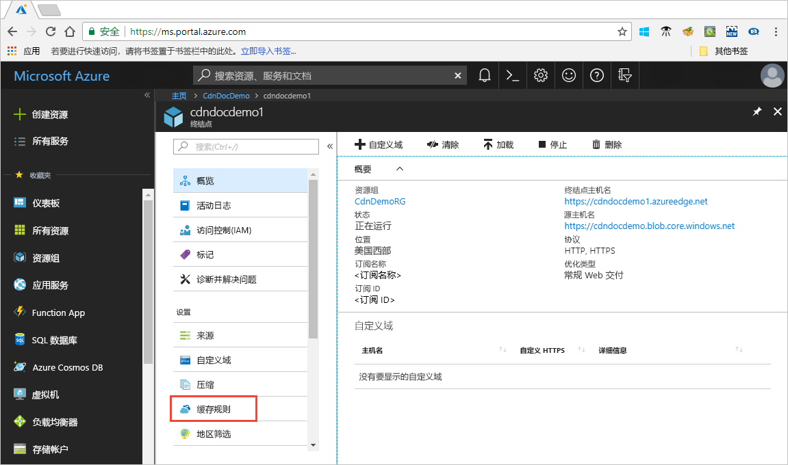

# 使用缓存规则控制 Azure CDN 缓存行为

> [!NOTE] 
> 缓存规则仅适用于 **Verizon 提供的标准 Azure CDN** 和 **Akamai 提供的标准 Azure CDN** 配置文件。 对于 **Verizon 提供的高级 Azure CDN** 配置文件，必须在**管理**门户中使用 [Azure CDN 规则引擎](cdn-rules-engine.md)来获得类似的功能。
 
Azure 内容分发网络 (CDN) 提供了两种方法来控制文件的缓存方式： 

- 缓存规则：本文介绍如何使用内容分发网络 (CDN) 缓存规则，全局性地和根据自定义条件（例如 URL 路径和文件扩展名）设置或修改默认的缓存过期行为。 Azure CDN 提供两种类型的缓存规则：

   - 全局缓存规则：可以针对配置文件中的每个终结点设置一个全局缓存规则，该规则影响对该终结点发出的所有请求。 全局缓存规则会替代所有 HTTP 缓存指令标头（如果已设置）。

   - 自定义缓存规则：可以针对配置文件中的每个终结点设置一个或多个自定义缓存规则。 自定义缓存规则将匹配特定的路径和文件扩展名，按顺序进行处理，并替代全局缓存规则（如果已设置）。 

- 查询字符串缓存：可以调整 Azure CDN 使用查询字符串处理请求的缓存方式。 有关信息，请参阅[使用查询字符串控制 Azure CDN 缓存行为](cdn-query-string.md)。 如果文件不可缓存，则根据缓存规则和 CDN 默认行为，查询字符串缓存设置不起作用。

有关默认缓存行为和缓存指令标头的信息，请参阅[缓存工作原理](cdn-how-caching-works.md)。 

## 访问 Azure CDN 缓存规则

1. 打开 Azure 门户，依次选择一个 CDN 配置文件和一个终结点。

2. 在左窗格中的“设置”下，选择“缓存规则”。

   

   “缓存规则”页随即出现。

   

## 缓存行为设置
对于全局和自定义缓存规则，可指定以下“缓存行为”设置：

- **绕过缓存**：不缓存，并忽略源提供的缓存指令标头。

- **替代**：忽略源提供的缓存指令标头；改用提供的缓存持续时间。

- **缺少时设置**：遵循源提供的缓存指令标头（如果存在）；否则，使用提供的缓存持续时间。

## 缓存过期持续时间
对于全局和自定义缓存规则，可以使用天、小时、分钟和秒作为单位指定缓存过期持续时间：

- 对于“缓存行为”设置“替代”和“缺少时设置”，有效的缓存持续时间范围为 0 秒到 366 天。 如果值为 0 秒，则 CDN 会缓存内容，但必须在源服务器上重新验证每个请求。

- 对于“绕过缓存”设置，缓存持续时间将自动设置为 0 秒且不可更改。

## 自定义缓存规则的匹配条件

对于自定义缓存规则，可以使用两个匹配条件：
 
- **路径**：此条件匹配 URL 的路径（不包括域名），并支持通配符 (\*)。 例如，_/myfile.html_、_/my/folder/*_ 和 _/my/images/*.jpg_。 最大长度为 260 个字符。

- **扩展名**：此条件匹配所请求文件的文件扩展名。 可以提供要匹配的文件扩展名的逗号分隔列表。 例如，_.jpg_、_.mp3_ 或 _.png_。 扩展名数目上限为 50 个，每个扩展名的字符数上限为 16 个。 

## 全局和自定义规则的处理顺序
全局和自定义缓存规则的处理顺序如下：

- 全局缓存规则优先于默认的 CDN 缓存行为（HTTP 缓存指令标头设置）。 

- 自定义缓存规则（如果适用）优先于全局缓存规则。 自定义缓存规则按从上到下的顺序进行处理。 也就是说，如果某个请求与两个条件匹配，则位于列表底部的规则优先于列表顶部的规则。 因此，应将更具体的规则放在列表的较低位置。

**示例**：
- 全局缓存规则： 
   - 缓存行为：**替代**
   - 缓存过期持续时间：1 天

- 自定义缓存规则 #1：
   - 匹配条件：**路径**
   - 匹配值：_/home/*_
   - 缓存行为：**替代**
   - 缓存过期持续时间：2 天

- 自定义缓存规则 #2：
   - 匹配条件：**扩展名**
   - 匹配值：_.html_
   - 缓存行为：**缺少时设置**
   - 缓存过期持续时间：3 天

如果设置了这些规则，则对 _&lt;endpoint hostname&gt;_.azureedge.net/home/index.html 发出的请求将触发自定义缓存规则 #2，该规则设置为“缺少时设置”且缓存过期持续时间为 3 天。 因此，如果 *index.html* 文件包含 `Cache-Control` 或 `Expires` HTTP 标头，则会遵循这些标头；如果未设置这些标头，则会将文件缓存 3 天。

> [!NOTE] 
> 在发生规则更改之前缓存的文件会保留其源缓存持续时间设置。 若要重置其缓存持续时间，必须[清除文件](cdn-purge-endpoint.md)。 
>
> Azure CDN 配置更改可能需要一段时间，才能在整个网络中传播： 
> - 对于 **Akamai 的 Azure CDN 标准版**配置文件，传播通常可在一分钟内完成。 
> - 对于“Verizon 提供的 Azure CDN 标准版”配置文件，传播通常在 10 分钟内完成。  
>

## 另请参阅

- [缓存工作原理](cdn-how-caching-works.md)
- [教程：设置 Azure CDN 缓存规则](cdn-caching-rules-tutorial.md)
