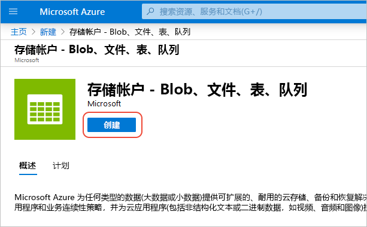

# 快速入门：将 Azure 存储帐户与 Azure CDN 集成
在此快速入门中，你将启用 [Azure 内容分发网络 (CDN)](cdn-overview.md) 来缓存 Azure 存储中的内容。 Azure CDN 为开发人员提供了一个用于交付高带宽内容的全局解决方案。 它可以在遍布美国、欧洲、亚洲、澳大利亚和南美洲的众多物理节点上缓存 blob 和计算实例的静态内容。

[!INCLUDE [quickstarts-free-trial-note](../../includes/quickstarts-free-trial-note.md)]

## 登录到 Azure 门户
使用 Azure 帐户登录到 [Azure 门户](https://portal.azure.com)。

## 创建存储帐户
使用以下过程为 Azure 订阅创建新的存储帐户。 通过存储帐户可访问 Azure 存储服务。 存储帐户表示用于访问每个 Azure 存储服务组件的最高级别的命名空间：Azure Blob、队列和表存储。 有关详细信息，请参阅 [Microsoft Azure 存储简介](../storage/common/storage-introduction.md)。

要创建存储帐户，必须是相关订阅的服务管理员或联合管理员。

可使用多种方法创建存储帐户，包括 Azure 门户和 PowerShell。 此快速入门演示了如何使用 Azure 门户。   

**为 Azure 订阅创建存储帐户**

1. 在 Azure 门户的左上角，选择“创建资源”。 

    此时会显示“新建”窗格。

2. 选择“存储”，然后选择“存储帐户 - Blob、文件、表、队列”。
    
    

    此时会显示“创建存储帐户”窗格。   

    

3. 在“名称”框中，输入子域名称。 此条目可包含 3-24 个小写字母和数字。
   
    此值会成为用于对订阅的 Blob、队列或表资源进行寻址的 URI 中的主机名。 要在 Blob 存储中对容器资源进行寻址，请使用以下格式的 URI：
   
    http://*&lt;StorageAcountLabel&gt;*.blob.core.windows.net/*&lt;mycontainer&gt;*

    其中，&lt;StorageAccountLabel&gt; 引用在“名称”框中输入的值。
   
    > [!IMPORTANT]    
    > 该 URL 标签构成存储帐户 URI 的子域，在 Azure 中的所有托管服务中必须是唯一的。
   
    此值还用作门户中存储帐户的名称，或者以编程方式访问此帐户时的名称。
    
4. 对于其余设置，请使用下表中指定的值：

    | 设置  | 值 |
    | -------- | ----- |
    | **部署模型** | 使用默认值。 |
    | **帐户种类** | 使用默认值。 |
    | **位置**    | 从下拉列表中选择“美国中部”。 |
    | **复制** | 使用默认值。 |
    | **性能** | 使用默认值。 |
    | **需要安全传输** | 使用默认值。 |
    | **订阅** | 从下拉列表中选择一个 Azure 订阅。 |
    | **资源组** | 选择“新建”，然后输入 *my-resource-group-123* 作为资源组名称。 该名称必须全局唯一。 如果它已被使用，可以输入一个不同的名称，也可以选择“使用现有”并从下拉列表中选择 **my-resource-group-123**。  有关资源组的信息，请参阅 [Azure 资源管理器概述](../azure-resource-manager/resource-group-overview.md#resource-groups)。| 
    | **配置虚拟网络** | 使用默认值。 |  
    
5. 选择“固定到仪表板”，以便在创建存储帐户后将其保存到仪表板。
    
6. 选择**创建**。 创建存储帐户可能需要几分钟时间才能完成。

## 为存储帐户启用 Azure CDN

可以直接从存储帐户中为存储帐户启用 Azure CDN。 如果要为 CDN 终结点指定高级配置设置（例如优化类型），可以使用 [Azure CDN 扩展](cdn-create-new-endpoint.md)来创建 CDN 配置文件或 CDN 终结点。

1. 从仪表板中选择一个存储帐户，然后从左窗格中选择“Azure CDN”。 如果未立即显示“Azure CDN”按钮，可在左窗格的“搜索”框中输入 CDN 来查找它。
    
    “Azure CDN”页面随即显示。

    
    
2. 输入下表中指定的必需信息来创建新的终结点：

    | 设置  | 值 |
    | -------- | ----- |
    | **CDN 配置文件** | 选择“新建”并输入 *my-cdn-profile-123* 作为配置文件名称。 此名称必须全局唯一；如果此名称已在使用，则可输入其他名称。  |
    | **定价层** | 从下拉列表中选择“标准 Verizon”。 |
    | **CDN 终结点名称** | 输入 *my-endpoint-123* 作为终结点主机名。 此名称必须全局唯一；如果此名称已在使用，则可输入其他名称。 此名称用于访问在域 _&lt;终结点名称&gt;_.azureedge.net 中缓存的资源。 默认情况下，新的 CDN 终结点使用存储帐户的主机名作为源服务器。|

3. 选择**创建**。 创建终结点之后，它会出现在终结点列表中。

    

## 启用其他 CDN 功能
在存储帐户的“Azure CDN”页面中，从列表中选择 CDN 终结点以打开 CDN 终结点配置页面。 从此页面中，可以为交付内容启用其他 CDN 功能，例如[压缩](cdn-improve-performance.md)、[查询字符串缓存](cdn-query-string.md)和[地区筛选](cdn-restrict-access-by-country.md)。 
    

## 访问 CDN 内容
若要访问 CDN 上的缓存内容，请使用门户中提供的 CDN URL。 缓存 blob 的地址采用以下格式：

http://<*EndpointName*\>.azureedge.net/<*myPublicContainer*\>/<*BlobName*\>

> [!NOTE]
> 启用对存储帐户的 Azure CDN 访问之后，所有公开可用的对象即有资格获得 CDN POP 缓存。 如果修改了当前缓存在 CDN 中的对象，则除非 Azure CDN 在缓存内容的生存时间到期后刷新其内容，否则无法通过 Azure CDN 访问新内容。

## 删除 CDN 中的内容
如果不再需要在 Azure CDN 中缓存对象，则可以执行以下步骤之一：

* 将容器设为专用容器而不是公用容器。 有关详细信息，请参阅[管理对容器和 Blob 的匿名读取访问](../storage/blobs/storage-manage-access-to-resources.md)。
* 通过 Azure 门户禁用或删除 CDN 终结点。
* 将托管服务修改为不再响应此对象的请求。

已在 Azure CDN 中缓存的对象保持缓存状态，直至对象的生存时间到期，或直至[清除](cdn-purge-endpoint.md)终结点为止。 当生存时间到期时，Azure CDN 会确定 CDN 终结点是否仍有效，以及是否仍可对该对象进行匿名访问。 如果不能，则不再缓存该对象。

## 清理资源
在前面的步骤中，在资源组中创建了 CDN 配置文件和终结点。 若要转到[后续步骤](#next-steps)，以便了解如何向终结点添加自定义域，请保存这些资源。 但是，如果认为将来不需要这些资源，可以通过删除资源组来删除它们，避免额外付费：

1. 在 Azure 门户的左侧菜单中，选择“资源组”，然后选择“my-resource-group-123”。

2. 在“资源组”页上选择“删除资源组”，在文本框中输入 *my-resource-group-123*，然后选择“删除”。

    此操作会删除在本快速入门中创建的资源组、配置文件和终结点。

3. 若要删除存储帐户，请从仪表板中选择它，然后从顶部的菜单中选择“删除”。

## 后续步骤
若要了解如何向 CDN 终结点添加自定义域，请参阅以下教程：

> [!div class="nextstepaction"]
> [教程：将自定义域添加到 Azure CDN 终结点](cdn-map-content-to-custom-domain.md)

