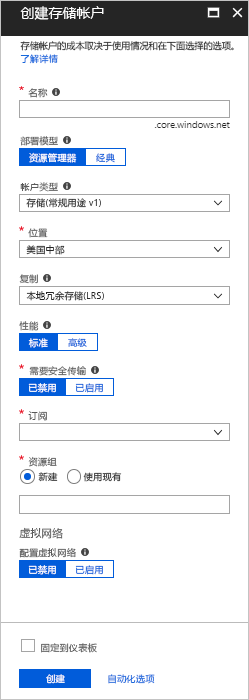
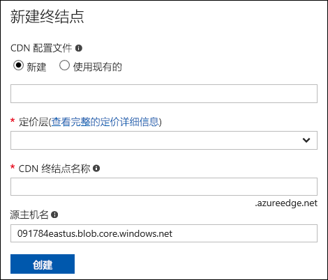
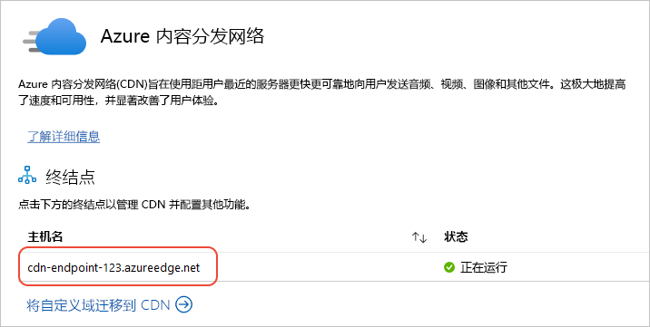
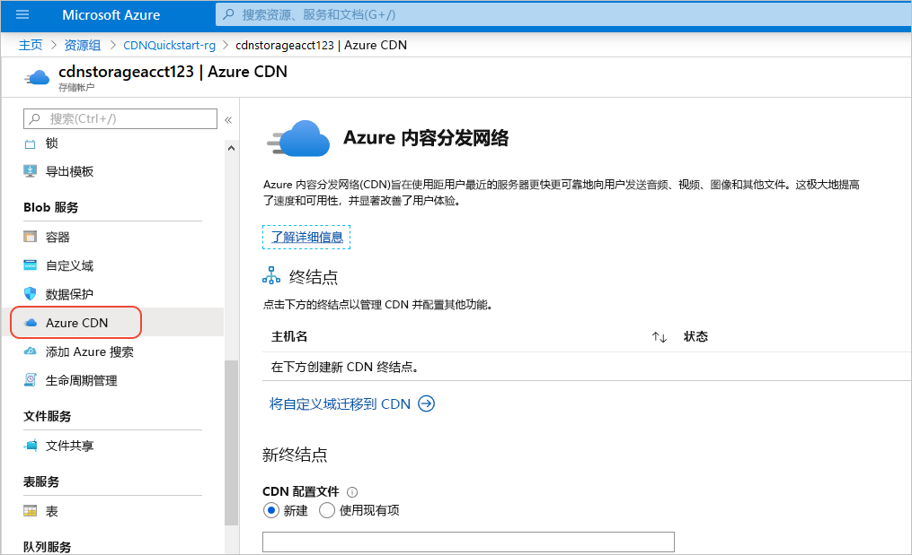

# 将 Azure 存储帐户与 Azure CDN 集成
可启用 Azure 内容交付网络 (CDN) 来缓存 Azure 存储中的内容。 Azure CDN 为开发人员提供了一个用于交付高带宽内容的全局解决方案。 它可以在遍布美国、欧洲、亚洲、澳大利亚和南美洲的众多物理节点上缓存 blob 和计算实例的静态内容。

## 步骤 1：创建存储帐户
使用以下过程为 Azure 订阅创建新的存储帐户。 通过存储帐户可访问 Azure 存储服务。 存储帐户表示用于访问每个 Azure 存储服务组件的最高级别的命名空间：Azure Blob、队列和表存储。 有关详细信息，请参阅 [Microsoft Azure 存储简介](../storage/common/storage-introduction.md)。

要创建存储帐户，必须是相关订阅的服务管理员或联合管理员。

> [!NOTE]
> 可使用多种方法创建存储帐户，包括 Azure 门户和 PowerShell。 本教程介绍如何使用 Azure 门户。   
> 

**为 Azure 订阅创建存储帐户**

1. 登录到 [Azure 门户](https://portal.azure.com)。
2. 在左上角，选择“创建资源”。 在“新建”窗格中，选择“存储”，然后选择“存储帐户 - blob、文件、表、队列”。
    
    此时会显示“创建存储帐户”窗格。   

    

3. 在“名称”框中，输入子域名称。 此条目可包含 3-24 个小写字母和数字。
   
    此值会成为用于对订阅的 Blob、队列或表资源进行寻址的 URI 中的主机名。 要在 Blob 存储中对容器资源进行寻址，请使用以下格式的 URI：
   
    http://*&lt;StorageAcountLabel&gt;*.blob.core.windows.net/*&lt;mycontainer&gt;*

    其中，&lt;StorageAccountLabel&gt; 引用在“名称”框中输入的值。
   
    > [!IMPORTANT]    
    > 该 URL 标签构成存储帐户 URI 的子域，在 Azure 中的所有托管服务中必须是唯一的。
   
    此值还用作门户中存储帐户的名称，或者以编程方式访问此帐户时的名称。
    
4. 使用“部署模型”、“帐户类型”、“性能”和“复制”的默认值。 
    
5. 对于“订阅”，选择要与存储帐户一起使用的订阅。
    
6. 对于“资源组”，选择或创建资源组。 有关资源组的信息，请参阅 [Azure 资源管理器概述](../azure-resource-manager/resource-group-overview.md#resource-groups)。
    
7. 对于“位置”，选择存储帐户的位置。
    
8. 选择“创建”。 完成存储帐户的创建过程可能需要几分钟时间。

## 步骤 2：为存储帐户启用 CDN

可直接从存储帐户中启用存储帐户的 CDN。 

1. 从仪表板中选择一个存储帐户，然后从左窗格中选择“Azure CDN”。 如果未立即显示“Azure CDN”按钮，可在左窗格的“搜索”框中输入 CDN。
    
    此时会显示“Azure 内容交付网络”窗格。

    
    
2. 输入所需信息，创建新的终结点：
    - **CDN 配置文件**：创建新的 CDN 配置文件或使用现有 CDN 配置文件。
    - **定价层**：只有在创建 CDN 配置文件时，才可选择定价层。
    - **CDN 终结点名称**：输入 CDN 终结点名称。

    > [!TIP]
    > 默认情况下，新的 CDN 终结点使用存储帐户的主机名作为源服务器。

3. 选择“创建”。 创建终结点之后，它会出现在终结点列表中。

    

> [!NOTE]
> 如果要为 CDN 终结点指定高级配置设置（例如优化类型），可以使用 [Azure CDN 扩展](cdn-create-new-endpoint.md#create-a-new-cdn-endpoint)来创建 CDN 终结点或 CDN 配置文件。

## 步骤 3：启用其他 CDN 功能

在存储帐户的“Azure CDN”窗格中，从列表中选择 CDN 终结点，打开“CDN 配置”窗格。 可为交付内容启用其他 CDN 功能，例如压缩、查询字符串和地区筛选。 还可将自定义域映射添加到 CDN 终结点并启用自定义域 HTTPS。
    

## 步骤 4：访问 CDN 内容
若要访问 CDN 上的缓存内容，请使用门户中提供的 CDN URL。 缓存 blob 的地址采用以下格式：

http://<*EndpointName*\>.azureedge.net/<*myPublicContainer*\>/<*BlobName*\>

> [!NOTE]
> 启用对存储帐户的 CDN 访问之后，所有公开可用的对象即有资格获得 CDN 边缘缓存。 如果修改了当前缓存在 CDN 中的对象，则除非 CDN 在缓存内容的生存时间到期后刷新其内容，否则无法通过 CDN 访问新内容。

## 步骤 5：从 CDN 删除内容
如果不再需要在 Azure CDN 中缓存对象，则可以执行以下步骤之一：

* 将容器设为专用容器而不是公用容器。 有关详细信息，请参阅[管理对容器和 Blob 的匿名读取访问](../storage/blobs/storage-manage-access-to-resources.md)。
* 通过 Azure 门户禁用或删除 CDN 终结点。
* 将托管服务修改为不再响应此对象的请求。

已在 Azure CDN 中缓存的对象保持缓存状态，直至对象的生存时间到期，或直至清除终结点为止。 当生存时间到期时，Azure CDN 会查看 CDN 终结点是否仍有效，以及是否仍可对该对象进行匿名访问。 如果不能，则不再缓存该对象。

## 其他资源
* [将自定义域添加到 CDN 终结点](cdn-map-content-to-custom-domain.md)
* [在 Azure CDN 自定义域上配置 HTTPS](cdn-custom-ssl.md)

