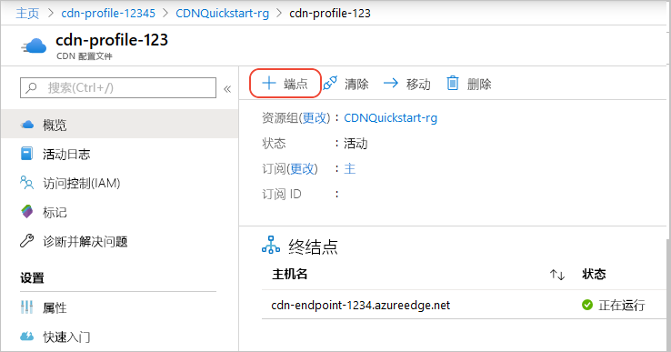
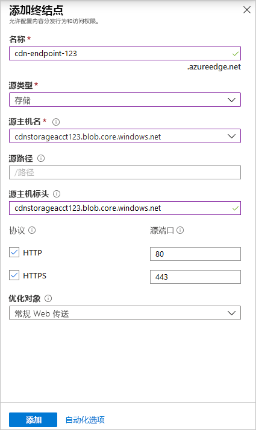
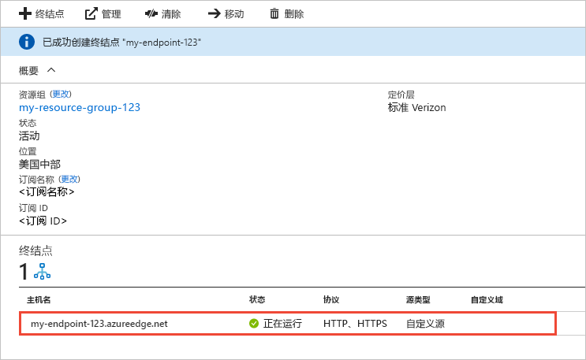

# 快速入门：创建 Azure CDN 配置文件和终结点
在本快速入门中，请通过创建新的 Azure 内容分发网络 (CDN) 配置文件和 CDN 终结点来启用 CDN。 创建配置文件和终结点以后，即可将内容交付给客户。

[!INCLUDE [quickstarts-free-trial-note](../../includes/quickstarts-free-trial-note.md)]

## 先决条件
就本快速入门来说，必须创建名为 *mystorageacct123* 的存储帐户，将其用作源服务器主机名。 有关详细信息，请参阅[将 Azure 存储帐户与 Azure CDN 集成](cdn-create-a-storage-account-with-cdn.md)

## 登录到 Azure 门户
使用 Azure 帐户登录到 [Azure 门户](https://portal.azure.com)。

[!INCLUDE [cdn-create-profile](../../includes/cdn-create-profile.md)]

## 创建新的 CDN 终结点

在创建 CDN 配置文件以后，即可用它来创建终结点。

1. 在 Azure 门户的仪表板中，选择已创建的 CDN 配置文件。 如果找不到该文件，请选择“所有服务”，然后选择“CDN 配置文件”。 在“CDN 配置文件”页中，选择要使用的配置文件。 
   
    此时会显示 CDN 配置文件页。

2. 选择“终结点”。
   
    
   
    此时会显示“添加终结点”页。

    使用图像后的表中指定的设置。
   
    

    | 设置 | 值 |
    | ------- | ----- |
    | **Name** | 输入 *my-endpoint-123* 作为终结点主机名。 此名称必须全局唯一；如果此名称已在使用，则可输入其他名称。 此名称用于访问在域 _&lt;终结点名称&gt;_.azureedge.net 中缓存的资源。|
    | **源服务器类型** | 选择“存储”。 | 
    | **源服务器主机名** | 输入 *mystorageacct123.blob.core.windows.net* 作为主机名。 此名称必须全局唯一；如果此名称已在使用，则可输入其他名称 |
    | **源服务器路径** | 留空。 |
    | **源服务器主机标头** | 保留默认的生成值。 |  
    | **协议** | 保留默认选择的 **HTTP** 和 **HTTPS** 选项。 |
    | **源服务器端口** | 保留默认的端口值。 | 
    | **优化对象** | 保留默认选择“常规 Web 交付”。 |
    
3. 选择“添加”可创建新的终结点。
   
   终结点在创建后出现在配置文件的终结点列表中。
    
   
    
   终结点不会立即可供使用，因为注册传播需花时间： 
   - 对于 Microsoft 的 Azure CDN 标准版配置文件，传播通常可在 10 分钟内完成。 
   - 对于 **Akamai 的 Azure CDN 标准版**配置文件，传播通常可在一分钟内完成。 
   - 对于 Verizon 的 Azure CDN 标准版和 Verizon 的 Azure CDN 高级版配置文件，传播通常可在 90 分钟内完成。 

## 清理资源
在前面的步骤中，在资源组中创建了 CDN 配置文件和终结点。 若要转到[后续步骤](#next-steps)，以便了解如何向终结点添加自定义域，请保存这些资源。 但是，如果认为将来不需要这些资源，可以通过删除资源组来删除它们，避免额外付费：

1. 在 Azure 门户的左侧菜单中，选择“资源组”，然后选择“my-resource-group-123”。

2. 在“资源组”页上选择“删除资源组”，在文本框中输入 *my-resource-group-123*，然后选择“删除”。

    此操作会删除在本快速入门中创建的资源组、配置文件和终结点。

## 后续步骤
若要了解如何向 CDN 终结点添加自定义域，请参阅以下教程：

> [!div class="nextstepaction"]
> [教程：将 Azure CDN 添加到 Web 应用](app-service-web-tutorial-content-delivery-network.md)

