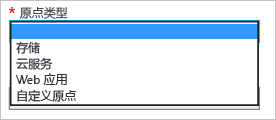

# Azure CDN 入门
本文介绍如何通过创建新 CDN 配置文件和终结点启用 Azure CDN。

> [!IMPORTANT]
> 如需 CDN 简介和功能的列表，请参阅 [CDN 概述](cdn-overview.md)。
> 
> 

## 创建新的 CDN 配置文件
CDN 配置文件是 CDN 终结点的集合。  每个配置文件包含一个或多个 CDN 终结点。  可能希望通过 Internet 域、Web 应用程序或某些其他条件来使用多个配置文件，以组织 CDN 终结点。

> [!NOTE]
> Azure 订阅对以下资源具有默认限制：
> - 可以创建的 CDN 配置文件数
> - 可以在 CDN 配置文件中创建的终结点的数量 
> - 可以映射到终结点的自定义域的数量
>
> 有关 CDN 订阅限制的信息，请参阅 [CDN 限制](https://docs.microsoft.com/azure/azure-subscription-service-limits#cdn-limits)。
>
> 可在 CDN 配置文件级别应用 CDN 定价。 如果想混合使用 Azure CDN 定价层，则需多个 CDN 配置文件。
> 
> 

[!INCLUDE [cdn-create-profile](../../includes/cdn-create-profile.md)]

## 创建新的 CDN 终结点
**创建新的 CDN 终结点**

1. 在 [Azure 门户](https://portal.azure.com)中，导航到 CDN 配置文件。  可能在先前步骤中将其固定到了仪表板。  如果不是，则可单击“浏览”、“CDN 配置文件”，并单击计划向其添加终结点的配置文件。
   
    将出现 CDN 配置文件边栏选项卡。
   
    ![CDN 配置文件][cdn-profile-settings]
2. 单击“添加终结点”  按钮。
   
    ![“添加终结点”按钮][cdn-new-endpoint-button]
   
    将出现“添加终结点”边栏选项卡。
   
    ![“添加终结点”边栏选项卡][cdn-add-endpoint]
3. 为该 CDN 终结点输入 **名称** 。  此名称用于访问在域 `<endpointname>.azureedge.net` 中缓存的资源。
4. 在“原点类型”  下拉列表中，选择原点类型。  为 Azure 存储帐户选择“存储”，为 Azure 云服务选择“云服务”，为 Azure Web 应用选择“Web 应用”，为其他任何公开可用 Web 服务器原点（托管在 Azure 或其他位置）选择“自定义原点”。
   
    
5. 在“原点主机名”  下拉列表中，选择或键入原始域。  下拉列表将列出步骤 4 中指定的所有可用类型源。  如果选择“自定义源服务器”作为“源服务器类型”，请输入自定义源服务器的域。
6. 在 **原点路径** 文本框中，输入要缓存的资源的路径，或留空以允许缓存步骤 5 中所指定域的任何资源。
7. 在 **原点主机头**中，输入想让 CDN 随每个请求发送的主机头，或保留默认值。
   
   > [!WARNING]
   > 某些类型的原点（例如 Azure 存储和 Web 应用）需要主机头来匹配原点的域。 除非拥有的原点要求不同于其域的主机头，否则应当保留默认值。
   > 
   > 
8. 对于**协议**和**原点端口**，指定用于访问原点中资源的协议和端口。 必须至少选择一种协议（HTTP 或 HTTPS）。 使用 CDN 提供的域 (`<endpointname>.azureedge.net`) 来访问 HTTPS 内容。 
   
   > [!NOTE]
   > **原点端口** 只影响终结点用来从原点检索信息的端口。  终结点自身仅可用于默认 HTTP 和 HTTPS 端口（80 和 443）上的最终客户端，而不考虑**原点端口**。  
   > 
   > **来自 Akamai 的 Azure CDN** 终结点不允许原点的完整 TCP 端口范围。  有关不被允许的原点端口列表，请参阅 [来自 Akamai 的 Azure CDN 受允许原点端口](https://msdn.microsoft.com/library/mt757337.aspx)。  
   > 
   > 使用 HTTPS 访问 CDN 内容具有以下限制：
   > 
   > * 必须使用 CDN 提供的 SSL 证书。 不支持第三方证书。
   > * HTTPS 对 Azure CDN 自定义域的支持仅在 **Verizon 的 Azure CDN** 产品（标准版和高级）中可用。 在 **Akamai 的 Azure CDN** 产品上不受支持。 有关详细信息，请参阅[在 Azure CDN 自定义域上启用或禁用 HTTPS](cdn-custom-ssl.md)。
  
9. 单击“创建”  按钮创建新的终结点。
   
   终结点在创建后出现在配置文件的终结点列表中。
    
   ![CDN 终结点][cdn-endpoint-success]
    
   > [!IMPORTANT]
   > 终结点不会立即可供使用，因为注册传播需花时间。  对于<b>来自 Akamai 的 Azure CDN</b> 配置文件，传播通常可在一分钟内完成。 对于<b>来自 Verizon 的 Azure CDN</b> 配置文件，传播通常在 90 分钟内完成，但某些情况下可能更长。
    > 
    > 尝试在终结点配置传播到 POP 之前使用 CDN 域名的用户可能会收到 HTTP 404 响应代码。  如果在创建终结点数小时后依然收到 404 响应，请参阅[排查 CDN 终结点返回 404 状态的问题](cdn-troubleshoot-endpoint.md)。
    > 
    > 

## 另请参阅
* [控制含查询字符串请求的缓存行为](cdn-query-string.md)
* [如何将 CDN 内容映射到自定义域](cdn-map-content-to-custom-domain.md)
* [在 Azure CDN 终结点上预加载资产](cdn-preload-endpoint.md)
* [清除 Azure CDN 终结点](cdn-purge-endpoint.md)
* [CDN 终结点返回 404 状态疑难解答](cdn-troubleshoot-endpoint.md)

[cdn-profile-settings]: ./media/cdn-create-new-endpoint/cdn-profile-settings.png
[cdn-new-endpoint-button]: ./media/cdn-create-new-endpoint/cdn-new-endpoint-button.png
[cdn-add-endpoint]: ./media/cdn-create-new-endpoint/cdn-add-endpoint.png
[cdn-endpoint-success]: ./media/cdn-create-new-endpoint/cdn-endpoint-success.png
