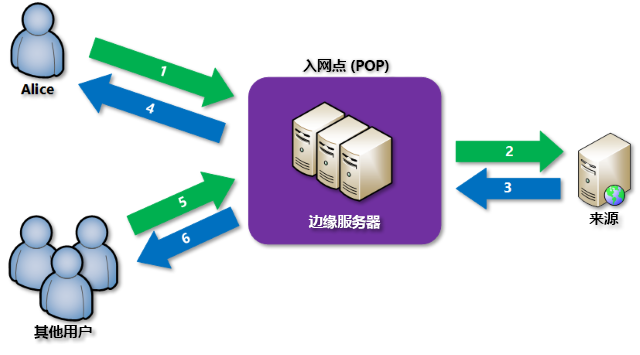

# 什么是 Azure 上的内容分发网络？
内容分发网络 (CDN) 是高效地向用户分发 Web 内容的分布式服务器网络。 CDN 将缓存的内容存储在 接入点 (POP) 位置（靠近最终用户的边缘服务器），以最大程度地降低延迟。 

Azure 内容分发网络 (CDN) 为开发人员提供了一个全局解决方案，通过在世界各地按特定策略放置的物理节点缓存内容来快速分发高带宽内容。 Azure CDN 还可以通过 CDN POP 来利用各种网络优化措施，从而加速不能缓存的动态内容的交付。 例如，可以绕过边界网关协议 (BGP) 的路由优化。

使用 Azure CDN 来交付网站资产的优点包括：

* 为最终用户提供更好的性能和改进的用户体验，尤其是在使用的应用程序需要多次往返来加载内容时。
* 大幅度缩放以更好地处理瞬间的高负载，例如在产品发布活动开始时。
* 通过分发用户请求并直接通过边缘服务器来提供内容，可以减少发送到源服务器的流量。

如需当前 CDN 节点位置的列表，请参阅 [Azure CDN POP 位置](cdn-pop-locations.md)。

## 工作原理

1. 用户 (Alice) 使用带有特殊域名（例如 _&lt;终结点名称&gt;_.azureedge.net）的 URL 来请求文件（也称资产）。 此名称可以是终结点主机名，也可以是自定义域。 DNS 将请求路由到性能最佳的 POP 位置，该位置通常是在地理上最靠近用户的 POP。
    
2. 如果 POP 中的边缘服务器在其缓存中没有文件，则 POP 将从源服务器请求文件。 源服务器可以是 Azure Web 应用、Azure 云服务、Azure 存储帐户或任何公开可用的 Web 服务器。
   
3. 源服务器将文件返回到 POP 中的边缘服务器。
    
4. POP 中的边缘服务器缓存文件并将文件返回到原始请求者 (Alice)。 在通过 HTTP 标头指定的生存时间 (TTL) 过期之前，文件仍缓存在 POP 中的边缘服务器上。 如果源服务器未指定 TTL，默认 TTL 为 7 天。
    
5. 其他用户则可能会使用 Alice 使用的 URL 请求同一文件，也可能被引向同一 POP。
    
6. 如果文件的 TTL 未过期，POP 边缘服务器会直接从缓存返回文件。 此过程会带来速度更快、响应更及时的用户体验。

## 要求
若要使用 Azure CDN，必须至少拥有一个 Azure 订阅。 还需创建至少一个 CDN 配置文件，该文件集合了 CDN 终结点。 每个 CDN 终结点表示对内容交付行为和访问权限的特定配置。 若要通过 Internet 域、Web 应用程序或某些其他条件来组织 CDN 终结点，可以使用多个配置文件。 由于 [Azure CDN 定价](https://azure.microsoft.com/pricing/details/cdn/)是在 CDN 配置文件级别应用的，因此如果需要使用混合的定价层，则必须创建多个 CDN 配置文件。 有关 Azure CDN 计费结构的信息，请参阅[了解 Azure CDN 计费](cdn-billing.md)。

### 限制
每个 Azure 订阅都对以下资源设置了默认限制：
 - 可以创建的 CDN 配置文件数。
 - 可以在 CDN 配置文件中创建的终结点的数量。 
 - 可以映射到终结点的自定义域的数量。

有关 CDN 订阅限制的详细信息，请参阅 [CDN 限制](https://docs.microsoft.com/azure/azure-subscription-service-limits#cdn-limits)。
    
## Azure CDN 功能
Azure CDN 提供以下重要功能：

- [动态站点加速](cdn-dynamic-site-acceleration.md)
- [CDN 缓存规则](cdn-caching-rules.md)
- [HTTPS 自定义域支持](cdn-custom-ssl.md)
- [Azure 诊断日志](cdn-azure-diagnostic-logs.md)
- [文件压缩](cdn-improve-performance.md)
- [地理筛选](cdn-restrict-access-by-country.md)

如需每个 Azure CDN 产品支持的功能的完整列表，请参阅[比较 Azure CDN 产品功能](cdn-features.md)。

## 后续步骤
- 若要进行 CDN 入门，请参阅[创建 Azure CDN 配置文件和终结点](cdn-create-new-endpoint.md)。
- 通过 [Microsoft Azure 门户](https://portal.azure.com)或 [PowerShell](cdn-manage-powershell.md) 管理 CDN 终结点。
- 了解如何通过 [.NET](cdn-app-dev-net.md) 或 [Node.js](cdn-app-dev-node.md) 实现 Azure CDN 的自动化。
- 若要在操作中了解 Azure CDN，请观看 [Azure CDN 视频](https://azure.microsoft.com/resources/videos/index/?services=cdn&sort=newest)。
- 有关最新 Azure CDN 功能的信息，请参阅 [Azure CDN 博客](https://azure.microsoft.com/blog/tag/azure-cdn/)。

