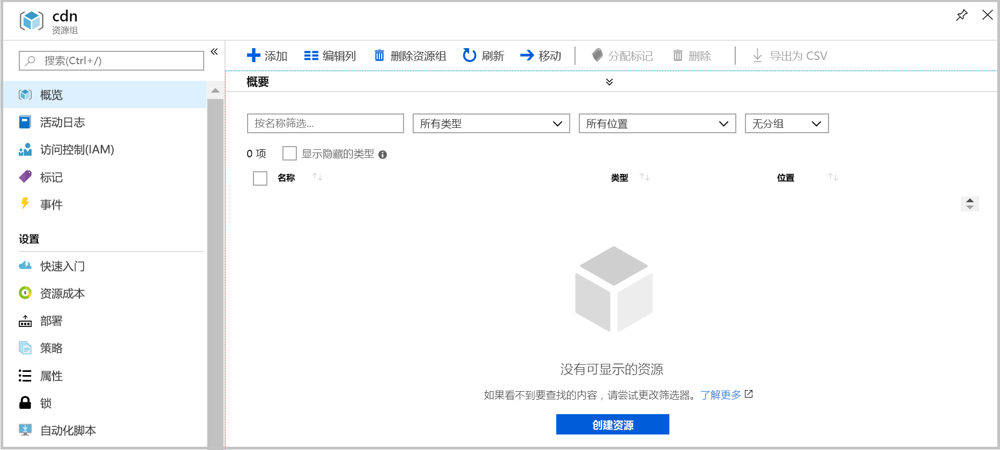

# <a name="quickstart-create-an-azure-cdn-profile-and-endpoint-using-resource-manager-template"></a>快速入门：使用资源管理器模板创建 Azure CDN 配置文件和终结点

在本快速入门中，我们将使用 CLI 部署一个 Azure 资源管理器模板。 创建的模板会将 CDN 配置文件和 CDN 终结点部署到 Web 应用程序的前端。
完成这些步骤大约需要 10 分钟时间。

[!INCLUDE [quickstarts-free-trial-note](../../includes/quickstarts-free-trial-note.md)]

## <a name="prequisites"></a>先决条件

在本快速入门中，必须使用一个 Web 应用程序作为起点。 本快速入门中使用的示例 Web 应用程序已部署到 https://cdndemo.azurewebsites.net

有关详细信息，请参阅[在 Azure 中创建静态 HTML Web 应用](https://docs.microsoft.com/azure/app-service/app-service-web-get-started-html)。

## <a name="create-a-resource-group"></a>创建资源组

所有资源必须部署在同一资源组中。

在所选的位置中创建资源组。 本示例演示如何在“美国东部”位置创建名为 cdn 的资源组。

```bash
az group create --name cdn --location eastus
```



## <a name="create-the-resource-manager-template"></a>创建 资源管理器模板

此步骤创建一个用于部署资源的模板文件。

尽管本示例演练的是“常规网站加速”方案，但也可以配置其他许多设置。 Azure 资源管理器模板参考文档中介绍了这些设置。 请参阅有关 [CDN 配置文件](https://docs.microsoft.com/azure/templates/microsoft.cdn/2017-10-12/profiles)和 [CDN 配置文件终结点](https://docs.microsoft.com/azure/templates/microsoft.cdn/2017-10-12/profiles/endpoints)的参考文档。

请注意，Microsoft CDN 不支持修改内容类型列表。

将模板保存为 **resource-manager-cdn.json**。

```json
{
    "$schema": "https://schema.management.azure.com/schemas/2015-01-01/deploymentTemplate.json#",
    "contentVersion": "1.0.0.0",
    "parameters": {
        "cdnProfileSku": {
            "type": "string",
            "allowedValues": [
                "Standard_Microsoft",
                "Standard_Akamai",
                "Standard_Verizon",
                "Premium_Verizon"
            ]
        },
        "endpointOriginHostName": {
            "type": "string"
        }
    },
    "variables": {
        "profile": {
            "name": "[replace(toLower(parameters('cdnProfileSku')), '_', '-')]"
        },
        "endpoint": {
            "name": "[replace(toLower(parameters('endpointOriginHostName')), '.', '-')]",
            "originHostName": "[parameters('endpointOriginHostName')]"
        }
    },
    "resources": [
        {
            "type": "Microsoft.Cdn/profiles",
            "apiVersion": "2017-10-12",
            "location": "[resourceGroup().location]",
            "name": "[variables('profile').name]",
            "sku": {
                "name": "[parameters('cdnProfileSku')]"
            }
        },
        {
            "dependsOn": [
                "[resourceId('Microsoft.Cdn/profiles', variables('profile').name)]"
            ],
            "type": "Microsoft.Cdn/profiles/endpoints",
            "apiVersion": "2017-10-12",
            "location": "[resourceGroup().location]",
            "name": "[concat(variables('profile').name, '/', variables('endpoint').name)]",
            "properties": {
                "hostName": "[concat(variables('endpoint').name, '.azureedge.net')]",
                "originHostHeader": "[variables('endpoint').originHostName]",
                "isHttpAllowed": true,
                "isHttpsAllowed": true,
                "queryStringCachingBehavior": "IgnoreQueryString",
                "origins": [
                    {
                        "name": "[replace(variables('endpoint').originHostName, '.', '-')]",
                        "properties": {
                            "hostName": "[variables('endpoint').originHostName]",
                            "httpPort": 80,
                            "httpsPort": 443
                        }
                    }
                ],
                "contentTypesToCompress": [
                    "application/eot",
                    "application/font",
                    "application/font-sfnt",
                    "application/javascript",
                    "application/json",
                    "application/opentype",
                    "application/otf",
                    "application/pkcs7-mime",
                    "application/truetype",
                    "application/ttf",
                    "application/vnd.ms-fontobject",
                    "application/xhtml+xml",
                    "application/xml",
                    "application/xml+rss",
                    "application/x-font-opentype",
                    "application/x-font-truetype",
                    "application/x-font-ttf",
                    "application/x-httpd-cgi",
                    "application/x-javascript",
                    "application/x-mpegurl",
                    "application/x-opentype",
                    "application/x-otf",
                    "application/x-perl",
                    "application/x-ttf",
                    "font/eot",
                    "font/ttf",
                    "font/otf",
                    "font/opentype",
                    "image/svg+xml",
                    "text/css",
                    "text/csv",
                    "text/html",
                    "text/javascript",
                    "text/js",
                    "text/plain",
                    "text/richtext",
                    "text/tab-separated-values",
                    "text/xml",
                    "text/x-script",
                    "text/x-component",
                    "text/x-java-source"
                ],
                "isCompressionEnabled": true,
                "optimizationType": "GeneralWebDelivery"
            }
        }
    ],
    "outputs": {
        "cdnUrl": {
            "type": "string",
            "value": "[concat('https://', variables('endpoint').name, '.azureedge.net')]"
        }
    }
}
```

## <a name="create-the-resources"></a>创建资源

使用 Azure CLI 部署模板。 系统会提示你提供 2 项输入：

**cdnProfileSku** - 要使用的 CDN 提供程序。 选项包括：

* Standard_Microsoft
* Standard_Akamai
* Standard_Verizon
* Premium_Verizon。

**endpointOriginHostName** - 要通过 CDN 提供的终结点，例如 cdndemo.azurewebsites.net。

```bash
az group deployment create --resource-group cdn --template-file arm-cdn.json
```


## <a name="view-the-cdn-profile"></a>查看 CDN 配置文件

```bash
az cdn profile list --resource-group cdn -o table
```


## <a name="view-the-cdn-endpoint-for-the-profile-standard-microsoft"></a>查看 standard-microsoft 配置文件的 CDN 终结点

```bash
az cdn endpoint list --profile-name standard-microsoft --resource-group cdn -o table
```


使用 HostName 查看内容。 例如，使用浏览器访问 https://cdndemo-azurewebsites-net.azureedge.net 。

## <a name="clean-up"></a>清理

删除资源组会自动删除其中部署的所有资源。

```bash
az group delete --name cdn
```


## <a name="references"></a>参考

* CDN 配置文件 - [Azure 资源管理器模板参考](https://docs.microsoft.com/azure/templates/microsoft.cdn/2017-10-12/profiles)
* CDN 终结点 - [Azure 资源管理器模板参考文档](https://docs.microsoft.com/azure/templates/microsoft.cdn/2017-10-12/profiles/endpoints)

## <a name="next-steps"></a>后续步骤

若要了解如何向 CDN 终结点添加自定义域，请参阅以下教程：

> [!div class="nextstepaction"]
> [教程：将自定义域添加到 Azure CDN 终结点](cdn-map-content-to-custom-domain.md)
