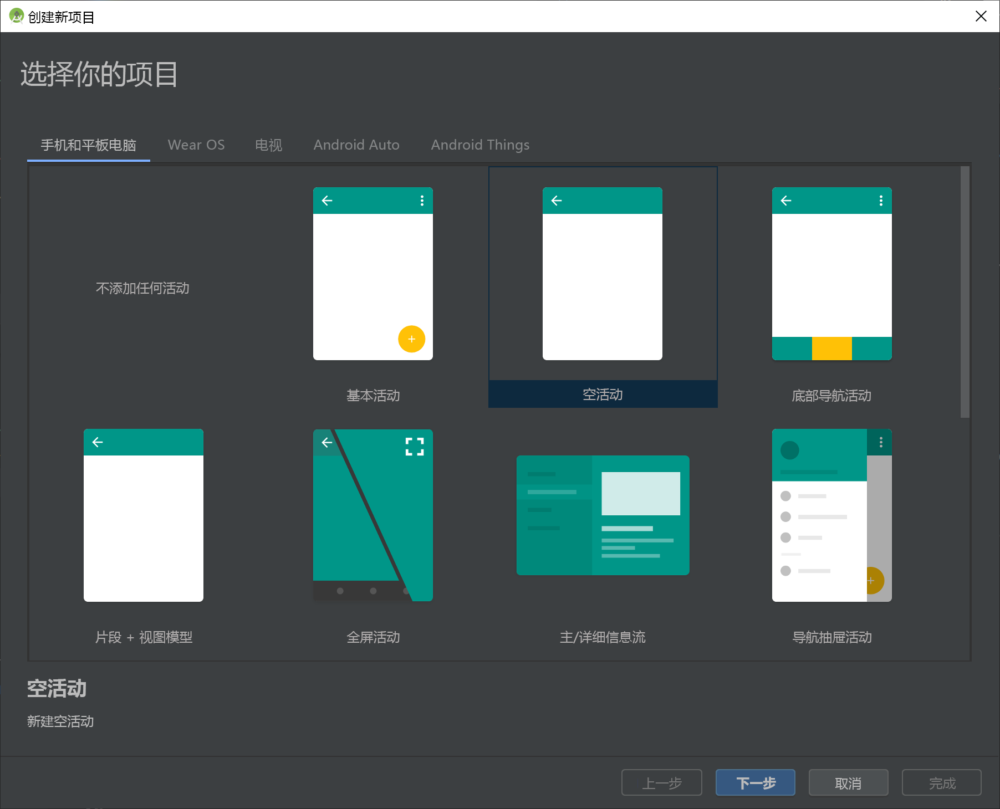
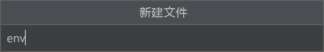
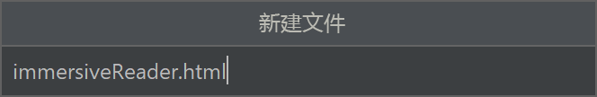

[沉浸式阅读器](https://www.onenote.com/learningtools)是一款经过广泛设计的工具，它实现了可靠的技术，旨在提高新的读者、语言学习者和有学习差异（如阅读障碍）的用户的阅读理解能力。 你可在应用程序中使用沉浸式阅读器来隔离文本，以改进焦点、显示常用词的图片、突出显示语音的各个部分、大声朗读所选文本、实时翻译字词和短语等等。

本快速入门将从头开始构建一个 Android 应用，并集成沉浸式阅读器。 [GitHub](https://github.com/microsoft/immersive-reader-sdk/tree/master/js/samples/quickstart-java-android) 提供了此快速入门的完整工作示例。

如果没有 Azure 订阅，请在开始之前创建一个[免费帐户](https://azure.microsoft.com/free/cognitive-services/)。

## <a name="prerequisites"></a>先决条件

* Azure 订阅 - [免费创建订阅](https://azure.microsoft.com/free/cognitive-services)
* 为 Azure Active Directory 身份验证配置的沉浸式阅读器资源。 按照[这些说明](../../how-to-create-immersive-reader.md)进行设置。 在配置环境属性时，将需要在此处创建的一些值。 将会话的输出保存到文本文件中，以供将来参考。
* [Git](https://git-scm.com/)。
* [沉浸式阅读器 SDK](https://github.com/microsoft/immersive-reader-sdk)。
* [Android Studio](https://developer.android.com/studio)。

## <a name="create-an-android-project"></a>创建 Android 项目

在 Android Studio 中启动新项目。 此示例的源代码作为[沉浸式阅读器 SDK](https://github.com/microsoft/immersive-reader-sdk/tree/master/js/samples/quickstart-java-android) 的一部分提供。


在“选择项目”窗口中选择“空活动”，选择“下一步”。  



## <a name="configure-the-project"></a>配置项目

将项目命名为“QuickstartJava”，然后选择一个保存它的位置。 选择“Java”作为编程语言，然后选择“完成” 。


## <a name="set-up-assets-and-authentication"></a>设置资产和身份验证

创建新的“/assets”文件夹。


 在资产文件夹内创建名为“env”的文件。 添加以下名称和值，并根据需要提供值。 不要将此 env 文件提交到源代码管理中，因为它包含不应公开的机密。



```text
TENANT_ID=<YOUR_TENANT_ID>
CLIENT_ID=<YOUR_CLIENT_ID>
CLIENT_SECRET=<YOUR_CLIENT_SECRET>
SUBDOMAIN=<YOUR_SUBDOMAIN>
```


## <a name="add-dependencies"></a>添加依赖项

将“build.gradle”文件中的现有依赖项替换为以下实现以启用 gson（JSON 分析和序列化）和 dotenv 以引用 env 文件中定义的变量。 你稍后在本快速入门中实现活动时可能需要再次同步项目。

```build.gradle
dependencies {
    implementation fileTree(dir: 'libs', include: ['*.jar'])
    implementation 'androidx.appcompat:appcompat:1.0.2'
    implementation 'androidx.constraintlayout:constraintlayout:1.1.3'
    implementation 'com.google.code.gson:gson:2.8.6'
    implementation 'io.github.cdimascio:java-dotenv:5.1.3'
    testImplementation 'junit:junit:4.12'
    androidTestImplementation 'androidx.test.ext:junit:1.1.0'
    androidTestImplementation 'androidx.test.espresso:espresso-core:3.1.1'
}
```


## <a name="update-app-strings-and-layout-resources"></a>更新应用字符串和布局资源

将“res/strings/strings.xml”中的内容替换为以下要在应用中使用的字符串。


```strings.xml
<resources>

    <!-- Copyright (c) Microsoft Corporation. All rights reserved. -->
    <!-- Licensed under the MIT License. -->

    <string name="app_name">ImmersiveReaderSDK</string>
    <string name="geographyTitle">Geography</string>
    <string name="geographyTextEn">The study of Earth's landforms is called physical geography. Landforms can be mountains and valleys. They can also be glaciers, lakes or rivers. Landforms are sometimes called physical features. It is important for students to know about the physical geography of Earth. The seasons, the atmosphere and all the natural processes of Earth affect where people are able to live. Geography is one of a combination of factors that people use to decide where they want to live. The physical features of a region are often rich in resources. Within a nation, mountain ranges become natural borders for settlement areas. In the U.S., major mountain ranges are the Sierra Nevada, the Rocky Mountains, and the Appalachians. Fresh water sources also influence where people settle. People need water to drink. They also need it for washing. Throughout history, people have settled near fresh water. Living near a water source helps ensure that people have the water they need. There was an added bonus, too. Water could be used as a travel route for people and goods. Many Americans live near popular water sources, such as the Mississippi River, the Colorado River and the Great Lakes.Mountains and deserts have been settled by fewer people than the plains areas. However, they have valuable resources of their own.</string>
    <string name="geographyTextFr">L\'étude des reliefs de la Terre est appelée géographie physique. Les reliefs peuvent être des montagnes et des vallées. Il peut aussi s\'agira de glaciers, delacs ou de rivières. Les reliefs sont parfois appelés caractéristiques physiques. Il est important que les élèves connaissent la géographie physique de laTerre. Les saisons, l\'atmosphère et tous les processus naturels de la Terre affectent l\'endroit où les gens sont capables de vivre. La géographie est l\'un desfacteurs que les gens utilisent pour décider où ils veulent vivre. Les caractéristiques physiques d\'une région sont souvent riches en ressources. Àl\'intérieur d\'une nation, les chaînes de montagnes deviennent des frontières naturelles pour les zones de peuplement. Aux États-Unis, les principaleschaînes de montagnes sont la Sierra Nevada, les montagnes Rocheuses et les Appalaches.Les sources d\'eau douce influencent également l\'endroit où lesgens s\'installent. Les gens ont besoin d\'eau pour boire. Ils en ont aussi besoin pour se laver. Tout au long de l\'histoire, les gens se sont installés près del\'eau douce. Vivre près d\'une source d\'eau permet de s\'assurer que les gens ont l\'eau dont ils ont besoin. Il y avait un bonus supplémentaire, aussi. L\'eaupourrait être utilisée comme voie de voyage pour les personnes et les marchandises. Beaucoup d\'Américains vivent près des sources d\'eau populaires,telles que le fleuve Mississippi, le fleuve Colorado et les Grands Lacs.Mountains et les déserts ont été installés par moins de gens que les zones desplaines. Cependant, ils disposent de ressources précieuses.Les gens ont une réponse.</string>
    <string name="immersiveReaderButtonText">Immersive Reader</string>
</resources>
```

将“res/layout/activity_main.xml”中的内容替换为以下要在应用中使用的 XML。 此 XML 是应用的 UI 布局。


```activity_main.xml
<?xml version="1.0" encoding="utf-8"?>

<!-- Copyright (c) Microsoft Corporation. All rights reserved. -->
<!-- Licensed under the MIT License. -->

<androidx.constraintlayout.widget.ConstraintLayout xmlns:android="http://schemas.android.com/apk/res/android"
    xmlns:app="http://schemas.android.com/apk/res-auto"
    xmlns:tools="http://schemas.android.com/tools"
    android:layout_width="match_parent"
    android:layout_height="match_parent"
    android:background="#FFFFFF"
    tools:context=".MainActivity">

    <LinearLayout
        android:id="@+id/linearLayout"
        android:layout_width="match_parent"
        android:layout_height="0dp"
        android:background="#FFFFFF"
        android:orientation="vertical"
        app:layout_constraintBottom_toBottomOf="parent"
        app:layout_constraintEnd_toEndOf="parent"
        app:layout_constraintHorizontal_bias="0.0"
        app:layout_constraintStart_toStartOf="parent"
        app:layout_constraintTop_toTopOf="parent"
        app:layout_constraintVertical_bias="0.0">

        <TextView
            android:id="@+id/Title"
            android:layout_width="match_parent"
            android:layout_height="wrap_content"
            android:layout_marginLeft="48dp"
            android:layout_marginTop="24dp"
            android:layout_marginRight="48dp"
            android:layout_marginBottom="24dp"
            android:text="@string/geographyTitle"
            android:textSize="24sp"
            android:textStyle="bold" />

        <ScrollView
            android:id="@+id/ContentPane"
            android:layout_width="match_parent"
            android:layout_height="480dp"
            android:layout_marginBottom="48dp"
            android:clipToPadding="false"
            android:fillViewport="false"
            android:paddingLeft="48dp"
            android:paddingRight="48dp"
            android:scrollbarStyle="outsideInset"
            android:visibility="visible"
            tools:visibility="visible">

        <LinearLayout
            android:layout_width="match_parent"
            android:layout_height="match_parent"
            android:orientation="vertical">

            <TextView
                android:id="@+id/Content1"
                android:layout_width="match_parent"
                android:layout_height="wrap_content"
                android:background="#00FFFFFF"
                android:text="@string/geographyTextEn"
                android:textSize="18sp" />

            <TextView
                android:id="@+id/Content2"
                android:layout_width="match_parent"
                android:layout_height="wrap_content"
                android:background="#00FFFFFF"
                android:text="@string/geographyTextFr"
                android:textSize="18sp" />

            </LinearLayout>

        </ScrollView>

        <Button
            android:id="@+id/LaunchImmersiveReaderButton"
            android:layout_width="match_parent"
            android:layout_height="60dp"
            android:layout_marginLeft="40dp"
            android:layout_marginRight="40dp"
            android:layout_marginBottom="80dp"
            android:text="@string/immersiveReaderButtonText"
            android:textAllCaps="false"
            android:textSize="24sp"
            android:visibility="visible"
            tools:visibility="visible" />

    </LinearLayout>

</androidx.constraintlayout.widget.ConstraintLayout>
```

## <a name="add-the-web-view-layout"></a>添加 Web 视图布局

在“res/layout/”文件夹中，创建一个新的布局资源文件，将它命名为“activity_immersive_reader” 。 然后将其内容替换为以下 XML。 此 XML 会添加 WebView 组件，供在后面步骤中将创建的 IRActivity Java 代码所使用。 目前它尚未定义，并且将导致错误。


```activity_immersive_reader.xml
<?xml version="1.0" encoding="utf-8"?>

<!-- Copyright (c) Microsoft Corporation. All rights reserved. -->
<!-- Licensed under the MIT License. -->

<androidx.constraintlayout.widget.ConstraintLayout xmlns:android="http://schemas.android.com/apk/res/android"
    xmlns:tools="http://schemas.android.com/tools"
    android:layout_width="match_parent"
    android:layout_height="match_parent"
    android:background="#FFFFFF"
    tools:context=".IRActivity">

    <WebView
        android:id="@+id/webView"
        android:layout_width="match_parent"
        android:layout_height="match_parent" />

</androidx.constraintlayout.widget.ConstraintLayout>
```

## <a name="set-up-the-app-java-code"></a>设置应用 Java 代码

在“/Java/com.example.quickstartjava”文件夹中，你将看到现有的“MainActivity.java”Java 类文件 。 此文件夹是应用逻辑的编写位置。


将 MainActivity.java 内容替换为以下代码。 代码中引用的一些类尚不存在，稍后将会创建它们。

```MainActivity.java
/**
 * Copyright (c) Microsoft Corporation. All rights reserved.
 * Licensed under the MIT License.
 */

package com.example.quickstartjava;

import android.app.Activity;
import android.os.Bundle;
import android.view.View;
import android.widget.Button;
import android.widget.TextView;

import java.util.ArrayList;
import java.util.List;

/**
 * Creates a new activity, finds its content and the Immersive Reader button.
 * When clicked, the app sends the content to the Immersive Reader SDK and
 * launches the Immersive Reader.
 */
public class MainActivity extends Activity {

    @Override
    public void onCreate(Bundle savedInstanceState) {
        super.onCreate(savedInstanceState);
        setContentView(R.layout.activity_main);
        final TextView irTitle = findViewById(R.id.Title);
        final TextView irText1 = findViewById(R.id.Content1);
        final TextView irText2 = findViewById(R.id.Content2);

        final Button immersiveReaderButton = findViewById(R.id.LaunchImmersiveReaderButton);
        immersiveReaderButton.setOnClickListener(new View.OnClickListener() {
            @Override
            public void onClick(View view) {
                List<ReadableTextChunk> readableTextChunks = new ArrayList<>();
                readableTextChunks.add(new ReadableTextChunk(irText1.getText().toString(), "en"));
                readableTextChunks.add(new ReadableTextChunk(irText2.getText().toString(), "fr"));
                ReadableContent readableContent = new ReadableContent(irTitle.getText().toString(), readableTextChunks);

                ImmersiveReader immersiveReader = new ImmersiveReader(MainActivity.this, new IRAuthenticator());
                immersiveReader.read(readableContent);
            }
        });
    }
}
```

我们将在“/Java/com.example.quickstartjava”文件夹中创建另外 16 个 Java 类文件。 应用会使用所有这些类来集成沉浸式阅读器 SDK。 对于每个新文件，代码中引用的一些类尚不存在，稍后将会创建它们。 创建所有类后，就不应再出现空引用错误。

若要创建新的“ImmersiveReader.java”Java 类文件，请右键单击 Android Studio 中的文件夹、选择“新建”，然后选择“Java 类”  。 将使用相同的方法为创建的每个新 Java 类文件创建 Java 类文件。


将“ImmersiveReader.java”内容替换为以下代码：

```ImmersiveReader.java
/**
 * Copyright (c) Microsoft Corporation. All rights reserved.
 * Licensed under the MIT License.
 */

package com.example.quickstartjava;

import android.app.Activity;
import android.content.Intent;
import androidx.annotation.Keep;

import java.lang.ref.WeakReference;

/**
 * This is the client facing class for invoking the new Immersive Reader functionality.
 * Usage:
 * ImmersiveReader immersiveReader = new ImmersiveReader(Activity, IRAuthenticator);
 * immersiveReader.read(ReadableTextChunk);
 */


@Keep
public class ImmersiveReader {

    WeakReference<Activity> mActivityWR;

    /**
     * Interface to accept access token from client app.
     * Note that it is client's responsibility to give a valid Access Token whenever getAccessToken() is requested.
     * In favor of latency perf, there would be no further validation by Immersive Reader module except to ensure that the provided access token is non-empty string
     */
    @Keep
    public interface IAuthenticator {
        String getAccessToken();
    }

    public ImmersiveReader(Activity activity, IAuthenticator authenticator) {
        mActivityWR = new WeakReference<>(activity);
        IRDataHolder.getInstance().setAuthenticator(authenticator);
    }

    public ImmersiveReader(Activity activity) {
        this(activity, null);
    }

    /**
     * Launches a new activity to speak the content as described by ReadableContent object.
     *
     * @param dataToRead - Content to be read
     * @return IRError - IRError, with following error codes:
     * a) Error.NONE in case of successful launch of Immersive Reader
     * b) Error.INVALID_ACCESS_TOKEN in case of empty access token
     * c) Error.INVALID_STATE in case of empty activity
     * d) Error.INVALID_CONTENT in case of empty list of text chunks
     */

    public IRError read(ReadableContent dataToRead) {

        Activity activity = mActivityWR.get();
        if (activity == null) {
            return new IRError(Error.INVALID_STATE, "Client activity is null");
        }

        if (dataToRead == null || dataToRead.getTextChunks().size() == 0) {
            return new IRError(Error.INVALID_CONTENT, "Readable Text Chunks not passed to Immersive Reader");
        }

        IRDataHolder.getInstance().setContentToRead(dataToRead);
        Intent intent = new Intent(mActivityWR.get(), IRActivity.class);
        activity.startActivity(intent);

        return new IRError(Error.NONE, "Immersive Reader launched");
    }

}
```

创建新的“IRActivity.java”Java 类文件。


将“IRActivity.java”内容替换为以下代码：

```IRActivity.java
/**
 * Copyright (c) Microsoft Corporation. All rights reserved.
 * Licensed under the MIT License.
 */

package com.example.quickstartjava;

import android.app.Activity;
import android.content.Intent;
import androidx.annotation.Keep;

import java.lang.ref.WeakReference;

/**
 * This is the client facing class for invoking the new Immersive Reader functionality.
 * Usage:
 * ImmersiveReader immersiveReader = new ImmersiveReader(Activity, IRAuthenticator);
 * immersiveReader.read(ReadableTextChunk);
 */


@Keep
public class ImmersiveReader {

    WeakReference<Activity> mActivityWR;

    /**
     * Interface to accept access token from client app.
     * Note that it is the client's responsibility to give a valid Access Token whenever getAccessToken() is requested.
     * In favor of latency perf, there would be no further validation by Immersive Reader module except to ensure that the provided access token is non-empty string.
     */
    @Keep
    public interface IAuthenticator {
        String getAccessToken();
    }

    public ImmersiveReader(Activity activity, IAuthenticator authenticator) {
        mActivityWR = new WeakReference<>(activity);
        IRDataHolder.getInstance().setAuthenticator(authenticator);
    }

    public ImmersiveReader(Activity activity) {
        this(activity, null);
    }

    /**
     * Launches a new activity to speak the content as described by ReadableContent object.
     *
     * @param dataToRead - Content to be read
     * @return IRError - IRError, with following error codes:
     * a) Error.NONE in case of successful launch of Immersive Reader
     * b) Error.INVALID_ACCESS_TOKEN in case of empty access token.
     * c) Error.INVALID_STATE in case of empty activity
     * d) Error.INVALID_CONTENT in case of empty list of text chunks
     */

    public IRError read(ReadableContent dataToRead) {

        Activity activity = mActivityWR.get();
        if (activity == null) {
            return new IRError(Error.INVALID_STATE, "Client activity is null");
        }

        if (dataToRead == null || dataToRead.getTextChunks().size() == 0) {
            return new IRError(Error.INVALID_CONTENT, "Readable Text Chunks not passed to Immersive Reader");
        }

        IRDataHolder.getInstance().setContentToRead(dataToRead);
        Intent intent = new Intent(mActivityWR.get(), IRActivity.class);
        activity.startActivity(intent);

        return new IRError(Error.NONE, "Immersive Reader launched");
    }

}
```

创建新的“IRError.java”Java 类文件。


将“IRError.java”内容替换为以下代码：

```IRError.java
/**
 * Copyright (c) Microsoft Corporation. All rights reserved.
 * Licensed under the MIT License.
 */

package com.example.quickstartjava;

import android.os.Parcel;
import android.os.Parcelable;
import androidx.annotation.Keep;

/**
 * Shared error handling of the app.
 */

@Keep
public class IRError implements Parcelable {

    private int errorId;
    private String errorMessage = "";

    public String getErrorMessage() {
        return errorMessage;
    }

    public void setErrorMessage(String errorMessage) {
        this.errorMessage = errorMessage;
    }

    public int getErrorId() {
        return errorId;
    }

    public void setErrorId(int errorId) {
        this.errorId = errorId;
    }

    public IRError(int errorId, String errorMessage) {
        this.errorId = errorId;
        this.errorMessage = errorMessage;
    }

    // parcelable
    @Override
    public int describeContents() {
        return 0;
    }

    @Override
    public void writeToParcel(Parcel out, int flags) {
        out.writeInt(this.errorId);
        out.writeString(this.errorMessage);
    }

    public static final Creator<IRError> CREATOR
            = new Creator<IRError>() {
        public IRError createFromParcel(Parcel in) {
            return new IRError(in);
        }

        public IRError[] newArray(int size) {
            return new IRError[size];
        }
    };

    private IRError(Parcel in) {
        this.errorId = in.readInt();
        this.errorMessage = in.readString();
    }
}
```

创建新的“Error.java”Java 类文件。


将“Error.java”内容替换为以下代码：

```Error.java
/**
 * Copyright (c) Microsoft Corporation. All rights reserved.
 * Licensed under the MIT License.
 */

package com.example.quickstartjava;

import androidx.annotation.Keep;

/**
 * Adds some default error status codes.
 */

@Keep
public class Error {

    public static final int NONE = 1000;
    public static final int INVALID_ACCESS_TOKEN = 8001;
    public static final int INVALID_STATE = 8002;
    public static final int INVALID_CONTENT = 8003;

}
```

创建新的“ReadableContent.java”Java 类文件。


将“ReadableContent.java”内容替换为以下代码：

```ReadableContent.java
/**
 * Copyright (c) Microsoft Corporation. All rights reserved.
 * Licensed under the MIT License.
 */

package com.example.quickstartjava;

import androidx.annotation.Keep;

import java.util.List;

/**
 * Content data to be sent to the Immersive Reader SDK
 */

@Keep
public class ReadableContent {

    private String mTitle;
    private List<ReadableTextChunk> mTextChunks;

    public ReadableContent(String title, List<ReadableTextChunk> textChunks) {
        this.mTitle = title;
        this.mTextChunks = textChunks;
    }

    public String getTitle() {
        return mTitle;
    }

    public List<ReadableTextChunk> getTextChunks() {
        return mTextChunks;
    }

}
```

创建新的“ReadableTextChunk.java”Java 类文件。


将“ReadableTextChunk.java”内容替换为以下代码：

```ReadableTextChunk.java
/**
 * Copyright (c) Microsoft Corporation. All rights reserved.
 * Licensed under the MIT License.
 */

import androidx.annotation.Keep;

/**
 * Content sent to the Immersive Reader SDK may be separated into chunks so that there may be
 * different types of content sent in the same document. This includes content of different
 * languages, math content, et cetera.
 */

@Keep
public class ReadableTextChunk {
    public String mText;
    public String mLocale;

    public ReadableTextChunk(String text, String locale) {
        this.mText = text;
        this.mLocale = locale;
    }
}
```

创建新的“IRDataHolder.java”Java 类文件。


将“IRDataHolder.java”内容替换为以下代码：

```IRDataHolder.java
/**
 * Copyright (c) Microsoft Corporation. All rights reserved.
 * Licensed under the MIT License.
 */

package com.example.quickstartjava;

import androidx.annotation.Keep;

/**
 * A thin singleton class that is used to hold the Client's IAuthenticator's implementation and the Content to be read.
 * This is required for two reasons:
 * 1) As per Android guidelines, data being passed via intent should be limited to a few KBs. Alternative is to use Singleton holder classes like this one.
 * 2) We need a way to make callbacks survive app configuration changes and killed in background scenarios.
 */

@Keep
public class IRDataHolder {

    private static IRDataHolder mInstance = null;
    private ReadableContent mActiveContent = null;
    private ImmersiveReader.IAuthenticator mAuthenticator = null;

    public static IRDataHolder getInstance() {

        if (mInstance == null) {
            synchronized (IRDataHolder.class) {
                if (mInstance == null) {
                    mInstance = new IRDataHolder();
                }
            }
        }
        return mInstance;
    }

    public void setContentToRead(ReadableContent content) {
        mActiveContent = content;
    }

    public ReadableContent getContentToRead() {
        return mActiveContent;
    }

    public ImmersiveReader.IAuthenticator getAuthenticator() {
        return mAuthenticator;
    }

    public void setAuthenticator(ImmersiveReader.IAuthenticator accessTokenProvider) {
        this.mAuthenticator = accessTokenProvider;
    }

    public void clearContent() {
        mActiveContent = null;
    }

}
```

创建新的“IRAuthenticator.java”Java 类文件。


将“IRAuthenticator.java”内容替换为以下代码：

```IRAuthenticator.java
/**
 * Copyright (c) Microsoft Corporation. All rights reserved.
 * Licensed under the MIT License.
 */

package com.example.quickstartjava;

import android.text.TextUtils;
import android.util.Log;

import org.json.JSONException;
import org.json.JSONObject;

import io.github.cdimascio.dotenv.Dotenv;
import java.io.BufferedReader;
import java.io.DataOutputStream;
import java.io.IOException;
import java.io.InputStreamReader;
import java.net.HttpURLConnection;
import java.net.MalformedURLException;
import java.net.URL;

import static java.net.HttpURLConnection.HTTP_OK;

// This sample app uses the Dotenv. It's a module that loads environment variables from a .env file to better manage secrets.
// https://github.com/cdimascio/java-dotenv
// Be sure to add a "env" file to the /assets folder.
// Instead of '.env', use 'env'.

public class IRAuthenticator implements ImmersiveReader.IAuthenticator {
    private static final String LOG_TAG = "IRAuthenticator";
    Dotenv dotEnv = Dotenv.configure()
            .directory("/assets")
            .filename("env")
            .ignoreIfMalformed()
            .ignoreIfMissing()
            .load();

    @Override
    public String getAccessToken() {
        String clientId = dotEnv.get("CLIENT_ID");
        String clientSecret = dotEnv.get("CLIENT_SECRET");
        String tenantId = dotEnv.get("TENANT_ID");
        String accessToken = null;

        try {
            StringBuilder urlStringBuilder = new StringBuilder();
            urlStringBuilder.append("https://login.windows.net/");
            urlStringBuilder.append(tenantId);
            urlStringBuilder.append("/oauth2/token");
            URL tokenUrl = new URL(urlStringBuilder.toString());


            StringBuilder formStringBuilder = new StringBuilder();
            formStringBuilder.append("grant_type=client_credentials&resource=https://cognitiveservices.azure.com/&client_id=");
            formStringBuilder.append(clientId);
            formStringBuilder.append("&client_secret=");
            formStringBuilder.append(clientSecret);
            String form = formStringBuilder.toString();

            HttpURLConnection httpURLConnection = (HttpURLConnection) tokenUrl.openConnection();
            httpURLConnection.setRequestMethod("POST");
            httpURLConnection.setRequestProperty("content-type", "application/x-www-form-urlencoded");
            httpURLConnection.setDoOutput(true);

            DataOutputStream dataOutputStream = new DataOutputStream(httpURLConnection.getOutputStream());
            dataOutputStream.writeBytes(form);
            dataOutputStream.flush();
            dataOutputStream.close();

            int responseCode = httpURLConnection.getResponseCode();

            if (responseCode == HTTP_OK) {
                BufferedReader bufferedReader = new BufferedReader(new InputStreamReader(httpURLConnection.getInputStream()));
                StringBuffer response = new StringBuffer();


                String line = bufferedReader.readLine();
                while (!TextUtils.isEmpty(line)) {
                    response.append(line);
                    line = bufferedReader.readLine();
                }

                bufferedReader.close();

                JSONObject accessTokenJson = new JSONObject(response.toString());
                accessToken = accessTokenJson.getString("access_token");
            }

        } catch (MalformedURLException e) {
            e.printStackTrace();
        } catch (IOException e) {
            e.printStackTrace();
        } catch (JSONException e) {
            e.printStackTrace();
        }

        //  accessToken = Constants.ACCESS_TOKEN;
        Log.i(LOG_TAG, "Accesstoken: " + accessToken);
        return accessToken;
    }
}
```

创建新的“IRLauncher.java”Java 类文件。


将“IRLauncher.java”内容替换为以下代码：

```IRLauncher.java
/**
 * Copyright (c) Microsoft Corporation. All rights reserved.
 * Licensed under the MIT License.
 */

package com.example.quickstartjava;

import android.content.Context;
import android.os.Build;
import android.text.TextUtils;
import android.view.View;
import android.webkit.CookieManager;
import android.webkit.WebView;
import android.webkit.WebViewClient;
import android.widget.Toast;

import com.google.gson.Gson;
import com.google.gson.GsonBuilder;

import java.util.ArrayList;
import java.util.Date;
import java.util.List;
import java.util.concurrent.Callable;

import io.github.cdimascio.dotenv.Dotenv;

/**
 * Responsible for setting up the web view with appropriate bridging between JavaScript and Java to launch the Immersive Reader url for reading the content.
 */

public class IRLauncher {
    Dotenv dotEnv = Dotenv.configure()
            .directory("/assets")
            .filename("env")
            .ignoreIfMalformed()
            .ignoreIfMissing()
            .load();

    private WebView mWebView;
    private Context mContext;
    public final String SUBDOMAIN = dotEnv.get("SUBDOMAIN");

    interface IRLaunchListener {

        // Invoked in case of successful launch of Immersive Reader Activity. Note that content reading can still fail due to multiple reasons including expired access token.
        void onSuccess();

        // Invoked in case of empty access token or empty content request to be read
        void onFailure(IRError error);

        // Invoked when Immersive Reader is exiting (e.g.) user pressed back in the Immersive Reader experience
        void onExit();
    }

    public IRLauncher(Context context, WebView webView) {
        this.mContext = context;
        this.mWebView = webView;
    }

    public void launch(final IRLaunchListener launchListener) {

        AuthenticationTask authenticationTask = new AuthenticationTask();
        AuthenticationTask.TaskParams params = authenticationTask.new TaskParams(IRDataHolder.getInstance().getAuthenticator(), new AuthenticationTask.ITaskListener() {
            @Override
            public void onAccessTokenObtained(String accessToken) {

                // Basic validation for access token
                if (TextUtils.isEmpty(accessToken)) {
                    launchListener.onFailure(new IRError(Error.INVALID_ACCESS_TOKEN, "Access token is empty"));
                }

                // Create list of chunks from data that was passed originally by the client and stored in the data holder
                List<Chunk> chunkList = new ArrayList<>();
                for (ReadableTextChunk textChunk : IRDataHolder.getInstance().getContentToRead().getTextChunks()) {
                    chunkList.add(new Chunk(textChunk.mText, textChunk.mLocale, "text/plain"));
                }
                Content content = new Content(IRDataHolder.getInstance().getContentToRead().getTitle(), chunkList);
                Options options = new Options(new Callable<Void>() {
                    public Void call() {
                        launchListener.onExit();
                        return null;
                    }
                }, "en", 0);

                // Prepare the webview
                prepareWebView(accessToken, content, options, launchListener);
                mWebView.loadUrl("file:///android_asset/immersiveReader.html");
                launchListener.onSuccess();
            }
        });

        authenticationTask.setParams(params);
        authenticationTask.execute();
    }

    private void prepareWebView(String accessToken, Content content, Options options, final IRLaunchListener launchListener) {
        mWebView.getSettings().setAllowContentAccess(true);
        mWebView.getSettings().setJavaScriptEnabled(true);
        mWebView.getSettings().setLoadsImagesAutomatically(true);
        mWebView.getSettings().setLoadWithOverviewMode(true);
        mWebView.getSettings().setUseWideViewPort(true);
        mWebView.getSettings().setUserAgentString("Android");
        mWebView.getSettings().setDomStorageEnabled(true);
        mWebView.getSettings().setAppCacheEnabled(false);
        mWebView.getSettings().setSupportZoom(true);
        mWebView.setInitialScale(1);

        // Enable web view cookies
        if (android.os.Build.VERSION.SDK_INT >= android.os.Build.VERSION_CODES.LOLLIPOP) {
            CookieManager.getInstance().setAcceptThirdPartyCookies(mWebView, true);
        } else {
            CookieManager.getInstance().setAcceptCookie(true);
        }

        final Date startPostMessageSentDurationInMs = new Date();

        // Create the Message
        final Message messageData = new Message(accessToken, SUBDOMAIN, content, 0, options);

        // Set WebView Client
        mWebView.setWebViewClient(new WebViewClient() {

            @Override
            public boolean shouldOverrideUrlLoading(WebView view, String url) {
                mWebView.loadUrl(url);
                return true;
            }

            @Override
            public void onPageFinished(WebView view, String url) {
                Date endPostMessageSentDurationInMs = new Date();
                long postMessageSentDurationInMs = endPostMessageSentDurationInMs.getTime() - startPostMessageSentDurationInMs.getTime();

                // Updates launchToPostMessageSentDurationInMs
                if (Build.VERSION.SDK_INT >= Build.VERSION_CODES.N) {
                    messageData.launchToPostMessageSentDurationInMs = Math.toIntExact(postMessageSentDurationInMs);
                } else {
                    messageData.launchToPostMessageSentDurationInMs = 0;
                }

                GsonBuilder gsonBuilder = new GsonBuilder();
                Gson gson = gsonBuilder.create();
                String messageJson = gson.toJson(messageData);

                if (Build.VERSION.SDK_INT >= Build.VERSION_CODES.KITKAT) {
                    StringBuilder scriptStringBuilder = new StringBuilder().append("handleLaunchImmersiveReader(").append(messageJson).append(")");
                    view.evaluateJavascript(scriptStringBuilder.toString(), null);
                } else {
                    StringBuilder urlStringBuilder = new StringBuilder().append("javascript:handleLaunchImmersiveReader(").append(messageJson).append(")");
                    view.loadUrl(urlStringBuilder.toString());
                }
                mWebView.setVisibility(View.VISIBLE);
            }
        });

        // Prepare and set the WebAppInterface to hear back from the JavaScript
        WebAppInterface jsInterface = new WebAppInterface(new WebAppInterface.WebAppListener() {
            @Override
            public void onShowToast(String toast) {
                Toast.makeText(mContext, toast, Toast.LENGTH_SHORT).show();
            }

            @Override
            public void onImmersiveReaderExit() {
                IRDataHolder.getInstance().clearContent();
                mWebView.post(new Runnable() {
                    @Override
                    public void run() {
                        mWebView.clearHistory();
                        mWebView.clearCache(true);
                        mWebView.loadUrl("about:blank");
                        mWebView.onPause();
                        mWebView.removeAllViews();
                        mWebView.pauseTimers();
                        mWebView.destroy();
                    }
                });
                launchListener.onExit();
            }
        });

        mWebView.addJavascriptInterface(jsInterface, "Android");
    }
}
```

创建新的“IRStore.java”Java 类文件。


将“IRStore.java”内容替换为以下代码：

```IRStore.java
/**
 * Copyright (c) Microsoft Corporation. All rights reserved.
 * Licensed under the MIT License.
 */

package com.example.quickstartjava;

import androidx.annotation.Keep;

@Keep
public final class IRStore {
    @Keep
    public final static class Output {
        public final static String ERROR = "Error";
    }
}
```

创建新的“AuthenticationTask.java”Java 类文件。


将“AuthenticationTask.java”内容替换为以下代码：

```AuthenticationTask.java
/**
 * Copyright (c) Microsoft Corporation. All rights reserved.
 * Licensed under the MIT License.
 */

package com.example.quickstartjava;

import android.os.AsyncTask;

/**
 * Async task to request the client for the access token in background thread.
 */

public class AuthenticationTask extends AsyncTask<Void, Void, String> {

    private TaskParams mParams;

    public interface ITaskListener {
        void onAccessTokenObtained(String accessToken);
    }

    public class TaskParams {
        ImmersiveReader.IAuthenticator mAccessTokenProvider;
        ITaskListener mTaskListener;

        public TaskParams(ImmersiveReader.IAuthenticator accessTokenProvider, ITaskListener taskListener) {
            this.mAccessTokenProvider = accessTokenProvider;
            this.mTaskListener = taskListener;
        }
    }

    public void setParams(TaskParams mParams) {
        this.mParams = mParams;
    }

    @Override
    protected String doInBackground(Void... voids) {
        return mParams.mAccessTokenProvider.getAccessToken();
    }

    @Override
    protected void onPostExecute(String accessToken) {
        super.onPostExecute(accessToken);
        if (mParams.mTaskListener != null) {
            mParams.mTaskListener.onAccessTokenObtained(accessToken);
        }
    }
}
```

创建新的“Chunk.java”Java 类文件。


将“Chunk.java”内容替换为以下代码：

```Chunk.java
/**
 * Copyright (c) Microsoft Corporation. All rights reserved.
 * Licensed under the MIT License.
 */

package com.example.quickstartjava;

import androidx.annotation.Keep;

/**
 * The chunk object that will be sent to the Immersive Reader SDK.
 * The content is a string of text, the lang is a string, e.g. 'll-cc',
 * and the mimeType is also a string, e.g. 'text/plain'.
 */

@Keep
public class Chunk {

    public String content;
    public String lang;
    public String mimeType;

    public Chunk(String content, String lang, String mimeType) {
        this.content = content;
        this.lang = lang;
        this.mimeType = mimeType;
    }
}
```

创建新的“Content.java”Java 类文件。


将“Content.java”内容替换为以下代码：

```Content.java
/**
 * Copyright (c) Microsoft Corporation. All rights reserved.
 * Licensed under the MIT License.
 */

package com.example.quickstartjava;

import androidx.annotation.Keep;
import java.util.List;

/**
 * The content object that will be sent to the Immersive Reader SDK.
 * This object contains the title and a list of Chunk objects.
 */

@Keep
public class Content {

    public String title;
    public List<Chunk> chunks;

    public Content(String title, List<Chunk> chunks) {
        this.title = title;
        this.chunks = chunks;
    }

}
```

创建新的“Options.java”Java 类文件。


将“Options.java”内容替换为以下代码：

```Options.java
/**
 * Copyright (c) Microsoft Corporation. All rights reserved.
 * Licensed under the MIT License.
 */

import java.util.concurrent.Callable;
import androidx.annotation.Keep;

/**
 * The options object that will be sent to the Immersive Reader SDK.
 */

@Keep
public class Options {

    public Callable<Void> onExit;
    public String uiLang;
    public Integer timeout;

    public Options(Callable<Void> exitCallback, String uiLang, Integer timeout) {
        this.onExit = exitCallback;
        this.uiLang = uiLang;
        this.timeout = timeout;
    }
}
```

创建新的“Message.java”Java 类文件。


将“Message.java”内容替换为以下代码：

```Message.java
/**
 * Copyright (c) Microsoft Corporation. All rights reserved.
 * Licensed under the MIT License.
 */

import androidx.annotation.Keep;

/**
 * The message object that will be sent to the Immersive Reader SDK.
 * This object contains the access token, sub domain, Content, and Options.
 */

@Keep
public class Message {

    public String cogSvcsAccessToken;
    public String cogSvcsSubdomain;
    public Content request;
    public Integer launchToPostMessageSentDurationInMs;
    public Options options;

    public Message(String cogSvcsAccessToken, String cogSvcsSubdomain, Content request, Integer launchToPostMessageSentDurationInMs, Options options) {
        this.cogSvcsAccessToken = cogSvcsAccessToken;
        this.cogSvcsSubdomain = cogSvcsSubdomain;
        this.request = request;
        this.launchToPostMessageSentDurationInMs = launchToPostMessageSentDurationInMs;
        this.options = options;
    }
}
```

创建新的“WebAppInterface.java”Java 类文件。


将“WebAppInterface.java”内容替换为以下代码：

```WebAppInterface.java
/**
 * Copyright (c) Microsoft Corporation. All rights reserved.
 * Licensed under the MIT License.
 */

package com.example.quickstartjava;

import androidx.annotation.Keep;
import android.webkit.JavascriptInterface;

/**
 * JavaScript interface implementation passed to the WebView to enable talking between JavaScript and Java.
 */

@Keep
public class WebAppInterface {

    public static WebAppListener mListener;

    interface WebAppListener {
        void onShowToast(String toast);

        void onImmersiveReaderExit();
    }

    public WebAppInterface(WebAppListener listener) {
        this.mListener = listener;
    }

    @JavascriptInterface
    public void showToast(String toast) {
        mListener.onShowToast(toast);
    }

    @JavascriptInterface
    public void immersiveReaderExit() {
        mListener.onImmersiveReaderExit();
    }

}
```

## <a name="add-the-app-html-to-the-web-view"></a>将应用 HTML 添加到 Web 视图

Web 视图的实现需要 HTML 才能工作。 右键单击“/assets”文件夹，创建新文件并将其命名为“immersiveReader.html” 。




添加以下 HTML 和 JavaScript。 此代码会将沉浸式阅读器 SDK 添加到应用，并通过我们编写的应用代码使用它来打开沉浸式阅读器。

```immersiveReader.html
<!-- Copyright (c) Microsoft Corporation. All rights reserved.
Licensed under the MIT License. -->

<!DOCTYPE html>
<html>
<head>
    <meta charset="utf-8">
    <meta name="viewport" content="width=device-width, initial-scale=1, shrink-to-fit=no">
    <script type="text/javascript" src="https://contentstorage.onenote.office.net/onenoteltir/immersivereadersdk/immersive-reader-sdk.1.0.0.js"></script>
</head>
<body>
    <script type="text/javascript">
        function handleLaunchImmersiveReader(message) {
            if (!message) {
                Android.showToast('Message is null or undefined!');
            } else {
                // Learn more about chunk usage and supported MIME types https://docs.microsoft.com/azure/cognitive-services/immersive-reader/reference#chunk
                var data = {
                    title: message.request.title,
                    chunks: []
                };

                for (var chunkIndex = 0; chunkIndex < message.request.chunks.length; chunkIndex++) {
                    data.chunks.push({
                        content: message.request.chunks[chunkIndex].content,
                        lang: message.request.chunks[chunkIndex].lang,
                        mimeType: message.request.chunks[chunkIndex].mimeType
                    });
                }

                // Learn more about options https://docs.microsoft.com/azure/cognitive-services/immersive-reader/reference#options
                var options = {
                    onExit: exitCallback,
                    uiZIndex: 2000
                };

                // Use the JavaScript SDK to launch the Immersive Reader.
                ImmersiveReader.launchAsync(message.cogSvcsAccessToken, message.cogSvcsSubdomain, data, options);

                // A simple declarative function used to close the Immersive Reader WebView via @JavaScriptInterface
                function exitCallback() {
                    Android.immersiveReaderExit();
                }
            }
        }
    </script>
</body>
</html>
```

## <a name="set-up-app-permissions"></a>设置应用权限


由于应用程序需要向沉浸式阅读器 SDK 发出网络调用才能正常工作，因此我们需要确保将应用权限配置为允许网络访问。 将“/manifests/AndroidManifest.xml”的内容替换为以下 XML：

```AndroidManifest.xml
<?xml version="1.0" encoding="utf-8"?>
<manifest xmlns:android="http://schemas.android.com/apk/res/android"
    package="com.example.quickstartjava">

    <uses-permission android:name="android.permission.INTERNET" />

    <application
        android:allowBackup="true"
        android:icon="@mipmap/ic_launcher"
        android:label="@string/app_name"
        android:roundIcon="@mipmap/ic_launcher_round"
        android:supportsRtl="true"
        android:theme="@style/AppTheme">
        <activity android:name=".MainActivity">
            <intent-filter>
                <action android:name="android.intent.action.MAIN" />

                <category android:name="android.intent.category.LAUNCHER" />
            </intent-filter>
        </activity>
        <activity
            android:name=".IRActivity"
            android:multiprocess="true" />
    </application>

</manifest>
```

## <a name="run-the-app"></a>运行应用

在设备模拟器上使用 Android Studio 运行应用。 当选择“沉浸式阅读器”时，会打开显示了应用上内容的沉浸式阅读器。


## <a name="next-steps"></a>后续步骤

浏览[沉浸式阅读器 SDK ](https://github.com/microsoft/immersive-reader-sdk)和[沉浸式阅读器 SDK 参考](../../reference.md)。