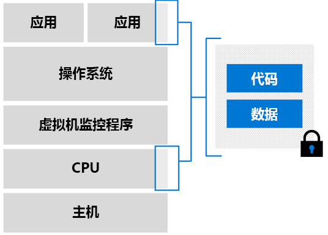

# Azure 上的机密计算

在云中处理敏感数据时，可以使用 Azure 机密计算将这些数据隔离。 许多行业都使用机密计算来保护其数据。 这些工作负荷包括：

- 保护财务数据
- 保护患者信息
- 对敏感信息运行机器学习过程
- 针对来自多个源的加密数据集执行算法

## 概述

> [!VIDEO https://www.youtube.com/embed/rT6zMOoLEqI]

我们知道，保护云数据非常重要。 我们将会倾听你的忧虑。 下面只是客户在将敏感工作负荷转移到云时可能会提出的一部分问题： 

- 如何确保 Microsoft 无法访问未加密的数据？
- 如何防止公司内部的特权管理员造成安全威胁？
- 还有哪些方法可以防止第三方访问敏感的客户数据？

Microsoft Azure 可帮助你最小化受攻击面，以增强数据保护。 Azure 已提供了许多工具来通过客户端加密和服务器端加密等模型保护[静态数据](../security/fundamentals/encryption-atrest.md)  。 此外，Azure 还提供了通过安全协议（例如 TLS 和 HTTPS）加密[传输中数据](../security/fundamentals/data-encryption-best-practices.md#protect-data-in-transit)的机制  。 本页介绍了数据加密的第三个支柱 - 使用中数据的加密  。

## 机密计算简介 

机密计算是由[机密计算联盟](https://confidentialcomputing.io/) (CCC) 定义的一个行业术语。CCC 是专业定义机密计算并加速其采用的基金会。 执行计算时，机密计算将对使用中的数据提供保护。 这些计算是在基于硬件的受信任执行环境 (TEE) 中进行的。

TEE 是强制仅执行已授权代码的环境。 TEE 外部的任何代码都无法读取或篡改该环境中的任何数据。

### 领地和受信任执行环境

在机密计算的上下文中，TEE 通常称为“领地”或“安全领地”   。 领地是硬件处理器和内存的受保护部分。 即使是使用调试器，也无法查看领地内部的数据或代码。 如果不受信任的代码尝试修改领地内存中的内容，则会禁用该环境并拒绝操作。

开发应用程序时，可以使用[软件工具](#oe-sdk)来屏蔽领地内部的代码和数据部分。 这些工具确保受信任环境外部的任何人都不能查看或修改你的代码和数据。 

从根本上讲，可将领地视为一个黑盒。 加密的代码和数据将放入该盒子中。 在盒子的外部看不到任何内容。 你为领地指定一个用于解密数据的密钥，然后，在从领地发出数据之前，会再次对数据进行处理和加密。

### 证明

你想要验证受信任环境是否安全。 这种验证是一个证明过程。 

通过证明，信赖方可以更加确信其软件：(1) 在领地中运行；(2) 领地是最新且安全的。 例如，领地请求底层硬件生成一个凭据，该凭据可以证明该领地在平台上存在。 然后，可以向另一个领地提供报告，验证该报告是否是在同一平台上生成的。

必须使用与系统软件和芯片兼容的安全证明服务来实施证明。 [Intel 的证明和预配服务](https://software.intel.com/sgx/attestation-services)与 Azure 机密计算虚拟机兼容。

## 使用 Azure 进行基于云的机密计算 

借助 Azure 机密计算，可以在虚拟化环境中利用机密计算功能。 现在可以使用工具、软件和云基础结构在安全硬件的基础上生成解决方案。 

### 虚拟机

Azure 是在虚拟化环境中提供机密计算的第一家云提供商。 我们开发了充当硬件与应用程序之间的抽象层的虚拟机。 你可以使用冗余和可用性选项大规模运行工作负荷。  

#### 支持 Intel SGX 的虚拟机

在 Azure 机密计算虚拟机中，为应用程序中的一部分代码和数据保留了一部分 CPU 硬件。 此受限部分即为领地。 

Azure 机密计算基础结构目前由虚拟机 (VM) 的专用 SKU 组成。 这些 VM 在具有软件防护扩展 (Intel SGX) 的 Intel 处理器上运行。 [Intel SGX](https://intel.com/sgx) 组件可以通过机密计算来增强保护。 

当前，Azure 提供了基于 Intel SGX 技术的 [DCsv2 系列](https://docs.microsoft.com/azure/virtual-machines/dcv2-series)来用于创建基于硬件的领地。 你可以构建安全的基于领地的应用程序以在 DCsv2 系列 VM 中运行，从而保护使用中的应用程序数据和代码。 

可以[详细了解](virtual-machine-solutions.md)如何使用基于硬件的受信任领地部署 Azure 机密计算虚拟机。

## 应用程序开发 

若要利用领地和独立环境的强大功能，需要使用支持机密计算的工具。 有多种工具支持领地应用程序开发。 例如，可以使用以下开源框架： 

- [Open Enclave 软件开发工具包 (SDK)](https://github.com/openenclave/openenclave)
- [机密联盟框架 (CCF)](https://github.com/Microsoft/CCF)

### 概述

使用领地构建的应用程序按两种方式分区：
1. “不受信任的”组件（宿主）
1. “受信任的”组件（领地）

宿主是在不受信任的环境中运行的领地应用程序  。 宿主中的代码无法访问已载入领地的代码。 

领地是 TEE 实现中运行代码和数据的位置  。 安全计算应在领地中进行，以确保机密和敏感数据保持受保护状态。 

在开始开发领地应用程序时，你需要确定哪些代码和数据需要保护。 你选择放入受信任组件的代码将与应用程序其余组件中的数据相互隔离。 初始化领地并将代码加载到内存后，无法从受保护环境的外部读取或更改该代码。

### Open Enclave 软件开发工具包 (OE SDK) 

若要编写在领地中运行的代码，请使用提供商支持的库或框架。 [开放领地 SDK](https://github.com/openenclave/openenclave) (OE SDK) 是一个开源 SDK，可以在支持机密计算的不同硬件上实现抽象化。 

OE SDK 旨在充当任何 CSP 的任何硬件上的单个抽象层。 可以在 Azure 机密计算虚拟机的基础上使用 OE SDK，以创建并运行基于领地的应用程序。

## 后续步骤

部署 DCsv2 系列虚拟机并在其上安装 OE SDK。

> [!div class="nextstepaction"]
> [在 Azure 市场中部署机密计算 VM](quick-create-marketplace.md)