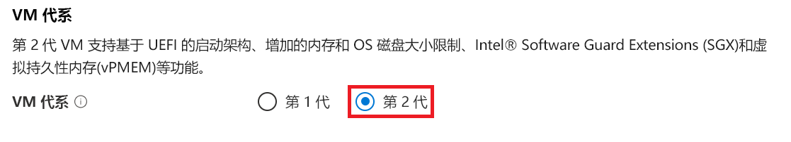
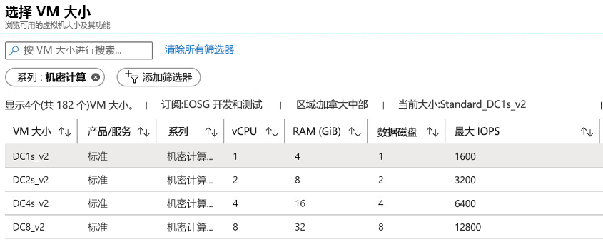
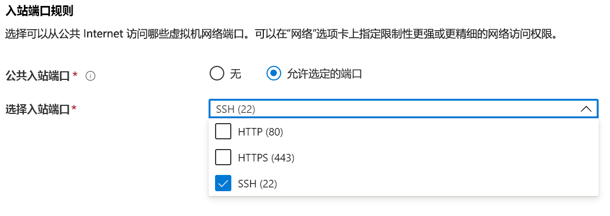

# <a name="quickstart-deploy-an-azure-confidential-computing-vm-in-the-azure-portal"></a>快速入门：在 Azure 门户中部署 Azure 机密计算 VM

使用 Azure 门户创建由 Intel SGX 提供支持的虚拟机 (VM)，以便开始使用 Azure 机密计算。 然后，安装 Open Enclave 软件开发工具包 (SDK) 以设置开发环境。 

如果你对使用自定义配置部署机密计算虚拟机感兴趣，建议使用本教程。 否则，建议按 [Microsoft 商业市场的机密计算虚拟机部署步骤](quick-create-marketplace.md)进行操作。


## <a name="prerequisites"></a>先决条件

如果还没有 Azure 订阅，可以在开始前[创建一个帐户](https://azure.microsoft.com/pricing/purchase-options/pay-as-you-go/)。

> [!NOTE]
> 免费试用帐户无法访问本教程中使用的虚拟机。 请升级为即用即付订阅。


## <a name="sign-in-to-azure"></a>登录 Azure

1. 登录 [Azure 门户](https://portal.azure.com/)。

1. 在顶部，选择“创建资源”。

1. 在“市场”窗格中，选择左侧的”计算”。

1. 查找并选择“虚拟机”。

    

1. 在虚拟机登陆页面上，选择“创建”。


## <a name="configure-a-confidential-computing-virtual-machine"></a>配置机密计算虚拟机

1. 在“基本信息”选项卡中，选择自己的**订阅**和**资源组**。

1. 在“虚拟机名称”中，为新 VM 输入一个名称。

1. 键入或选择以下值：

   * **区域**：选择合适的 Azure 区域。

        > [!NOTE]
        > 机密计算虚拟机仅在特定区域提供的专用硬件上运行。 有关 DCsv2 系列 VM 的最新可用区域，请参阅[可用区域](https://azure.microsoft.com/global-infrastructure/services/?products=virtual-machines)。

1. 配置要用于虚拟机的操作系统映像。

    * **选择映像**：对于本教程，请选择 Ubuntu 18.04 LTS。 还可以选择 Windows Server 2019、Windows Server 2016 或 Ubuntu 16.04 LTS。 如果选择这样做，则本教程会对你进行相应的重定向。
    
    * **切换第 2 代的映像**：机密计算虚拟机仅在[第 2 代](../virtual-machines/linux/generation-2.md)映像上运行。 确保所选映像是第 2 代映像。 单击上方的“高级”选项卡，你将在其中配置虚拟机。 向下滚动，直至找到标签为“VM 代系”的部分。 选择“第 2 代”，然后返回到“基本信息”选项卡。
    

        


        

    * **返回到基本配置**：使用顶部的导航返回到“基本信息”选项卡。

1. 通过选择“更改大小”，在大小选择器中选择具有机密计算功能的虚拟机。 在虚拟机大小选择器中，单击“清除所有筛选器”。 选择“添加筛选器”，接着选择“系列”作为筛选器类型，然后仅选择“机密计算”。

    

    > [!TIP]
    > 应当会看到以下大小：DC1s_v2、DC2s_v2、DC4s_V2 和 DC8_v2。 这是目前仅有的支持机密计算的虚拟机大小。 [了解详细信息](virtual-machine-solutions.md)。

1. 填充以下信息：

   * **身份验证类型**：若要创建 Linux VM，请选择“SSH 公钥”。 

        > [!NOTE]
        > 可以选择使用“SSH 公钥”或“密码”进行身份验证。 SSH 更安全。 有关如何生成 SSH 密钥的说明，请参阅[在 Linux 和 Mac 上为 Azure 中的 Linux VM 创建 SSH 密钥](../virtual-machines/linux/mac-create-ssh-keys.md)。

    * **用户名**：输入 VM 的管理员名称。

    * **SSH 公钥**：在适用情况下输入你的 RSA 公钥。
    
    * 密码：在适用情况下输入你的身份验证密码。

    * **公共入站端口**：选择“允许所选的端口”，然后在“选择公共入站端口”列表中选择“SSH (22)”和“HTTP (80)”。    如果要部署 Windows VM，请选择“HTTP (80)”和“RDP (3389)” 。 在本快速入门中，必须执行此步骤才能连接到 VM 并完成 Open Enclave SDK 配置。 

     


1. 在“磁盘”选项卡中进行更改。

   * 如果选择了“DC1s_v2”、“DC2s_v2”、“DC4s_V2”虚拟机，请选择“标准 SSD”或“高级 SSD”作为磁盘类型。 
   * 如果选择了“DC8_v2”虚拟机，请选择“标准 SSD”作为磁盘类型。

1. 在下面的选项卡中对设置进行任何所需的更改，或保留默认设置。

    * **网络**
    * **Management**
    * **来宾配置**
    * **标记**

1. 选择“查看 + 创建”。

1. 在“查看 + 创建”窗格中，选择“创建”。 

> [!NOTE]
> 如果已部署 Linux VM，请转到下一部分继续学习本教程。 如果已部署 Windows VM，请[按照这些步骤连接到 Windows VM](../virtual-machines/windows/connect-logon.md)，然后[在 Windows 上安装 OE SDK](https://github.com/openenclave/openenclave/blob/master/docs/GettingStartedDocs/install_oe_sdk-Windows.md)。


## <a name="connect-to-the-linux-vm"></a>连接到 Linux VM

如果已使用 BASH shell，请通过 ssh 命令连接到 Azure VM。 在以下命令中，替换连接到 Linux VM 所需的 VM 用户名和 IP 地址。

```bash
ssh azureadmin@40.55.55.555
```

可以在 Azure 门户中虚拟机的“概览”部分找到 VM 的公共 IP 地址。

:::image type="content" source="media/quick-create-portal/public-ip-virtual-machine.png" alt-text="Azure 门户中的 IP 地址":::

如果在 Windows 上运行且没有 BASH shell，请安装 SSH 客户端，例如 PuTTY。

1. [下载并安装 PuTTY](https://www.chiark.greenend.org.uk/~sgtatham/putty/download.html)。

1. 运行 PuTTY。

1. 在 PuTTY 配置屏幕上，输入 VM 的公共 IP 地址。

1. 选择“打开”，并根据提示输入用户名和密码。

若要详细了解如何连接到 Linux VM，请参阅[使用门户在 Azure 上创建 Linux VM](../virtual-machines/linux/quick-create-portal.md)。

> [!NOTE]
> 如果出现有关不会在注册表中缓存服务器主机密钥的 PuTTY 安全警报，请从以下选项中进行选择。 如果你信任此主机，请选择“是”将密钥添加到 PuTTy 缓存并继续进行连接。 如果你只想建立连接一次，而无需将密钥添加到缓存，请选择“否”。 如果你不信任此主机，请选择“取消”以放弃连接。

## <a name="install-the-open-enclave-sdk-oe-sdk"></a>安装 Open Enclave SDK (OE SDK) <a id="Install"></a>

按照分步说明在运行 Ubuntu 18.04 LTS Gen 2 映像的 DCsv2 系列虚拟机上安装 [OE SDK](https://github.com/openenclave/openenclave)。 

如果虚拟机在 Ubuntu 16.04 LTS Gen 2 上运行，则需要按照[适用于 Ubuntu 16.04 的安装说明](https://github.com/openenclave/openenclave/blob/master/docs/GettingStartedDocs/install_oe_sdk-Ubuntu_16.04.md)进行操作。

#### <a name="1-configure-the-intel-and-microsoft-apt-repositories"></a>1.配置 Intel 和 Microsoft APT 存储库

```bash
echo 'deb [arch=amd64] https://download.01.org/intel-sgx/sgx_repo/ubuntu bionic main' | sudo tee /etc/apt/sources.list.d/intel-sgx.list
wget -qO - https://download.01.org/intel-sgx/sgx_repo/ubuntu/intel-sgx-deb.key | sudo apt-key add -

echo "deb http://apt.llvm.org/bionic/ llvm-toolchain-bionic-7 main" | sudo tee /etc/apt/sources.list.d/llvm-toolchain-bionic-7.list
wget -qO - https://apt.llvm.org/llvm-snapshot.gpg.key | sudo apt-key add -

echo "deb [arch=amd64] https://packages.microsoft.com/ubuntu/18.04/prod bionic main" | sudo tee /etc/apt/sources.list.d/msprod.list
wget -qO - https://packages.microsoft.com/keys/microsoft.asc | sudo apt-key add -
```

#### <a name="2-install-the-intel-sgx-dcap-driver"></a>2.安装 Intel SGX DCAP 驱动程序

```bash
sudo apt update
sudo apt -y install dkms
wget https://download.01.org/intel-sgx/sgx-dcap/1.4/linux/distro/ubuntuServer18.04/sgx_linux_x64_driver_1.21.bin -O sgx_linux_x64_driver.bin
chmod +x sgx_linux_x64_driver.bin
sudo ./sgx_linux_x64_driver.bin
```

> [!WARNING]
> 请使用 [Intel SGX 站点](https://01.org/intel-software-guard-extensions/downloads)中的最新 Intel SGX DCAP 驱动程序。

#### <a name="3-install-the-intel-and-open-enclave-packages-and-dependencies"></a>3.安装 Intel 和 Open Enclave 包与依赖项

```bash
sudo apt -y install clang-7 libssl-dev gdb libsgx-enclave-common libsgx-enclave-common-dev libprotobuf10 libsgx-dcap-ql libsgx-dcap-ql-dev az-dcap-client open-enclave
```

> [!NOTE] 
> 此步骤还会安装 [az-dcap-client](https://github.com/microsoft/azure-dcap-client) 包，在 Azure 中执行远程认证时需要此包。

#### <a name="4-verify-the-open-enclave-sdk-install"></a>4.**验证 Open Enclave SDK 安装**

参阅 GitHub 上的[使用 Open Enclave SDK](https://github.com/openenclave/openenclave/blob/master/docs/GettingStartedDocs/Linux_using_oe_sdk.md) 来验证和使用已安装的 SDK。

## <a name="clean-up-resources"></a>清理资源

当不再需要时，可以删除资源组、虚拟机和所有相关资源。 

选择虚拟机的资源组，然后选择“删除”。 确认资源组名称，以完成资源删除。

## <a name="next-steps"></a>后续步骤

在本快速入门中，你部署了一个机密计算虚拟机，并安装了 Open Enclave SDK。 有关 Azure 上的机密计算虚拟机的详细信息，请参阅[有关虚拟机的解决方案](virtual-machine-solutions.md)。 

如果部署了 Windows VM，请使用 GitHub 上的[适用于 Windows 的 OE SDK 示例](https://github.com/openenclave/openenclave/blob/master/samples/README_Windows.md)，了解如何生成应用程序。 

继续参阅 GitHub 上的 Open Enclave SDK Linux 示例，了解如何在 Linux 上生成机密计算应用程序。 

> [!div class="nextstepaction"]
> [在 Linux 上生成 Open Enclave SDK 示例](https://github.com/openenclave/openenclave/blob/master/samples/README_Linux.md)
