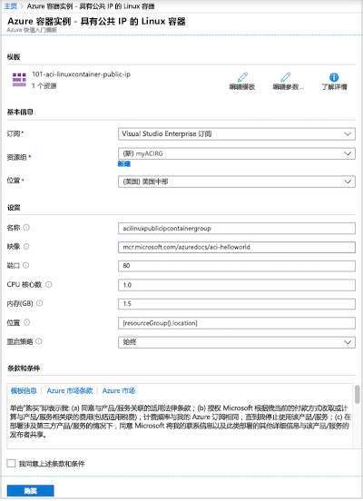
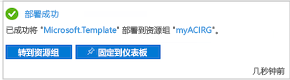
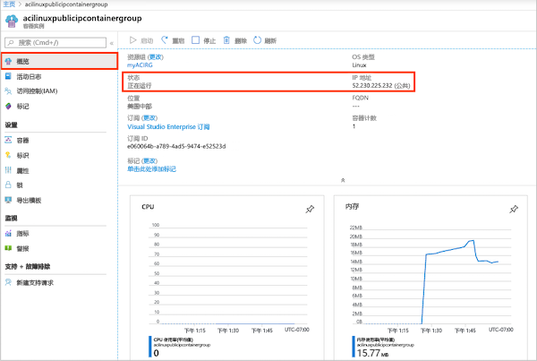
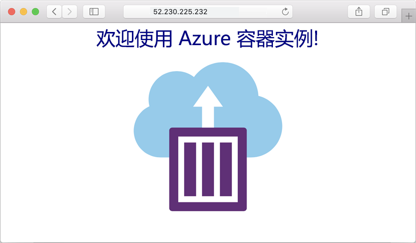
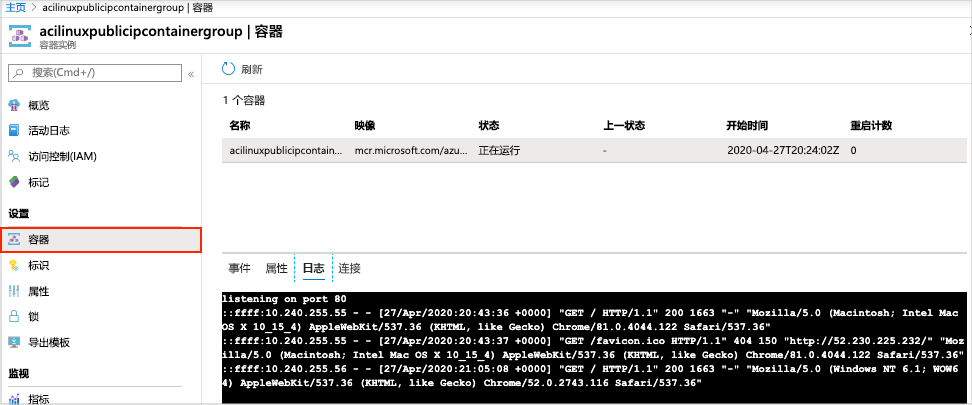

# 快速入门：使用资源管理器模板在 Azure 中部署容器实例

使用 Azure 容器实例在 Azure 中快速方便地运行无服务器 Docker 容器。 当你不需要像 AzureKubernetes 服务这样的完整容器业务流程平台时，可以按需将应用程序部署到容器实例。 在本快速入门中，你将使用 Azure 资源管理器模板部署一个独立的 Docker 容器，并使其 Web 应用程序可通过公共 IP 地址使用。

[!INCLUDE [About Azure Resource Manager](../../includes/resource-manager-quickstart-introduction.md)]

如果没有 Azure 订阅，请在开始之前创建一个[免费](https://azure.microsoft.com/free/)帐户。

## 先决条件

无。

## 创建容器实例

### 查看模板

本快速入门中使用的模板来自 [Azure 快速入门模板](https://azure.microsoft.com/resources/templates/101-aci-linuxcontainer-public-ip/)。

:::code language="json" source="~/quickstart-templates/101-aci-linuxcontainer-public-ip/azuredeploy.json" range="1-107" highlight="61-100":::

模板中定义了以下资源：

* **[Microsoft.ContainerInstance/containerGroups](/azure/templates/microsoft.containerinstance/containergroups)** ：创建 Azure 容器组。 此模板定义一个组，其中包含单个容器实例。

可以在[快速入门模板库](https://azure.microsoft.com/resources/templates/?resourceType=Microsoft.Containerinstance&pageNumber=1&sort=Popular)中找到更多 Azure 容器实例模板示例。

### 部署模板

 1. 选择下图登录到 Azure 并打开一个模板。 该模板将在另一位置创建注册表和副本。

    

 2. 选择或输入以下值。

    * **订阅**：选择一个 Azure 订阅。
    * **资源组**：选择“新建”，为资源组输入一个独一无二的名称，然后选择“确定”。  
    * **位置**：选择资源组的位置。 示例：“美国中部”  。
    * **名称**：接受为实例生成的名称，或者输入一个名称。
    * **映像**：接受默认映像名称。 此示例 Linux 映像打包了一个用 Node.js 编写的小型 Web 应用，该应用提供静态 HTML 页面。 

    对于剩余的属性，请接受默认值。

    查看条款和条件。 如果你同意，请选择“我同意上述条款和条件”  。

    

 3. 成功创建实例后，你会收到通知：

    

 使用 Azure 门户部署模板。 除了 Azure 门户之外，还可以使用 Azure PowerShell、Azure CLI 和 REST API。 若要了解其他部署方法，请参阅[部署模板](../azure-resource-manager/templates/deploy-cli.md)。

## 查看已部署的资源

使用 Azure 门户或诸如 [Azure CLI](container-instances-quickstart.md) 之类的工具来查看容器实例的属性。

1. 在门户中，搜索“容器实例”，然后选择你创建的容器实例。

1. 在“概览”  页上，记下实例的“状态”及其“IP 地址”   。

    

2. 在其状态为“正在运行”  后，在浏览器中导航到 IP 地址。 

    

### 查看容器日志

当排查容器或其运行的应用程序的问题时，查看容器实例的日志非常有用。

若要查看容器的日志，请在“设置”  下选择“容器” > “日志”。   应当会看到在浏览器中查看应用程序时生成的 HTTP GET 请求。

## 清理资源

使用完容器后，在容器实例的“概览”页上选择“删除”。   出现提示时，确认删除。

## 后续步骤

在本快速入门中，你已基于公共 Microsoft 映像创建了一个 Azure 容器实例。 若要基于专用 Azure 容器注册表生成容器映像并部署它，请继续学习 Azure 容器实例教程。

> [!div class="nextstepaction"]
> [教程：创建要部署到 Azure 容器实例的容器映像](./container-instances-tutorial-prepare-app.md)

有关引导你完成模板创建过程的分步教程，请参阅：

> [!div class="nextstepaction"]
> [教程：创建和部署你的第一个 Azure 资源管理器模板](../azure-resource-manager/templates/template-tutorial-create-first-template.md)