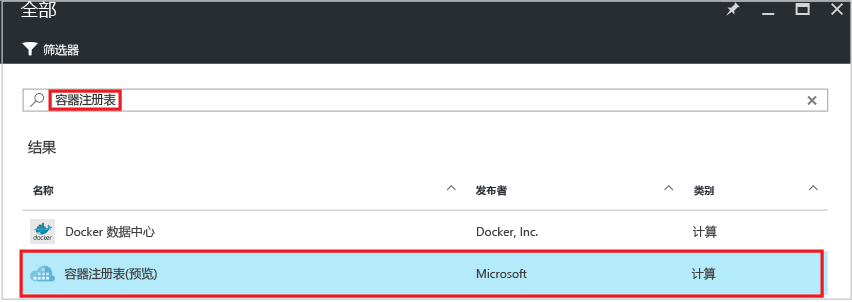
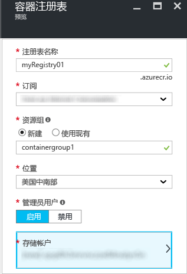
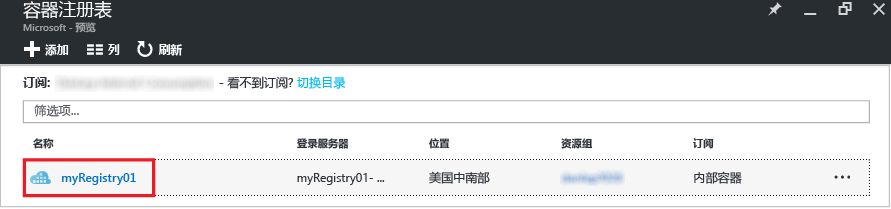
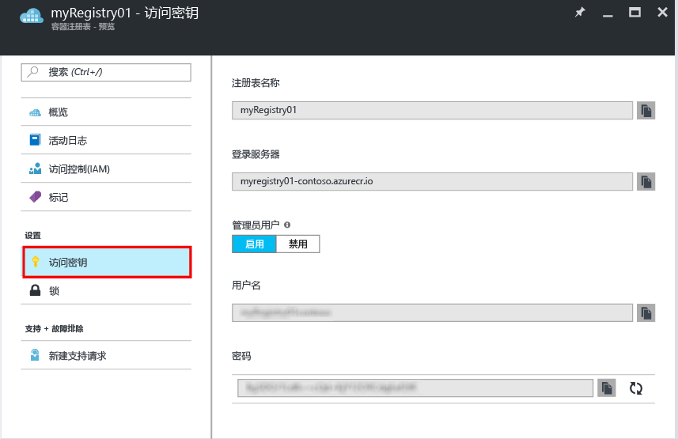

---
title: 创建 Azure 容器注册表 - 门户 | Microsoft 文档 description: 使用 Azure 门户创建和管理 Azure 容器注册表 services: container-registry documentationcenter: '' author: stevelas manager: balans editor: dlepow tags: ''keywords: ''

ms.assetid: 53a3b3cb-ab4b-4560-bc00-366e2759f1a1 ms.service: container-registry ms.devlang: na ms.topic: get-started-article ms.tgt_pltfrm: na ms.workload: na ms.date: 11/14/2016 ms.author: stevelas ---# 使用 Azure 门户创建容器注册表 使用 Azure 门户创建容器注册表并管理其设置。 也可以使用 [Azure CLI 2.0 命令](container-registry-get-started-azure-cli.md)或者使用容器注册表 [REST API](https://go.microsoft.com/fwlink/p/?linkid=834376) 以编程方式创建和管理容器注册表。

有关背景信息和概念，请参阅[什么是 Azure 容器注册表？](container-registry-intro.md)

> [!NOTE]
> 容器注册表目前以预览版提供。

## 创建容器注册表
1. 在[门户](https://portal.azure.com)中单击“+新建”。
2. 在应用商店中搜索“容器注册表”。
3. 选择发行商为“Microsoft”的“容器注册表(预览版)”。 
    
4. 单击“创建” 。 此时将显示“容器注册表”边栏选项卡。

    
5. 在“容器注册表”边栏选项卡中输入以下信息。 完成后，单击“创建”。
   
    a.在“解决方案资源管理器”中，右键单击项目文件夹下的“引用”文件夹，然后单击“添加引用”。 **注册表名称** - 特定注册表的全局唯一顶级域名。 在本示例中，注册表名称为 *myRegistry01*，但需要将它替换为你自己的唯一名称。 该名称只能包含字母和数字。
   
    b.保留“数据库类型”设置，即设置为“共享”。 **资源组** - 选择现有的[资源组](../azure-resource-manager/resource-group-overview.md#resource-groups)，或键入新资源组的名称。 
   
    c. **位置** - 选择[提供](https://azure.microsoft.com/regions/services/)该服务的 Azure 数据中心位置，例如“美国中南部”。 
   
    d. **管理员用户** - 如果需要，可以启用一个管理员用户来访问注册表。 创建注册表后可以更改此设置。
   
   > [!IMPORTANT]
   > 除了通过管理员用户帐户提供访问权限以外，容器注册表还基于 Azure Active Directory 服务主体的身份验证。 有关详细信息和注意事项，请参阅 [Authenticate with a container registry](container-registry-authentication.md)（使用容器注册表进行身份验证）。
   

    e.在“新建 MySQL 数据库”边栏选项卡中，接受法律条款，然后单击“确定”。 **存储帐户** - 使用默认设置来创建[存储帐户](../storage/storage-introduction.md)，或选择位于同一位置的现有存储帐户。 当前不支持高级存储。

## 管理注册表设置
创建注册表后，请在门户中的“容器注册表”在边栏选项卡上查找注册表设置。 例如，可能需要指定设置来登录注册表，或者需要启用或禁用管理员用户。

1. 在“容器注册表”边栏选项卡上，单击相应注册表的名称。
   
    
2. 若要管理访问权限设置，请单击“访问密钥”。
   
    
3. 请注意以下设置：
   
   * **登录服务器** - 用于登录注册表的完全限定名称。 在此示例中，它是 `myregistry01-contoso.azurecr.io`。
   * **管理员用户** - 启用或禁用注册表的管理员用户帐户。
   * **用户名**和**密码** - 可用于登录注册表的管理员用户帐户（如果已启用）的凭据。 可以根据需要重新生成密码。

## 后续步骤
* [使用 Docker CLI 推送第一个映像](container-registry-get-started-docker-cli.md)

