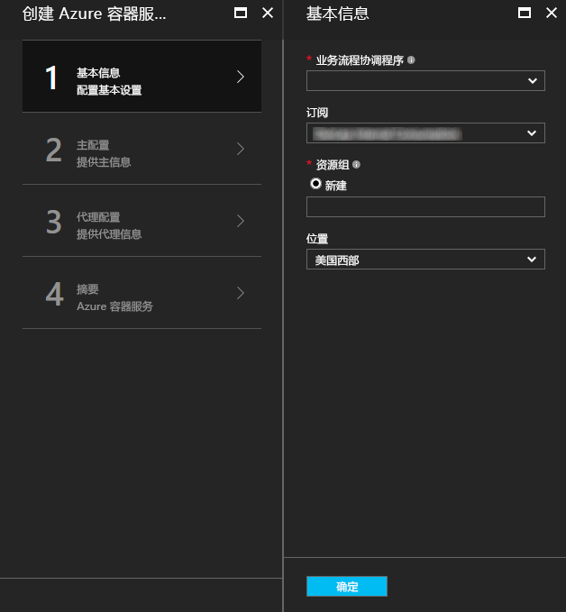
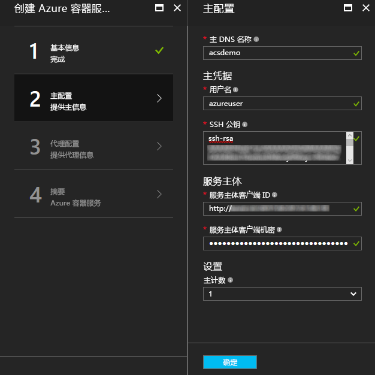
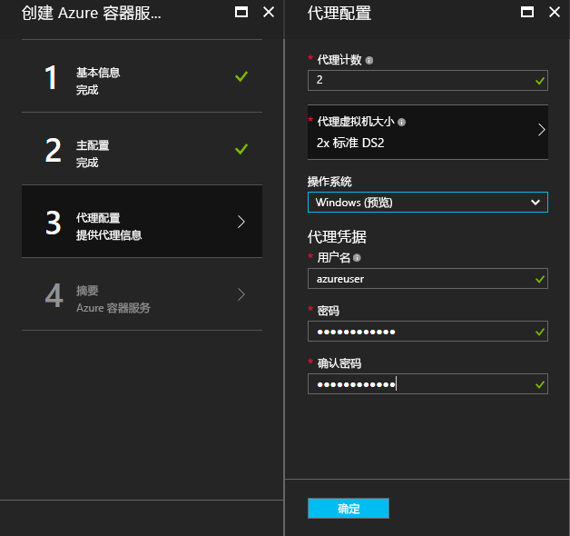
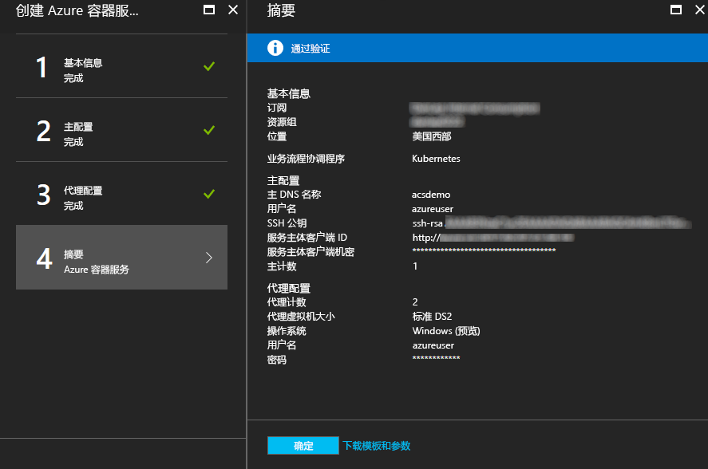

# <a name="deploy-a-docker-container-hosting-solution-using-the-azure-portal"></a>使用 Azure 门户部署 Docker 容器托管解决方案


在 Azure 容器服务中，可以快速部署流行的开源容器群集和协调解决方案。 本文档逐步讲解如何使用 Azure 门户或 Azure Resource Manager 快速入门模板部署 Azure 容器服务群集。 

也可使用 [Azure CLI 2.0](container-service-create-acs-cluster-cli.md) 或 Azure 容器服务 API 部署 Azure 容器服务群集。

有关背景信息，请参阅 [Azure 容器服务简介](../container-service-intro.md)。


## <a name="prerequisites"></a>先决条件

* **Azure 订阅**：如果没有订阅，可以注册[免费试用版](http://azure.microsoft.com/pricing/free-trial/?WT.mc_id=AA4C1C935)。 对于较大的群集，请考虑即用即付订阅或其他购买选项。

    > [!NOTE]
    > Azure 订阅使用量和[资源配额](../../azure-subscription-service-limits.md)（例如核心配额）可能会限制所部署群集的大小。 若要请求增加配额，可免费建立[联机客户支持请求](../../azure-supportability/how-to-create-azure-support-request.md)。
    >

* **SSH RSA 公钥**：通过门户或某个 Azure 快速入门模板进行部署时需提供公钥，以便针对 Azure 容器服务虚拟机进行身份验证。 若要创建安全外壳 (SSH) RSA 密钥，请参阅 [OS X 和 Linux](../../virtual-machines/linux/mac-create-ssh-keys.md) 或 [Windows](../../virtual-machines/linux/ssh-from-windows.md) 指南。 

* **服务主体客户端 ID 和机密**（仅 Kubernetes）：有关如何创建 Azure Active Directory 服务主体的详细信息和指南，请参阅[关于 Kubernetes 群集的服务主体](../kubernetes/container-service-kubernetes-service-principal.md)。


## <a name="create-a-cluster-by-using-the-azure-portal"></a>使用 Azure 门户创建群集
1. 登录到 Azure 门户，选择“新建”，并在 Azure 应用商店中搜索“Azure 容器服务”。

      <br />

2. 单击“Azure 容器服务”，并单击“创建”。

3. 在“基本信息”边栏选项卡中输入以下信息：

    * **协调器**：选择要在群集上部署的某个容器协调器。
        * **DC/OS**：部署 DC/OS 群集。
        * **Swarm**：部署 Docker Swarm 群集。
        * **Kubernetes**：部署 Kubernetes 群集。
    * **订阅**：选择一个 Azure 订阅。
    * **资源组** - 为部署输入新资源组的名称。
    * **位置**：选择 Azure 容器服务部署的 Azure 区域。 有关可用产品，请查看[可用产品（按区域）](https://azure.microsoft.com/regions/services/)。
    
      <br />
    
    准备好继续下一步时，请单击“确定”。

4. 在“主机配置”边栏选项卡上，为 Linux 主节点或群集中的节点输入以下设置（其中某些设置特定于每个协调器）：

    * **主机 DNS 名称**：用于为主机创建唯一完全限定的域名 (FQDN) 的前缀。 主机 FQDN 的形式是 *prefix*mgmt.*location*.cloudapp.azure.com。
    * **用户名**：群集中每个 Linux 虚拟机上帐户的用户名。
    * **SSH RSA 公钥**：添加用于针对 Linux 虚拟机进行身份验证的公钥。 此密钥不能包含换行符，且必须包含 `ssh-rsa` 前缀，这很重要。 `username@domain` 后缀是可选的。 此密钥应如下所示：**ssh-rsa AAAAB3Nz...<...>...UcyupgH azureuser@linuxvm**。 
    * **服务主体**：如果已选择 Kubernetes 协调器，则输入 Azure Active Directory **服务主体客户端 ID**（也称为 appId）和**服务主体的客户端机密**（密码）。 有关详细信息，请参阅[关于 Kubernetes 群集的服务主体](../kubernetes/container-service-kubernetes-service-principal.md)。
    * **主机计数**：群集中主机的数目。
    * **VM 诊断**：对于某些协调器，可以在主机上启用 VM 诊断。

      <br />

    准备好继续下一步时，请单击“确定”。

5. 在“代理配置”边栏选项卡中输入以下信息：

    * **代理计数**：对于 Docker Swarm 和 Kubernetes，此值是代理规模集中的初始代理数目。 对于 DC/OS，此值是专用规模集中的初始代理数目。 此外，将为 DC/OS 创建包含预先确定代理数目的公共规模集。 此公共规模集中的代理数目由群集中的主机数目确定：一个主机需要一个公共代理，三或五个主机需要两个公共代理。
    * **代理虚拟机大小**：代理虚拟机的大小。
    * **操作系统**：此设置目前仅在已选择 Kubernetes 协调器时可用。 选择在代理上运行的 Linux 分发或 Windows Server 操作系统。 此设置确定群集是否可以运行 Linux 或 Windows 容器应用。 

        > [!NOTE]
        > Kubernetes 群集的 Windows 容器支持处于预览状态。 在 DC/OS 和 Swarm 群集上，Azure 容器服务中目前仅支持 Linux 代理。

    * **代理凭据**：如果选择 Windows 操作系统，则输入代理 VM 的管理员“用户名”和“密码”。 

      <br />

    准备好继续下一步时，请单击“确定”。

6. 服务验证完成后，请单击“确定”。

      <br />

7. 查看条款。 若要启动部署过程，请单击“创建”。

    如果已选择将部署固定到 Azure 门户，可以看到部署状态。

      <br />

部署需要数分钟才能完成。 然后，Azure 容器服务群集即可供使用。


## <a name="create-a-cluster-by-using-a-quickstart-template"></a>使用快速入门模板创建群集
Azure 快速入门模板适用于在 Azure 容器服务中部署群集。 可修改提供的快速入门模板，包含其他或高级 Azure 配置。 若要使用 Azure 快速入门模板创建 Azure 容器服务群集，需要 Azure 订阅。 如果没有该订阅，请注册[免费试用版](http://azure.microsoft.com/pricing/free-trial/?WT.mc_id=AA4C1C935)。 

请按以下步骤使用模板和 Azure CLI 2.0 部署群集（参见[安装和设置说明](/cli/azure/install-az-cli2)）。

> [!NOTE] 
> 如果使用 Windows 系统，可以通过 Azure PowerShell 按照类似步骤部署模板。 请参阅本部分后面的步骤。 也可通过[门户](../../azure-resource-manager/resource-group-template-deploy-portal.md)或其他方法部署模板。

1. 若要部署 DC/OS、Docker Swarm 或 Kubernetes 群集，请从 GitHub 中选择以下可用快速入门模板之一。 后跟一份不完整的列表。 除了默认选择的协调器有所不同外，DC/OS 和 Swarm 模板完全相同。

    * [DC/OS 模板](https://github.com/Azure/azure-quickstart-templates/tree/master/101-acs-dcos)
    * [Swarm 模板](https://github.com/Azure/azure-quickstart-templates/tree/master/101-acs-swarm)
    * [Kubernetes 模板](https://github.com/Azure/azure-quickstart-templates/tree/master/101-acs-kubernetes)

2. 登录到 Azure 帐户 (`az login`)，确保 Azure CLI 连接到 Azure 订阅。 可以使用以下命令查看默认订阅：

    ```azurecli
    az account show
    ```
    
    如果在有多个订阅的情况下需要设置其他默认订阅，请运行 `az account set --subscription` 并指定订阅 ID 或名称。

3. 最好是使用新资源组进行部署。 若要创建资源组，请使用 `az group create` 命令并指定资源组名称和位置： 

    ```azurecli
    az group create --name "RESOURCE_GROUP" --location "LOCATION"
    ```

4. 创建包含所需模板参数的 JSON 文件。 下载名为 `azuredeploy.parameters.json` 的参数文件，该文件是 GitHub 中的 Azure 容器服务模板 `azuredeploy.json` 附带的。 输入群集所需的参数值。 

    例如，若要使用 [DC/OS 模板](https://github.com/Azure/azure-quickstart-templates/tree/master/101-acs-dcos)，请提供 `dnsNamePrefix` 和 `sshRSAPublicKey` 的参数值。 请参阅 `azuredeploy.json` 中的说明和其他参数的选项。  
 

5. 创建容器服务群集时，可以将部署参数文件与以下命令一起传递，其中：

    * **RESOURCE_GROUP** 是在上一步创建的资源组的名称。
    * **DEPLOYMENT_NAME**（可选）是提供给部署的名称。
    * **TEMPLATE_URI** 是部署文件 `azuredeploy.json` 的位置。 此 URI 必须是 RAW 文件，而不是指向 GitHub UI 的指针。 要查找此 URI，请在 GitHub 中选择 `azuredeploy.json` 文件，并单击“原始”按钮。  

    ```azurecli
    az group deployment create -g RESOURCE_GROUP -n DEPLOYMENT_NAME --template-uri TEMPLATE_URI --parameters @azuredeploy.parameters.json
    ```

    也可在命令行中将参数作为 JSON 格式的字符串提供。 请使用与以下命令类似的命令：

    ```azurecli
    az group deployment create -g RESOURCE_GROUP -n DEPLOYMENT_NAME --template-uri TEMPLATE_URI --parameters "{ \"param1\": {\"value1\"} … }"
    ```

    > [!NOTE]
    > 部署需要数分钟才能完成。
    > 

### <a name="equivalent-powershell-commands"></a>等效的 PowerShell 命令
也可使用 PowerShell 部署 Azure 容器服务群集模板。 本文档基于 1.0 版 [Azure PowerShell 模块](https://azure.microsoft.com/blog/azps-1-0/)。

1. 若要部署 DC/OS、Docker Swarm 或 Kubernetes 群集，请从 GitHub 中选择以下可用快速入门模板之一。 后跟一份不完整的列表。 请注意，除了默认选择的协调器有所不同外，DC/OS 和 Swarm 模板完全相同。

    * [DC/OS 模板](https://github.com/Azure/azure-quickstart-templates/tree/master/101-acs-dcos)
    * [Swarm 模板](https://github.com/Azure/azure-quickstart-templates/tree/master/101-acs-swarm)
    * [Kubernetes 模板](https://github.com/Azure/azure-quickstart-templates/tree/master/101-acs-kubernetes)

2. 在 Azure 订阅中创建群集之前，请确认 PowerShell 会话已登录到 Azure。 为此，可以使用 `Get-AzureRMSubscription` 命令：

    ```powershell
    Get-AzureRmSubscription
    ```

3. 如果需要登录到 Azure，请使用 `Login-AzureRMAccount` 命令：

    ```powershell
    Login-AzureRmAccount
    ```

4. 最好是使用新资源组进行部署。 若要创建资源组，请使用 `New-AzureRmResourceGroup` 命令，并指定资源组名称和目标区域：

    ```powershell
    New-AzureRmResourceGroup -Name GROUP_NAME -Location REGION
    ```

5. 创建资源组后，可以使用以下命令创建群集。 使用 `-TemplateUri` 参数指定所需模板的 URI。 运行此命令时，PowerShell 会提示输入部署参数值。

    ```powershell
    New-AzureRmResourceGroupDeployment -Name DEPLOYMENT_NAME -ResourceGroupName RESOURCE_GROUP_NAME -TemplateUri TEMPLATE_URI
    ```

#### <a name="provide-template-parameters"></a>提供模板参数
如果熟悉 PowerShell 的话，就知道可以通过键入减号 (-) 并按 TAB 键来切换 cmdlet 的可用参数。 对于模板中定义的参数，同样也可以使用此功能。 只要键入模板名称，该 cmdlet 就会提取该模板、分析参数并将模板参数动态添加到该命令。 这使得指定模板参数值变得非常轻松。 而且，如果忘记了必需的参数值，PowerShell 会提示输入该值。

以下是包含参数的完整命令。 提供自己的资源名称值。

```powershell
New-AzureRmResourceGroupDeployment -ResourceGroupName RESOURCE_GROUP_NAME-TemplateURI TEMPLATE_URI -adminuser value1 -adminpassword value2 ....
```

## <a name="next-steps"></a>后续步骤
创建一个正常运行的群集后，请参阅以下文档了解有关连接和管理的详细信息：

* [Connect to an Azure Container Service cluster](../container-service-connect.md)
* [Work with Azure Container Service and DC/OS](container-service-mesos-marathon-rest.md)
* [Work with Azure Container Service and Docker Swarm](container-service-docker-swarm.md)
* [Work with Azure Container Service and Kubernetes](../kubernetes/container-service-kubernetes-walkthrough.md)（使用 Azure 容器服务和 Kubernetes）

