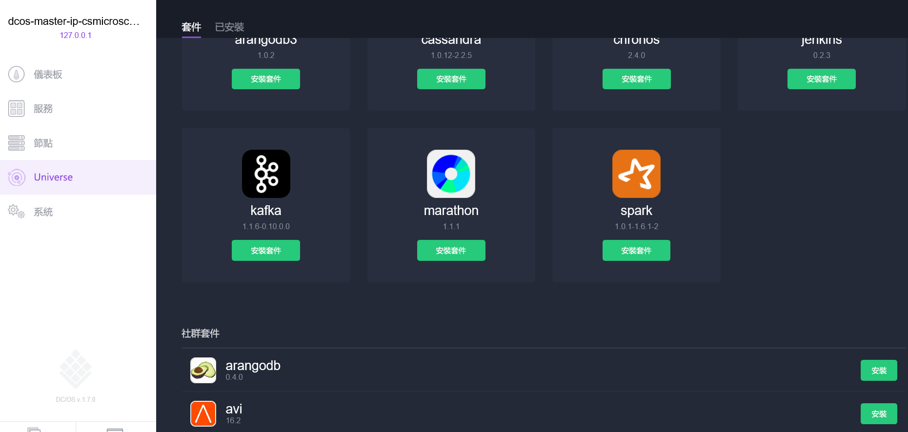
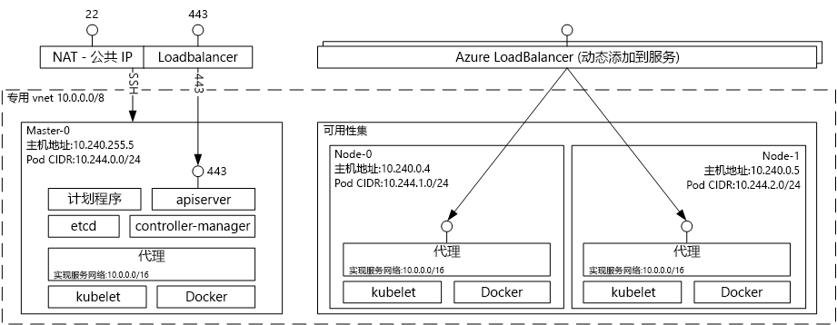

# （已弃用）Azure 容器服务的托管解决方案的 Docker 容器简介 

[!INCLUDE [ACS deprecation](../../../includes/container-service-deprecation.md)]

Azure 容器服务让创建、配置和管理预配置来运行容器化应用程序的虚拟机群集变得更简单。 它使用热门开源计划和业务流程工具的优化配置。 通过此服务，用户可使用现有技能或利用不断增加的大量社区专业知识，在 Microsoft Azure 上部署和管理基于容器的应用程序。

Azure 容器服务利用 Docker 容器格式，确保应用程序容器完全可移植。 它也支持选择 Marathon 和 DC/OS、Docker Swarm 或 Kubernetes，使用户能够将这些应用程序扩展到数千个，甚至数万个容器中。

通过 Azure 容器服务，可利用 Azure 的企业级功能，同时保留应用程序的可移植性，包括业务流程层的可移植性。

## 使用 Azure 容器服务
Azure 容器服务旨在通过使用当今用户中热门的开源工具和技术提供容器托管环境。 为此，我们所选的业务流程（DC/OS、Docker Swarm 或 Kubernetes）公开了标准 API 终结点。 通过使用这些终结点，可利用能够与这些终结点通信的任何软件。 例如，对于 Docker Swarm 终结点，可选择使用Docker 命令行接口 (CLI)。 对于 DC/OS，可以选择 DCOS CLI。 对于 Kubernetes，可以选择 `kubectl`。

## 通过 Azure 容器服务创建 Docker 群集
若要开始使用 Azure 容器服务，可通过门户（在“市场”中搜索“Azure 容器服务”）使用 Azure 资源管理器模板（[Docker Swarm](https://github.com/Azure/azure-quickstart-templates/tree/master/101-acs-swarm)、[DC/OS](https://github.com/Azure/azure-quickstart-templates/tree/master/101-acs-dcos) 或 [Kubernetes](https://github.com/Azure/azure-quickstart-templates/tree/master/101-acs-kubernetes)）或使用 [Azure CLI](container-service-create-acs-cluster-cli.md) 部署 Azure 容器服务群集。 可修改提供的快速入门模板，包含其他或高级 Azure 配置。 有关详细信息，请参阅[部署 Azure 容器服务群集](container-service-deployment.md)。

## 部署应用程序
Azure 容器服务针对业务流程提供了 Docker Swarm、DC/OS 或 Kubernetes 选项。 部署应用程序的方式取决于所选的业务流程。

### 使用 DC/OS
DC/OS 是基于 Apache Mesos 分布式系统内核的分布式操作系统。 Apache Mesos 存放于 Apache Software Foundation，并将一些 [IT 业界知名人士](https://mesos.apache.org/documentation/latest/powered-by-mesos/) 列为用户和参与者。

DC/OS 和 Apache Mesos 包含一个引人注目的功能集：

* 成熟的可伸缩性
* 使用 Apache ZooKeeper 的容错复制主要和辅助数据库
* 支持 Docker 格式的容器
* 任务与 Linux 容器间的本机隔离
* 多资源计划（内存、CPU、磁盘和端口）
* 用于开发新并行应用程序的 Java、Python 和 C++ API
* 用于查看群集状态的 Web UI

默认情况下，Azure 容器服务上运行的 DC/OS 包括用于计划工作负荷的 Marathon 业务流程平台。 但是，ACS 的 DC/OS 部署随附的是可添加到服务中的服务的 Mesosphere Universe。 Universe 中的服务包括 Spark、Hadoop 和 Cassandra 等。

#### 使用 Marathon
Marathon 是 cgroups 中针对服务的群集范围初始化和控制系统，或者对于 Azure 容器服务而言，是 Docker 格式的容器。 Marathon 提供可从中部署应用程序的 Web UI。 可通过类似于 `http://DNS_PREFIX.REGION.cloudapp.azure.com` 的 URL 访问它，
其中 DNS\_PREFIX 和 REGION 均在部署时定义。 也可以提供自己的 DNS 名称。 有关使用 Marathon Web UI 运行容器的详细信息，请参阅[通过 Marathon Web UI 管理 DC/OS 容器](container-service-mesos-marathon-ui.md)。

还可将 REST API 用于与 Marathon 通信。 有大量客户端库可用于每个池。 它们涵盖各种语言，用户可以使用任何语言的 HTTP 协议。 此外，许多热门 DevOps 工具提供对 Marathon 的支持。 处理 Azure 容器服务群集时，这可为运营团队提供最大的灵活性。 有关使用 Marathon REST API 运行容器的详细信息，请参阅[通过 Marathon REST API 管理 DC/OS 容器](container-service-mesos-marathon-rest.md)。

### 使用 Docker Swarm
Docker Swarm 为 Docker 提供本机群集。 由于 Docker Swarm 为标准 Docker API 提供服务，因此任何已与 Docker 守护程序通信的工具均可使用 Swarm 以透明方式扩展到 Azure 容器服务上的多个主机。

[!INCLUDE [container-service-swarm-mode-note](../../../includes/container-service-swarm-mode-note.md)]

支持用于管理 Swarm 群集上容器的工具包括但不限于以下工具：

* Dokku
* Docker CLI 和 Docker Compose
* Krane
* Jenkins

### 使用 Kubernetes
Kubernetes 是一种热门的开放源代码的生产级容器业务流程工具。 Kubernetes 对容器化应用程序自动进行部署、扩展和管理。 由于它是开源解决方案且由开源社区驱动，因此可在 Azure 容器服务中无缝运行，并可用于在 Azure 容器服务中大规模部署容器。

它具有一组丰富的功能，包括：
* 水平扩展
* 服务发现和负载均衡
* 机密和配置管理
* 基于 API 的自动推出和回退
* 自我修复

## 视频
Azure 容器服务入门 (101)：  

> [!VIDEO https://channel9.msdn.com/Shows/Azure-Friday/Azure-Container-Service-101/player]
>
>

使用 Azure 容器服务生成应用程序 (Build 2016)

> [!VIDEO https://channel9.msdn.com/Events/Build/2016/B822/player]
>
>

## 后续步骤

使用[门户](container-service-deployment.md)或 [Azure CLI](container-service-create-acs-cluster-cli.md) 部署容器服务群集。
