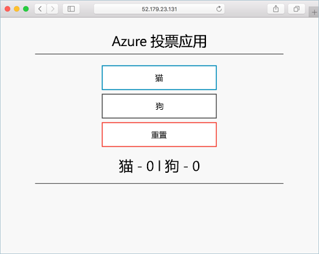

# <a name="deploy-docker-swarm-cluster"></a>部署 Docker Swarm 群集

在本快速入门中，将使用 Azure CLI 部署 Docker Swarm 群集。 然后，在群集上部署和运行包含 Web 前端和 Redis 实例的多容器应用程序。 完成后，即可通过 Internet 访问应用程序。

如果还没有 Azure 订阅，可以在开始前创建一个 [免费帐户](https://azure.microsoft.com/free/?WT.mc_id=A261C142F)。

本快速入门需要运行 Azure CLI 2.0.4 或更高版本。 运行 `az --version` 即可查找版本。 如果需要进行安装或升级，请参阅[安装 Azure CLI 2.0]( /cli/azure/install-azure-cli)。

## <a name="create-a-resource-group"></a>创建资源组

使用 [az group create](/cli/azure/group#create) 命令创建资源组。 Azure 资源组是在其中部署和管理 Azure 资源的逻辑组。

以下示例在 westus 位置创建名为 myResourceGroup 的资源组。

```azurecli-interactive
az group create --name myResourceGroup --location westus
```

输出：

```json
{
  "id": "/subscriptions/00000000-0000-0000-0000-000000000000/resourceGroups/myResourceGroup",
  "location": "westcentralus",
  "managedBy": null,
  "name": "myResourceGroup",
  "properties": {
    "provisioningState": "Succeeded"
  },
  "tags": null
}
```

## <a name="create-docker-swarm-cluster"></a>创建 Docker Swarm 群集

使用 [az acs create](/cli/azure/acs#create) 命令在 Azure 容器服务中创建 Docker Swarm 群集。 

以下示例创建名为 mySwarmCluster 的群集，其中包含一个 Linux 主节点和三个 Linux 代理节点。

```azurecli-interactive
az acs create --name mySwarmCluster --orchestrator-type Swarm --resource-group myResourceGroup --generate-ssh-keys
```

在某些情况下（如限时试用），Azure 订阅对 Azure 资源的访问受限。 如果由于可用核心有限而导致部署失败，请将 `--agent-count 1` 添加到 [az acs creat](/cli/azure/acs#create) 命令中，以减少默认代理计数。 

几分钟后，该命令完成并返回有关群集的 JSON 格式信息。

## <a name="connect-to-the-cluster"></a>连接至群集

本快速入门自始至终都需要 Docker Swarm 主池和代理池的 IP 地址。 运行以下命令即可返回这两个 IP 地址。


```bash
az network public-ip list --resource-group myResourceGroup --query "[*].{Name:name,IPAddress:ipAddress}" -o table
```

输出：

```bash
Name                                                                 IPAddress
-------------------------------------------------------------------  -------------
swarmm-agent-ip-myswarmcluster-myresourcegroup-d5b9d4agent-66066781  52.179.23.131
swarmm-master-ip-myswarmcluster-myresourcegroup-d5b9d4mgmt-66066781  52.141.37.199
```

创建到 Swarm 主池的 SSH 隧道。 将 `IPAddress` 替换为 Swarm 主池的 IP 地址。

```bash
ssh -p 2200 -fNL 2375:localhost:2375 azureuser@IPAddress
```

设置 `DOCKER_HOST` 环境变量。 这样可以针对 Docker Swarm 运行 docker 命令，不需指定主机名称。

```bash
export DOCKER_HOST=:2375
```

现在可以在 Docker Swarm 上运行 Docker 服务了。


## <a name="run-the-application"></a>运行应用程序

创建名为 `docker-compose.yaml` 的文件并将以下内容复制到其中。

```yaml
version: '3'
services:
  azure-vote-back:
    image: redis
    container_name: azure-vote-back
    ports:
        - "6379:6379"

  azure-vote-front:
    image: microsoft/azure-vote-front:redis-v1
    container_name: azure-vote-front
    environment:
      REDIS: azure-vote-back
    ports:
        - "80:80"
```

运行以下命令以创建 Azure Vote 服务。

```bash
docker-compose up -d
```

输出：

```bash
Creating network "user_default" with the default driver
Pulling azure-vote-front (microsoft/azure-vote-front:redis-v1)...
swarm-agent-EE873B23000005: Pulling microsoft/azure-vote-front:redis-v1...
swarm-agent-EE873B23000004: Pulling microsoft/azure-vote-front:redis-v1... : downloaded
Pulling azure-vote-back (redis:latest)...
swarm-agent-EE873B23000004: Pulling redis:latest... : downloaded
Creating azure-vote-front ... 
Creating azure-vote-back ... 
Creating azure-vote-front
Creating azure-vote-back ...
```

## <a name="test-the-application"></a>测试应用程序

浏览到 Swarm 代理池的 IP 地址，对 Azure Vote 应用程序进行测试。



## <a name="delete-cluster"></a>删除群集
如果不再需要群集，可以使用 [az group delete](/cli/azure/group#delete) 命令删除资源组、容器服务及所有相关资源。

```azurecli-interactive
az group delete --name myResourceGroup --yes --no-wait
```

## <a name="get-the-code"></a>获取代码

本快速入门使用了预先创建的容器映像来创建 Docker 服务。 GitHub 上提供了相关的应用程序代码、Dockerfile 和 Compose 文件。

[https://github.com/Azure-Samples/azure-voting-app-redis](https://github.com/Azure-Samples/azure-voting-app-redis.git)

## <a name="next-steps"></a>后续步骤

在本快速入门中，你部署了 Docker Swarm 群集，并向该群集部署了多容器应用程序。

若要了解如何将 Docker Swarm 与 Visual Studio Team Services 集成，请继续学习“将 CI/CD 用于 Docker Swarm 和 VSTS”。

> [!div class="nextstepaction"]
> [将 CI/CD 用于 Docker Swarm 和 VSTS](./container-service-docker-swarm-setup-ci-cd.md)