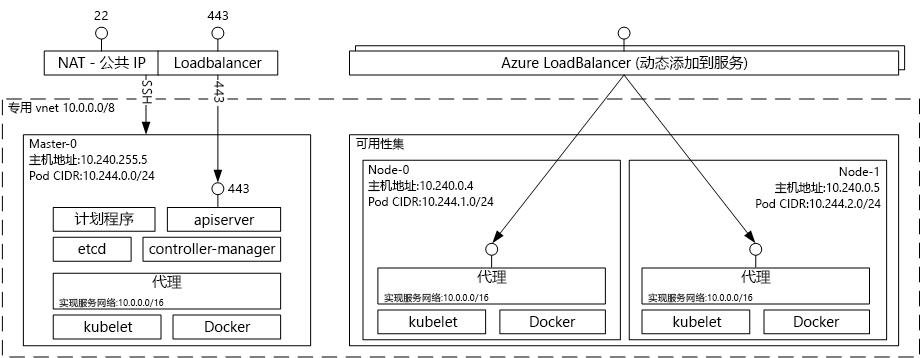

# 用于 Kubernetes 的 Azure 容器服务简介
有了用于 Kubernetes 的 Azure 容器服务，即可轻松创建、配置和管理虚拟机群集，这些虚拟机已经过预配置，可以运行容器化应用程序。 通过此服务，用户可使用现有技能或利用不断增加的大量社区专业知识，在 Microsoft Azure 上部署和管理基于容器的应用程序。

使用 Azure 容器服务时，可利用 Azure 的企业级功能，并且仍可通过 Kubernetes 以及 Docker 映像格式保留应用程序的可移植性。

## 使用用于 Kubernetes 的 Azure 容器服务
Azure 容器服务旨在通过使用当今客户中热门的开源工具和技术提供容器托管环境。 为此，我们公开标准 Kubernetes API 终结点。 通过使用这些标准终结点，可利用能够与 Kubernetes 群集通信的任何软件。 例如，可以选择 [kubectl](https://kubernetes.io/docs/user-guide/kubectl-overview/)、[helm](https://helm.sh/) 或 [draft](https://github.com/Azure/draft)。

## 使用 Azure 容器服务创建 Kubernetes 群集
若要开始使用 Azure 容器服务，可通过 [Azure CLI 2.0](container-service-kubernetes-walkthrough.md) 或门户（在 Marketplace 中搜索“Azure 容器服务”）部署 Azure 容器服务群集。 如果你是需要对 Azure Resource Manager 模板进行更多控制的高级用户，可以使用开源的 [acs-engine](https://github.com/Azure/acs-engine) 项目来生成自己的自定义 Kubernetes 群集，然后通过 `az` CLI 进行部署。

### 使用 Kubernetes
Kubernetes 对容器化应用程序自动进行部署、扩展和管理。 它具有一组丰富的功能，包括：
* 自动装箱
* 自我修复
* 水平扩展
* 服务发现和负载均衡
* 自动推出和回退
* 机密和配置管理
* 存储业务流程
* Batch 执行

通过 Azure 容器服务部署的 Kubernetes 的体系结构图：

## 视频

Azure 容器服务中的 Kubernetes 支持（Azure Friday，2017 年 1 月）：

> [!VIDEO https://channel9.msdn.com/Shows/Azure-Friday/Kubernetes-Support-in-Azure-Container-Services/player]
>
>

用于在 Kubernetes 上开发和部署应用程序的工具（Azure OpenDev，2017 年 6 月）：

> [!VIDEO https://channel9.msdn.com/Events/AzureOpenDev/June2017/Tools-for-Developing-and-Deploying-Applications-on-Kubernetes/player]
>
>

## 后续步骤

浏览 [Kubernetes 快速入门](container-service-kubernetes-walkthrough.md)，现在就开始了解 Azure 容器服务。