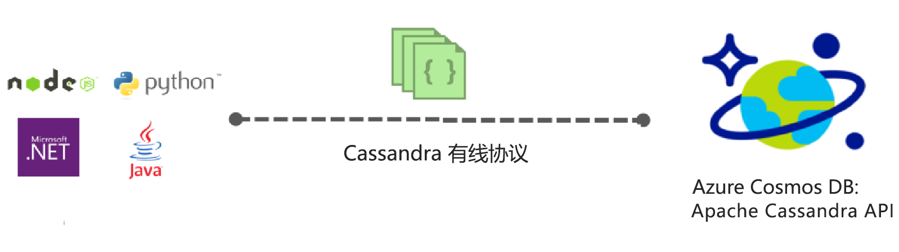
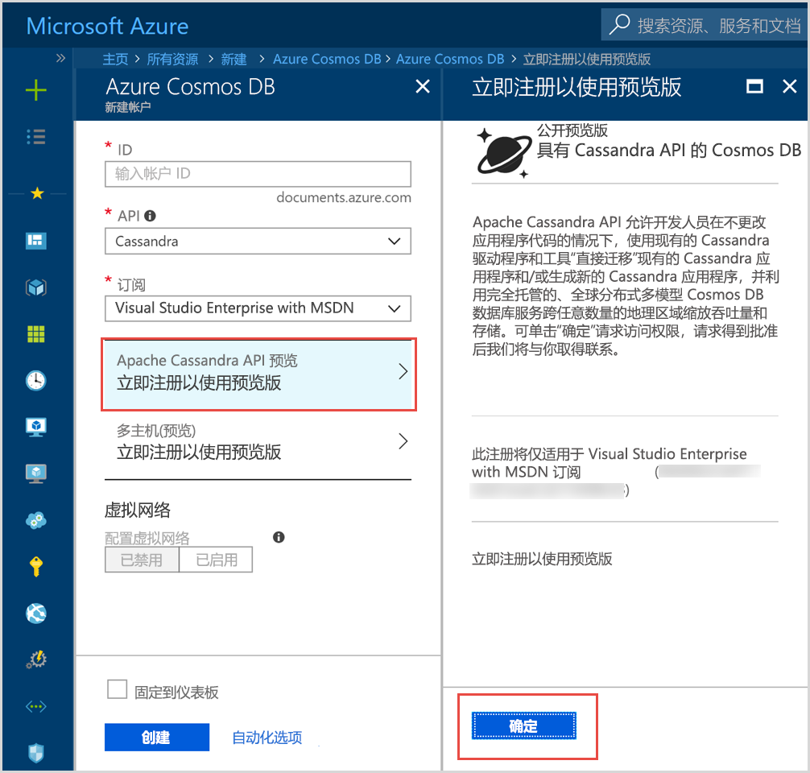

# Azure Cosmos DB 简介：Apache Cassandra API

Azure Cosmos DB 提供的 Cassandra API（预览版）适用于为 Apache Cassandra 编写且需要以下高级功能的应用程序：

* [可扩展存储大小和吞吐量](partition-data.md)。
* [统包全局分发](distribute-data-globally.md)
* 99% 的情况下低至个位数的毫秒级延迟。
* [五个妥善定义的一致性级别](consistency-levels.md)
* [自动为数据编制索引](http://www.vldb.org/pvldb/vol8/p1668-shukla.pdf)不需要处理架构和索引管理。 
* 保证高可用性，均由[行业领先的 SLA](https://azure.microsoft.com/support/legal/sla/cosmos-db/) 提供支持

## Azure Cosmos DB Apache Cassandra API 是什么？

通过 Apache Cassandra API，Azure Cosmos DB 可以充当为 [Apache Cassandra](https://cassandra.apache.org/) 编写的应用的数据存储。 这意味着通过使用现有的[符合 CQLv4 的 Apache 许可驱动程序](https://cassandra.apache.org/doc/latest/getting_started/drivers.html?highlight=driver)，为 Cassandra 编写的应用程序现在可以与 Azure Cosmos DB Cassandra API 通信。 在许多情况下，只需更改连接字符串，就可以从使用 Apache Cassandra 切换为使用 Azure Cosmos DB 的 Apache Cassandra API。 使用此功能，可以在 Azure 云中轻松生成和运行 Cassandra API 数据库应用程序（利用 Azure Cosmos DB 的全球分布和[行业领先的综合性 SLA](https://azure.microsoft.com/support/legal/sla/cosmos-db)），并且可继续使用熟悉的技能和 Cassandra API 工具。

通过 Cassandra API 可以使用基于 Cassandra 查询语言的工具（如 CQLSH）和熟悉的 Cassandra 客户端驱动程序与 Azure Cosmos DB 中存储的数据交互。 有关其更多的详细说明，可观看由首席工程经理 Kirill Gavrylyuk 主讲的 Microsoft Mechanics 视频。

> [!VIDEO https://www.youtube.com/embed/1Sf4McGN1AQ]
>

## 使用 Azure Cosmos DB Cassandra API 的优势是什么？

无需操作管理：作为一个完全托管的服务，Azure Cosmos DB 确保 Cassandra API 管理员无需为管理和监视跨 OS、JVM 和 yaml 文件的大量设置以及它们的相互作用而担忧。 Azure Cosmos DB 提供对吞吐量、延迟、存储和可用性以及可配置警报的监视。 

性能管理：Azure Cosmos DB 提供 SLA 支持的第 99 百分位数的低延迟读写。 用户无需担心提供良好的读写 SLA 会产生很多运营开销。 这些常常包含计划压缩、管理逻辑删除、布隆筛选器设置和副本滞后。 使用 Azure Cosmos DB 无需担心管理这些问题，你可以专注于应用程序的可交付结果。

自动编制索引：Azure Cosmos DB 自动对 Cassandra API 数据库中表的所有列编制索引。 Azure Cosmos DB 不需要创建辅助索引便可加速查询。 它提供低延迟读写体验，同时自动编制一致的索引。 

能够使用现有的代码和工具：Azure Cosmos DB 的线路协议级别与现有 SDK 和工具兼容。 此兼容性确保只需经过细微的更改，就可以将现有代码库用于 Azure Cosmos DB 的 Cassandra API。

吞吐量和存储弹性：Azure Cosmos 平台通过简单的门户、PowerShell 或 CLI 操作，可以跨区域灵活地提供有保证的吞吐量。 随着应用程序规模的增长，你可以弹性无缝地扩展 Azure Cosmos DB 表且其性能可以预测。 Azure Cosmos DB 支持可以扩展到几乎无限存储大小的 Cassandra API 表。 

全球分发和可用性：Azure Cosmos DB 可以实现在整个 Azure 区域内分发数据，使用户获得低延迟体验同时确保了可用性。 Azure Cosmos DB 在区域内提供 99.99% 的可用性，跨区域提供 99.999% 读取可用性，并且没有任何运营开销。 Azure Cosmos DB 在 30 多个 [Azure 区域](https://azure.microsoft.com/regions/services/)中可用。 在[全球分布数据](distribute-data-globally.md)中了解详细信息。 

一致性选择：Azure Cosmos DB 提供五个定义明确的一致性级别以供选择，可在一致性和性能之间实现最佳平衡。 这些一致性级别分别是：强、有限过期、会话、一致前缀和最终。 通过这些细化且定义明确的一致性级别，开发者可以在一致性、可用性和延迟之间实现合理的平衡。 有关详细信息，请参阅[使用一致性级别最大化可用性和性能](consistency-levels.md)。 

**企业级**：Azure cosmos DB 提供[符合性认证](https://www.microsoft.com/trustcenter)，以确保用户可以安全地使用该平台。 Azure Cosmos DB 还提供静态和动态加密、IP 防火墙和审核日志以控制平面活动。  

## 立即注册 

如果已经有 Azure 订阅，则可以在 [Azure 门户](https://aka.ms/cosmosdb-cassandra-signup)中注册，以加入 Cassandra API（预览版）计划。  如果是 Azure 新手，请注册[免费试用版](https://azure.microsoft.com/free)，获取对 Azure Cosmos DB 12 个月的免费访问权限。 请完成以下步骤，以请求访问 Cassandra API（预览版）计划。

1. 在 [Azure 门户](https://portal.azure.com)中，单击“创建资源” > “数据库” > “Azure Cosmos DB”。 

2. 在“新建帐户”页中，选择 API 框中的“Cassandra”。 

3. 在“订阅”框中，请选择要用于此帐户的 Azure 订阅。

4. 单击“立即注册预览版”。

    

3. 在“立即注册预览版”窗格中，单击“确定”。 

    提交请求后，新帐户窗格中的状态将更改为“等待审批”。 

提交请求后，等待通知你请求已获得批准的电子邮件。 由于提交请求的用户很多，应该会在一周内收到通知。 你无需创建完成请求的支持票证。 我们将按照收到请求的顺序来审阅请求。 

## 如何入门
加入预览计划后，请遵循“Cassandra API 快速入门”中说明，使用 Cassandra API 来创建应用：

* [快速入门：使用 Node.js 和 Azure Cosmos DB 生成 Cassandra Web 应用](create-cassandra-nodejs.md)
* [快速入门：使用 Java 和 Azure Cosmos DB 生成 Cassandra Web 应用](create-cassandra-java.md)
* [快速入门：使用 .NET 和 Azure Cosmos DB 生成 Cassandra Web 应用](create-cassandra-dotnet.md)
* [快速入门：使用 Python 和 Azure Cosmos DB 生成 Cassandra Web 应用](create-cassandra-python.md)

## 后续步骤

有关 Azure Cosmos DB Cassandra API 的信息已整合到整个 Azure Cosmos DB 文档中，以下是一些入门指南：

* 按照[快速入门](create-cassandra-nodejs.md)中的说明使用 Git 示例创建帐户和新应用
* 按照[教程](tutorial-develop-cassandra-java.md)中的说明以编程的方式创建新应用。
* 按照[导入 Cassandra 数据教程](cassandra-import-data.md)中的说明将现有数据导入到 Azure Cosmos DB。
* 阅读[常见问题解答](faq.md#cassandra)。
