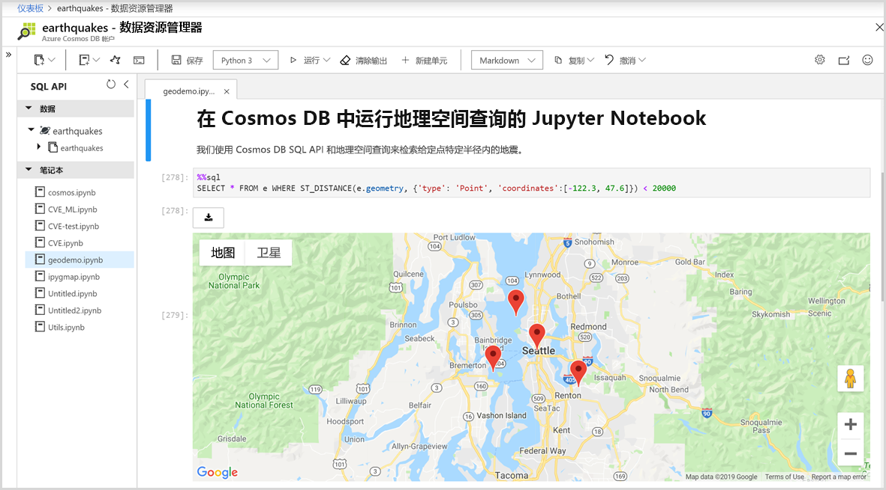

# Azure Cosmos DB 中的内置 Jupyter 笔记本支持

Jupyter 笔记本是一种开源 Web 应用程序，可用于创建和共享包含实时代码、公式、可视化效果和叙述性文本的文档。 Azure Cosmos DB 为所有 API（例如 Cassandra、MongoDB、SQL、Gremlin 和表）提供了内置 Jupyter Notebook 支持。 对所有 Azure Cosmos DB API 和数据模型的内置笔记本支持允许你以交互方式运行查询。 Jupyter 笔记本在 Azure Cosmos 帐户中运行，可供开发人员用来执行数据浏览、数据清理、数据转换、数值模拟、统计建模、数据可视化和机器学习操作。

Jupyter 笔记本支持 Magic 函数，这些函数可通过支持其他命令扩展内核的功能。 Cosmos magic 是一种命令，可在 Jupyter 笔记本中扩展 Python 内核的功能，使你除了 Apache Spark 以外，还能够运行 Azure Cosmos SQL API 查询。 可以轻松地组合使用 Python 和 SQL API 查询来查询和可视化数据，只需使用丰富的集成了呈现命令的可视化库即可。
Azure 门户以本机方式将 Jupyter 笔记本体验集成到 Azure Cosmos 帐户中，如下图所示：

## Jupyter 笔记本的优势

Jupyter 笔记本一开始是为以 Python、R 编写的数据科学应用程序开发的。但是，它们可以通过各种方式用于不同类型的项目，例如：

* ***数据可视化：** 可以通过 Jupyter 笔记本将数据以共享笔记本的形式可视化，该笔记本可以将某个数据集呈现为图形。 可以通过 Jupyter 笔记本创作可视化效果，将其共享，并允许对共享的代码和数据集进行交互式更改。

* **代码共享：** 可以通过 GitHub 之类的服务来共享代码，但这些服务大部分是非交互式的。 使用 Jupyter 笔记本时，可以在 Azure 门户中直接查看代码、执行代码并显示结果。

* **与代码实时交互：** Jupyter 笔记本代码是动态的；它可以通过实时方式进行编辑并立即重新运行。 笔记本还可以嵌入用户控件（例如，滑块或文本输入字段），这些控件可以用作代码的输入源、演示或概念证明 (POC)。

* **记录代码示例和数据浏览的结果：** 如果你有一个代码片段，需要逐行说明其在 Azure Cosmos DB 中的工作原理以及相应的实时输出，则可将其嵌入 Jupyter 笔记本中。 代码会一直完全正常地运行。 你可以同时添加交互性和文档内容。

* **Cosmos magic 命令：** 在 Jupyter 笔记本中，可以使用适合 Azure Cosmos DB 的自定义 magic 命令，使交互式计算更容易些。 例如 %%sql magic，它允许用户直接在笔记本中使用 SQL API 查询 Cosmos 容器。

* **集中处理环境：** Jupyter 笔记本将代码、富文本、图像、视频、动画、数学公式、绘图、地图、交互式图形、小组件和图形用户界面组合到单个文档中。

## Jupyter 笔记本的组件

Jupyter 笔记本可能包括多种类型的组件，每一种都组织成不同的块：

* **文本和 HTML：** 纯文本或者以 Markdown 语法标注的用于生成 HTML 的文本可以插入到文档中的任何位置。 也可以内联方式包括 CSS 样式，或者将其添加到用于生成笔记本的模板。

* **代码和输出：** Jupyter 笔记本支持 Python 代码。 已执行代码的结果立即显示在代码块后面，代码块可以按你喜欢的任意顺序执行多次。

* **可视化效果：** 可以使用 Matplotlib、Plotly 或 Bokeh 之类的模块通过代码生成图形和图表。 与输出类似，这些可视化效果以内联方式显示在生成它们的代码旁边。

* **多媒体：** Jupyter 笔记本基于 Web 技术，因此可以显示网页中支持的所有类型的多媒体。 可以将它们作为 HTML 元素包括在笔记本中，也可以使用 `IPython.display` 模块以编程方式生成它们。

* **数据：** 可以通过编程方式将 Azure Cosmos 容器中的数据和查询结果导入 Jupyter 笔记本中。 例如，可以通过任何 Cosmos DB API 或本机内置 Apache Spark 将用于查询数据的代码包括到笔记本中。

## 后续步骤

若要开始使用 Azure Cosmos DB 中的内置 Jupyter 笔记本，请参阅以下文章：

* [在 Azure Cosmos 帐户中启用笔记本](enable-notebooks.md)
* [使用笔记本功能和命令](use-notebook-features-and-commands.md)

