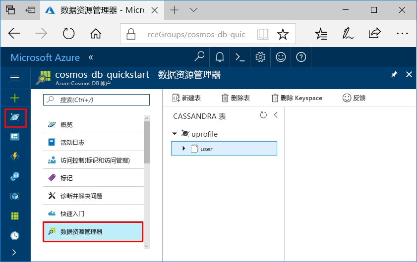

# <a name="quickstart-build-a-cassandra-app-with-net-and-azure-cosmos-db"></a>快速入门：使用 .NET 和 Azure Cosmos DB 生成 Cassandra 应用

本快速入门介绍如何使用 .NET 和 Azure Cosmos DB [Cassandra API](cassandra-introduction.md)，通过克隆 GitHub 中的示例来生成配置文件应用。 此外，本快速入门还逐步讲解了如何使用基于 Web 的 Azure 门户创建 Azure Cosmos DB 帐户。   

Azure Cosmos DB 由 Microsoft 提供，是全球分布的多模型数据库服务。 可快速创建和查询文档、表、键/值和图形数据库，它们都受益于 Azure Cosmos DB 核心的全球分布和横向缩放功能。 

## <a name="prerequisites"></a>先决条件

[!INCLUDE [quickstarts-free-trial-note](../../includes/quickstarts-free-trial-note.md)]或者，无需 Azure 订阅即可[免费试用 Azure Cosmos DB](https://azure.microsoft.com/try/cosmosdb/)，也无需缴纳费用或承诺金。

有权访问 Azure Cosmos DB Cassandra API 预览程序。 如果尚未申请访问权限，请[立即注册](cassandra-introduction.md#sign-up-now)。

此外： 
* 如果尚未安装 Visual Studio 2017，可以下载并使用免费的 [Visual Studio 2017 Community Edition](https://www.visualstudio.com/downloads/)。 在安装 Visual Studio 的过程中，请确保启用“Azure 开发”。
* 安装 [Git](https://www.git-scm.com/) 以克隆示例。

<a id="create-account"></a>
## <a name="create-a-database-account"></a>创建数据库帐户

[!INCLUDE [cosmos-db-create-dbaccount-cassandra](../../includes/cosmos-db-create-dbaccount-cassandra.md)]


## <a name="clone-the-sample-application"></a>克隆示例应用程序

现在，让我们转到如何使用代码上来。 从 GitHub 克隆 Cassandra API 应用，设置连接字符串，并运行应用。 会看到以编程方式处理数据是多么容易。 

1. 打开命令提示符，新建一个名为“git-samples”的文件夹，然后关闭命令提示符。

    ```bash
    md "C:\git-samples"
    ```

2. 打开诸如 git bash 之类的 git 终端窗口，并使用 `cd` 命令更改为要安装示例应用的新文件夹。

    ```bash
    cd "C:\git-samples"
    ```

3. 运行下列命令以克隆示例存储库。 此命令在计算机上创建示例应用程序的副本。

    ```bash
    git clone https://github.com/Azure-Samples/azure-cosmos-db-cassandra-dotnet-getting-started.git
    ```

3. 然后在 Visual Studio 中打开 CassandraQuickStartSample 解决方案文件。 

## <a name="review-the-code"></a>查看代码

此步骤是可选的。 如果有意了解如何使用代码创建数据库资源，可以查看以下代码片段。 这些代码片段全部摘自 C:\git-samples\azure-cosmos-db-cassandra-dotnet-getting-started\CassandraQuickStartSample 文件夹中安装的 Program.cs 文件。 否则，可以直接跳转到[更新连接字符串](#update-your-connection-string)。

* 通过连接到 Cassandra 群集终结点初始化会话。 Azure Cosmos DB 的 Cassandra API 仅支持 TLSv1.2。 

  ```csharp
   var options = new Cassandra.SSLOptions(SslProtocols.Tls12, true, ValidateServerCertificate);
   options.SetHostNameResolver((ipAddress) => CassandraContactPoint);
   Cluster cluster = Cluster.Builder().WithCredentials(UserName, Password).WithPort(CassandraPort).AddContactPoint(CassandraContactPoint).WithSSL(options).Build();
   ISession session = cluster.Connect();
   ```

* 创建新密钥空间。

    ```csharp
    session.Execute("CREATE KEYSPACE uprofile WITH REPLICATION = { 'class' : 'NetworkTopologyStrategy', 'datacenter1' : 1 };"); 
    ```

* 创建新表。

   ```csharp
  session.Execute("CREATE TABLE IF NOT EXISTS uprofile.user (user_id int PRIMARY KEY, user_name text, user_bcity text)");
   ```

* 使用有连接到配置文件密钥空间的新会话的 IMapper 对象插入用户实体。

    ```csharp
    mapper.Insert<User>(new User(1, "LyubovK", "Dubai"));
    ```
    
* 通过查询获取所有用户的信息。

    ```csharp
   foreach (User user in mapper.Fetch<User>("Select * from user"))
   {
      Console.WriteLine(user);
   }
    ```
    
* 通过查询获取单个用户的信息。

    ```csharp
    mapper.FirstOrDefault<User>("Select * from user where user_id = ?", 3);
    ```

## <a name="update-your-connection-string"></a>更新连接字符串

现在返回到 Azure 门户，获取连接字符串信息，并将其复制到应用。 连接字符串信息使应用能与托管数据库进行通信。

1. 在 [Azure 门户](http://portal.azure.com/)中，单击“连接字符串”。 

    使用  屏幕右侧的按钮以复制“用户名”值。

    

2. 在 Visual Studio 2017 中，打开 Program.cs 文件。 

3. 粘贴门户中的“用户名”值，并覆盖第 13 行中的 `<FILLME>`。

    Program.cs 的第 13 行现在应该类似 

    `private const string UserName = "cosmos-db-quickstart";`

3. 返回到门户，然后复制“密码”值。 粘贴门户中的“密码”值，并覆盖第 14 行中的 `<FILLME>`。

    Program.cs 的第 14 行现在应该类似 

    `private const string Password = "2Ggkr662ifxz2Mg...==";`

4. 返回到门户，然后复制“联系点”值。 粘贴门户中的“联系点”值，并覆盖第 15 行中的 `<FILLME>`。

    Program.cs 的第 15 行现在应该类似 

    `private const string CassandraContactPoint = "cosmos-db-quickstarts.cassandra.cosmosdb.azure.com"; //  DnsName`

5. 保存 Program.cs 文件。
    
## <a name="run-the-app"></a>运行应用

1. 在 Visual Studio 中，单击“工具” > “NuGet 包管理器” > “包管理器控制台”。

2. 在命令提示符处，使用以下命令安装 .NET 驱动程序的 NuGet 包。 

    ```cmd
    Install-Package CassandraCSharpDriver
    ```
3. 单击 Ctrl+F5 运行应用程序。 应用将显示在控制台窗口中。 

    

    按 CTRL + C 停止执行程序并关闭控制台窗口。 
    
    现在，可在 Azure 门户中打开数据资源管理器，查看查询、修改和处理这些新数据。 

    

## <a name="review-slas-in-the-azure-portal"></a>在 Azure 门户中查看 SLA

[!INCLUDE [cosmosdb-tutorial-review-slas](../../includes/cosmos-db-tutorial-review-slas.md)]

## <a name="clean-up-resources"></a>清理资源

[!INCLUDE [cosmosdb-delete-resource-group](../../includes/cosmos-db-delete-resource-group.md)]

## <a name="next-steps"></a>后续步骤

本快速入门介绍了如何创建 Azure Cosmos DB 帐户、如何使用数据资源管理器创建容器，以及如何运行 Web 应用。 现在可以将其他数据导入 Cosmos DB 帐户。 

> [!div class="nextstepaction"]
> [将 Cassandra 数据导入 Azure Cosmos DB](cassandra-import-data.md)
