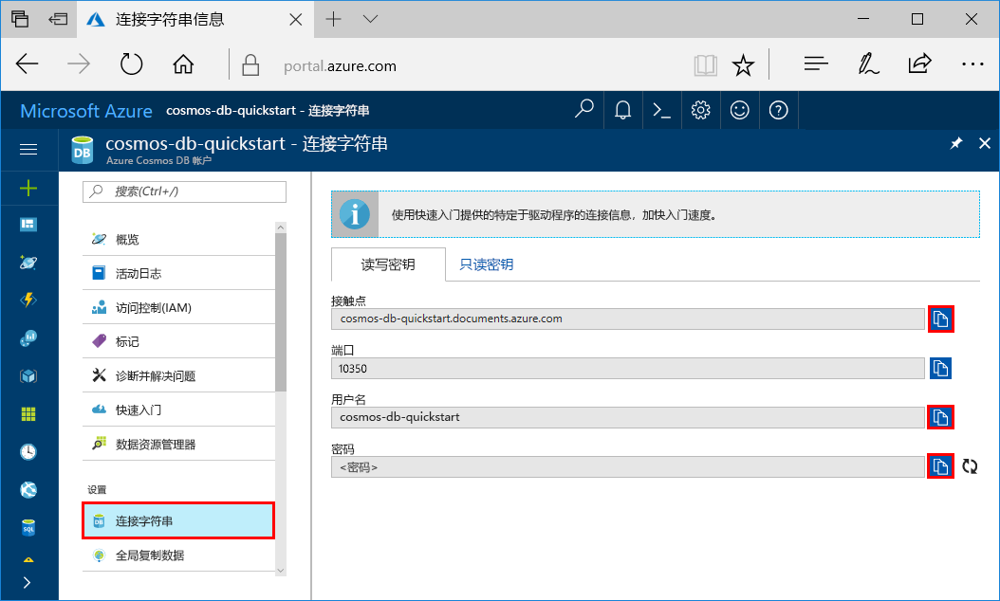

# <a name="quickstart-build-a-cassandra-app-with-java-and-azure-cosmos-db"></a>快速入门：使用 Java 和 Azure Cosmos DB 生成 Cassandra 应用

本快速入门介绍如何使用 Java 和 Azure Cosmos DB [Cassandra API](cassandra-introduction.md)，通过克隆 GitHub 中的示例来生成配置文件应用。 此外，本快速入门还逐步讲解了如何使用基于 Web 的 Azure 门户创建 Azure Cosmos DB 帐户。

Azure Cosmos DB 由 Microsoft 提供，是全球分布的多模型数据库服务。 可快速创建和查询文档、表、键/值和图形数据库，它们都受益于 Azure Cosmos DB 核心的全球分布和横向缩放功能。 

## <a name="prerequisites"></a>先决条件

[!INCLUDE [quickstarts-free-trial-note](../../includes/quickstarts-free-trial-note.md)]或者，无需 Azure 订阅即可[免费试用 Azure Cosmos DB](https://azure.microsoft.com/try/cosmosdb/)，也无需缴纳费用或承诺金。

有权访问 Azure Cosmos DB Cassandra API 预览程序。 如果尚未申请访问权限，请[立即注册](cassandra-introduction.md#sign-up-now)。

此外： 

* [Java 开发工具包 (JDK) 1.7+](http://www.oracle.com/technetwork/java/javase/downloads/jdk8-downloads-2133151.html)
    * 在 Ubuntu 上运行 `apt-get install default-jdk`，以便安装 JDK。
    * 请确保设置 JAVA_HOME 环境变量，使之指向在其中安装了 JDK 的文件夹。
* [下载](http://maven.apache.org/download.cgi)和[安装](http://maven.apache.org/install.html) [Maven](http://maven.apache.org/) 二进制存档
    * 在 Ubuntu 上，可以通过运行 `apt-get install maven` 来安装 Maven。
* [Git](https://www.git-scm.com/)
    * 在 Ubuntu 上，可以通过运行 `sudo apt-get install git` 来安装 Git。


## <a name="create-a-database-account"></a>创建数据库帐户

在创建文档数据库之前，需通过 Azure Cosmos DB 创建 Cassandra 帐户。

[!INCLUDE [cosmos-db-create-dbaccount-cassandra](../../includes/cosmos-db-create-dbaccount-cassandra.md)]

## <a name="clone-the-sample-application"></a>克隆示例应用程序

现在，让我们转到如何使用代码上来。 从 GitHub 克隆 Cassandra 应用，设置连接字符串，并运行应用。 会看到以编程方式处理数据是多么容易。 

1. 打开命令提示符，新建一个名为“git-samples”的文件夹，然后关闭命令提示符。

    ```bash
    md "C:\git-samples"
    ```

2. 打开诸如 git bash 之类的 git 终端窗口，并使用 `cd` 命令更改为要安装示例应用的新文件夹。

    ```bash
    cd "C:\git-samples"
    ```

3. 运行下列命令以克隆示例存储库。 此命令在计算机上创建示例应用程序的副本。

    ```bash
    git clone https://github.com/Azure-Samples/azure-cosmos-db-cassandra-java-getting-started.git
    ```

## <a name="review-the-code"></a>查看代码

此步骤是可选的。 如果有意了解如何使用代码创建数据库资源，可以查看下面的代码段。 否则，可以直接跳转到[更新连接字符串](#update-your-connection-string)。 这些代码片段全部摘自 src/main/java/com/azure/cosmosdb/cassandra/util/CassandraUtils.java 文件。  

* 已设置 Cassandra 主机、端口、用户名、密码和 SSL 选项。 连接字符串信息来自 Azure 门户中的连接字符串页。

   ```java
   cluster = Cluster.builder().addContactPoint(cassandraHost).withPort(cassandraPort).withCredentials(cassandraUsername, cassandraPassword).withSSL(sslOptions).build();
   ```

* `cluster` 连接到 Azure Cosmos DB Cassandra API 并返回可供访问的会话。

    ```java
    return cluster.connect();
    ```

以下代码片段来自 src/main/java/com/azure/cosmosdb/cassandra/repository/UserRepository.java 文件。

* 创建新密钥空间。

    ```java
    public void createKeyspace() {
        final String query = "CREATE KEYSPACE IF NOT EXISTS uprofile WITH replication = {'class': 'SimpleStrategy', 'replication_factor': '3' } ";
        session.execute(query);
        LOGGER.info("Created keyspace 'uprofile'");
    }
    ```

* 创建新表。

   ```java
   public void createTable() {
        final String query = "CREATE TABLE IF NOT EXISTS uprofile.user (user_id int PRIMARY KEY, user_name text, user_bcity text)";
        session.execute(query);
        LOGGER.info("Created table 'user'");
   }
   ```

* 使用准备的语句对象插入用户实体。

    ```java
    public PreparedStatement prepareInsertStatement() {
        final String insertStatement = "INSERT INTO  uprofile.user (user_id, user_name , user_bcity) VALUES (?,?,?)";
        return session.prepare(insertStatement);
    }

    public void insertUser(PreparedStatement statement, int id, String name, String city) {
        BoundStatement boundStatement = new BoundStatement(statement);
        session.execute(boundStatement.bind(id, name, city));
    }
    ```

* 通过查询获取所有用户信息。

    ```java
   public void selectAllUsers() {
        final String query = "SELECT * FROM uprofile.user";
        List<Row> rows = session.execute(query).all();

        for (Row row : rows) {
            LOGGER.info("Obtained row: {} | {} | {} ", row.getInt("user_id"), row.getString("user_name"), row.getString("user_bcity"));
        }
    }
    ```

* 通过查询获取单个用户的信息。

    ```java
    public void selectUser(int id) {
        final String query = "SELECT * FROM uprofile.user where user_id = 3";
        Row row = session.execute(query).one();

        LOGGER.info("Obtained row: {} | {} | {} ", row.getInt("user_id"), row.getString("user_name"), row.getString("user_bcity"));
    }
    ```

## <a name="update-your-connection-string"></a>更新连接字符串

现在返回到 Azure 门户，获取连接字符串信息，并将其复制到应用。 这样，应用程序就可以与托管的数据库进行通信。

1. 在 [Azure 门户](http://portal.azure.com/)中，单击“连接字符串”。 

    

2. 使用屏幕右侧的  复制“联系点”值。

3. 打开 C:\git-samples\azure-cosmosdb-cassandra-java-getting-started\java-examples\src\main\resources 文件夹中的 `config.properties` 文件。 

3. 粘贴门户中的“联系点”值，并覆盖第 2 行中的 `<Cassandra endpoint host>`。

    config.properties 的第 2 行现在应类似于 

    `cassandra_host=cosmos-db-quickstarts.cassandra.cosmosdb.azure.com`

3. 返回到门户，然后复制“用户名”值。 粘贴门户中的“用户名”值，并覆盖第 4 行中的 `<cassandra endpoint username>`。

    config.properties 的第 4 行现在应类似于 

    `cassandra_username=cosmos-db-quickstart`

4. 返回到门户，然后复制“密码”值。 粘贴门户中的“密码”值，并覆盖第 5 行中的 `<cassandra endpoint password>`。

    config.properties 的第 5 行现在应类似于 

    `cassandra_password=2Ggkr662ifxz2Mg...==`

5. 在第 6 行中，如果需要使用特定的 SSL 证书，则请使用该 SSL 证书的位置替换 `<SSL key store file location>`。 如果未提供值，则会使用安装在 <JAVA_HOME>/jre/lib/security/cacerts 中的 JDK 证书。 

6. 如果将第 6 行更改为使用特定的 SSL 证书，则请将第 7 行更新为使用该证书的密码。 

7. 保存 config.properties 文件。

## <a name="run-the-app"></a>运行应用程序

1. 在 git 终端窗口中，通过 `cd` 命令转到 azure-cosmosdb-cassandra-java-getting-started\java-examples 文件夹。

    ```git
    cd "C:\git-samples\azure-cosmosdb-cassandra-java-getting-started\java-examples"
    ```

2. 在 git 终端窗口中，使用以下命令生成 cosmosdb-cassandra-examples.jar 文件。

    ```git
    mvn clean install
    ```

3. 在 git 终端窗口中，运行以下命令以启动 Java 应用程序。

    ```git
    java -cp target/cosmosdb-cassandra-examples.jar com.azure.cosmosdb.cassandra.examples.UserProfile
    ```

    终端窗口会显示通知，指出密钥空间和表已创建。 然后，它会选择并返回表中的所有用户，然后显示输出，接着按 ID 选择行并显示值。  

    按 CTRL + C 停止执行程序并关闭控制台窗口。 
    
    现在，可在 Azure 门户中打开数据资源管理器，查看查询、修改和处理这些新数据。 

    

## <a name="review-slas-in-the-azure-portal"></a>在 Azure 门户中查看 SLA

[!INCLUDE [cosmosdb-tutorial-review-slas](../../includes/cosmos-db-tutorial-review-slas.md)]

## <a name="clean-up-resources"></a>清理资源

[!INCLUDE [cosmosdb-delete-resource-group](../../includes/cosmos-db-delete-resource-group.md)]

## <a name="next-steps"></a>后续步骤

本快速入门介绍了如何使用数据资源管理器创建 Azure Cosmos DB 帐户、Cassandra 数据库和集合，以及如何通过运行应用以编程方式执行同一操作。 现在可以将其他数据导入 Azure Cosmos DB 集合。 

> [!div class="nextstepaction"]
> [将 Cassandra 数据导入 Azure Cosmos DB](cassandra-import-data.md)
