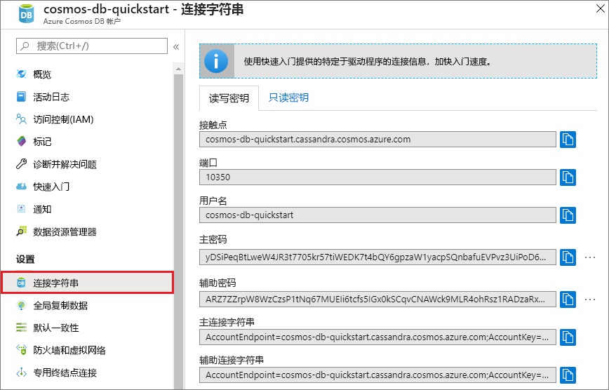
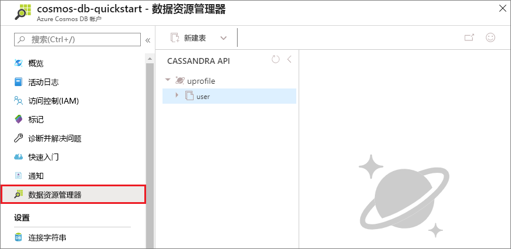

# <a name="quickstart-build-a-cassandra-app-with-nodejs-and-azure-cosmos-db"></a>快速入门：使用 Node.js 和 Azure Cosmos DB 生成 Cassandra 应用

本快速入门介绍如何使用 Node.js 和 Azure Cosmos DB [Cassandra API](cassandra-introduction.md)，通过克隆 GitHub 中的示例来生成配置文件应用。 此外，本快速入门还逐步讲解了如何使用基于 Web 的 Azure 门户创建 Azure Cosmos DB 帐户。

Azure Cosmos DB 由 Microsoft 提供，是全球分布的多模型数据库服务。 可快速创建和查询文档、表、键/值和图形数据库，它们都受益于 Azure Cosmos DB 核心的全球分布和横向缩放功能。 

## <a name="prerequisites"></a>先决条件

* 有权访问 Azure Cosmos DB Cassandra API 预览程序。 如果尚未申请访问权限，请[立即注册](https://aka.ms/cosmosdb-cassandra-signup)。
* [Node.js](https://nodejs.org/en/) 版本 v0.10.29 或更高版本
* [Git](http://git-scm.com/)

[!INCLUDE [quickstarts-free-trial-note](../../includes/quickstarts-free-trial-note.md)]或者，无需 Azure 订阅即可[免费试用 Azure Cosmos DB](https://azure.microsoft.com/try/cosmosdb/)，也无需缴纳费用或做出承诺。


## <a name="create-a-database-account"></a>创建数据库帐户

在创建文档数据库之前，需通过 Azure Cosmos DB 创建 Cassandra 帐户。

[!INCLUDE [cosmos-db-create-dbaccount-cassandra](../../includes/cosmos-db-create-dbaccount-cassandra.md)]

## <a name="clone-the-sample-application"></a>克隆示例应用程序

现在从 github 克隆 Cassandra API 应用，设置连接字符串，并运行应用。 会看到以编程方式处理数据是多么容易。 

1. 打开诸如 git bash 之类的 git 终端窗口，并使用 `cd` 命令更改为相应的示例应用程序安装文件夹。 

    ```bash
    cd "C:\git-samples"
    ```

2. 运行下列命令以克隆示例存储库。 此命令在计算机上创建示例应用程序的副本。

    ```bash
    git clone https://github.com/Azure-Samples/azure-cosmos-db-cassandra-nodejs-getting-started.git
    ```

## <a name="review-the-code"></a>查看代码

此步骤是可选的。 如果有意了解如何使用代码创建数据库资源，可以查看下面的代码段。 这些代码片段全部摘自 C:\git-samples\azure-cosmos-db-cassandra-nodejs-getting-started 文件夹中的 `uprofile.js` 文件。 否则，可以直接跳转到[更新连接字符串](#update-your-connection-string)。 

* 用户名和密码是使用 Azure 门户中的连接字符串页设置的。 “path\to\cert”提供 X509 证书的路径。 

   ```nodejs
   var ssl_option = {
        cert : fs.readFileSync("path\to\cert"),
        rejectUnauthorized : true,
        secureProtocol: 'TLSv1_2_method'
        };
   const authProviderLocalCassandra = new cassandra.auth.PlainTextAuthProvider(config.username, config.password);
   ```

* 使用 contactPoint 信息初始化 `client`。 从 Azure 门户中检索 contactPoint。

    ```nodejs
    const client = new cassandra.Client({contactPoints: [config.contactPoint], authProvider: authProviderLocalCassandra, sslOptions:ssl_option});
    ```

* `client` 连接到 Azure Cosmos DB Cassandra API。

    ```nodejs
    client.connect(next);
    ```

* 创建新的键空间。

    ```nodejs
    function createKeyspace(next) {
        var query = "CREATE KEYSPACE IF NOT EXISTS uprofile WITH replication = {\'class\': \'NetworkTopologyStrategy\', \'datacenter1\' : \'1\' }";
        client.execute(query, next);
        console.log("created keyspace");    
  }
    ```

* 创建新表。

   ```nodejs
   function createTable(next) {
    var query = "CREATE TABLE IF NOT EXISTS uprofile.user (user_id int PRIMARY KEY, user_name text, user_bcity text)";
        client.execute(query, next);
        console.log("created table");
   },
   ```

* 插入键/值实体。

    ```nodejs
    ...
       {
          query: 'INSERT INTO  uprofile.user  (user_id, user_name , user_bcity) VALUES (?,?,?)',
          params: [5, 'IvanaV', 'Belgaum', '2017-10-3136']
        }
    ];
    client.batch(queries, { prepare: true}, next);
    ```

* 用于获取所有键值的查询。

    ```nodejs
   var query = 'SELECT * FROM uprofile.user';
    client.execute(query, { prepare: true}, function (err, result) {
      if (err) return next(err);
      result.rows.forEach(function(row) {
        console.log('Obtained row: %d | %s | %s ',row.user_id, row.user_name, row.user_bcity);
      }, this);
      next();
    });
    ```  
    
* 用于获取键-值的查询。

    ```nodejs
    function selectById(next) {
        console.log("\Getting by id");
        var query = 'SELECT * FROM uprofile.user where user_id=1';
        client.execute(query, { prepare: true}, function (err, result) {
        if (err) return next(err);
            result.rows.forEach(function(row) {
            console.log('Obtained row: %d | %s | %s ',row.user_id, row.user_name, row.user_bcity);
        }, this);
        next();
        });
    }
    ```  

## <a name="update-your-connection-string"></a>更新连接字符串

现在返回到 Azure 门户，获取连接字符串信息，并将其复制到应用。 这样，应用程序就可以与托管的数据库进行通信。

1. 在 [Azure 门户](http://portal.azure.com/)中，单击“连接字符串”。 

    使用屏幕右侧的  复制最上面的值“联系点”。

    

2. 打开 `config.js` 文件。 

3. 粘贴门户中的“联系点”值，并覆盖第 4 行中的 `<FillMEIN>`。

    第 4 行现在应如下所示 

    `config.contactPoint = "cosmos-db-quickstarts.documents.azure.com:10350"`

4. 复制并粘贴门户中的“用户名”值，并覆盖第 2 行中的 `<FillMEIN>`。

    第 2 行现在应如下所示 

    `config.username = 'cosmos-db-quickstart';`
    
5. 复制并粘贴门户中的“密码”值，并覆盖第 3 行中的 `<FillMEIN>`。

    第 3 行现在应如下所示

    `config.password = '2Ggkr662ifxz2Mg==';`

6. 保存 config.js 文件。
    
## <a name="use-the-x509-certificate"></a>使用 X509 证书 

1. 如果需要添加 Baltimore CyberTrust 根，它具有序列号 02:00:00:b9 和 SHA1 指纹 d4🇩🇪20:d0:5e:66:fc:53:fe:1a:50:88:2c:78:db:28:52:ca:e4:74。 可以从 https://cacert.omniroot.com/bc2025.crt 下载、使用扩展名 .cer 保存到本地文件。 

2. 打开 uprofile.js，并将“path\to\cert”更改为指向新证书。 

3. 保存 uprofile.js。 

## <a name="run-the-app"></a>运行应用程序

1. 在 git 终端窗口中，运行 `npm install` 安装所需的 npm 模块。

2. 运行 `node uprofile.js` 启动 node 应用程序。

3. 通过命令行验证结果是否符合预期。

    

    按 CTRL + C 停止执行程序并关闭控制台窗口。 

    现在，可在 Azure 门户中打开数据资源管理器，查看查询、修改和处理这些新数据。 

     

## <a name="review-slas-in-the-azure-portal"></a>在 Azure 门户中查看 SLA

[!INCLUDE [cosmosdb-tutorial-review-slas](../../includes/cosmos-db-tutorial-review-slas.md)]

## <a name="clean-up-resources"></a>清理资源

[!INCLUDE [cosmosdb-delete-resource-group](../../includes/cosmos-db-delete-resource-group.md)]

## <a name="next-steps"></a>后续步骤

在本快速入门教程中，已了解如何创建 Azure Cosmos DB 帐户、使用数据资源管理器创建集合和运行应用。 现在可以将其他数据导入 Cosmos DB 帐户。 

> [!div class="nextstepaction"]
> [将 Cassandra 数据导入 Azure Cosmos DB](cassandra-import-data.md)


