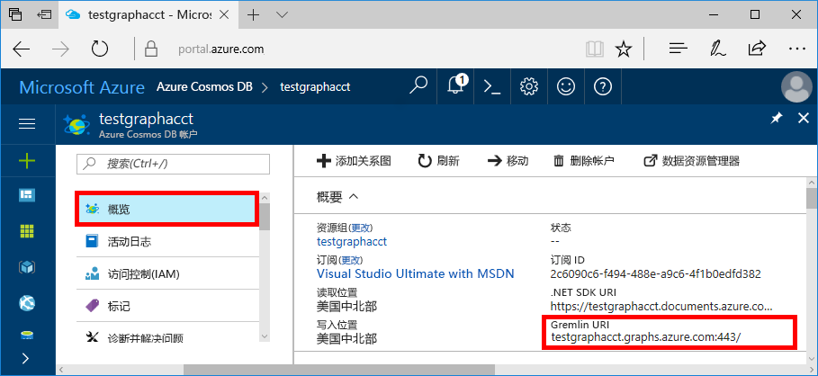
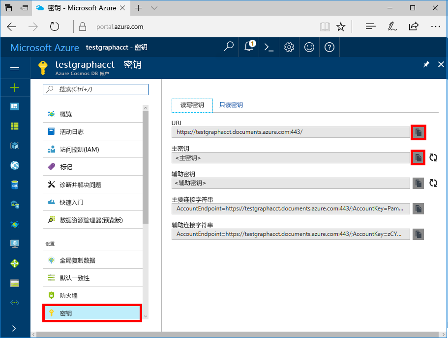

# <a name="azure-cosmos-db-create-query-and-traverse-a-graph-in-the-gremlin-console"></a>Azure Cosmos DB：在 Gremlin 控制台中创建、查询和遍历图形

Azure Cosmos DB 是 Microsoft 提供的全球分布式多模型数据库服务。 可快速创建和查询文档、键/值和图形数据库，它们都受益于 Azure Cosmos DB 核心的全球分布和水平缩放功能。 

本快速入门教程演示如何使用 Azure 门户创建 Azure Cosmos DB 帐户、数据库和图形（容器），并使用 [Apache TinkerPop](http://tinkerpop.apache.org) 的 [Gremlin 控制台](https://tinkerpop.apache.org/docs/current/reference/#gremlin-console)处理图形 API（预览版）数据。 本教程将创建并查询顶点和边缘，更新顶点属性，查询顶点，遍历图形，然后删除顶点。


Gremlin 控制台基于 Groovy/Java，在 Linux、Mac 和 Windows 上运行。 可以从 [Apache TinkerPop 站点](http://tinkerpop.apache.org/downloads.html)下载它。

## <a name="prerequisites"></a>先决条件

需要使用 Azure 订阅为本快速入门教程创建 Azure Cosmos DB 帐户。

[!INCLUDE [quickstarts-free-trial-note](../../includes/quickstarts-free-trial-note.md)]

还需要安装 [Gremlin 控制台](http://tinkerpop.apache.org/)。 使用 3.2.5 或更高版本。

## <a name="create-a-database-account"></a>创建数据库帐户

[!INCLUDE [cosmos-db-create-dbaccount-graph](../../includes/cosmos-db-create-dbaccount-graph.md)]

## <a name="add-a-graph"></a>添加图形

[!INCLUDE [cosmos-db-create-graph](../../includes/cosmos-db-create-graph.md)]

## <a id="ConnectAppService"></a>连接到应用服务
1. 在启动 Gremlin 控制台之前，请在 apache-tinkerpop-gremlin-console-3.2.5/conf 目录中创建或修改 remote-secure.yaml 配置文件。
2. 填写 *host*、*port*、*username*、*password*、*connectionPool* 和 *serializer* 配置：

    设置|建议的值|说明
    ---|---|---
    hosts|[***.graphs.azure.com]|参阅以下屏幕截图。 这是 Azure 门户的“概述”页上的“Gremlin URI”值，方括号中已删除尾部的 :443/。<br><br>也可以在“密钥”选项卡中使用“URI”值来检索此值：删除 https://，将 documents 更改为 graphs 并删除尾部的 :443/ 即可。
    端口|443|设置为 443。
    username|*用户名*|采用 `/dbs/<db>/colls/<coll>` 格式的资源，其中，`<db>` 是数据库名称，`<coll>` 是集合名称。
    password|*主密钥*| 请参阅下面的第二幅屏幕截图。 这是主密钥，可以从 Azure 门户的“密钥”页上的“主密钥”框中检索到。 使用该框左侧的复制按钮可复制该值。
    connectionPool|{enableSsl: true}|SSL 的连接池设置。
    serializer|{ className: org.apache.tinkerpop.gremlin.<br>driver.ser.GraphSONMessageSerializerV1d0,<br> config: { serializeResultToString: true }}|请设置为此值，并在粘贴此值时删除所有 `\n` 换行符。

    对于“主机”值，请复制“概述”页中的“Gremlin URI”值：

    对于“密码”值，请复制“密钥”页中的“主密钥”：


3. 在终端中运行 `bin/gremlin.bat` 或 `bin/gremlin.sh` 启动[Gremlin 控制台](http://tinkerpop.apache.org/docs/3.2.5/tutorials/getting-started/)。
4. 在终端中运行 `:remote connect tinkerpop.server conf/remote-secure.yaml` 连接到应用服务。

    > [!TIP]
    > 如果收到错误`No appenders could be found for logger`，请确保已更新 remote-secure.yaml 文件中的序列化程序值，如步骤 2 中所述。 

很好！ 完成设置后，我们开始运行一些控制台命令。

现在尝试一个简单的 count() 命令。 在控制台的提示符下键入以下命令：
```
:> g.V().count()
```

> [!TIP]
> 注意到文本 `g.V().count()` 前面的 `:>` 了吗？ 
>
> 这是命令的一部分，也需要键入。 通过 Azure Cosmos DB 使用 Gremlin 控制台时，这一部分非常重要。  
>
> 省略此 `:>` 前缀将指示控制台在本地执行命令，通常针对一个内存中图表执行。
> 使用此 `:>` 则指示控制台执行远程命令，此时针对 Cosmos DB（localhost 仿真器或一个 > Azure 实例）执行。


## <a name="create-vertices-and-edges"></a>创建顶点和边缘

首先为 Thomas、Mary Kay、Robin、Ben 和 Jack 添加五个人员顶点。

输入 (Thomas)：

```
:> g.addV('person').property('firstName', 'Thomas').property('lastName', 'Andersen').property('age', 44).property('userid', 1)
```

输出：

```
==>[id:796cdccc-2acd-4e58-a324-91d6f6f5ed6d,label:person,type:vertex,properties:[firstName:[[id:f02a749f-b67c-4016-850e-910242d68953,value:Thomas]],lastName:[[id:f5fa3126-8818-4fda-88b0-9bb55145ce5c,value:Andersen]],age:[[id:f6390f9c-e563-433e-acbf-25627628016e,value:44]],userid:[[id:796cdccc-2acd-4e58-a324-91d6f6f5ed6d|userid,value:1]]]]
```
输入 (Mary Kay)：

```
:> g.addV('person').property('firstName', 'Mary Kay').property('lastName', 'Andersen').property('age', 39).property('userid', 2)

```

输出：

```
==>[id:0ac9be25-a476-4a30-8da8-e79f0119ea5e,label:person,type:vertex,properties:[firstName:[[id:ea0604f8-14ee-4513-a48a-1734a1f28dc0,value:Mary Kay]],lastName:[[id:86d3bba5-fd60-4856-9396-c195ef7d7f4b,value:Andersen]],age:[[id:bc81b78d-30c4-4e03-8f40-50f72eb5f6da,value:39]],userid:[[id:0ac9be25-a476-4a30-8da8-e79f0119ea5e|userid,value:2]]]]

```

输入 (Robin)：

```
:> g.addV('person').property('firstName', 'Robin').property('lastName', 'Wakefield').property('userid', 3)
```

输出：

```
==>[id:8dc14d6a-8683-4a54-8d74-7eef1fb43a3e,label:person,type:vertex,properties:[firstName:[[id:ec65f078-7a43-4cbe-bc06-e50f2640dc4e,value:Robin]],lastName:[[id:a3937d07-0e88-45d3-a442-26fcdfb042ce,value:Wakefield]],userid:[[id:8dc14d6a-8683-4a54-8d74-7eef1fb43a3e|userid,value:3]]]]
```

输入 (Ben)：

```
:> g.addV('person').property('firstName', 'Ben').property('lastName', 'Miller').property('userid', 4)

```

输出：

```
==>[id:ee86b670-4d24-4966-9a39-30529284b66f,label:person,type:vertex,properties:[firstName:[[id:a632469b-30fc-4157-840c-b80260871e9a,value:Ben]],lastName:[[id:4a08d307-0719-47c6-84ae-1b0b06630928,value:Miller]],userid:[[id:ee86b670-4d24-4966-9a39-30529284b66f|userid,value:4]]]]
```

输入 (Jack)：

```
:> g.addV('person').property('firstName', 'Jack').property('lastName', 'Connor').property('userid', 5)
```

输出：

```
==>[id:4c835f2a-ea5b-43bb-9b6b-215488ad8469,label:person,type:vertex,properties:[firstName:[[id:4250824e-4b72-417f-af98-8034aa15559f,value:Jack]],lastName:[[id:44c1d5e1-a831-480a-bf94-5167d133549e,value:Connor]],userid:[[id:4c835f2a-ea5b-43bb-9b6b-215488ad8469|userid,value:5]]]]
```


接下来，为人员之间的关系添加边缘。

输入 (Thomas-> Mary Kay)：

```
:> g.V().hasLabel('person').has('firstName', 'Thomas').addE('knows').to(g.V().hasLabel('person').has('firstName', 'Mary Kay'))
```

输出：

```
==>[id:c12bf9fb-96a1-4cb7-a3f8-431e196e702f,label:knows,type:edge,inVLabel:person,outVLabel:person,inV:0d1fa428-780c-49a5-bd3a-a68d96391d5c,outV:1ce821c6-aa3d-4170-a0b7-d14d2a4d18c3]
```

输入 (Thomas-> Robin)：

```
:> g.V().hasLabel('person').has('firstName', 'Thomas').addE('knows').to(g.V().hasLabel('person').has('firstName', 'Robin'))
```

输出：

```
==>[id:58319bdd-1d3e-4f17-a106-0ddf18719d15,label:knows,type:edge,inVLabel:person,outVLabel:person,inV:3e324073-ccfc-4ae1-8675-d450858ca116,outV:1ce821c6-aa3d-4170-a0b7-d14d2a4d18c3]
```

输入 (Robin -> Ben)：

```
:> g.V().hasLabel('person').has('firstName', 'Robin').addE('knows').to(g.V().hasLabel('person').has('firstName', 'Ben'))
```

输出：

```
==>[id:889c4d3c-549e-4d35-bc21-a3d1bfa11e00,label:knows,type:edge,inVLabel:person,outVLabel:person,inV:40fd641d-546e-412a-abcc-58fe53891aab,outV:3e324073-ccfc-4ae1-8675-d450858ca116]
```

## <a name="update-a-vertex"></a>更新顶点

使用新年龄 *45* 更新 *Thomas* 顶点。

输入：
```
:> g.V().hasLabel('person').has('firstName', 'Thomas').property('age', 45)
```
输出：

```
==>[id:ae36f938-210e-445a-92df-519f2b64c8ec,label:person,type:vertex,properties:[firstName:[[id:872090b6-6a77-456a-9a55-a59141d4ebc2,value:Thomas]],lastName:[[id:7ee7a39a-a414-4127-89b4-870bc4ef99f3,value:Andersen]],age:[[id:a2a75d5a-ae70-4095-806d-a35abcbfe71d,value:45]]]]
```

## <a name="query-your-graph"></a>查询图形

现在，我们针对图形运行各种查询。

首先，我们尝试结合筛选器运行一个查询，以返回年龄超过 40 岁的人员。

输入（筛选器查询）：

```
:> g.V().hasLabel('person').has('age', gt(40))
```

输出：

```
==>[id:ae36f938-210e-445a-92df-519f2b64c8ec,label:person,type:vertex,properties:[firstName:[[id:872090b6-6a77-456a-9a55-a59141d4ebc2,value:Thomas]],lastName:[[id:7ee7a39a-a414-4127-89b4-870bc4ef99f3,value:Andersen]],age:[[id:a2a75d5a-ae70-4095-806d-a35abcbfe71d,value:45]]]]
```

接下来，投影年龄超过 40 岁的人员的名字。

输入（筛选器 + 投影查询）：

```
:> g.V().hasLabel('person').has('age', gt(40)).values('firstName')
```

输出：

```
==>Thomas
```

## <a name="traverse-your-graph"></a>遍历图形

我们遍历图形，返回 Thomas 的所有朋友。

输入（Thomas 的朋友）：

```
:> g.V().hasLabel('person').has('firstName', 'Thomas').outE('knows').inV().hasLabel('person')
```

输出： 

```
==>[id:f04bc00b-cb56-46c4-a3bb-a5870c42f7ff,label:person,type:vertex,properties:[firstName:[[id:14feedec-b070-444e-b544-62be15c7167c,value:Mary Kay]],lastName:[[id:107ab421-7208-45d4-b969-bbc54481992a,value:Andersen]],age:[[id:4b08d6e4-58f5-45df-8e69-6b790b692e0a,value:39]]]]
==>[id:91605c63-4988-4b60-9a30-5144719ae326,label:person,type:vertex,properties:[firstName:[[id:f760e0e6-652a-481a-92b0-1767d9bf372e,value:Robin]],lastName:[[id:352a4caa-bad6-47e3-a7dc-90ff342cf870,value:Wakefield]]]]
```

接下来，获取下一个顶点层。 遍历图形，返回 Thomas 的朋友的所有朋友。

输入（Thomas 的朋友的朋友）：

```
:> g.V().hasLabel('person').has('firstName', 'Thomas').outE('knows').inV().hasLabel('person').outE('knows').inV().hasLabel('person')
```
输出：

```
==>[id:a801a0cb-ee85-44ee-a502-271685ef212e,label:person,type:vertex,properties:[firstName:[[id:b9489902-d29a-4673-8c09-c2b3fe7f8b94,value:Ben]],lastName:[[id:e084f933-9a4b-4dbc-8273-f0171265cf1d,value:Miller]]]]
```

## <a name="drop-a-vertex"></a>删除顶点

现在，我们从图形数据库中删除某个顶点。

输入（删除 Jack 顶点）：

```
:> g.V().hasLabel('person').has('firstName', 'Jack').drop()
```

## <a name="clear-your-graph"></a>清除图形

最后，我们清除所有顶点和边缘的数据库。

输入：

```
:> g.E().drop()
:> g.V().drop()
```

祝贺你！ 现已完成这篇“Azure Cosmos DB：图形 API”教程！

## <a name="review-slas-in-the-azure-portal"></a>在 Azure 门户中查看 SLA

[!INCLUDE [cosmosdb-tutorial-review-slas](../../includes/cosmos-db-tutorial-review-slas.md)]

## <a name="clean-up-resources"></a>清理资源

如果不打算继续使用此应用，请删除本快速入门教程在 Azure 门户中创建的所有资源，步骤如下：  

1. 在 Azure 门户的左侧菜单中，单击“资源组”，并单击已创建资源的名称。 
2. 在资源组页上单击“删除”，在文本框中键入要删除的资源的名称，并单击“删除”。

## <a name="next-steps"></a>后续步骤

本快速入门教程已介绍如何创建 Azure Cosmos DB 帐户、使用数据资源管理器创建图形、创建顶点和边缘，以及使用 Gremlin 控制台遍历图形。 现在可以使用 Gremlin 构建更复杂的查询，实现功能强大的图形遍历逻辑。 

> [!div class="nextstepaction"]
> [使用 Gremlin 查询](tutorial-query-graph.md)
