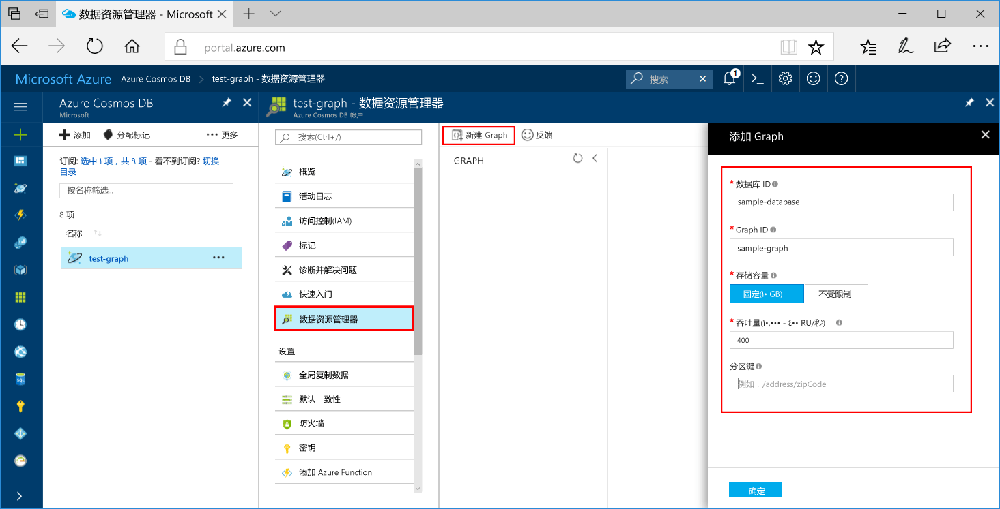
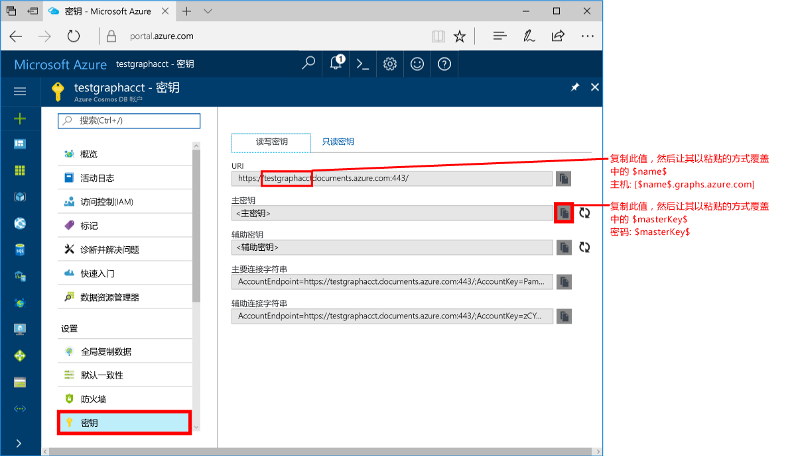
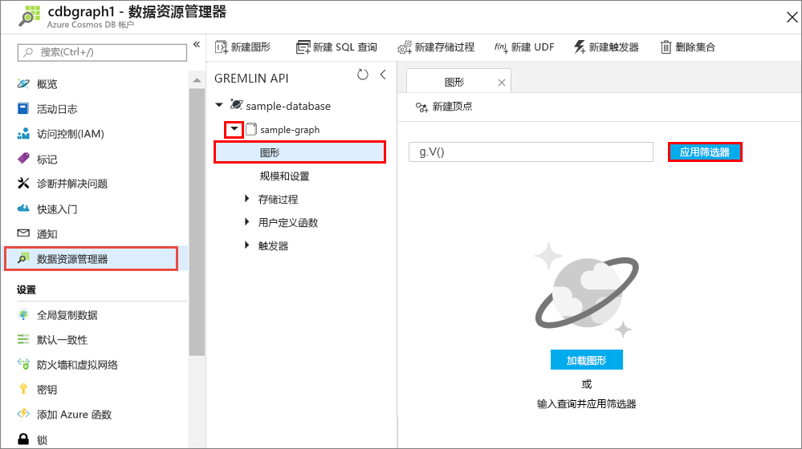
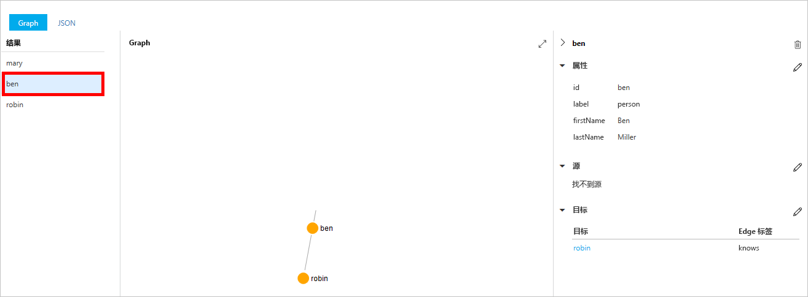
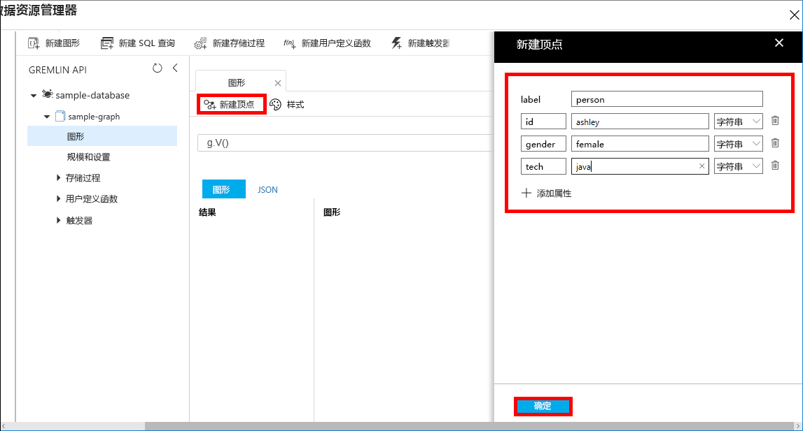
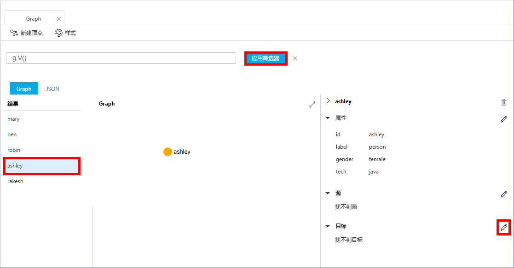
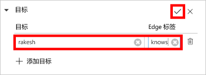
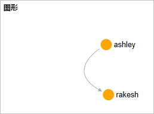

# <a name="azure-cosmos-db-create-a-graph-database-using-java-and-the-azure-portal"></a>Azure Cosmos DB：使用 Java 和 Azure 门户创建图形数据库

Azure Cosmos DB 是 Microsoft 提供的全球分布式多模型数据库服务。 使用 Azure Cosmos DB，可以快速创建和查询托管的文档、表和图形数据库。 

本快速入门使用适用于 Azure Cosmos DB 的 Azure 门户工具，创建简单的图形数据库。 本快速入门还介绍了如何使用图形数据库通过 OSS [Gremlin Java](https://mvnrepository.com/artifact/org.apache.tinkerpop/gremlin-driver) 驱动程序快速创建 Java 控制台应用。 本快速入门中的说明适用于任何能够运行 Java 的操作系统。 借助本快速入门，可以熟悉如何通过 UI 或编程方式（以首选方式为准）创建和修改图形。 

## <a name="prerequisites"></a>先决条件
[!INCLUDE [quickstarts-free-trial-note](../../includes/quickstarts-free-trial-note.md)]

此外：

* [Java 开发工具包 (JDK) 1.7+](http://www.oracle.com/technetwork/java/javase/downloads/jdk8-downloads-2133151.html)
    * 在 Ubuntu 上运行 `apt-get install default-jdk`，以便安装 JDK。
    * 请确保设置 JAVA_HOME 环境变量，使之指向在其中安装了 JDK 的文件夹。
* [下载](http://maven.apache.org/download.cgi)和[安装](http://maven.apache.org/install.html) [Maven](http://maven.apache.org/) 二进制存档
    * 在 Ubuntu 上，可以通过运行 `apt-get install maven` 来安装 Maven。
* [Git](https://www.git-scm.com/)
    * 在 Ubuntu 上，可以通过运行 `sudo apt-get install git` 来安装 Git。

## <a name="create-a-database-account"></a>创建数据库帐户

在创建图形数据库之前，需通过 Azure Cosmos DB 创建 Gremlin (Graph) 数据库帐户。

[!INCLUDE [cosmos-db-create-dbaccount-graph](../../includes/cosmos-db-create-dbaccount-graph.md)]

## <a name="add-a-graph"></a>添加图形

现在可以在 Azure 门户中使用数据资源管理器工具来创建图形数据库。 

1. 依次单击“数据资源管理器” > “新图形”。

    此时，最右侧显示“添加图形”区域，可能需要向右滚动才能看到。

    

2. 在“添加图形”页上，输入新图形的设置。

    设置|建议的值|说明
    ---|---|---
    数据库 ID|sample-database|输入“sample-database”作为新数据库的名称。 数据库名称的长度必须为 1 到 255 个字符，不能包含 `/ \ # ?` 或尾随空格。
    图形 ID|sample-graph|输入“sample-graph”作为新集合的名称。 图形名称与数据库 ID 的字符要求相同。
    存储容量|固定 (10 GB)|将值更改为“固定(10GB)”。 此值是数据库的存储容量。
    吞吐量|400 RU|将吞吐量更改为每秒 400 个请求单位 (RU/s)。 如果想要减少延迟，以后可以增加吞吐量。
    分区键|留空|本快速入门此分区键留空。

3. 填写表单后，请单击“确定”。

## <a name="clone-the-sample-application"></a>克隆示例应用程序

现在，让我们转到如何使用代码上来。 接下来，克隆 GitHub 中的图形 API 应用程序，设置连接字符串，并运行应用程序。 会看到以编程方式处理数据是多么容易。  

1. 打开命令提示符，新建一个名为“git-samples”的文件夹，然后关闭命令提示符。

    ```bash
    md "C:\git-samples"
    ```

2. 打开诸如 git bash 之类的 git 终端窗口，并使用 `cd` 命令更改为相应的示例应用程序安装文件夹。  

    ```bash
    cd "C:\git-samples"
    ```

3. 运行下列命令以克隆示例存储库。 此命令在计算机上创建示例应用程序的副本。 

    ```bash
    git clone https://github.com/Azure-Samples/azure-cosmos-db-graph-java-getting-started.git
    ```

## <a name="review-the-code"></a>查看代码

此步骤是可选的。 如果有意了解如何使用代码创建数据库资源，可以查看下面的代码段。 这些代码段全部取自 C:\git-samples\azure-cosmos-db-graph-java-getting-started\src\GetStarted 文件夹中的 `Program.java` 文件。 否则，可以直接跳转到[更新连接字符串](#update-your-connection-information)。 

* 将通过 `src/remote.yaml` 中的配置初始化 Gremlin `Client`。

    ```java
    cluster = Cluster.build(new File("src/remote.yaml")).create();
    ...
    client = cluster.connect();
    ```

* 将使用 `client.submit` 方法执行一系列 Gremlin 步骤。

    ```java
    ResultSet results = client.submit(gremlin);

    CompletableFuture<List<Result>> completableFutureResults = results.all();
    List<Result> resultList = completableFutureResults.get();

    for (Result result : resultList) {
        System.out.println(result.toString());
    }
    ```

## <a name="update-your-connection-information"></a>更新连接信息

现在，返回到 Azure 门户，获取连接信息，并将信息复制到应用程序中。 借助这些设置，应用程序可以与托管的数据库进行通信。

1. 在 [Azure 门户](http://portal.azure.com/)中，单击“密钥”。 

    复制 URI 值的第一部分。

    
2. 打开 src/remote.yaml 文件，并将值粘贴到 `hosts: [$name$.graphs.azure.com]` 中的 `$name$`。

    remote.yaml 的第 1 行现应如下所示 

    `hosts: [test-graph.graphs.azure.com]`

3. 在 Azure 门户中，使用“复制”按钮复制主密钥，并将它粘贴到 `password: $masterKey$` 中的 `$masterKey$`。

    remote.yaml 的第 4 行现应如下所示 

    `password: 2Ggkr662ifxz2Mg==`

4. 将 remote.yaml 的第 3 行从

    `username: /dbs/$database$/colls/$collection$`

    to 

    `username: /dbs/sample-database/colls/sample-graph`

5. 保存 remote.yaml 文件。

## <a name="run-the-console-app"></a>运行控制台应用

1. 在 git 终端窗口中，通过 `cd` 命令转到 azure-cosmos-db-graph-java-getting-started 文件夹。

    ```git
    cd "C:\git-samples\azure-cosmos-db-graph-java-getting-started"
    ```

2. 在 git 终端窗口中，使用以下命令安装所需的 Java 包。

   ```
   mvn package
   ```

3. 在 git 终端窗口中，使用以下命令启动 Java 应用程序。
    
    ```
    mvn exec:java -D exec.mainClass=GetStarted.Program
    ```

    终端窗口会显示添加到图形的顶点。 
    
    如果遇到超时错误，请在[更新你的连接信息](#update-your-connection-information)中检查是否正确更新了连接信息，并尝试再次运行上一个命令。 
    
    一旦程序停止运行，按 Enter，然后在 Internet 浏览器中立即切换回 Azure 门户。 

<a id="add-sample-data"></a>
## <a name="review-and-add-sample-data"></a>查看并添加示例数据

现在可以回到数据资源管理器，查看添加到图形的顶点，并添加其他数据点。

1. 单击“数据资源管理器”，展开“sample-graph”，再依次单击“图形”和“应用筛选器”。 

   

2. 在“结果”列表中，请注意添加到图形的新用户。 选择“ben”。请注意，他连接到 robin。 可以通过拖放操作来移动顶点，也可以通过滚动鼠标滚轮进行缩放，并能用双箭头放大图形。 

   

3. 接下来，添加几个新用户。 单击“新建顶点”按钮，向图形添加数据。

   

4. 输入标签“人员”。

5. 单击“添加属性”，添加下列所有属性。 注意，可以在图形中为每个人创建唯一属性。 仅 id 键是必需的。

    key|value|说明
    ----|----|----
    id|ashley|顶点的唯一标识符。 如果未指定 id，将为你生成一个。
    gender|女| 
    技术 | java | 

    > [!NOTE]
    > 在本快速入门中，我们创建未分区的集合。 但是，如果在创建集合过程中通过指定分区键创建了分区的集合，则需在每个新顶点中包括该分区键作为键。 

6. 单击 **“确定”**。 可能需要展开屏幕才能在屏幕底部看到“确定”。

7. 再次单击“新建顶点”，添加其他新用户。 

8. 输入标签“人员”。

9. 单击“添加属性”，添加下列所有属性：

    key|value|说明
    ----|----|----
    id|rakesh|顶点的唯一标识符。 如果未指定 id，将为你生成一个。
    gender|男| 
    学校|MIT| 

10. 单击 **“确定”**。 

11. 单击“应用筛选器”按钮（默认 `g.V()` 筛选器），显示图形中的所有值。 所有用户此时会显示在“结果”列表中。 

    添加更多数据时，可以使用筛选器来限制结果。 默认情况下，数据资源管理器使用 `g.V()` 检索图形中的所有顶点。 可以更改为其他[图形查询](tutorial-query-graph.md)（如 `g.V().count()`），以 JSON 格式返回图形中所有 顶点的计数。 如果更改了筛选器，请将筛选器更改回 `g.V()`，并单击“应用筛选器”，再次显示所有结果。

12. 现在可以连接 rakesh 与 ashley。 确保“ashley”在“结果”列表中为选中状态，然后单击右下侧“目标”旁边的编辑按钮。 可能需要扩大窗口才能看到“属性”区域。

   

13. 在“目标”框中键入“rakesh”，在“Edge 标签”框中键入“认识”，再选中复选框。

   

14. 现在，从结果列表中选择“rakesh”即可看到 ashley 和 rakesh 已连接。 

   

   这就完成了本教程的资源创建部分。可以继续向图形添加顶点、修改现有顶点，也可以更改查询。 现在，回顾一下 Azure Cosmos DB 提供的指标，然后清理资源。 

## <a name="review-slas-in-the-azure-portal"></a>在 Azure 门户中查看 SLA

[!INCLUDE [cosmosdb-tutorial-review-slas](../../includes/cosmos-db-tutorial-review-slas.md)]

## <a name="clean-up-resources"></a>清理资源

[!INCLUDE [cosmosdb-delete-resource-group](../../includes/cosmos-db-delete-resource-group.md)]

## <a name="next-steps"></a>后续步骤

在本快速入门教程中，已了解如何创建 Azure Cosmos DB 帐户、使用数据资源管理器创建图形和运行应用。 现可使用 Gremlin 构建更复杂的查询，实现功能强大的图形遍历逻辑。 

> [!div class="nextstepaction"]
> [使用 Gremlin 查询](tutorial-query-graph.md)

