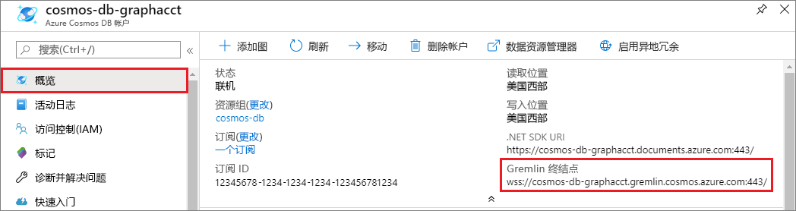
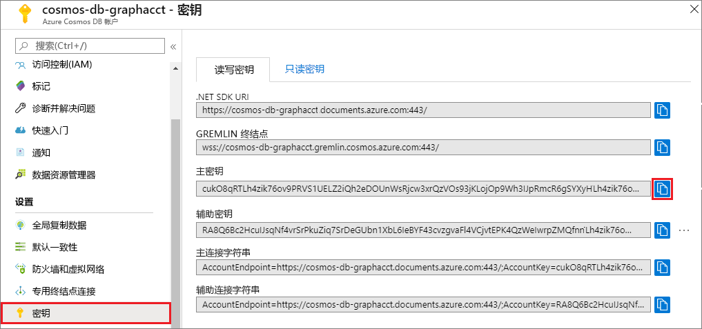

# <a name="quickstart-build-a-nodejs-application-by-using-azure-cosmos-db-gremlin-api-account"></a>快速入门：使用 Azure Cosmos DB Gremlin API 帐户生成 Node.js 应用程序

> [!div class="op_single_selector"]
> * [Gremlin 控制台](create-graph-gremlin-console.md)
> * [.NET](create-graph-dotnet.md)
> * [Java](create-graph-java.md)
> * [Node.js](create-graph-nodejs.md)
> * [Python](create-graph-python.md)
> * [PHP](create-graph-php.md)
>  

在本快速入门中，你将通过 Azure 门户创建和管理 Azure Cosmos DB Gremlin（图形）API 帐户，并使用从 GitHub 克隆的 Node.js 应用来添加数据。 Azure Cosmos DB 是一种多模型数据库服务，它通过全局分布和水平缩放功能让你快速创建和查询文档、表、键/值和图形数据库。

## <a name="prerequisites"></a>先决条件
- 具有活动订阅的 Azure 帐户。 [免费创建一个](https://azure.microsoft.com/free/?ref=microsoft.com&utm_source=microsoft.com&utm_medium=docs&utm_campaign=visualstudio)。 
- [Node.js 0.10.29+](https://nodejs.org/)。
- [Git](https://git-scm.com/downloads)。

## <a name="create-a-database-account"></a>创建数据库帐户

[!INCLUDE [cosmos-db-create-dbaccount-graph](../../includes/cosmos-db-create-dbaccount-graph.md)]

## <a name="add-a-graph"></a>添加图形

[!INCLUDE [cosmos-db-create-graph](../../includes/cosmos-db-create-graph.md)]

## <a name="clone-the-sample-application"></a>克隆示例应用程序

现在从 GitHub 克隆 Gremlin API 应用，设置连接字符串，并运行应用。 会看到以编程方式处理数据是多么容易。 

1. 打开命令提示符，新建一个名为“git-samples”的文件夹，然后关闭命令提示符。

    ```bash
    md "C:\git-samples"
    ```

2. 打开诸如 git bash 之类的 git 终端窗口，并使用 `cd` 命令更改为要安装示例应用的新文件夹。

    ```bash
    cd "C:\git-samples"
    ```

3. 运行下列命令以克隆示例存储库。 此命令在计算机上创建示例应用程序的副本。

    ```bash
    git clone https://github.com/Azure-Samples/azure-cosmos-db-graph-nodejs-getting-started.git
    ```

3. 在 Visual Studio 中打开解决方案文件。 

## <a name="review-the-code"></a>查看代码

此步骤是可选的。 如果有意了解如何使用代码创建数据库资源，可以查看以下代码片段。 否则，可以直接跳转到[更新连接字符串](#update-your-connection-string)。 

以下代码片段全部摘自 *app.js* 文件。

此控制台应用使用开源 [Gremlin Node.js](https://www.npmjs.com/package/gremlin) 驱动程序。

* 将创建 Gremlin 客户端。

    ```javascript
    const authenticator = new Gremlin.driver.auth.PlainTextSaslAuthenticator(
        `/dbs/${config.database}/colls/${config.collection}`, 
        config.primaryKey
    )


    const client = new Gremlin.driver.Client(
        config.endpoint, 
        { 
            authenticator,
            traversalsource : "g",
            rejectUnauthorized : true,
            mimeType : "application/vnd.gremlin-v2.0+json"
        }
    );

    ```

  配置均位于 *config.js* 中，可以在[以下部分](#update-your-connection-string)中编辑该文件。

* 将定义一系列函数以执行不同 Gremlin 操作。 以下是其中一个函数：

    ```javascript
    function addVertex1()
    {
        console.log('Running Add Vertex1'); 
        return client.submit("g.addV(label).property('id', id).property('firstName', firstName).property('age', age).property('userid', userid).property('pk', 'pk')", {
                label:"person",
                id:"thomas",
                firstName:"Thomas",
                age:44, userid: 1
            }).then(function (result) {
                    console.log("Result: %s\n", JSON.stringify(result));
            });
    }
    ```

* 每个函数均通过 Gremlin 查询字符串参数执行 `client.execute` 方法。 下面是演示如何执行 `g.V().count()` 的示例：

    ```javascript
    function countVertices()
    {
        console.log('Running Count');
        return client.submit("g.V().count()", { }).then(function (result) {
            console.log("Result: %s\n", JSON.stringify(result));
        });
    }
    ```

* 然后在文件末尾，调用所有方法。 这将依次执行它们：

    ```javascript
    client.open()
    .then(dropGraph)
    .then(addVertex1)
    .then(addVertex2)
    .then(addEdge)
    .then(countVertices)
    .catch((err) => {
        console.error("Error running query...");
        console.error(err)
    }).then((res) => {
        client.close();
        finish();
    }).catch((err) => 
        console.error("Fatal error:", err)
    );
    ```


## <a name="update-your-connection-string"></a>更新连接字符串

1. 打开 *config.js* 文件。 

2. 在 *config.js* 中，使用 Azure 门户中你的 Cosmos DB 帐户的“概述”页面中的“Gremlin 终结点”值填写 `config.endpoint` 密钥。   

    `config.endpoint = "https://<your_Gremlin_account_name>.gremlin.cosmosdb.azure.com:443/";`

    

3. 在 *config.js* 中，使用 Azure 门户中你的 Cosmos DB 帐户的“密钥”页面中的“主密钥”值填写 config.primaryKey 值。   

    `config.primaryKey = "PRIMARYKEY";`

   

4. 输入数据库名称和图形（容器）名称作为 config.database 和 config.collection 的值。 

下面的示例展示了完成的 *config.js* 文件应该是什么样子的：

```javascript
var config = {}

// Note that this must include the protocol (HTTPS:// for .NET SDK URI or wss:// for Gremlin Endpoint) and the port number
config.endpoint = "https://testgraphacct.gremlin.cosmosdb.azure.com:443/"; 
config.primaryKey = "Pams6e7LEUS7LJ2Qk0fjZf3eGo65JdMWHmyn65i52w8ozPX2oxY3iP0yu05t9v1WymAHNcMwPIqNAEv3XDFsEg==";
config.database = "graphdb"
config.collection = "Persons"

module.exports = config;
```

## <a name="run-the-console-app"></a>运行控制台应用

1. 打开一个终端窗口，切换到（通过 `cd` 命令）项目中包括的 *package.json* 文件的安装目录。

2. 运行 `npm install`，安装所需的 npm 模块，包括 `gremlin`。

3. 在终端中运行 `node app.js`，启动 node 应用程序。

## <a name="browse-with-data-explorer"></a>使用数据资源管理器浏览

现在可以返回到 Azure 门户中的数据资源管理器，查看、查询、修改以及使用新的图形数据。

在数据资源管理器中，新数据库会显示在“图形”窗格中。  展开数据库（后跟容器），然后选择“图形”。 

选择“应用筛选器”时，由示例应用生成的数据会显示在“图形”选项卡的下一窗格中。  

尝试使用 `.has('firstName', 'Thomas')` 来完成 `g.V()`，对筛选器进行测试。 请注意，值区分大小写。

## <a name="review-slas-in-the-azure-portal"></a>在 Azure 门户中查看 SLA

[!INCLUDE [cosmosdb-tutorial-review-slas](../../includes/cosmos-db-tutorial-review-slas.md)]

## <a name="clean-up-your-resources"></a>清理资源

[!INCLUDE [cosmosdb-delete-resource-group](../../includes/cosmos-db-delete-resource-group.md)]

## <a name="next-steps"></a>后续步骤

在本文中，你已了解了如何创建 Azure Cosmos DB 帐户，使用数据资源管理器创建图形，以及运行 Node.js 应用来向图形中添加数据。 现可使用 Gremlin 生成更复杂的查询，实现功能强大的图形遍历逻辑。 

> [!div class="nextstepaction"]
> [使用 Gremlin 查询](tutorial-query-graph.md)
