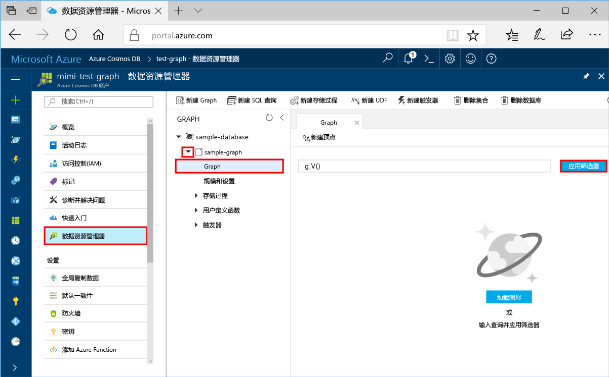
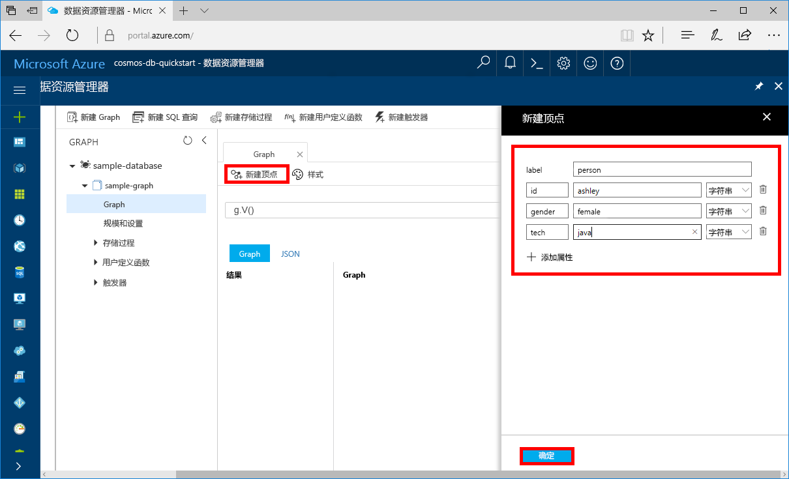
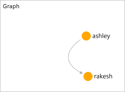

# <a name="azure-cosmos-db-create-a-graph-database-using-php-and-the-azure-portal"></a>Azure Cosmos DB：使用 PHP 和 Azure 门户创建图形数据库

本快速入门介绍如何使用 PHP 和 Azure Cosmos DB [图形 API](graph-introduction.md)，通过克隆 GitHub 中的示例来生成控制台应用。 此外，本快速入门还逐步讲解了如何使用基于 Web 的 Azure 门户创建 Azure Cosmos DB 帐户。   

Azure Cosmos DB 由 Microsoft 提供，是全球分布的多模型数据库服务。 可快速创建和查询文档、表、键/值和图形数据库，它们都受益于 Azure Cosmos DB 核心的全球分布和横向缩放功能。  

## <a name="prerequisites"></a>先决条件

[!INCLUDE [quickstarts-free-trial-note](../../includes/quickstarts-free-trial-note.md)]或者，无需 Azure 订阅即可[免费试用 Azure Cosmos DB](https://azure.microsoft.com/try/cosmosdb/)，也无需缴纳费用或承诺金。

此外：
* [PHP](http://php.net/) 5.6 或更高版本
* [编辑器](https://getcomposer.org/download/)

## <a name="create-a-database-account"></a>创建数据库帐户

在创建图形数据库之前，需通过 Azure Cosmos DB 创建 Gremlin (Graph) 数据库帐户。

[!INCLUDE [cosmos-db-create-dbaccount-graph](../../includes/cosmos-db-create-dbaccount-graph.md)]

## <a name="add-a-graph"></a>添加图形

[!INCLUDE [cosmos-db-create-graph](../../includes/cosmos-db-create-graph.md)]

## <a name="clone-the-sample-application"></a>克隆示例应用程序

现在，让我们转到如何使用代码上来。 接下来，克隆 GitHub 中的图形 API 应用程序，设置连接字符串，并运行应用程序。 会看到以编程方式处理数据是多么容易。  

1. 打开命令提示符，新建一个名为“git-samples”的文件夹，然后关闭命令提示符。

    ```bash
    md "C:\git-samples"
    ```

2. 打开诸如 git bash 之类的 git 终端窗口，并使用 `cd` 命令更改为相应的示例应用程序安装文件夹。  

    ```bash
    cd "C:\git-samples"
    ```

3. 运行下列命令以克隆示例存储库。 此命令在计算机上创建示例应用程序的副本。 

    ```bash
    git clone https://github.com/Azure-Samples/azure-cosmos-db-graph-php-getting-started.git
    ```

## <a name="review-the-code"></a>查看代码

此步骤是可选的。 如果有意了解如何使用代码创建数据库资源，可以查看下面的代码段。 这些代码片段全部摘自 C:\git-samples\azure-cosmos-db-graph-php-getting-started\ 文件夹中的 connect.php 文件。 否则，可以直接跳转到[更新连接字符串](#update-your-connection-information)。 

* 在使用 `$db` 对象的 `connect.php` 文件开头将 Gremlin `connection` 进行初始化。

    ```php
    $db = new Connection([
        'host' => '<your_server_address>.graphs.azure.com',
        'username' => '/dbs/<db>/colls/<coll>',
        'password' => 'your_primary_key'
        ,'port' => '443'

        // Required parameter
        ,'ssl' => TRUE
    ]);
    ```

* 将使用 `$db->send($query);` 方法执行一系列 Gremlin 步骤。

    ```php
    $query = "g.V().drop()";
    ...
    $result = $db->send($query);
    $errors = array_filter($result);
    }
    ```

## <a name="update-your-connection-information"></a>更新连接信息

现在，返回到 Azure 门户，获取连接信息，并将信息复制到应用程序中。 借助这些设置，应用程序可以与托管的数据库进行通信。

1. 在 [Azure 门户](http://portal.azure.com/)中，单击“密钥”。 

    复制 URI 值的第一部分。

    
2. 打开 `connect.php` 文件，并将 URI 值粘贴至第 8 行的 `your_server_address` 位置。

    现在，连接对象初始化应该类似于下面的代码：

    ```php
    $db = new Connection([
        'host' => 'testgraphacct.graphs.azure.com',
        'username' => '/dbs/<db>/colls/<coll>',
        'password' => 'your_primary_key'
        ,'port' => '443'

        // Required parameter
        ,'ssl' => TRUE
    ]);
    ```

3. 如果图形数据库帐户是在 2017 年 12 月 20 日或之后创建的，请将主机名中的 `graphs.azure.com` 更改为 `gremlin.cosmosdb.azure.com`。

4. 将连接对象中的 `username` 参数更改为你的数据库和图形名称。 如果使用了建议值 `sample-database` 和 `sample-graph`，则它应如以下代码所示：

    `'username' => '/dbs/sample-database/colls/sample-graph'`

    此时，整个连接对象应类似于下面的代码片段：

    ```php
    $db = new Connection([
        'host' => 'testgraphacct.graphs.azure.com',
        'username' => '/dbs/sample-database/colls/sample-graph',
        'password' => 'your_primary_key',
        'port' => '443'

        // Required parameter
        ,'ssl' => TRUE
    ]);
    ```

5. 在 Azure 门户中，使用“复制”按钮复制主密钥，并将它粘贴到密码参数中的 `your_primary_key` 位置。

    现在，连接对象初始化应该类似于下面的代码：

    ```php
    $db = new Connection([
        'host' => 'testgraphacct.graphs.azure.com',
        'username' => '/dbs/sample-database/colls/sample-graph',
        'password' => '2Ggkr662ifxz2Mg==',
        'port' => '443'

        // Required parameter
        ,'ssl' => TRUE
    ]);
    ```

6. 保存 `connect.php` 文件。

## <a name="run-the-console-app"></a>运行控制台应用

1. 在 git 终端窗口中，运行 `cd` 命令以转到 azure-cosmos-db-graph-php-getting-started 文件夹。

    ```git
    cd "C:\git-samples\azure-cosmos-db-graph-php-getting-started"
    ```

2. 在 git 终端窗口中，使用以下命令安装所需的 PHP 依赖项。

   ```
   composer install
   ```

3. 在 git 终端窗口中，使用以下命令启动 PHP 应用程序。
    
    ```
    php connect.php
    ```

    终端窗口会显示添加到图形的顶点。 
    
    如果遇到超时错误，请在[更新你的连接信息](#update-your-connection-information)中检查是否正确更新了连接信息，并尝试再次运行上一个命令。 
    
    一旦程序停止运行，按 Enter，然后在 Internet 浏览器中立即切换回 Azure 门户。 

<a id="add-sample-data"></a>
## <a name="review-and-add-sample-data"></a>查看并添加示例数据

现在可以回到数据资源管理器，查看添加到图形的顶点，并添加其他数据点。

1. 单击“数据资源管理器”，展开“sample-graph”，再依次单击“图形”和“应用筛选器”。 

   

2. 在“结果”列表中，请注意添加到图形的新用户。 选择“ben”。请注意，他连接到 robin。 可以通过拖放操作来移动顶点，也可以通过滚动鼠标滚轮进行缩放，并能用双箭头放大图形。 

   

3. 接下来，添加几个新用户。 单击“新建顶点”按钮，向图形添加数据。

   

4. 输入标签“人员”。

5. 单击“添加属性”，添加下列所有属性。 注意，可以在图形中为每个人创建唯一属性。 仅 id 键是必需的。

    key|值|说明
    ----|----|----
    id|ashley|顶点的唯一标识符。 如果未指定 id，将为你生成一个。
    gender|女| 
    技术 | java | 

    > [!NOTE]
    > 在本快速入门中，将创建未分区的集合。 但是，如果在创建集合过程中通过指定分区键创建了分区的集合，则需在每个新顶点中包括该分区键作为键。 

6. 单击“确定”。 可能需要展开屏幕才能在屏幕底部看到“确定”。

7. 再次单击“新建顶点”，添加其他新用户。 

8. 输入标签“人员”。

9. 单击“添加属性”，添加下列所有属性：

    key|值|说明
    ----|----|----
    id|rakesh|顶点的唯一标识符。 如果未指定 id，将为你生成一个。
    gender|男| 
    学校|MIT| 

10. 单击“确定”。 

11. 单击“应用筛选器”按钮（默认 `g.V()` 筛选器），显示图形中的所有值。 所有用户此时会显示在“结果”列表中。 

    添加更多数据时，可以使用筛选器来限制结果。 默认情况下，数据资源管理器使用 `g.V()` 检索图形中的所有顶点。 可以更改为其他[图形查询](tutorial-query-graph.md)（如 `g.V().count()`），以 JSON 格式返回图形中所有 顶点的计数。 如果更改了筛选器，请将筛选器更改回 `g.V()`，并单击“应用筛选器”，再次显示所有结果。

12. 现在可以连接 rakesh 与 ashley。 确保“ashley”在“结果”列表中为选中状态，然后单击右下侧“目标”旁边的编辑按钮。 可能需要扩大窗口才能看到“属性”区域。

   

13. 在“目标”框中键入“rakesh”，在“Edge 标签”框中键入“认识”，再选中复选框。

   

14. 现在，从结果列表中选择“rakesh”即可看到 ashley 和 rakesh 已连接。 

   

   这就完成了本快速入门的资源创建部分。 可以继续向图形添加顶点、修改现有顶点，也可以更改查询。 现在，回顾一下 Azure Cosmos DB 提供的指标，然后清理资源。 

## <a name="review-slas-in-the-azure-portal"></a>在 Azure 门户中查看 SLA

[!INCLUDE [cosmosdb-tutorial-review-slas](../../includes/cosmos-db-tutorial-review-slas.md)]

## <a name="clean-up-resources"></a>清理资源

[!INCLUDE [cosmosdb-delete-resource-group](../../includes/cosmos-db-delete-resource-group.md)]

## <a name="next-steps"></a>后续步骤

在本快速入门教程中，已了解如何创建 Azure Cosmos DB 帐户、使用数据资源管理器创建图形和运行应用。 现在可以使用 Gremlin 构建更复杂的查询，实现功能强大的图形遍历逻辑。 

> [!div class="nextstepaction"]
> [使用 Gremlin 查询](tutorial-query-graph.md)

