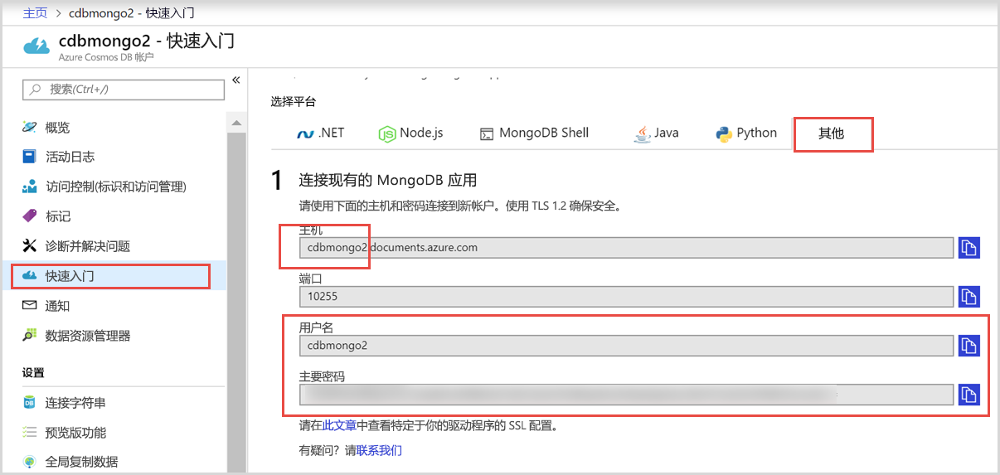
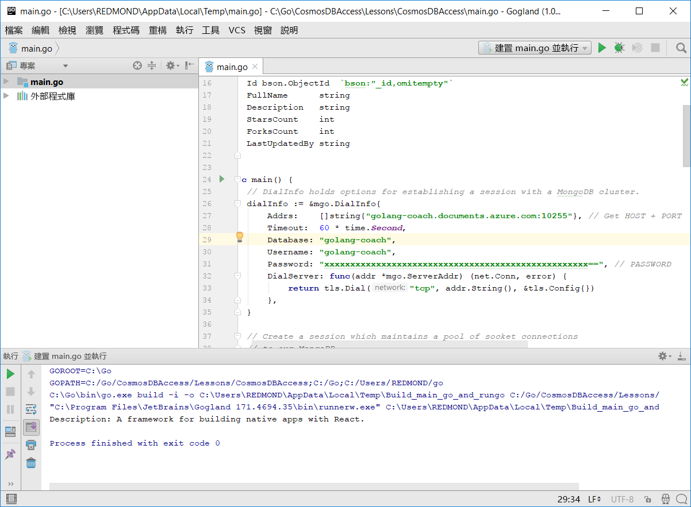
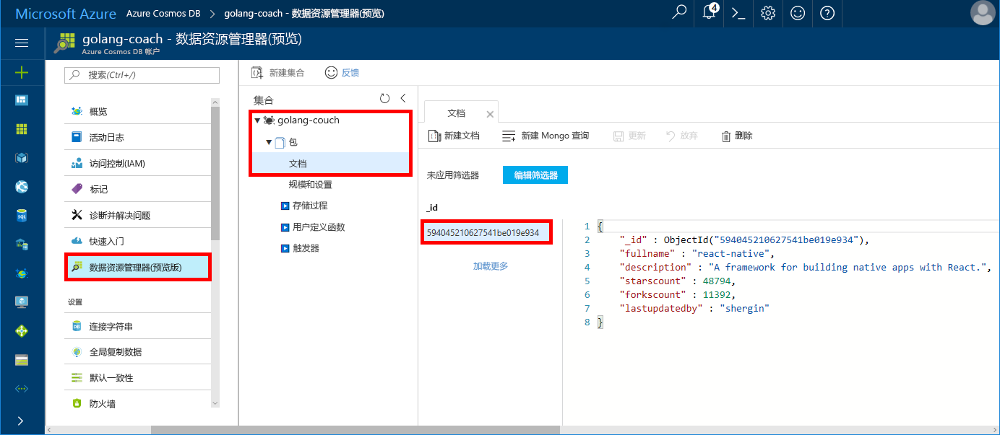

# Azure Cosmos DB：使用 Golang 和 Azure 门户生成 MongoDB API 控制台应用
<a id="azure-cosmos-db-build-a-mongodb-api-console-app-with-golang-and-the-azure-portal" class="xliff"></a>

Azure Cosmos DB 是 Microsoft 提供的全球分布式多模型数据库服务。 可快速创建和查询文档、键/值和图形数据库，它们都受益于 Azure Cosmos DB 核心的全球分布和水平缩放功能。

本快速入门演示如何使用以 [Golang](https://golang.org/) 编写的现有 [MongoDB](https://docs.microsoft.com/en-us/azure/cosmos-db/mongodb-introduction) 应用，并将其连接到支持 MongoDB 客户端连接的 Azure Cosmos DB 数据库。

换而言之，Golang 应用程序仅知道它要使用 MongoDB API 连接到某个数据库。 应用程序完全知道数据存储在 Azure Cosmos DB 中。

## 先决条件
<a id="prerequisites" class="xliff"></a>

- Azure 订阅。 如果还没有 Azure 订阅，可以在开始前创建一个[免费帐户](https://azure.microsoft.com/free)。
- [Go](https://golang.org/dl/) 以及 [Go](https://golang.org/) 语言的基础知识。
- IDE — [Gogland](https://www.jetbrains.com/go/)（由 Jetbrains 推出）、[Visual Studio Code](https://code.visualstudio.com/)（由 Microsoft 推出）或 [Atom](https://atom.io/)。 在本教程中，我将使用 Goglang。

<a id="create-account"></a>
## 创建数据库帐户
<a id="create-a-database-account" class="xliff"></a>

[!INCLUDE [cosmos-db-create-dbaccount](../../includes/cosmos-db-create-dbaccount-mongodb.md)]

## 克隆示例应用程序
<a id="clone-the-sample-application" class="xliff"></a>

克隆示例应用程序，并安装所需包。

1. 在 GOROOT\src 文件夹（默认位于 C:\Go\ 中）中创建名为 CosmosDBSample 的文件夹。
2. 使用 git 终端窗口（例如 git bash）运行以下命令，将示例存储库克隆到 CosmosDBSample 文件夹中。 

    ```bash
    git clone https://github.com/Azure-Samples/azure-cosmos-db-mongodb-golang-getting-started.git
    ```
3.  运行以下命令以获取 mgo 包。 

    ```
    go get gopkg.in/mgo.v2
    ```

[mgo](http://labix.org/mgo)（发音同 mango）驱动程序是适用于 [Go 语言](http://golang.org/)的 [MongoDB](http://www.mongodb.org/) 驱动程序，该语言采用很简单的 API 和标准的 GO 惯用语，实现了多种经过严格测试的精选功能。

<a id="connection-string"></a>

## 更新连接字符串
<a id="update-your-connection-string" class="xliff"></a>

现在返回到 Azure 门户，获取连接字符串信息，并将其复制到应用。

1. 单击左侧导航菜单中的“快速启动”，然后单击“其他”，查看 Go 应用程序所需的连接字符串信息。

2. 在 Goglang 的 GOROOT\CosmosDBSample 目录中打开 main.go 文件，然后使用 Azure 门户中的连接字符串信息更新以下代码行，如以下屏幕截图所示。 

    数据库名称是 Azure 门户连接字符串窗格中“Host”值的前缀。 就下图所示帐户来说，数据库名称为 golang-coach。

    ```go
    Database: "The prefix of the Host value in the Azure portal",
    Username: "The Username in the Azure portal",
    Password: "The Password in the Azure portal",
    ```

    

3. 保存 main.go 文件。

## 查看代码
<a id="review-the-code" class="xliff"></a>

让我们快速查看一下 main.go 文件中的情况。 

### 将 Go 应用连接到 Azure Cosmos DB
<a id="connecting-the-go-app-to-azure-cosmos-db" class="xliff"></a>

Azure Cosmos DB 支持启用了 SSL 的 MongoDB。 若要连接到启用了 SSL 的 MongoDB，需在 [mgo.DialInfo](http://gopkg.in/mgo.v2#DialInfo) 中定义 DialServer 函数，然后使用 [tls.Dial](http://golang.org/pkg/crypto/tls#Dial) 函数进行连接。

以下 Golang 代码片段通过 Azure Cosmos DB MongoDB API 连接 Go 应用。 DialInfo 类包含与 MongoDB 群集建立会话的选项。

```go
// DialInfo holds options for establishing a session with a MongoDB cluster.
dialInfo := &mgo.DialInfo{
    Addrs:    []string{"golang-couch.documents.azure.com:10255"}, // Get HOST + PORT
    Timeout:  60 * time.Second,
    Database: "golang-coach", // It can be anything
    Username: "golang-coach", // Username
    Password: "Azure database connect password from Azure Portal", // PASSWORD
    DialServer: func(addr *mgo.ServerAddr) (net.Conn, error) {
        return tls.Dial("tcp", addr.String(), &tls.Config{})
    },
}

// Create a session which maintains a pool of socket connections
// to our Azure Cosmos DB MongoDB database.
session, err := mgo.DialWithInfo(dialInfo)

if err != nil {
    fmt.Printf("Can't connect to mongo, go error %v\n", err)
    os.Exit(1)
}

defer session.Close()

// SetSafe changes the session safety mode.
// If the safe parameter is nil, the session is put in unsafe mode, 
// and writes become fire-and-forget,
// without error checking. The unsafe mode is faster since operations won't hold on waiting for a confirmation.
// 
session.SetSafe(&mgo.Safe{})
```

没有 SSL 连接时，使用 mgo.Dial() 方法。 对于 SSL 连接，mgo.DialWithInfo() 方法是必需的。

可以使用 DialWIthInfo{} 对象的实例来创建会话对象。 建立会话以后，即可使用以下代码片段访问集合：

```go
collection := session.DB(“golang-couch”).C(“package”)
```

<a id="create-document"></a>

### 创建文档
<a id="create-a-document" class="xliff"></a>

```go
// Model
type Package struct {
    Id bson.ObjectId  `bson:"_id,omitempty"`
    FullName      string
    Description   string
    StarsCount    int
    ForksCount    int
    LastUpdatedBy string
}

// insert Document in collection
err = collection.Insert(&Package{
    FullName:"react",
    Description:"A framework for building native apps with React.",
    ForksCount: 11392,
    StarsCount:48794,
    LastUpdatedBy:"shergin",

})

if err != nil {
    log.Fatal("Problem inserting data: ", err)
    return
}
```

### 查询或读取文档
<a id="query-or-read-a-document" class="xliff"></a>

Azure Cosmos DB 支持对存储在每个集合中的 JSON 文档进行各种查询。 下面的示例代码演示你可针对集合中文档运行的查询。

```go
// Get a Document from the collection
result := Package{}
err = collection.Find(bson.M{"fullname": "react"}).One(&result)
if err != nil {
    log.Fatal("Error finding record: ", err)
    return
}

fmt.Println("Description:", result.Description)
```


### 更新文档
<a id="update-a-document" class="xliff"></a>

```go
// Update a document
updateQuery := bson.M{"_id": result.Id}
change := bson.M{"$set": bson.M{"fullname": "react-native"}}
err = collection.Update(updateQuery, change)
if err != nil {
    log.Fatal("Error updating record: ", err)
    return
}
```

### 删除文档
<a id="delete-a-document" class="xliff"></a>

Azure Cosmos DB 支持删除 JSON 文档。

```go
// Delete a document
query := bson.M{"_id": result.Id}
err = collection.Remove(query)
if err != nil {
   log.Fatal("Error deleting record: ", err)
   return
}
```
    
## 运行应用程序
<a id="run-the-app" class="xliff"></a>

1. 在 Goglang 中，确保 GOPATH（依次单击“文件”、“设置”、“Go”、“GOPATH”即可找到）包含安装 gopkg 时所在的位置，默认为 USERPROFILE\go。 
2. 注释掉用于删除文档的行（即第 91-96 行），这样就能在运行应用后看到文档。
3. 在 Goglang 中单击“运行”，然后单击“运行‘生成 main.go 并运行’”。

    应用完成后，将会显示在[创建文档](#create-document)中创建的文档的说明。
    
    ```
    Description: A framework for building native apps with React.
    
    Process finished with exit code 0
    ```

    
    
## 在数据资源管理器中查看文档
<a id="review-your-document-in-data-explorer" class="xliff"></a>

回到 Azure 门户，在数据资源管理器中查看文档。

1. 在左侧导航菜单中单击“数据资源管理器(预览)”，展开“golang-coach”、“包”，然后单击“文档”。 在“文档”选项卡中单击“\_id”，在右窗格中显示文档。 

    
    
2. 然后即可使用内联文档，单击“更新”将其保存。 也可删除该文档，或者创建新文档或查询。

## 在 Azure 门户中查看 SLA
<a id="review-slas-in-the-azure-portal" class="xliff"></a>

[!INCLUDE [cosmosdb-tutorial-review-slas](../../includes/cosmos-db-tutorial-review-slas.md)]

## 清理资源
<a id="clean-up-resources" class="xliff"></a>

如果不打算继续使用此应用，请删除本快速入门教程在 Azure 门户中创建的所有资源，步骤如下：

1. 在 Azure 门户的左侧菜单中，单击“资源组”，然后单击已创建资源的名称。 
2. 在资源组页上单击“删除”，在文本框中键入要删除的资源的名称，然后单击“删除”。

## 后续步骤
<a id="next-steps" class="xliff"></a>

在本快速入门教程中，你已了解如何创建 Azure Cosmos DB 帐户和使用 API for MongoDB 运行 Golang 应用。 现在可以将其他数据导入 Cosmos DB 帐户。 

> [!div class="nextstepaction"]
> [将 MongoDB API 的数据导入 Azure Cosmos DB](mongodb-migrate.md)

