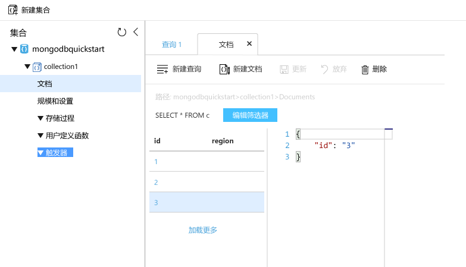

# <a name="quickstart-migrate-an-existing-mongodb-nodejs-web-app-to-azure-cosmos-db"></a>快速入门：将现有的 MongoDB Node.js Web 应用迁移到 Azure Cosmos DB 

> [!div class="op_single_selector"]
> * [.NET](create-mongodb-dotnet.md)
> * [Java](create-mongodb-java.md)
> * [Node.js](create-mongodb-nodejs.md)
> * [Python](create-mongodb-flask.md)
> * [Xamarin](create-mongodb-xamarin.md)
> * [Golang](create-mongodb-go.md)
>  

在本快速入门中，你将使用 Azure Cloud Shell 以及从 GitHub 克隆的 MEAN（MongoDB、Express、Angular 和 Node.js）应用来创建和管理 Azure Cosmos DB for Mongo DB API 帐户。 Azure Cosmos DB 是一种多模型数据库服务，它通过全局分布和水平缩放功能让你快速创建和查询文档、表、键/值和图形数据库。

## <a name="prerequisites"></a>先决条件
- 具有活动订阅的 Azure 帐户。 [免费创建一个](https://azure.microsoft.com/free/?ref=microsoft.com&utm_source=microsoft.com&utm_medium=docs&utm_campaign=visualstudio)。 或者[免费试用 Azure Cosmos DB](https://azure.microsoft.com/try/cosmosdb/) 而无需 Azure 订阅。 你还可以将 [Azure Cosmos DB 模拟器](https://aka.ms/cosmosdb-emulator)与连接字符串 `.mongodb://localhost:C2y6yDjf5/R+ob0N8A7Cgv30VRDJIWEHLM+4QDU5DE2nQ9nDuVTqobD4b8mGGyPMbIZnqyMsEcaGQy67XIw/Jw==@localhost:10255/admin?ssl=true` 配合使用。
- [Node.js](https://nodejs.org/)，应具备 Node.js 的实践知识。
- [Git](https://git-scm.com/downloads)。
- [Azure CLI 2.0+](/cli/azure/install-azure-cli)（如果不想使用 Azure Cloud Shell）。

[!INCLUDE [cloud-shell-try-it](../../includes/cloud-shell-try-it.md)]

## <a name="clone-the-sample-application"></a>克隆示例应用程序

运行下列命令以克隆示例存储库。 此示例存储库包含默认的 [MEAN.js](https://meanjs.org/) 应用程序。

1. 打开命令提示符，新建一个名为“git-samples”的文件夹，然后关闭命令提示符。

    ```bash
    mkdir "C:\git-samples"
    ```

2. 打开诸如 git bash 之类的 git 终端窗口，并使用 `cd` 命令更改为要安装示例应用的新文件夹。

    ```bash
    cd "C:\git-samples"
    ```

3. 运行下列命令以克隆示例存储库。 此命令在计算机上创建示例应用程序的副本。 

    ```bash
    git clone https://github.com/prashanthmadi/mean
    ```

## <a name="run-the-application"></a>运行应用程序

此 MongoDB 应用程序以 node.js 编写，连接到支持 MongoDB 客户端的 Azure Cosmos DB 数据库。 换言之，应用程序完全知道数据存储在 Azure Cosmos DB 数据库中。

安装所需的包，并启动应用程序。

```bash
cd mean
npm install
npm start
```
应用程序尝试连接到 MongoDB 源并失败，当输出返回“[MongoError: 连接 ECONNREFUSED 127.0.0.1:27017]”时，继续并退出应用程序。

## <a name="sign-in-to-azure"></a>登录 Azure

如果选择在本地安装并使用 CLI，本主题要求运行 Azure CLI 2.0 版或更高版本。 运行 `az --version` 即可查找版本。 如果需要进行安装或升级，请参阅 [安装 Azure CLI]。 

如果使用已安装的 Azure CLI，请使用 [az login](/cli/azure/reference-index#az-login) 命令登录到 Azure 订阅，按屏幕说明操作。 如果使用 Azure Cloud Shell，可以跳过此步骤。

```azurecli
az login 
``` 
   
## <a name="add-the-azure-cosmos-db-module"></a>添加 Azure Cosmos DB 模块

如果使用已安装的 Azure CLI，请运行 `az` 命令，检查是否已安装 `cosmosdb` 组件。 如果 `cosmosdb` 处于基本命令列表中，继续执行下一个命令。 如果使用 Azure Cloud Shell，可以跳过此步骤。

如果 `cosmosdb` 不在基本命令列表中，请重装 [Azure CLI](/cli/azure/install-azure-cli)。

## <a name="create-a-resource-group"></a>创建资源组

使用 [az group create](/cli/azure/group#az-group-create) 创建[资源组](../azure-resource-manager/management/overview.md)。 Azure 资源组是在其中部署和管理 Azure 资源（例如 Web 应用、数据库和存储帐户）的逻辑容器。 

以下示例在西欧区域中创建资源组。 选择资源组的唯一名称。

如果使用 Azure Cloud Shell，请选择“试用”  ，按照屏幕提示登录，然后将命令复制到命令提示符中。

```azurecli-interactive
az group create --name myResourceGroup --location "West Europe"
```

## <a name="create-an-azure-cosmos-db-account"></a>创建 Azure Cosmos DB 帐户

使用 [az cosmosdb create](/cli/azure/cosmosdb#az-cosmosdb-create) 命令创建 Cosmos 帐户。

在以下命令中，请将 `<cosmosdb-name>` 占位符替换成自己的唯一 Cosmos 帐户名。 此唯一名称将用作 Cosmos DB 终结点 (`https://<cosmosdb-name>.documents.azure.com/`) 的一部分，因此这个名称需要在 Azure 中的所有 Cosmos 帐户中具有唯一性。 

```azurecli-interactive
az cosmosdb create --name <cosmosdb-name> --resource-group myResourceGroup --kind MongoDB
```

`--kind MongoDB` 参数启用 MongoDB 客户端连接。

创建 Azure Cosmos DB 帐户后，Azure CLI 会显示类似于以下示例的信息： 

> [!NOTE]
> 此示例使用 JSON 作为 Azure CLI 输出格式，此为默认设置。 若要使用其他输出格式，请参阅 [Azure CLI 命令的输出格式](https://docs.microsoft.com/cli/azure/format-output-azure-cli)。

```json
{
  "databaseAccountOfferType": "Standard",
  "documentEndpoint": "https://<cosmosdb-name>.documents.azure.com:443/",
  "id": "/subscriptions/00000000-0000-0000-0000-000000000000/resourceGroups/myResourceGroup/providers/Microsoft.Document
DB/databaseAccounts/<cosmosdb-name>",
  "kind": "MongoDB",
  "location": "West Europe",
  "name": "<cosmosdb-name>",
  "readLocations": [
    {
      "documentEndpoint": "https://<cosmosdb-name>-westeurope.documents.azure.com:443/",
      "failoverPriority": 0,
      "id": "<cosmosdb-name>-westeurope",
      "locationName": "West Europe",
      "provisioningState": "Succeeded"
    }
  ],
  "resourceGroup": "myResourceGroup",
  "type": "Microsoft.DocumentDB/databaseAccounts",
  "writeLocations": [
    {
      "documentEndpoint": "https://<cosmosdb-name>-westeurope.documents.azure.com:443/",
      "failoverPriority": 0,
      "id": "<cosmosdb-name>-westeurope",
      "locationName": "West Europe",
      "provisioningState": "Succeeded"
    }
  ]
} 
```

## <a name="connect-your-nodejs-application-to-the-database"></a>将 Node.js 应用程序连接至数据库

在此步骤中，将 MEAN.js 示例应用程序连接到你刚才创建的 Azure Cosmos DB 数据库帐户。 

<a name="devconfig"></a>
## <a name="configure-the-connection-string-in-your-nodejs-application"></a>在 Node.js 应用程序中配置连接字符串

在 MEAN.js 存储库中，打开 `config/env/local-development.js`。

请将此文件的内容替换为以下代码。 另外，请务必将两个 `<cosmosdb-name>` 占位符替换为 Cosmos 帐户名。

```javascript
'use strict';

module.exports = {
  db: {
    uri: 'mongodb://<cosmosdb-name>:<primary_master_key>@<cosmosdb-name>.documents.azure.com:10255/mean-dev?ssl=true&sslverifycertificate=false'
  }
};
```

## <a name="retrieve-the-key"></a>检索密钥

若要连接到 Cosmos 数据库，需要使用数据库密钥。 使用 [az cosmosdb keys list](/cli/azure/cosmosdb/keys#az-cosmosdb-keys-list) 命令检索主键。

```azurecli-interactive
az cosmosdb keys list --name <cosmosdb-name> --resource-group myResourceGroup --query "primaryMasterKey"
```

Azure CLI 输出类似于以下示例的信息。 

```json
"RUayjYjixJDWG5xTqIiXjC..."
```

复制 `primaryMasterKey` 的值。 粘贴此值并覆盖 `local-development.js` 中的 `<primary_master_key>`。

保存所做更改。

### <a name="run-the-application-again"></a>再次运行应用程序。

再次运行 `npm start`。 

```bash
npm start
```

此时应会显示一条控制台消息，告知开发环境已启动并运行。 

在浏览器中转到 `http://localhost:3000`。 在顶部菜单中选择“注册”，并尝试创建两个虚拟用户。  

MEAN.js 示例应用程序将用户数据存储在数据库中。 如果上述操作成功并且 MEAN.js 可自动登录到已创建的用户，则表示 Azure Cosmos DB 连接可正常工作。 


## <a name="view-data-in-data-explorer"></a>在数据资源管理器中查看数据

Cosmos 数据库中存储的数据可用于在 Azure 门户中查看和查询。

若要查看、查询和处理在上一步骤中创建的用户数据，请在 Web 浏览器中登录到 [Azure 门户](https://portal.azure.com)。

在顶部搜索框中，输入 **Azure Cosmos DB**。 打开 Cosmos 帐户边栏选项卡后，请选择 Cosmos 帐户。 在左侧导航栏中，选择“数据资源管理器”  。 在“集合”窗格中展开你的集合，即可查看该集合中的文档，查询数据，甚至可以创建和运行存储过程、触发器与 UDF。 




## <a name="deploy-the-nodejs-application-to-azure"></a>将 Node.js 应用程序部署到 Azure

此步骤将 Node.js 应用程序部署到 Cosmos DB。

可能已经注意到，前面更改的配置文件适用于开发环境 (`/config/env/local-development.js`)。 将应用程序部署到应用服务后，该应用程序默认在生产环境中运行。 因此，现在需要对相应的配置文件做出相同的更改。

在 MEAN.js 存储库中，打开 `config/env/production.js`。

在 `db` 对象中，替换 `uri` 的值，如下方示例所示。 请务必像前面一样替换占位符。

```javascript
'mongodb://<cosmosdb-name>:<primary_master_key>@<cosmosdb-name>.documents.azure.com:10255/mean?ssl=true&sslverifycertificate=false',
```

> [!NOTE] 
> 由于 Cosmos DB 的要求，`ssl=true` 选项很重要。 有关详细信息，请参阅[连接字符串要求](connect-mongodb-account.md#connection-string-requirements)。
>
>

在终端中，将所有更改提交到 Git。 可以复制这两个命令，以便同时运行。

```bash
git add .
git commit -m "configured MongoDB connection string"
```
## <a name="clean-up-resources"></a>清理资源

[!INCLUDE [cosmosdb-delete-resource-group](../../includes/cosmos-db-delete-resource-group.md)]

## <a name="next-steps"></a>后续步骤

在本快速入门中，你已了解了如何使用 Azure Cloud Shell 创建 Azure Cosmos DB MongoDB API 帐户，以及如何创建和运行 MEAN.js 应用，以将用户添加到该帐户。 现在可以将其他数据导入 Azure Cosmos DB 帐户了。

> [!div class="nextstepaction"]
> [将 MongoDB 数据导入 Azure Cosmos DB](mongodb-migrate.md)
