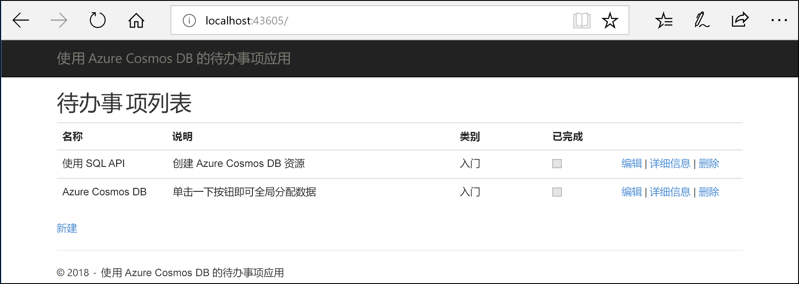
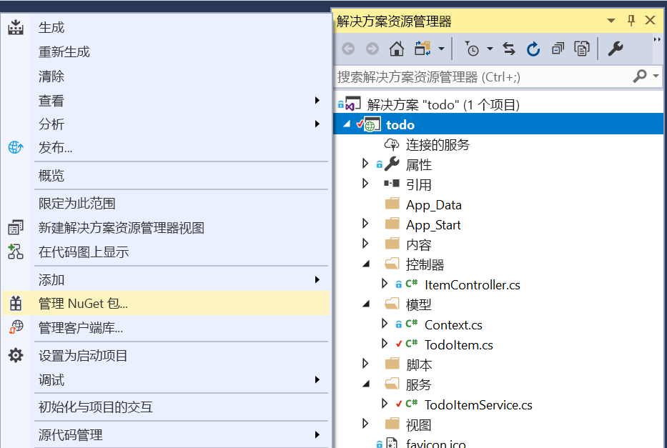

# <a name="quickstart-build-an-aspnet-web-app-using-azure-cosmos-db-sql-api-account"></a>快速入门：使用 Azure Cosmos DB SQL API 帐户生成 ASP.NET web 应用

> [!div class="op_single_selector"]
> * [.NET（预览版）](create-sql-api-dotnet-preview.md)
> * [.NET](create-sql-api-dotnet.md)
> * [Java](create-sql-api-java.md)
> * [Node.js](create-sql-api-nodejs.md)
> * [Python](create-sql-api-python.md)
> * [Xamarin](create-sql-api-xamarin-dotnet.md)
>  
> 

Azure Cosmos DB 是 Microsoft 提供的高度可用的全球分布式多模型数据库服务。 可快速创建和查询文档、键/值和图形数据库，所有这些都受益于 Azure Cosmos DB 核心的全球分布和水平缩放功能。 

本快速入门演示如何使用 Azure 门户创建 Azure Cosmos DB [SQL API](sql-api-introduction.md) 帐户、数据库和容器。 然后会生成并部署基于 [SQL .NET API](sql-api-sdk-dotnet.md) 构建的 ASP.NET“待办事项列表”Web 应用，如以下屏幕截图中所示。 

本快速入门使用 Azure Cosmos DB .NET SDK 3.0+ 版本。 



## <a name="prerequisites"></a>先决条件

如果尚未安装 Visual Studio 2017，可以下载并使用**免费的** [Visual Studio 2017 Community Edition](https://www.visualstudio.com/downloads/)。 在安装 Visual Studio 的过程中，请确保启用“Azure 开发”工作负荷。

[!INCLUDE [quickstarts-free-trial-note](../../includes/quickstarts-free-trial-note.md)] 
[!INCLUDE [cosmos-db-emulator-docdb-api](../../includes/cosmos-db-emulator-docdb-api.md)]  

<a id="create-account"></a>
## <a name="create-a-database-account"></a>创建数据库帐户

[!INCLUDE [cosmos-db-create-dbaccount-preview](../../includes/cosmos-db-create-dbaccount-preview.md)]

<a id="create-collection"></a>
## <a name="add-a-collection"></a>添加集合

[!INCLUDE [cosmos-db-create-collection-preview](../../includes/cosmos-db-create-collection-preview.md)]

<a id="add-sample-data"></a>
## <a name="add-sample-data"></a>添加示例数据

[!INCLUDE [cosmos-db-create-sql-api-add-sample-data](../../includes/cosmos-db-create-sql-api-add-sample-data.md)]

## <a name="query-your-data"></a>查询数据

[!INCLUDE [cosmos-db-create-sql-api-query-data](../../includes/cosmos-db-create-sql-api-query-data.md)]

## <a name="clone-the-sample-application"></a>克隆示例应用程序

现在，让我们转到如何使用代码上来。 接下来，克隆 [GitHub 中的 SQL API](https://github.com/Azure-Samples/cosmos-dotnet-todo-app) 应用程序，设置连接字符串，并运行应用程序。 

1. 打开命令提示符，新建一个名为“git-samples”的文件夹，然后关闭命令提示符。

    ```bash
    md "C:\git-samples"
    ```

2. 打开诸如 git bash 之类的 git 终端窗口，并使用 `cd` 命令更改为要安装示例应用的新文件夹。

    ```bash
    cd "C:\git-samples"
    ```

3. 运行下列命令以克隆示例存储库。 此命令在计算机上创建示例应用程序的副本。

    ```bash
    git clone https://github.com/Azure-Samples/cosmos-dotnet-todo-app.git
    ```

4. 在 Visual Studio 中打开 **todo.sln** 解决方案文件。 

## <a name="review-the-code"></a>查看代码

此步骤是可选的。 如果有意了解如何使用代码创建数据库资源，可以查看以下代码片段。 否则，可以直接跳转到[更新连接字符串](#update-your-connection-string)。 

注意，如果你熟悉旧版 .NET SDK，则可能已看惯了术语“集合”和“文档”。 由于 Azure Cosmos DB 支持多 API 模型，因此 3.0+ 版的 .NET SDK 使用通用术语“容器”和“项”。 容器可以是集合、图或表。 项可以是文档、边缘/顶点或行，是容器中的内容。 [详细了解数据库、容器和项。](databases-containers-items.md)

以下代码片段全部摘自 ToDoItemService.cs 文件。

* 对第 68 - 69 行中的 CosmosClient 进行初始化。

    ```csharp
    CosmosConfiguration config = new CosmosConfiguration(Endpoint, PrimaryKey);
    client = new CosmosClient(config);
    ```

* 在第 71 行创建一个新数据库。

    ```csharp
    CosmosDatabase database = await client.Databases.CreateDatabaseIfNotExistsAsync(DatabaseId);
    ```

* 在第 72 行创建分区键为“/category”的新容器。

    ```csharp
    CosmosContainer container = await database.Containers.CreateContainerIfNotExistsAsync(ContainerId, "/category");
    ```

## <a name="update-your-connection-string"></a>更新连接字符串

现在返回到 Azure 门户，获取连接字符串信息，并将其复制到应用。

1. 在 [Azure 门户](https://portal.azure.com/)的 Azure Cosmos DB 帐户的左侧导航栏中，选择“密钥”，然后选择“读写密钥”。 使用屏幕右侧的复制按钮将 URI 和主密钥复制到下一步的 web.config 文件中。

    

2. 在 Visual Studio 2017 中，打开 **web.config** 文件。 

3. 从门户中复制 URI 值（使用复制按钮），并在 web.config 中将其设为 ``endpoint`` 密钥的值。 

    `<add key="endpoint" value="FILLME" />`

4. 然后从门户复制“主密钥”的值，并在 web.config 中将其设为 ``primarykey`` 的值。 

    `<add key="primaryKey" value="FILLME" />`
    
5. 然后更新数据库和容器的值，以匹配先前创建的数据库和容器的名称。 现已使用与 Azure Cosmos DB 进行通信所需的所有信息更新应用。 

    `<add key="database" value="Tasks" />`

    `<add key="container" value="Items" />`
    
## <a name="run-the-web-app"></a>运行 Web 应用

1. 在“解决方案资源管理器”中，右键单击 Visual Studio 解决方案下方的新控制台应用程序项目，并单击“管理 NuGet 包...”
    
    
1. 在“NuGet”选项卡上，单击“浏览”，并在搜索框中键入 **Microsoft.Azure.Cosmos**。
1. 在结果中找到“Microsoft.Azure.Cosmos”，并单击“安装”。
   Azure Cosmos DB SQL API 客户端库的程序包 ID 是 [Microsoft Azure Cosmos DB 客户端库](https://www.nuget.org/packages/Microsoft.Azure.Cosmos/)。

   

    如果获得有关查看解决方案更改的消息，请单击“确定”。 如果获得有关接受许可证的消息，请单击“我接受”。

1. 选择 CTRL + F5 以运行应用程序。 应用会显示在浏览器中。 

1. 在浏览器中选择“新建”，并在“待办事项”应用中创建一些新任务。 此外还会看到在[添加示例数据](#add-sample-data)中创建的任务

   

现可返回到数据资源管理器，查看查询、修改和处理此新数据。 

## <a name="review-slas-in-the-azure-portal"></a>在 Azure 门户中查看 SLA

[!INCLUDE [cosmosdb-tutorial-review-slas](../../includes/cosmos-db-tutorial-review-slas.md)]

## <a name="clean-up-resources"></a>清理资源

[!INCLUDE [cosmosdb-delete-resource-group](../../includes/cosmos-db-delete-resource-group.md)]

## <a name="next-steps"></a>后续步骤

本快速入门介绍了如何创建 Azure Cosmos DB 帐户、如何使用数据资源管理器创建容器并向其添加项，以及如何运行 Web 应用。 现在可以将其他数据导入 Cosmos DB 帐户。 

> [!div class="nextstepaction"]
> [将数据导入 Azure Cosmos DB](import-data.md)


