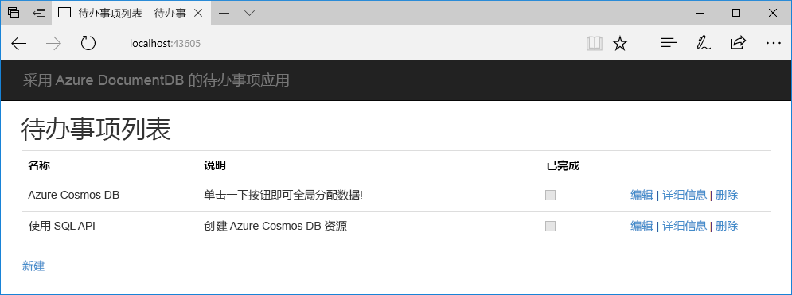

# <a name="quickstart-build-a-net-web-app-with-azure-cosmos-db-using-the-sql-api-and-the-azure-portal"></a>快速入门：使用 SQL API 和 Azure 门户生成包含 Azure Cosmos DB 的 .NET Web 应用

Azure Cosmos DB 是 Microsoft 提供的全球分布式多模型数据库服务。 可快速创建和查询文档、键/值和图形数据库，所有这些都受益于 Azure Cosmos DB 核心的全球分布和水平缩放功能。 

本快速入门教程演示如何使用 Azure 门户创建 Azure Cosmos DB [SQL API](sql-api-introduction.md) 帐户、文档数据库和集合。 然后会生成并部署基于 [SQL .NET API](sql-api-sdk-dotnet.md) 构建的“待办事项列表”Web 应用，如以下屏幕截图中所示。 



## <a name="prerequisites"></a>先决条件

如果尚未安装 Visual Studio 2017，可以下载并使用**免费的** [Visual Studio 2017 Community Edition](https://www.visualstudio.com/downloads/)。 在安装 Visual Studio 的过程中，请确保启用“Azure 开发”。

[!INCLUDE [quickstarts-free-trial-note](../../includes/quickstarts-free-trial-note.md)] 
[!INCLUDE [cosmos-db-emulator-docdb-api](../../includes/cosmos-db-emulator-docdb-api.md)]  

<a id="create-account"></a>
## <a name="create-a-database-account"></a>创建数据库帐户

[!INCLUDE [cosmos-db-create-dbaccount](../../includes/cosmos-db-create-dbaccount.md)]

<a id="create-collection"></a>
## <a name="add-a-collection"></a>添加集合

[!INCLUDE [cosmos-db-create-collection](../../includes/cosmos-db-create-collection.md)]

<a id="add-sample-data"></a>
## <a name="add-sample-data"></a>添加示例数据

[!INCLUDE [cosmos-db-create-sql-api-add-sample-data](../../includes/cosmos-db-create-sql-api-add-sample-data.md)]

## <a name="query-your-data"></a>查询数据

[!INCLUDE [cosmos-db-create-sql-api-query-data](../../includes/cosmos-db-create-sql-api-query-data.md)]

## <a name="clone-the-sample-application"></a>克隆示例应用程序

现在，让我们转到如何使用代码上来。 接下来，克隆 GitHub 中的 SQL API 应用程序，设置连接字符串，并运行应用程序。 会看到以编程方式处理数据是多么容易。 

1. 打开命令提示符，新建一个名为“git-samples”的文件夹，然后关闭命令提示符。

    ```bash
    md "C:\git-samples"
    ```

2. 打开诸如 git bash 之类的 git 终端窗口，并使用 `cd` 命令更改为要安装示例应用的新文件夹。

    ```bash
    cd "C:\git-samples"
    ```

3. 运行下列命令以克隆示例存储库。 此命令在计算机上创建示例应用程序的副本。

    ```bash
    git clone https://github.com/Azure-Samples/documentdb-dotnet-todo-app.git
    ```

4. 然后在 Visual Studio 中打开 todo 解决方案文件。 

## <a name="review-the-code"></a>查看代码

此步骤是可选的。 如果有意了解如何使用代码创建数据库资源，可以查看下面的代码段。 否则，可以直接跳转到[更新连接字符串](#update-your-connection-string)。 

以下代码片段全部摘自 DocumentDBRepository.cs 文件。

* 在第 76 行对 DocumentClient 进行初始化。

    ```csharp
    client = new DocumentClient(new Uri(ConfigurationManager.AppSettings["endpoint"]), ConfigurationManager.AppSettings["authKey"]);
    ```

* 在第 91 行创建一个新数据库。

    ```csharp
    await client.CreateDatabaseAsync(new Database { Id = DatabaseId });
    ```

* 在第 110 行创建一个新集合。

    ```csharp
    await client.CreateDocumentCollectionAsync(
        UriFactory.CreateDatabaseUri(DatabaseId),
        new DocumentCollection
            {
               Id = CollectionId
            },
        new RequestOptions { OfferThroughput = 400 });
    ```

## <a name="update-your-connection-string"></a>更新连接字符串

现在返回到 Azure 门户，获取连接字符串信息，并将其复制到应用。

1. 在 [Azure 门户](http://portal.azure.com/)的 Azure Cosmos DB 帐户的左侧导航栏中，单击“密钥”，并单击“读写密钥”。 使用屏幕右侧的复制按钮将 URI 和主密钥复制到下一步的 web.config 文件中。

    

2. 在 Visual Studio 2017 中，打开 web.config 文件。 

3. 从门户中复制 URI 值（使用复制按钮），并在 web.config 中将其设为终结点密钥的值。 

    `<add key="endpoint" value="FILLME" />`

4. 然后从门户复制 PRIMARY KEY 值，并在 web.config 中将其设为 authKey 的值。现已使用与 Azure Cosmos DB 进行通信所需的所有信息更新应用。 

    `<add key="authKey" value="FILLME" />`
    
## <a name="run-the-web-app"></a>运行 Web 应用
1. 在 Visual Studio 中，右键单击解决方案资源管理器中的项目，并单击“管理 NuGet 包”。 

2. 在 NuGet“浏览”框中，键入 *DocumentDB*。

3. 从结果中安装“Microsoft.Azure.DocumentDB”库。 这会安装 Microsoft.Azure.DocumentDB 包以及所有依赖项。

4. 单击 Ctrl+F5 运行应用程序。 应用会显示在浏览器中。 

5. 在浏览器中单击“新建”，并在“待办事项”应用中创建一些新任务。

   

现可返回到数据资源管理器，查看查询、修改和处理此新数据。 

## <a name="review-slas-in-the-azure-portal"></a>在 Azure 门户中查看 SLA

[!INCLUDE [cosmosdb-tutorial-review-slas](../../includes/cosmos-db-tutorial-review-slas.md)]

## <a name="clean-up-resources"></a>清理资源

[!INCLUDE [cosmosdb-delete-resource-group](../../includes/cosmos-db-delete-resource-group.md)]

## <a name="next-steps"></a>后续步骤

在本快速入门教程中，已了解如何创建 Azure Cosmos DB 帐户、使用数据资源管理器创建集合和运行 Web 应用。 现在可以将其他数据导入 Cosmos DB 帐户。 

> [!div class="nextstepaction"]
> [将数据导入 Azure Cosmos DB](import-data.md)


