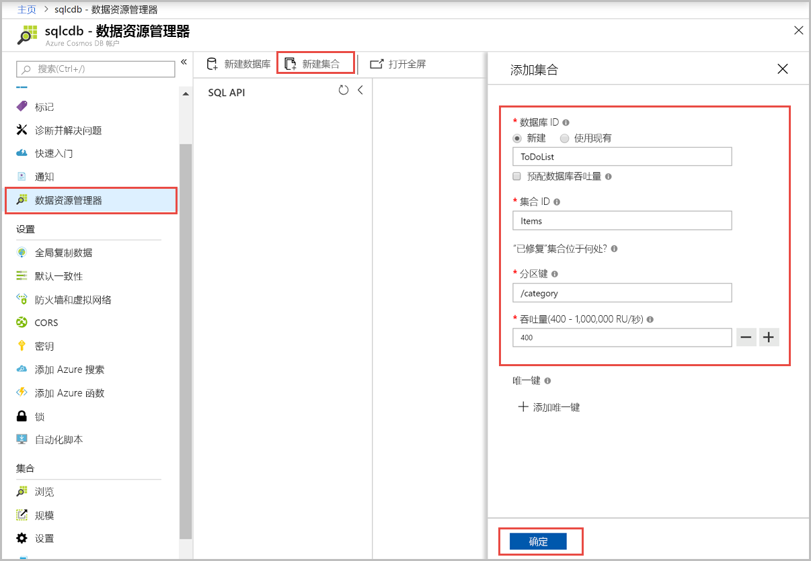
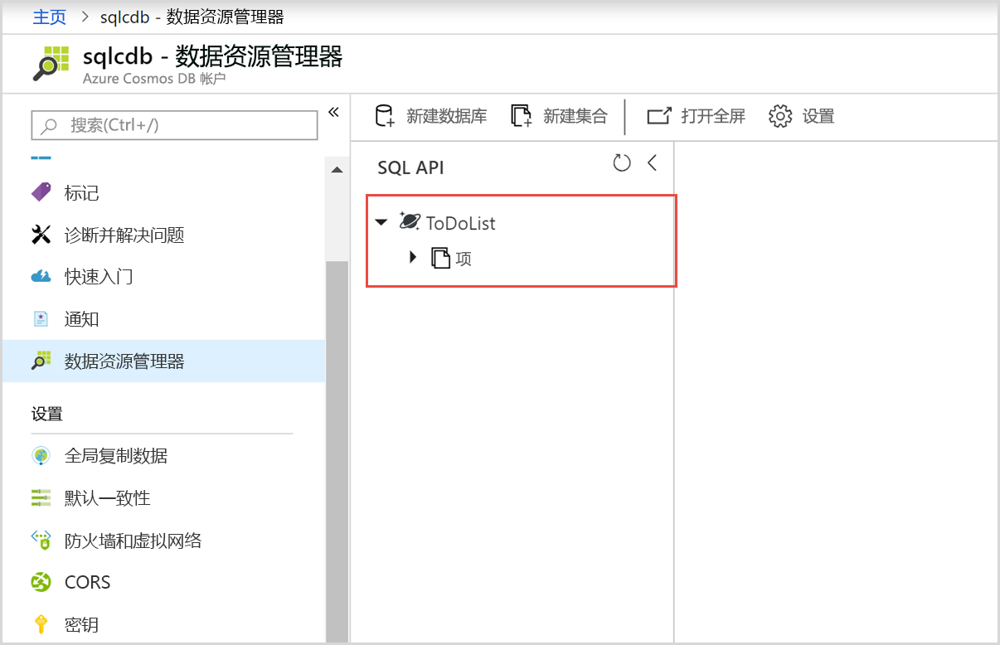
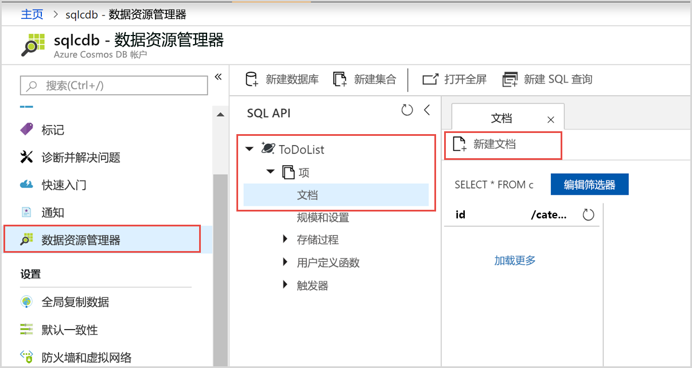
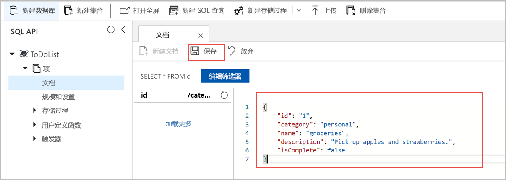

# <a name="quickstart-build-a-net-web-app-using-sql-api-account-in-azure-cosmos-db"></a>快速入门：在 Azure Cosmos DB 中生成一个使用 SQL API 帐户的 .NET Web 应用

> [!div class="op_single_selector"]
> * [.NET](create-sql-api-dotnet.md)
> * [.NET（预览版）](create-sql-api-dotnet-preview.md)
> * [Java](create-sql-api-java.md)
> * [Node.js](create-sql-api-nodejs.md)
> * [Python](create-sql-api-python.md)
> * [Xamarin](create-sql-api-xamarin-dotnet.md)
>  
> 

Azure Cosmos DB 是 Microsoft 提供的全球分布式多模型数据库服务。 可以使用 Azure Cosmos DB 快速创建和查询键/值数据库、文档数据库和图形数据库，所有这些资源都可受益于 Azure Cosmos DB 核心的全球分布和水平缩放功能。 

本快速入门演示如何使用 Azure 门户创建 Azure Cosmos DB [SQL API](sql-api-introduction.md) 帐户、创建文档数据库和集合，并将数据添加到集合。 然后，可以使用 [SQL .NET SDK](sql-api-sdk-dotnet.md) Web 应用将更多数据添加到集合。 

本快速入门使用 Azure 门户中的数据资源管理器来创建数据库和集合。 你也可以使用 .NET 示例代码创建数据库和集合。 有关详细信息，请参阅[查看 .NET 代码](#review-the-net-code)。 

## <a name="prerequisites"></a>先决条件

已安装包含 Azure 开发工作流的 Visual Studio 2017
- 可以下载并使用**免费的** [Visual Studio 2017 Community Edition](https://www.visualstudio.com/downloads/)。 在安装 Visual Studio 的过程中，请确保启用“Azure 开发”。 

Azure 订阅，或免费的 Azure Cosmos DB 试用帐户
- [!INCLUDE [quickstarts-free-trial-note](../../includes/quickstarts-free-trial-note.md)] 
- [!INCLUDE [cosmos-db-emulator-docdb-api](../../includes/cosmos-db-emulator-docdb-api.md)]  

<a id="create-account"></a>
## <a name="create-an-azure-cosmos-db-account"></a>创建 Azure Cosmos DB 帐户

[!INCLUDE [cosmos-db-create-dbaccount](../../includes/cosmos-db-create-dbaccount.md)]

<a id="create-collection-database"></a>
## <a name="add-a-database-and-a-collection"></a>添加数据库和集合 

可以使用 Azure 门户中的数据资源管理器来创建数据库和集合。 

1.  在 Azure Cosmos DB 帐户页上的左侧导航栏中选择“数据资源管理器”，然后选择“新建集合”。 
    
    可能需要向右滚动才能看到“添加集合”区域。
    
    
    
1.  在“添加集合”页上，输入新集合的设置。
    
    |设置|建议的值|说明
    |---|---|---|
    |**数据库 ID**|ToDoList|输入 ToDoList 作为新数据库的名称。 数据库名称必须包含 1 到 255 个字符，不能包含 `/, \\, #, ?` 或尾随空格。|
    |**集合 ID**|Items|输入 *Items* 作为新集合的名称。 集合 ID 与数据库名称的字符要求相同。|
    |**分区键**| /category| 本文中所述的示例使用 /category 作为分区键。|
    |**吞吐量**|400|将吞吐量保留为每秒 400 个请求单位 (RU/s)。 如果想要减少延迟，以后可以增加吞吐量。| 
    
    对于本示例，请不要添加“唯一键”。 使用唯一键可将数据完整性层添加到数据库，因为它能确保每个分区键的一个或多个值的唯一性。 有关详细信息，请参阅 [Azure Cosmos DB 中的唯一键](unique-keys.md)。
    
1.  选择“确定”。 
    数据资源管理器将显示新的数据库和集合。
    
    

## <a name="add-data-to-your-database"></a>将数据添加到数据库

使用数据资源管理器将数据添加到新的数据库。

1. 在“数据资源管理器”中，新数据库会显示在“集合”窗格中。 依次展开“ToDoList”数据库、“Items”集合，选择“文档”，然后选择“新建文档”。 
   
   
   
1. 在“文档”窗格的右侧，将以下结构添加到文档：

     ```json
     {
         "id": "1",
         "category": "personal",
         "name": "groceries",
         "description": "Pick up apples and strawberries.",
         "isComplete": false
     }
     ```

1. 选择“保存”。
   
   
   
1. 再次选择“新建文档”，创建并保存具有唯一 `id` 的另一个文档，以及所需的其他任何属性和值。 文档可以采用任何结构，因为 Azure Cosmos DB 不会对数据施加任何架构。

## <a name="query-your-data"></a>查询数据

[!INCLUDE [cosmos-db-create-sql-api-query-data](../../includes/cosmos-db-create-sql-api-query-data.md)]

## <a name="use-the-net-web-app-to-manage-data"></a>使用 .NET Web 应用管理数据

若要了解如何以编程方式轻松处理 Azure Cosmos DB 数据，请克隆 GitHub 中的示例 SQL API .NET Web 应用，更新连接字符串，然后运行该应用以更新数据。 

也可以使用 .NET 示例代码创建数据库和集合。 有关详细信息，请参阅[查看 .NET 代码](#review-the-net-code)。

### <a name="clone-the-sample-app"></a>克隆示例应用

首先，克隆 GitHub 中的 C# [SQL API 应用](https://github.com/Azure-Samples/documentdb-dotnet-todo-app)。 

1. 打开 Git 终端窗口（例如 Git Bash），创建名为 *git-samples* 的新目录并切换到该目录： 
   
   ```bash
   mkdir /c/git-samples/
   cd /c/git-samples/
   ```
   
1. 运行以下命令以克隆示例存储库，并在计算机上创建示例应用的副本：
   
   ```bash
   git clone https://github.com/Azure-Samples/documentdb-dotnet-todo-app.git
   ```

### <a name="update-the-connection-string"></a>更新连接字符串 

1. 在 Visual Studio 中导航到所克隆的应用的 *todo.sln* 文件并将其打开。 

1. 在 Visual Studio 的“解决方案资源管理器”中，打开 *web.config* 文件。 

1. 返回 Azure 门户，复制连接字符串信息，并将其粘贴到 *web.config* 中。
   
   1. 在 Azure Cosmos DB 帐户的左侧导航栏中，选择“密钥”。
      
      
      
   1. 在“读写密钥”下，使用右侧的复制按钮复制“URI”值，并将其粘贴到 *web.config* 中的 `endpoint` 密钥。例如： 
      
      `<add key="endpoint" value="https://mysqlapicosmosdb.documents.azure.com:443/" />`
      
   1. 复制“主密钥”值，并将其粘贴到 *web.config* 中的 `authKey` 密钥。例如：
      
      `<add key="authKey" value="19ZDNJAiYL26tmnRvoez6hmtIfBGwjun50PWRjNYMC2ig8Ob9hYk7Fq1RYSv8FcIYnh1TdBISvCh7s6yyb0000==" />`

       
1. 确保 *web.config* 中的数据库和集合值与前面创建的名称相匹配。 

   ```csharp
   <add key="database" value="ToDoList"/>
   <add key="collection" value="Items"/>
   ```
 
1. 保存 *web.config*。现已使用与 Azure Cosmos DB 进行通信所需的所有信息更新应用。

### <a name="run-the-web-app"></a>运行 Web 应用

1. 在 Visual Studio 的“解决方案资源管理器”中，右键单击“todo”项目，然后选择“管理 NuGet 包”。 

1. 在 NuGet“浏览”框中，键入 *DocumentDB*。

1. 从结果中安装 **Microsoft.Azure.DocumentDB** 库（如果尚未安装）。 这会安装 [Microsoft.Azure.DocumentDB](https://www.nuget.org/packages/Microsoft.Azure.DocumentDB/) 包以及所有依赖项。
   
   如果 NuGet 包管理器显示一条消息，指出解决方案中缺少某些包，请选择“还原”以从内部源安装这些包。 

1. 在浏览器中按 **Ctrl**+**F5** 运行该应用。 

1. 在 to-do 应用中选择“新建”，然后创建几个新任务。

   

可以返回到 Azure 门户中的数据资源管理器，以查看、查询、修改和处理新数据。 

## <a name="review-the-net-code"></a>查看 .NET 代码

此步骤是可选的。 在本快速入门中，你已使用 Azure 门户创建了一个数据库和一个集合，并使用 .NET 示例添加了示例数据。 但是，也可以使用 .NET 示例创建数据库和集合。 如果你想要了解数据库资源是如何在该代码中创建的，请查看以下代码片段。 这些代码片段全部摘自 **todo** 项目中的 *DocumentDBRepository.cs* 文件。

* 此代码初始化 `DocumentClient`： 

    ```csharp
    client = new DocumentClient(new Uri(ConfigurationManager.AppSettings["endpoint"]), ConfigurationManager.AppSettings["authKey"]);
    ```

* 此代码使用 `CreateDatabaseAsync` 方法创建新的数据库：

    ```csharp
    await client.CreateDatabaseAsync(new Database { Id = DatabaseId });
    ```

* 以下代码使用 `CreateDocumentCollectionAsync` 方法创建新的集合：

    ```csharp
    private static async Task CreateCollectionIfNotExistsAsync(string partitionkey)
    {
       try
       {       
        await client.ReadDocumentCollectionAsync(UriFactory.CreateDocumentCollectionUri(DatabaseId, CollectionId), new RequestOptions { PartitionKey = new PartitionKey(partitionkey) });
       }
        catch (DocumentClientException e)
        {
           if (e.StatusCode == System.Net.HttpStatusCode.NotFound)
            {
                await client.CreateDocumentCollectionAsync(
                  UriFactory.CreateDatabaseUri(DatabaseId),
                   new DocumentCollection
                    {
                      Id = CollectionId,
                      PartitionKey = new PartitionKeyDefinition
                       {
                           Paths = new System.Collections.ObjectModel.Collection<string>(new List<string>() { partitionkey })
                        }
                    },
                      new RequestOptions { OfferThroughput = 400 });
            }
            else
            {
                throw;
            }
        }
    }
    ```

## <a name="clean-up-resources"></a>清理资源

[!INCLUDE [cosmosdb-delete-resource-group](../../includes/cosmos-db-delete-resource-group.md)]

## <a name="next-steps"></a>后续步骤

本快速入门已介绍如何创建 Azure Cosmos DB 帐户、使用数据资源管理器创建数据库和集合，并运行 .NET Web 应用来更新数据。 现在可以将其他数据导入 Azure Cosmos DB 帐户了。 

> [!div class="nextstepaction"]
> [将数据导入 Azure Cosmos DB](import-data.md)

