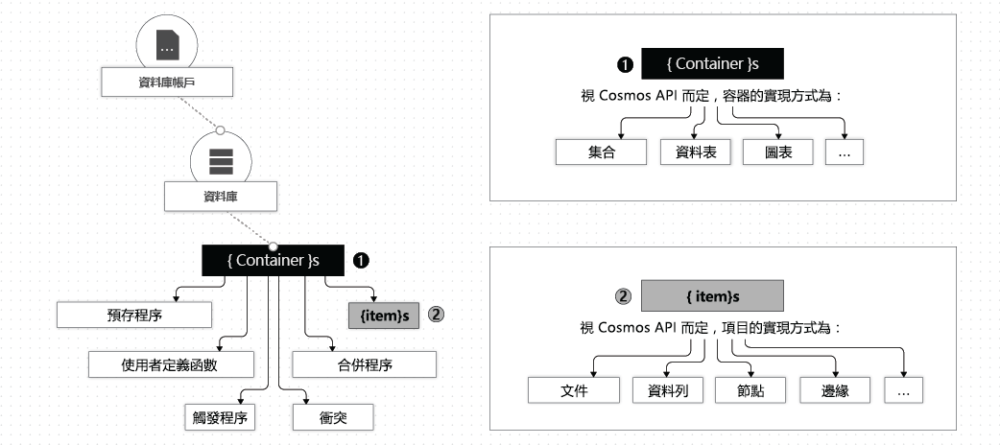

# <a name="quickstart-build-a-java-app-to-manage-azure-cosmos-db-sql-api-data"></a>快速入门：生成 Java 应用以管理 Azure Cosmos DB SQL API 数据


> [!div class="op_single_selector"]
> * [.NET V3](create-sql-api-dotnet.md)
> * [.NET V4](create-sql-api-dotnet-V4.md)
> * [Java](create-sql-api-java.md)
> * [Node.js](create-sql-api-nodejs.md)
> * [Python](create-sql-api-python.md)
> * [Xamarin](create-sql-api-xamarin-dotnet.md)

在本快速入门中，你将通过 Azure 门户并使用从 GitHub 克隆的 Java 应用来创建和管理 Azure Cosmos DB SQL API 帐户。 首先，请使用 Azure 门户创建 Azure Cosmos DB SQL API 帐户，使用 SQL Java SDK 创建 Java 应用，然后使用 Java 应用程序将资源添加到 Cosmos DB 帐户。 Azure Cosmos DB 是一种多模型数据库服务，它通过全局分布和水平缩放功能让你快速创建和查询文档、表、键/值和图形数据库。

## <a name="prerequisites"></a>先决条件

- 具有活动订阅的 Azure 帐户。 [免费创建一个](https://azure.microsoft.com/free/?ref=microsoft.com&utm_source=microsoft.com&utm_medium=docs&utm_campaign=visualstudio)。 或者[免费试用 Azure Cosmos DB](https://azure.microsoft.com/try/cosmosdb/) 而无需 Azure 订阅。 你还可以使用 [Azure Cosmos DB 模拟器](https://aka.ms/cosmosdb-emulator)以及 URI `https://localhost:8081` 和密钥 `C2y6yDjf5/R+ob0N8A7Cgv30VRDJIWEHLM+4QDU5DE2nQ9nDuVTqobD4b8mGGyPMbIZnqyMsEcaGQy67XIw/Jw==`。
- [Java 开发工具包 (JDK) 8](https://www.azul.com/downloads/azure-only/zulu/?&version=java-8-lts&architecture=x86-64-bit&package=jdk)。 将 `JAVA_HOME` 环境变量指向其中安装了 JDK 的文件夹。
- [Maven 二进制存档](https://maven.apache.org/download.cgi)。 在 Ubuntu 上运行 `apt-get install maven`，以安装 Maven。
- [Git](https://www.git-scm.com/downloads)。 在 Ubuntu 上运行 `sudo apt-get install git`，以安装 Git。

## <a name="introductory-notes"></a>介绍性说明

Cosmos DB 帐户的结构。  不管使用 API 还是编程语言，都具有以下特点：一个 Cosmos DB 帐户  包含零个或零个以上的数据库  ，一个数据库  (DB) 包含零个或零个以上的容器  ，一个容器  包含零个或零个以上的项，如下图所示：



可在[此处](databases-containers-items.md)阅读有关数据库、容器和项的详细信息。 几个重要属性在容器级别定义，其中包括预配吞吐量  和分区键  。 

预配吞吐量以具有货币价格的请求单位 (*RU*) 度量，是帐户运营成本中重要的确定性因素。 可以按单容器粒度或单数据库粒度选择预配吞吐量，但通常首选容器级别吞吐量规范。 可在[此处](set-throughput.md)阅读有关吞吐量预配的详细信息。

将项插入 Cosmos DB 容器时，数据库会添加更多的存储和计算来处理请求，以水平方式增长。 存储和计算容量添加到称为分区  的离散单元中，你必须在文档中选择一个字段作为分区键，以便将每个文档映射到分区。 分区的管理方式是从分区键值的范围内为每个分区分配一个大致相等的切片；因此，建议选择相对随机或均匀分布的分区键。 否则，某些分区看到的请求数会多得多（热分区  ），而其他分区看到的请求数会少得多（冷分区  ），这是应该避免的。 可以在[此处](partitioning-overview.md)详细了解分区。

## <a name="create-a-database-account"></a>创建数据库帐户

在创建文档数据库之前，需通过 Azure Cosmos DB 创建 SQL API 帐户。

[!INCLUDE [cosmos-db-create-dbaccount](../../includes/cosmos-db-create-dbaccount.md)]

## <a name="add-a-container"></a>添加容器

[!INCLUDE [cosmos-db-create-collection](../../includes/cosmos-db-create-collection.md)]

<a id="add-sample-data"></a>
## <a name="add-sample-data"></a>添加示例数据

[!INCLUDE [cosmos-db-create-sql-api-add-sample-data](../../includes/cosmos-db-create-sql-api-add-sample-data.md)]

## <a name="query-your-data"></a>查询数据

[!INCLUDE [cosmos-db-create-sql-api-query-data](../../includes/cosmos-db-create-sql-api-query-data.md)]

## <a name="clone-the-sample-application"></a>克隆示例应用程序

现在，让我们转到如何使用代码上来。 接下来，克隆 GitHub 中的 SQL API 应用程序，设置连接字符串，并运行应用程序。 会看到以编程方式处理数据是多么容易。 

运行下列命令以克隆示例存储库。 此命令在计算机上创建示例应用程序的副本。

```bash
git clone https://github.com/Azure-Samples/azure-cosmos-java-getting-started.git
```

## <a name="review-the-code"></a>查看代码

此步骤是可选的。 如果有意了解如何使用代码创建数据库资源，可以查看以下代码片段。 否则，可以跳到[运行应用](#run-the-app)。 


# <a name="sync-api"></a>[同步 API](#tab/sync)

### <a name="managing-database-resources-using-the-synchronous-sync-api"></a>使用同步 (sync) API 管理数据库资源

* `CosmosClient` 初始化。 `CosmosClient` 为 Azure Cosmos 数据库服务提供客户端逻辑表示形式。 此客户端用于对服务配置和执行请求。
    
    [!code-java[](~/azure-cosmosdb-java-v4-getting-started/src/main/java/com/azure/cosmos/sample/sync/SyncMain.java?name=CreateSyncClient)]

* `CosmosDatabase` 的创建。

    [!code-java[](~/azure-cosmosdb-java-v4-getting-started/src/main/java/com/azure/cosmos/sample/sync/SyncMain.java?name=CreateDatabaseIfNotExists)]

* `CosmosContainer` 的创建。

    [!code-java[](~/azure-cosmosdb-java-v4-getting-started/src/main/java/com/azure/cosmos/sample/sync/SyncMain.java?name=CreateContainerIfNotExists)]

* 使用 `createItem` 方法创建项。

    [!code-java[](~/azure-cosmosdb-java-v4-getting-started/src/main/java/com/azure/cosmos/sample/sync/SyncMain.java?name=CreateItem)]
   
* 使用 `readItem` 方法执行点读取。

    [!code-java[](~/azure-cosmosdb-java-v4-getting-started/src/main/java/com/azure/cosmos/sample/sync/SyncMain.java?name=ReadItem)]

* 使用 `queryItems` 方法对 JSON 执行 SQL 查询。

    [!code-java[](~/azure-cosmosdb-java-v4-getting-started/src/main/java/com/azure/cosmos/sample/sync/SyncMain.java?name=QueryItems)]

# <a name="async-api"></a>[异步 API](#tab/async)

### <a name="managing-database-resources-using-the-asynchronous-async-api"></a>使用异步 (async) API 管理数据库资源

* 异步 API 调用立即返回，而不等待服务器的响应。 对于这种情况，以下代码片段演示了通过异步 API 完成上述所有管理任务时可用的正确设计模式。

* `CosmosAsyncClient` 初始化。 `CosmosAsyncClient` 为 Azure Cosmos 数据库服务提供客户端逻辑表示形式。 此客户端用于对服务配置和执行异步请求。
    
    [!code-java[](~/azure-cosmosdb-java-v4-getting-started/src/main/java/com/azure/cosmos/sample/async/AsyncMain.java?name=CreateAsyncClient)]

* `CosmosAsyncDatabase` 的创建。

    [!code-java[](~/azure-cosmosdb-java-v4-getting-started/src/main/java/com/azure/cosmos/sample/sync/SyncMain.java?name=CreateDatabaseIfNotExists)]

* `CosmosAsyncContainer` 的创建。

    [!code-java[](~/azure-cosmosdb-java-v4-getting-started/src/main/java/com/azure/cosmos/sample/sync/SyncMain.java?name=CreateContainerIfNotExists)]

* 与同步 API 一样，项的创建是使用 `createItem` 方法完成的。 此示例演示如何通过订阅反应流（发出请求并输出通知）来有效地发出大量异步 `createItem` 请求。 由于此简单示例会一直运行到完成并终止，因此使用了 `CountDownLatch` 实例来确保程序在创建项期间不会终止。 **适当的异步编程做法是不要阻止异步调用 - 在真实用例中，请求是从一个无限期执行的 main() 循环生成的，因此无需闩锁异步调用。**

    [!code-java[](~/azure-cosmosdb-java-v4-getting-started/src/main/java/com/azure/cosmos/sample/async/AsyncMain.java?name=CreateItem)]
   
* 与同步 API 一样，点读取是使用 `readItem` 方法执行的。

    [!code-java[](~/azure-cosmosdb-java-v4-getting-started/src/main/java/com/azure/cosmos/sample/async/AsyncMain.java?name=ReadItem)]

* 与同步 API 一样，对 JSON 的 SQL 查询是使用 `queryItems` 方法执行的。

    [!code-java[](~/azure-cosmosdb-java-v4-getting-started/src/main/java/com/azure/cosmos/sample/async/AsyncMain.java?name=QueryItems)]

---

## <a name="run-the-app"></a>运行应用

现在返回到 Azure 门户，获取连接字符串信息，并使用终结点信息启动应用。 这样，应用程序就可以与托管的数据库进行通信。

1. 在 git 终端窗口中，通过 `cd` 转至示例代码文件夹。

    ```bash
    cd azure-cosmos-java-getting-started
    ```

2. 在 git 终端窗口中，使用以下命令安装所需的 Java 包。

    ```bash
    mvn package
    ```

3. 在 git 终端窗口中，使用以下命令启动 Java 应用程序（请将 SYNCASYNCMODE 替换为 `sync` 或 `async`，具体取决于要运行的示例代码；将 YOUR_COSMOS_DB_HOSTNAME 替换为门户中带引号的 URI 值，并将 YOUR_COSMOS_DB_MASTER_KEY 替换为门户中带引号的主密钥）

    ```bash
    mvn exec:java@SYNCASYNCMODE -DACCOUNT_HOST=YOUR_COSMOS_DB_HOSTNAME -DACCOUNT_KEY=YOUR_COSMOS_DB_MASTER_KEY

    ```

    此时，终端窗口显示通知，提示 FamilyDB 数据库已创建。 
    
4. 该应用创建名为 `AzureSampleFamilyDB` 的数据库
5. 该应用创建名为 `FamilyContainer` 的容器
6. 该应用使用对象 ID 和分区键值（在本示例中为 lastName）执行点读取。 
7. 该应用将查询项，以检索姓氏中包含 ('Andersen', 'Wakefield', 'Johnson') 的所有家庭

7. 应用不删除创建的资源。 切换回门户，以便在帐户中[清理资源](#clean-up-resources)，  以免产生费用。

## <a name="review-slas-in-the-azure-portal"></a>在 Azure 门户中查看 SLA

[!INCLUDE [cosmosdb-tutorial-review-slas](../../includes/cosmos-db-tutorial-review-slas.md)]

## <a name="clean-up-resources"></a>清理资源

[!INCLUDE [cosmosdb-delete-resource-group](../../includes/cosmos-db-delete-resource-group.md)]

## <a name="next-steps"></a>后续步骤

在本快速入门中，你已了解了如何使用数据资源管理器创建 Azure Cosmos DB SQL API 帐户、文档数据库和容器，以及如何通过运行 Java 应用以编程方式执行同一操作。 现在可以将其他数据导入 Azure Cosmos DB 帐户了。 

> [!div class="nextstepaction"]
> [将数据导入 Azure Cosmos DB](import-data.md)
