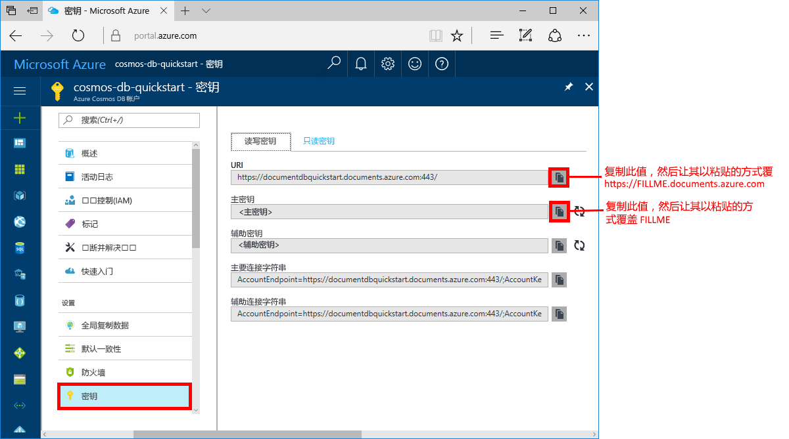

# <a name="azure-cosmos-db-create-a-document-database-using-java-and-the-azure-portal"></a>Azure Cosmos DB：使用 Java 和 Azure 门户创建文档数据库

Azure Cosmos DB 是 Microsoft 提供的全球分布式多模型数据库服务。 使用 Azure Cosmos DB，可以快速创建和查询托管的文档、表和图形数据库。

本快速入门通过适用于 Azure Cosmos DB [SQL API](sql-api-introduction.md) 的 Azure 门户工具创建文档数据库。 本快速入门还介绍了如何使用 [SQL Java API](sql-api-sdk-java.md) 快速创建 Java 控制台应用。 本快速入门中的说明适用于任何能够运行 Java 的操作系统。 通过完成本快速入门，可以熟悉如何通过 UI 或编程方式（以首选方式为准）创建和修改文档数据库资源。

## <a name="prerequisites"></a>先决条件

[!INCLUDE [quickstarts-free-trial-note](../../includes/quickstarts-free-trial-note.md)] 
[!INCLUDE [cosmos-db-emulator-docdb-api](../../includes/cosmos-db-emulator-docdb-api.md)]

此外： 

* [Java 开发工具包 (JDK) 1.7+](http://www.oracle.com/technetwork/java/javase/downloads/jdk8-downloads-2133151.html)
    * 在 Ubuntu 上运行 `apt-get install default-jdk`，以便安装 JDK。
    * 请确保设置 JAVA_HOME 环境变量，使之指向在其中安装了 JDK 的文件夹。
* [下载](http://maven.apache.org/download.cgi)和[安装](http://maven.apache.org/install.html) [Maven](http://maven.apache.org/) 二进制存档
    * 在 Ubuntu 上，可以通过运行 `apt-get install maven` 来安装 Maven。
* [Git](https://www.git-scm.com/)
    * 在 Ubuntu 上，可以通过运行 `sudo apt-get install git` 来安装 Git。

## <a name="create-a-database-account"></a>创建数据库帐户

在创建文档数据库之前，需通过 Azure Cosmos DB 创建 SQL API 帐户。

[!INCLUDE [cosmos-db-create-dbaccount](../../includes/cosmos-db-create-dbaccount.md)]

## <a name="add-a-collection"></a>添加集合

[!INCLUDE [cosmos-db-create-collection](../../includes/cosmos-db-create-collection.md)]

<a id="add-sample-data"></a>
## <a name="add-sample-data"></a>添加示例数据

[!INCLUDE [cosmos-db-create-sql-api-add-sample-data](../../includes/cosmos-db-create-sql-api-add-sample-data.md)]

## <a name="query-your-data"></a>查询数据

[!INCLUDE [cosmos-db-create-sql-api-query-data](../../includes/cosmos-db-create-sql-api-query-data.md)]

## <a name="clone-the-sample-application"></a>克隆示例应用程序

现在，让我们转到如何使用代码上来。 接下来，克隆 GitHub 中的 SQL API 应用程序，设置连接字符串，并运行应用程序。 会看到以编程方式处理数据是多么容易。 

1. 打开命令提示符，新建一个名为“git-samples”的文件夹，然后关闭命令提示符。

    ```bash
    md "C:\git-samples"
    ```

2. 打开诸如 git bash 之类的 git 终端窗口，并使用 `cd` 命令更改为要安装示例应用的新文件夹。 

    ```bash
    cd "C:\git-samples"
    ```

3. 运行下列命令以克隆示例存储库。 此命令在计算机上创建示例应用程序的副本。

    ```bash
    git clone https://github.com/Azure-Samples/azure-cosmos-db-documentdb-java-getting-started.git
    ```

## <a name="review-the-code"></a>查看代码

此步骤是可选的。 如果有意了解如何使用代码创建数据库资源，可以查看以下代码片段。 否则，可以直接跳转到[更新连接字符串](#update-your-connection-string)。 

以代码片段全部摘自 C:\git-samples\azure-cosmos-db-documentdb-java-getting-started\src\GetStarted\Program.java 文件。

* `DocumentClient` 初始化。 [DocumentClient](https://docs.microsoft.com/java/api/com.microsoft.azure.documentdb._document_client) 为 Azure Cosmos DB 数据库服务提供客户端逻辑表示。 此客户端用于对服务配置和执行请求。 本快速入门稍后将会更新此代码的 `FILLME` 部分。

    ```java
    this.client = new DocumentClient("https://FILLME.documents.azure.com",
            "FILLME", 
            new ConnectionPolicy(),
            ConsistencyLevel.Session);
    ```

* [Database](https://docs.microsoft.com/java/api/com.microsoft.azure.documentdb._database) 创建。

    ```java
    Database database = new Database();
    database.setId(databaseName);
    
    this.client.createDatabase(database, null);
    ```

* [DocumentCollection](https://docs.microsoft.com/java/api/com.microsoft.azure.documentdb._document_collection) 创建。

    ```java
    DocumentCollection collectionInfo = new DocumentCollection();
    collectionInfo.setId(collectionName);

    ...

    this.client.createCollection(databaseLink, collectionInfo, requestOptions);
    ```

* 使用 [createDocument](https://docs.microsoft.com/java/api/com.microsoft.azure.documentdb._document_client.createdocument) 方法创建文档。

    ```java
    // Any Java object within your code can be serialized into JSON and written to Azure Cosmos DB
    Family andersenFamily = new Family();
    andersenFamily.setId("Andersen.1");
    andersenFamily.setLastName("Andersen");
    // More properties

    String collectionLink = String.format("/dbs/%s/colls/%s", databaseName, collectionName);
    this.client.createDocument(collectionLink, family, new RequestOptions(), true);
    ```

* 使用 [queryDocuments](https://docs.microsoft.com/java/api/com.microsoft.azure.documentdb._document_client.querydocuments) 方法，对 JSON 执行 SQL 查询。

    ```java
    FeedOptions queryOptions = new FeedOptions();
    queryOptions.setPageSize(-1);
    queryOptions.setEnableCrossPartitionQuery(true);

    String collectionLink = String.format("/dbs/%s/colls/%s", databaseName, collectionName);
    FeedResponse<Document> queryResults = this.client.queryDocuments(
        collectionLink,
        "SELECT * FROM Family WHERE Family.lastName = 'Andersen'", queryOptions);

    System.out.println("Running SQL query...");
    for (Document family : queryResults.getQueryIterable()) {
        System.out.println(String.format("\tRead %s", family));
    }
    ```    

## <a name="update-your-connection-string"></a>更新连接字符串

现在返回到 Azure 门户，获取连接字符串信息，并将其复制到应用。 这样，应用程序就可以与托管的数据库进行通信。

1. 在 [Azure 门户](http://portal.azure.com/)中，单击“密钥”。 

    使用屏幕右侧的“复制”按钮，复制最上面的 URI 值。

    

2. 打开 C:\git-samples\azure-cosmos-db-documentdb-java-getting-started\src\GetStarted 文件夹中的 `Program.java` 文件。 

3. 将门户中的 URI 值粘贴到第 45 行上的 `https://FILLME.documents.azure.com`。

4. 返回到门户，并复制主密钥值，如屏幕截图所示。 将门户中的主密钥值粘贴到第 46 行上的 `FILLME`。

    现在，getStartedDemo 方法应如下所示： 
    
    ```java
    private void getStartedDemo() throws DocumentClientException, IOException {
        this.client = new DocumentClient("https://youraccountname.documents.azure.com:443/",
                "your-primary-key...RJhQrqQ5QQ==", 
                new ConnectionPolicy(),
                ConsistencyLevel.Session);
    ```

5. 保存 Program.java 文件。

## <a name="run-the-app"></a>运行应用

1. 在 git 终端窗口中，通过 `cd` 命令转到 azure-cosmos-db-documentdb-java-getting-started 文件夹。

    ```git
    cd "C:\git-samples\azure-cosmos-db-documentdb-java-getting-started"
    ```

2. 在 git 终端窗口中，使用以下命令安装所需的 Java 包。

    ```
    mvn package
    ```

3. 在 git 终端窗口中，使用以下命令启动 Java 应用程序。

    ```
    mvn exec:java -D exec.mainClass=GetStarted.Program
    ```

    此时，终端窗口显示通知，提示 FamilyDB 数据库已创建。 
    
4. 按下某个键创建数据库，然后按下另一个键创建集合。 

    程序结束时会删除所有资源。在浏览器中切换回到数据资源管理器，可以看到，帐户中现在包含 FamilyDB 数据库和 FamilyCollection 集合。

5. 切换到控制台窗口，按下某个键创建第一个文档，再按下另一个键创建第二个文档。 然后切换回到数据资源管理器以查看这些资源。 

6. 按下某个键运行查询，并在控制台窗口中查看输出。 

7. 按下下一个键会删除资源。 如果想要保留资源，可以在控制台窗口中按 CTRL+C 结束程序。 否则，请按任意键从帐户中删除资源，以免产生费用。 

    


## <a name="review-slas-in-the-azure-portal"></a>在 Azure 门户中查看 SLA

[!INCLUDE [cosmosdb-tutorial-review-slas](../../includes/cosmos-db-tutorial-review-slas.md)]

## <a name="clean-up-resources"></a>清理资源

[!INCLUDE [cosmosdb-delete-resource-group](../../includes/cosmos-db-delete-resource-group.md)]

## <a name="next-steps"></a>后续步骤

本快速入门介绍了如何使用数据资源管理器创建 Azure Cosmos DB 帐户、文档数据库和集合，以及如何通过运行应用以编程方式执行同一操作。 现在可以将其他数据导入 Azure Cosmos DB 集合。 

> [!div class="nextstepaction"]
> [将数据导入 Azure Cosmos DB](import-data.md)


