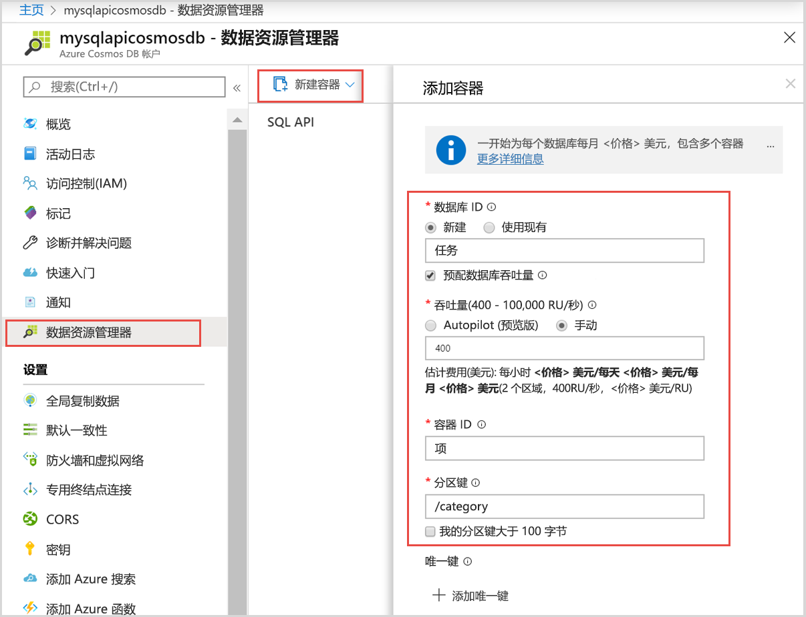
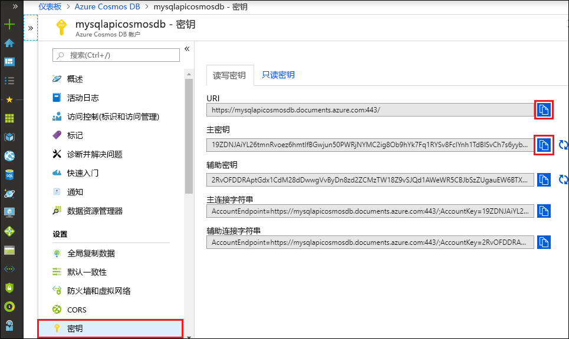

# <a name="quickstart-use-nodejs-to-connect-and-query-data-from-azure-cosmos-db-sql-api-account"></a>快速入门：使用 Node.js 连接和查询 Azure Cosmos DB SQL API 帐户中的数据

> [!div class="op_single_selector"]
> - [.NET V3](create-sql-api-dotnet.md)
> - [.NET V4](create-sql-api-dotnet-V4.md)
> - [Java SDK v4](create-sql-api-java.md)
> - [Node.js](create-sql-api-nodejs.md)
> - [Python](create-sql-api-python.md)
> - [Xamarin](create-sql-api-xamarin-dotnet.md)

在本快速入门中，你将通过 Azure 门户并使用从 GitHub 克隆的 Node.js 应用来创建和管理 Azure Cosmos DB SQL API 帐户。 Azure Cosmos DB 是一种多模型数据库服务，你可以借助其全球分布和水平缩放功能快速创建和查询文档、表、键/值和图数据库。

## <a name="walkthrough-video"></a>演练视频

观看此视频，了解本文中内容的完整演练。

> [!VIDEO https://channel9.msdn.com/Shows/Docs-Azure/Quickstart-Use-Nodejs-to-connect-and-query-data-from-Azure-Cosmos-DB-SQL-API-account/player]

## <a name="prerequisites"></a>先决条件

- 具有活动订阅的 Azure 帐户。 [免费创建一个](https://azure.microsoft.com/free/?ref=microsoft.com&utm_source=microsoft.com&utm_medium=docs&utm_campaign=visualstudio)。 或者[免费试用 Azure Cosmos DB](https://azure.microsoft.com/try/cosmosdb/) 而无需 Azure 订阅。 你还可以使用 [Azure Cosmos DB 模拟器](https://aka.ms/cosmosdb-emulator)以及 URI `https://localhost:8081` 和密钥 `C2y6yDjf5/R+ob0N8A7Cgv30VRDJIWEHLM+4QDU5DE2nQ9nDuVTqobD4b8mGGyPMbIZnqyMsEcaGQy67XIw/Jw==`。
- [Node.js 6.0.0+](https://nodejs.org/)。
- [Git](https://www.git-scm.com/downloads)。

## <a name="create-an-azure-cosmos-account"></a>创建 Azure Cosmos 帐户

在本快速入门中，可以使用[免费试用 Azure Cosmos DB](https://azure.microsoft.com/try/cosmosdb/) 选项创建 Azure Cosmos 帐户。

1. 导航到[免费试用 Azure Cosmos DB](https://azure.microsoft.com/try/cosmosdb/) 页。

1. 选择 **SQL** API 帐户，然后选择“创建”。 使用 Microsoft 帐户登录。

1. 登录成功后，应该就可以使用 Azure Cosmos 帐户。 选择“在 Azure 门户中打开”，打开新创建的帐户。

“免费试用 Azure Cosmos DB”选项不需要 Azure 订阅，它为你提供了有效期为 30 天的 Azure Cosmos 帐户。 若要延长 Azure Cosmos 帐户的使用时间，应改为在 Azure 订阅中[创建帐户](create-cosmosdb-resources-portal.md#create-an-azure-cosmos-db-account)。

## <a name="add-a-container"></a>添加容器

现在可以在 Azure 门户中使用数据资源管理器工具来创建数据库和容器。

1. 选择“数据资源管理器” > “新建容器”。 

   “添加容器”区域显示在最右侧，可能需要向右滚动才能看到它。

   

2. 在“添加容器”页中，输入新容器的设置。

   | 设置           | 建议的值 | 说明                                                                                                                                                                                                                                                                                                                                                                           |
   | ----------------- | --------------- | ------------------------------------------------------------------------------------------------------------------------------------------------------------------------------------------------------------------------------------------------------------------------------------------------------------------------------------------------------------------------------------- |
   | **数据库 ID**   | 任务           | 输入 _Tasks_ 作为新数据库的名称。 数据库名称必须包含 1 到 255 个字符，不能包含 `/, \\, #, ?` 或尾随空格。 选中“预配数据库吞吐量”选项，这样就可以在数据库中的所有容器之间共享预配给该数据库的吞吐量。 此选项还有助于节省成本。 |
   | **吞吐量**    | 400             | 将吞吐量保留为每秒 400 个请求单位 (RU/s)。 如果想要减少延迟，以后可以增加吞吐量。                                                                                                                                                                                                                                                    |
   | **容器 ID**  | Items           | 输入 _Items_ 作为新容器的名称。 容器 ID 与数据库名称的字符要求相同。                                                                                                                                                                                                                                                               |
   | **分区键** | /category       | 本文中所述的示例使用 /category 作为分区键。                                                                                                                                                                                                                                                                                                           |

   除了前面的设置，还可以选择为容器添加“唯一键”。 在此示例中，请将此字段留空。 开发人员可以使用唯一键向数据库添加一层数据完整性。 创建容器时，通过创建唯一键策略，可确保每个分区键的一个或多个值的唯一性。 若要了解详细信息，请参阅 [Azure Cosmos DB 中的唯一键](unique-keys.md)一文。

   选择“确定”。 数据资源管理器将显示新的数据库和容器。

## <a name="add-sample-data"></a>添加示例数据

[!INCLUDE [cosmos-db-create-sql-api-add-sample-data](../../includes/cosmos-db-create-sql-api-add-sample-data.md)]

## <a name="query-your-data"></a>查询数据

[!INCLUDE [cosmos-db-create-sql-api-query-data](../../includes/cosmos-db-create-sql-api-query-data.md)]

## <a name="clone-the-sample-application"></a>克隆示例应用程序

现在让我们从 GitHub 克隆 Node.js 应用，设置连接字符串并运行。

1. 运行下列命令以克隆示例存储库。 此命令在计算机上创建示例应用程序的副本。

   ```bash
   git clone https://github.com/Azure-Samples/azure-cosmos-db-sql-api-nodejs-getting-started.git
   ```

## <a name="review-the-code"></a>查看代码

此步骤是可选的。 如果有意了解如何使用代码创建 Azure Cosmos 数据库资源，可以查看以下代码片段。 否则，可以直接跳转到[更新连接字符串](#update-your-connection-string)。

如果你熟悉旧版 SQL JavaScript SDK，则可能习惯于看到术语“集合”和“文档”。  由于 Azure Cosmos DB 支持[多 API 模型](introduction.md)，因此 [2.0+ 版的 JavaScript SDK](https://www.npmjs.com/package/@azure/cosmos) 使用通用术语“容器”（可能为集合、图形或表），并使用“项”来描述容器的内容。

Cosmos DB JavaScript SDK 称为“@azure/cosmos”，可以从 npm 安装...

```bash
npm install @azure/cosmos
```

以下代码片段全部摘自 _app.js_ 文件。

- `CosmosClient` 从 `@azure/cosmos` npm 包导入。

  ```javascript
  const CosmosClient = require("@azure/cosmos").CosmosClient;
  ```

- 新的 `CosmosClient` 对象已初始化。

  ```javascript
  const client = new CosmosClient({ endpoint, key });
  ```

- 选择“Tasks”数据库。

  ```javascript
  const database = client.database(databaseId);
  ```

- 选择“Items”容器/集合。

  ```javascript
  const container = database.container(containerId);
  ```

- 选择“Items”容器中的所有项目。

  ```javascript
  // query to return all items
  const querySpec = {
    query: "SELECT * from c"
  };

  const { resources: items } = await container.items
    .query(querySpec)
    .fetchAll();
  ```

- 创建新项

  ```javascript
  const { resource: createdItem } = await container.items.create(newItem);
  ```

- 更新项

  ```javascript
  const { id, category } = createdItem;

  createdItem.isComplete = true;
  const { resource: updatedItem } = await container
    .item(id, category)
    .replace(createdItem);
  ```

- 删除项

  ```javascript
  const { resource: result } = await container.item(id, category).delete();
  ```

> [!NOTE]
> 在“update”和“delete”方法中，必须通过调用 `container.item()` 从数据库中选择项。 传入的两个参数是项的 ID 和项的分区键。 在这种情况下，分区键是“category”字段的值。

## <a name="update-your-connection-string"></a>更新连接字符串

现在，返回 Azure 门户，获取 Azure Cosmos 帐户的连接字符串详细信息。 将连接字符串复制到应用，以便其连接数据库。

1. 在 [Azure 门户](https://portal.azure.com/)中，在你的 Azure Cosmos DB 帐户中，从左侧导航栏中选择“密钥”，然后选择“读写密钥”。 在下一步中，使用屏幕右侧的复制按钮将 URI 和主密钥复制到 _app.js_ 文件中。

   

2. 打开 _config.js_ 文件。

3. 从门户中复制 URI 值（使用复制按钮），并在 _config.js_ 中将其设为终结点密钥的值。

   `endpoint: "<Your Azure Cosmos account URI>"`

4. 然后从门户复制“主密钥”的值，并在 _config.js_ 中将其设为 `config.key` 的值。 现已使用与 Azure Cosmos DB 进行通信所需的所有信息更新应用。

   `key: "<Your Azure Cosmos account key>"`

## <a name="run-the-app"></a>运行应用

1. 在终端中运行 `npm install`，安装“@azure/cosmos”npm 包

2. 在终端中运行 `node app.js`，启动 node 应用程序。

3. 之前在本快速入门中创建的两个项已列出。新项已创建。 该项上的“isComplete”标志更新为“true”，最后该项被删除。

可以继续试用此示例应用程序，也可以返回到数据资源管理器来修改和处理数据。

## <a name="review-slas-in-the-azure-portal"></a>在 Azure 门户中查看 SLA

[!INCLUDE [cosmosdb-tutorial-review-slas](../../includes/cosmos-db-tutorial-review-slas.md)]

## <a name="next-steps"></a>后续步骤

在本快速入门中，你已了解了如何创建 Azure Cosmos DB 帐户、如何使用数据资源管理器创建容器，以及如何运行 Node.js 应用。 现在可以将其他数据导入 Azure Cosmos DB 帐户了。

> [!div class="nextstepaction"]
> [将数据导入 Azure Cosmos DB](import-data.md)
