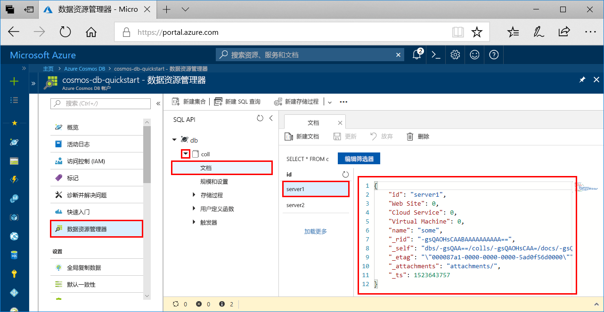

# <a name="azure-cosmos-db-build-a-sql-api-app-with-python-and-the-azure-portal"></a>Azure Cosmos DB：使用 Python 和 Azure 门户生成 SQL API 应用

Azure Cosmos DB 是 Microsoft 提供的全球分布式多模型数据库服务。 可快速创建和查询文档、键/值和图形数据库，所有这些都受益于 Azure Cosmos DB 核心的全球分布和水平缩放功能。 

本快速入门教程演示如何使用 Azure 门户创建 Azure Cosmos DB [SQL API](sql-api-introduction.md) 帐户、文档数据库和集合。 然后会生成并运行基于 [SQL Python API](sql-api-sdk-python.md) 构建的控制台应用。

[!INCLUDE [quickstarts-free-trial-note](../../includes/quickstarts-free-trial-note.md)] [!INCLUDE [cosmos-db-emulator-docdb-api](../../includes/cosmos-db-emulator-docdb-api.md)]

## <a name="prerequisites"></a>先决条件

* [Python 3.6](https://www.python.org/downloads/)，并且已将 \<install location\>\Python36 和 \<install location>\Python36\Scripts 添加到 PATH。 
* [Visual Studio Code](https://code.visualstudio.com/)
* [适用于 Visual Studio Code 的 Python 扩展](https://marketplace.visualstudio.com/items?itemName=ms-python.python#overview)

## <a name="create-a-database-account"></a>创建数据库帐户

[!INCLUDE [cosmos-db-create-dbaccount](../../includes/cosmos-db-create-dbaccount.md)]

## <a name="add-a-collection"></a>添加集合

[!INCLUDE [cosmos-db-create-collection](../../includes/cosmos-db-create-collection.md)]

## <a name="add-sample-data"></a>添加示例数据

[!INCLUDE [cosmos-db-create-sql-api-add-sample-data](../../includes/cosmos-db-create-sql-api-add-sample-data.md)]

## <a name="query-your-data"></a>查询数据

[!INCLUDE [cosmos-db-create-sql-api-query-data](../../includes/cosmos-db-create-sql-api-query-data.md)]

## <a name="clone-the-sample-application"></a>克隆示例应用程序

现在，请克隆 GitHub 中的 SQL API 应用，设置连接字符串，并运行该应用。 会看到以编程方式处理数据是多么容易。 

1. 打开命令提示符，新建一个名为“git-samples”的文件夹，然后关闭命令提示符。

    ```bash
    md "C:\git-samples"
    ```

2. 打开诸如 git bash 之类的 git 终端窗口，并使用 `cd` 命令更改为要安装示例应用的新文件夹。

    ```bash
    cd "C:\git-samples"
    ```

3. 运行下列命令以克隆示例存储库。 此命令在计算机上创建示例应用程序的副本。 

    ```bash
    git clone https://github.com/Azure-Samples/azure-cosmos-db-documentdb-python-getting-started.git
    ```  
    
## <a name="review-the-code"></a>查看代码

此步骤是可选的。 如果有意了解如何使用代码创建数据库资源，可以查看以下代码片段。 否则，可以直接跳转到[更新连接字符串](#update-your-connection-string)。 

以下代码片段全部摘自 DocumentDBGetStarted.py 文件。

* 将对 DocumentClient 进行初始化。

    ```python
    # Initialize the Python client
    client = document_client.DocumentClient(config['ENDPOINT'], {'masterKey': config['MASTERKEY']})
    ```

* 将创建一个新数据库。

    ```python
    # Create a database
    db = client.CreateDatabase({ 'id': config['SQL_DATABASE'] })
    ```

* 将创建一个新集合。

    ```python
    # Create collection options
    options = {
        'offerEnableRUPerMinuteThroughput': True,
        'offerVersion': "V2",
        'offerThroughput': 400
    }

    # Create a collection
    collection = client.CreateCollection(db['_self'], { 'id': config['SQL_COLLECTION'] }, options)
    ```

* 将创建一些文档。

    ```python
    # Create some documents
    document1 = client.CreateDocument(collection['_self'],
        { 
            'id': 'server1',
            'Web Site': 0,
            'Cloud Service': 0,
            'Virtual Machine': 0,
            'name': 'some' 
        })
    ```

* 将使用 SQL 执行查询

    ```python
    # Query them in SQL
    query = { 'query': 'SELECT * FROM server s' }    
            
    options = {} 
    options['enableCrossPartitionQuery'] = True
    options['maxItemCount'] = 2

    result_iterable = client.QueryDocuments(collection['_self'], query, options)
    results = list(result_iterable);

    print(results)
    ```

## <a name="update-your-connection-string"></a>更新连接字符串

现在返回到 Azure 门户，获取连接字符串信息，并将其复制到应用。

1. 在 [Azure 门户](http://portal.azure.com/)中，在你的 Azure Cosmos DB 帐户中，单击左侧导航栏中的“密钥”。 使用屏幕右侧的复制按钮将 **URI** 和**主密钥**复制到下一步的 DocumentDBGetStarted.py 文件中。

    

2. 在 Visual Studio Code 中打开 C:\git-samples\azure-cosmos-db-documentdb-python-getting-startedDocumentDBGetStarted.py 文件。 

3. 从门户中复制 **URI** 值（使用复制按钮），并在 DocumentDBGetStarted.py 中使其成为终结点密钥的值。 

    `'ENDPOINT': 'https://FILLME.documents.azure.com',`

4. 然后从门户复制“主密钥”值，并在 DocumentDBGetStarted.py 中使其成为 **config.MASTERKEY** 的值。 现已使用与 Azure Cosmos DB 进行通信所需的所有信息更新应用。 

    `'MASTERKEY': 'FILLME',`

5. 保存 DocumentDBGetStarted.py 文件。
    
## <a name="run-the-app"></a>运行应用

1. 在 Visual Studio Code 中，选择“视图”>“命令面板”。 

2. 在提示符下，输入 **Python: Select Interpreter** 并选择要使用的 Python 的版本。

    Visual Studio Code 中的页脚将更新以指示所选的解释器。 

3. 选择“视图” > “集成终端”以打开 Visual Studio Code 集成终端。

4. 在集成的终端窗口中，确保位于 azure-cosmos-db-documentdb-python-getting-started 文件夹中。 如果没有位于该文件夹中，请运行以下命令来切换到示例文件夹。 

    ```
    cd "C:\git-samples\azure-cosmos-db-documentdb-python-getting-started"`
    ```

5. 运行以下命令来安装 pydocumentdb 包。 

    ```
    pip3 install pydocumentdb
    ```

    如果尝试安装 pydocumentdb 时收到有关访问被拒绝的错误，则需要[以管理员身份运行 VS Code](https://stackoverflow.com/questions/37700536/visual-studio-code-terminal-how-to-run-a-command-with-administrator-rights)。

6. 运行以下命令来运行示例并将新文档存储在 Azure Cosmos dB 中。

    ```
    python DocumentDBGetStarted.py
    ```

7. 若要确认是否已创建并保存了新文档，请在 Azure 门户中选择“数据资源管理器”，展开“列”，展开“文档”，然后选择 **server1** 文档。 server1 文档内容与在集成的终端窗口中返回的内容相匹配。 

    

## <a name="review-slas-in-the-azure-portal"></a>在 Azure 门户中查看 SLA

[!INCLUDE [cosmosdb-tutorial-review-slas](../../includes/cosmos-db-tutorial-review-slas.md)]

## <a name="clean-up-resources"></a>清理资源

[!INCLUDE [cosmosdb-delete-resource-group](../../includes/cosmos-db-delete-resource-group.md)]

## <a name="next-steps"></a>后续步骤

在本快速入门教程中，已了解如何创建 Azure Cosmos DB 帐户、使用数据资源管理器创建集合和运行应用。 现在可以将其他数据导入 Cosmos DB 帐户。 

> [!div class="nextstepaction"]
> [将 SQL API 的数据导入 Azure Cosmos DB](import-data.md)


