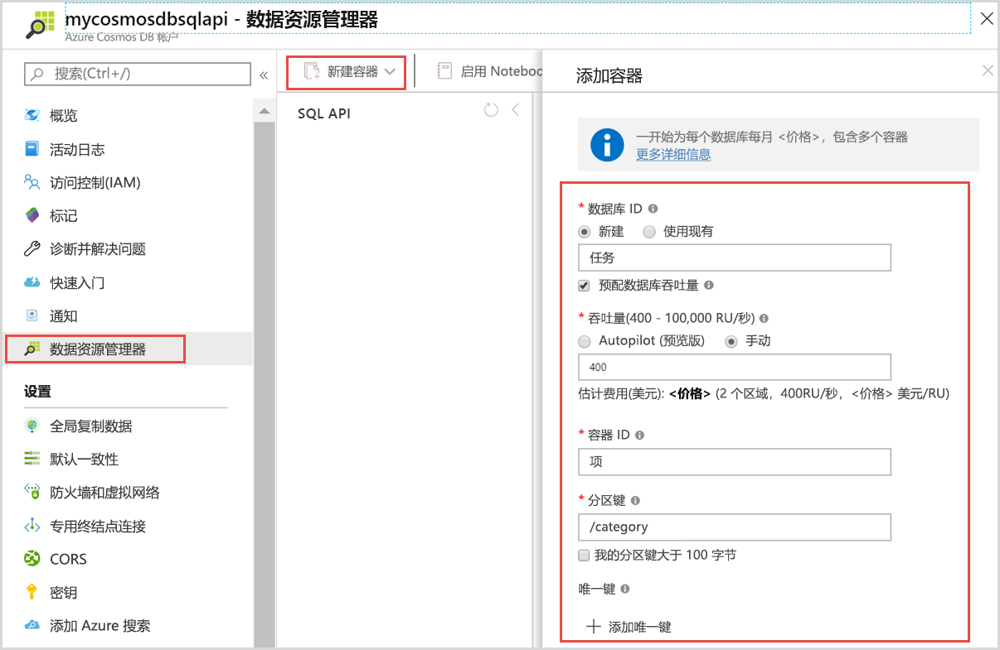
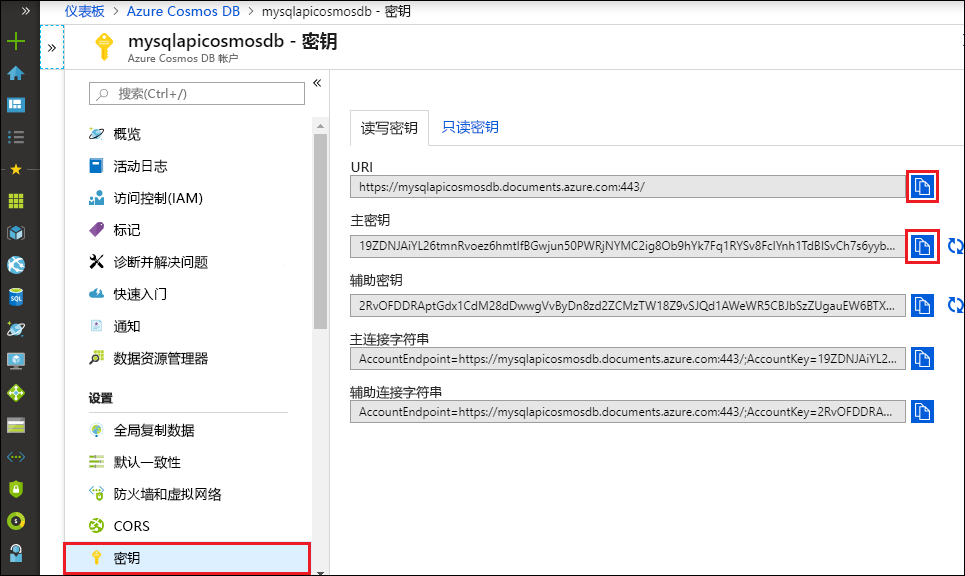

# <a name="quickstart-build-a-python-application-using-an-azure-cosmos-db-sql-api-account"></a>快速入门：使用 Azure Cosmos DB SQL API 帐户生成 Python 应用程序

> [!div class="op_single_selector"]
> * [.NET V3](create-sql-api-dotnet.md)
> * [.NET V4](create-sql-api-dotnet-V4.md)
> * [Java SDK v4](create-sql-api-java.md)
> * [Node.js](create-sql-api-nodejs.md)
> * [Python](create-sql-api-python.md)
> * [Xamarin](create-sql-api-xamarin-dotnet.md)

在本快速入门中，你将通过 Azure 门户创建和管理 Azure Cosmos DB SQL API 帐户，并通过 Visual Studio Code 使用从 GitHub 克隆的 Python 应用来添加数据。 Azure Cosmos DB 是一种多模型数据库服务，它通过全局分布和水平缩放功能让你快速创建和查询文档、表、键/值和图形数据库。

## <a name="prerequisites"></a>先决条件

- 具有活动订阅的 Azure 帐户。 [免费创建一个](https://azure.microsoft.com/free/?ref=microsoft.com&utm_source=microsoft.com&utm_medium=docs&utm_campaign=visualstudio)。 或者[免费试用 Azure Cosmos DB](https://azure.microsoft.com/try/cosmosdb/) 而无需 Azure 订阅。 你还可以使用 [Azure Cosmos DB 模拟器](https://aka.ms/cosmosdb-emulator)以及 URI `https://localhost:8081` 和密钥 `C2y6yDjf5/R+ob0N8A7Cgv30VRDJIWEHLM+4QDU5DE2nQ9nDuVTqobD4b8mGGyPMbIZnqyMsEcaGQy67XIw/Jw==`。
- [Python 3.6+](https://www.python.org/downloads/)，以及 `PATH` 中的 `python` 可执行文件。
- [Visual Studio Code](https://code.visualstudio.com/)。
- [适用于 Visual Studio Code 的 Python 扩展](https://marketplace.visualstudio.com/items?itemName=ms-python.python#overview)。
- [Git](https://www.git-scm.com/downloads)。 

## <a name="create-a-database-account"></a>创建数据库帐户

[!INCLUDE [cosmos-db-create-dbaccount](../../includes/cosmos-db-create-dbaccount.md)]

## <a name="add-a-container"></a>添加容器

现在可以在 Azure 门户中使用数据资源管理器工具来创建数据库和容器。 

1. 选择“数据资源管理器” > “新建容器”。  
    
    “添加容器”区域显示在最右侧，可能需要向右滚动才能看到它。

    

2. 在“添加容器”页中，输入新容器的设置。

    |设置|建议的值|说明
    |---|---|---|
    |**数据库 ID**|任务|输入 *Tasks* 作为新数据库的名称。 数据库名称必须包含 1 到 255 个字符，不能包含 `/, \\, #, ?` 或尾随空格。 选中“预配数据库吞吐量”选项，这样就可以在数据库中的所有容器之间共享预配给该数据库的吞吐量。 此选项还有助于节省成本。 |
    |**吞吐量**|400|将吞吐量保留为每秒 400 个请求单位 (RU/s)。 如果想要减少延迟，以后可以增加吞吐量。| 
    |**容器 ID**|Items|输入 *Items* 作为新容器的名称。 容器 ID 与数据库名称的字符要求相同。|
    |**分区键**| /category| 本文中所述的示例使用 /category 作为分区键。|
    
    除了前面的设置，还可以选择为容器添加“唯一键”。 在此示例中，请将此字段留空。 开发人员可以使用唯一键向数据库添加一层数据完整性。 创建容器时，通过创建唯一键策略，可确保每个分区键的一个或多个值的唯一性。 若要了解详细信息，请参阅 [Azure Cosmos DB 中的唯一键](unique-keys.md)一文。
    
    选择“确定”。 数据资源管理器将显示新的数据库和容器。

## <a name="add-sample-data"></a>添加示例数据

[!INCLUDE [cosmos-db-create-sql-api-add-sample-data](../../includes/cosmos-db-create-sql-api-add-sample-data.md)]

## <a name="query-your-data"></a>查询数据

[!INCLUDE [cosmos-db-create-sql-api-query-data](../../includes/cosmos-db-create-sql-api-query-data.md)]

## <a name="clone-the-sample-application"></a>克隆示例应用程序

现在，让我们从 GitHub 中克隆一个 SQL API 应用，设置连接字符串，然后运行该应用。 本快速入门使用 [Python SDK](https://pypi.org/project/azure-cosmos/#history) 版本 4。

1. 打开命令提示符，新建一个名为“git-samples”的文件夹，然后关闭命令提示符。

    ```cmd
    md "git-samples"
    ```
   如果使用的是 bash 提示符，则应当改用以下命令：

   ```bash
   mkdir "git-samples"
   ```

2. 打开诸如 git bash 之类的 git 终端窗口，并使用 `cd` 命令更改为要安装示例应用的新文件夹。

    ```bash
    cd "git-samples"
    ```

3. 运行下列命令以克隆示例存储库。 此命令在计算机上创建示例应用程序的副本。 

    ```bash
    git clone https://github.com/Azure-Samples/azure-cosmos-db-python-getting-started.git
    ```  

## <a name="update-your-connection-string"></a>更新连接字符串

现在返回到 Azure 门户，获取连接字符串信息，并将其复制到应用。

1. 在 [Azure 门户](https://portal.azure.com/)中，在你的 Azure Cosmos DB 帐户中，选择左侧导航栏中的“密钥”。 使用屏幕右侧的复制按钮将 **URI** 和**主密钥**复制到下一步的 *cosmos_get_started.py* 文件中。

    

2. 在 Visual Studio Code 中，打开 *\git-samples\azure-cosmos-db-python-getting-started* 中的 *cosmos_get_started.py* 文件。

3. 从门户中复制你的 **URI** 值（使用复制按钮），并在 *cosmos_get_started.py* 中将其设为 **endpoint** 变量的值。 

    `endpoint = 'https://FILLME.documents.azure.com',`

4. 然后从门户复制“主密钥”值，并在 *cosmos_get_started.py* 中将其设为 **key** 的值。 现已使用与 Azure Cosmos DB 进行通信所需的所有信息更新应用。 

    `key = 'FILLME'`

5. 保存 *cosmos_get_started.py* 文件。

## <a name="review-the-code"></a>查看代码

此步骤是可选的。 了解在代码中创建的数据库资源，或者跳转到[更新连接字符串](#update-your-connection-string)。

以下代码片段全部摘自 *cosmos_get_started.py* 文件。

* 对 CosmosClient 进行初始化。 请务必根据[更新连接字符串](#update-your-connection-string)部分中所述更新“endpoint”和“key”值。 

    [!code-python[](~/azure-cosmos-db-python-getting-started/cosmos_get_started.py?name=create_cosmos_client)]

* 将创建一个新数据库。

    [!code-python[](~/azure-cosmos-db-python-getting-started/cosmos_get_started.py?name=create_database_if_not_exists)]

* 将创建一个[预配吞吐量](request-units.md)为 400 RU/秒的新容器。 选择 `lastName` 作为[分区键](partitioning-overview.md#choose-partitionkey)，这可以按属性进行筛选并执行有效的查询。 

    [!code-python[](~/azure-cosmos-db-python-getting-started/cosmos_get_started.py?name=create_container_if_not_exists)]

* 向容器中添加一些项。 容器是项（JSON 文档）的集合，这些项可以采用不同的架构。 帮助器方法 ```get_[name]_family_item``` 返回 Azure Cosmos DB 中作为 JSON 文档存储的家族表示形式。

    [!code-python[](~/azure-cosmos-db-python-getting-started/cosmos_get_started.py?name=create_item)]

* 使用 `read_item` 方法执行点读取（键值查找）。 我们将输出每个操作的 [RU 费用](request-units.md)。

    [!code-python[](~/azure-cosmos-db-python-getting-started/cosmos_get_started.py?name=read_item)]

* 使用 SQL 查询语法执行查询。 由于我们在 WHERE 子句中使用 ```lastName``` 的分区键值，因此 Azure Cosmos DB 会有效地将此查询路由到相关分区，从而提高性能。

    [!code-python[](~/azure-cosmos-db-python-getting-started/cosmos_get_started.py?name=query_items)]
   
## <a name="run-the-app"></a>运行应用

1. 在 Visual Studio Code 中，选择“视图” > “命令面板”。  

2. 在提示符处，输入 Python:Select Interpreter，然后选择要使用的 Python 的版本。

    Visual Studio Code 中的页脚将更新以指示所选的解释器。 

3. 选择“视图” > “集成终端”以打开 Visual Studio Code 集成终端。 

4. 在集成的终端窗口中，确保位于 *azure-cosmos-db-python-getting-started* 文件夹中。 如果没有位于该文件夹中，请运行以下命令来切换到示例文件夹。 

    ```cmd
    cd "\git-samples\azure-cosmos-db-python-getting-started"`
    ```

5. 运行以下命令来安装 azure-cosmos 程序包。 

    ```python
    pip install --pre azure-cosmos
    ```

    如果尝试安装 azure-cosmos 时收到有关访问被拒绝的错误，则需要[以管理员身份运行 VS Code](https://stackoverflow.com/questions/37700536/visual-studio-code-terminal-how-to-run-a-command-with-administrator-rights)。

6. 运行以下命令来运行示例并将新文档存储在 Azure Cosmos DB 中。

    ```python
    python cosmos_get_started.py
    ```

7. 若要确认是否已创建并保存新项，请在 Azure 门户中选择“数据资源管理器” > “AzureSampleFamilyDatabase” > “项”。   查看创建的项。 例如，下面是 Andersen 家族的示例 JSON 文档：
   
   ```json
   {
       "id": "Andersen-1569479288379",
       "lastName": "Andersen",
       "district": "WA5",
       "parents": [
           {
               "familyName": null,
               "firstName": "Thomas"
           },
           {
               "familyName": null,
               "firstName": "Mary Kay"
           }
       ],
       "children": null,
       "address": {
           "state": "WA",
           "county": "King",
           "city": "Seattle"
       },
       "registered": true,
       "_rid": "8K5qAIYtZXeBhB4AAAAAAA==",
       "_self": "dbs/8K5qAA==/colls/8K5qAIYtZXc=/docs/8K5qAIYtZXeBhB4AAAAAAA==/",
       "_etag": "\"a3004d78-0000-0800-0000-5d8c5a780000\"",
       "_attachments": "attachments/",
       "_ts": 1569479288
   }
   ```

## <a name="review-slas-in-the-azure-portal"></a>在 Azure 门户中查看 SLA

[!INCLUDE [cosmosdb-tutorial-review-slas](../../includes/cosmos-db-tutorial-review-slas.md)]

## <a name="clean-up-resources"></a>清理资源

[!INCLUDE [cosmosdb-delete-resource-group](../../includes/cosmos-db-delete-resource-group.md)]

## <a name="next-steps"></a>后续步骤

在本快速入门中，你已了解了如何创建 Azure Cosmos DB 帐户，使用数据资源管理器创建容器，以及在 Visual Studio Code 中运行 Python 应用。 现在可以将其他数据导入 Azure Cosmos DB 帐户了。 

> [!div class="nextstepaction"]
> [将 SQL API 的数据导入 Azure Cosmos DB](import-data.md)


