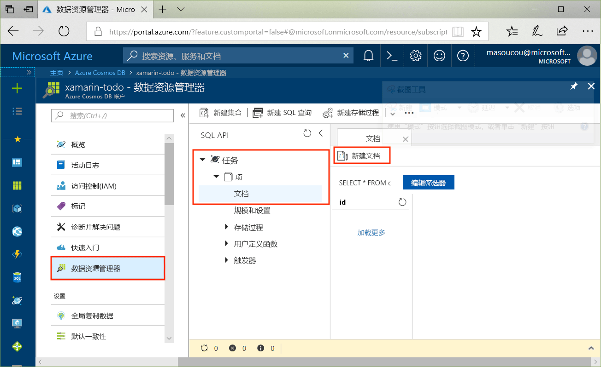
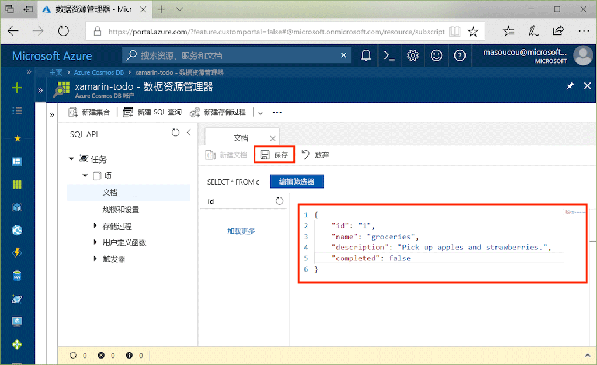

# <a name="azure-cosmos-db-build-a-todo-app-with-xamarin"></a>Azure Cosmos DB：使用 Xamarin 生成 ToDo 应用

Azure Cosmos DB 是 Microsoft 提供的全球分布式多模型数据库服务。 可快速创建和查询文档、键/值和图形数据库，所有这些都受益于 Azure Cosmos DB 核心的全球分布和水平缩放功能。

> [!NOTE]
> 在 GitHub 上的[此文档](https://github.com/xamarinhq/app-geocontacts)中，可以找到整个规范示例 Xamarin 应用的示例代码，其中展示了多个 Azure 产品，包括 CosmosDB。 此应用演示如何查看地理分散的联系人，并让这些联系人更新其位置。

本快速入门演示如何使用 Azure 门户创建 Azure Cosmos DB SQL API 帐户、文档数据库和集合， 然后演示如何使用 [Xamarin.Forms](https://docs.microsoft.com/xamarin/#pivot=platforms&panel=XamarinForms) 和 [MVVM 体系结构模式](https://docs.microsoft.com/xamarin/xamarin-forms/xaml/xaml-basics/data-bindings-to-mvvm)生成并部署一个基于 [SQL .NET API](sql-api-sdk-dotnet.md) 和 [Xamarin](https://docs.microsoft.com/xamarin/#pivot=platforms&panel=Cross-Platform) 的待办事项列表 Web 应用。


## <a name="prerequisites"></a>先决条件

如果是在 Windows 上进行开发，且尚未安装 Visual Studio 2017，可以下载并使用**免费的** [Visual Studio 2017 Community Edition](https://www.visualstudio.com/downloads/)。 在安装 Visual Studio 的过程中，请确保启用“Azure 开发”和“使用 .NET 进行移动开发”工作负荷。

如果使用 Mac，可以下载**免费的** [Visual Studio for Mac](https://www.visualstudio.com/vs/mac/)。

[!INCLUDE [quickstarts-free-trial-note](../../includes/quickstarts-free-trial-note.md)]
[!INCLUDE [cosmos-db-emulator-docdb-api](../../includes/cosmos-db-emulator-docdb-api.md)]

## <a name="create-a-database-account"></a>创建数据库帐户

[!INCLUDE [cosmos-db-create-dbaccount](../../includes/cosmos-db-create-dbaccount.md)]

## <a name="add-a-collection"></a>添加集合

[!INCLUDE [cosmos-db-create-collection](../../includes/cosmos-db-create-collection.md)]

## <a name="add-sample-data"></a>添加示例数据

现在可以使用数据资源管理器将数据添加到新集合。

1. 在数据资源管理器中，展开 **Tasks** 数据库，展开 **Items** 集合，单击“文档”，然后单击“新建文档”。

   

2. 现在，将文档添加到具有以下结构的集合。

     ```json
     {
         "id": "1",
         "name": "groceries",
         "description": "Pick up apples and strawberries.",
         "completed": false
     }
     ```

3. 将 json 添加到“文档”选项卡以后，即可单击“保存”。

    

4. 再创建并保存一个文档，在其中插入 `id` 属性的唯一值，并将其他属性更改为适当值。 新文档可以具有所需的任何结构，因为 Azure Cosmos DB 不对数据施加任何架构。

     现在可以在数据资源管理器中使用查询来检索数据。 默认情况下，数据资源管理器使用 `SELECT * FROM c` 来检索集合中的所有文档，但可以将其更改为其他 [SQL 查询](sql-api-sql-query.md)（例如 `SELECT * FROM c ORDER BY c._ts DESC`），根据时间戳按升序返回所有文档。

     还可以使用数据资源管理器创建存储过程、UDF 和触发器以执行服务器端业务逻辑和缩放吞吐量。 数据资源管理器公开 API 中提供的所有内置编程数据访问，但可以使用它轻松访问 Azure 门户中的数据。

## <a name="clone-the-sample-application"></a>克隆示例应用程序

现在请从 GitHub 克隆 Xamarin SQL API 应用，查看代码，获取 API 密钥，然后运行该应用。 会看到以编程方式处理数据是多么容易。

1. 打开 git 终端窗口（例如 git bash）并使用 `cd` 切换到工作目录。

2. 运行下列命令以克隆示例存储库。

    ```bash
    git clone https://github.com/Azure/azure-documentdb-dotnet.git
    ```

3. 然后，在 Visual Studio 中打开 samples/xamarin/ToDoItems 文件夹中的 ToDoItems.sln 文件。

## <a name="obtain-your-api-keys"></a>获取 API 密钥

返回到 Azure 门户，获取 API 密钥信息并将其复制到应用中。

1. 在 [Azure 门户](http://portal.azure.com/)的 Azure Cosmos DB SQL API 帐户的左侧导航栏中，单击“密钥”，然后单击“读写密钥”。 使用屏幕右侧的复制按钮将 URI 和主密钥复制到下一步的 APIKeys.cs 文件中。

    

2. 在 Visual Studio 2017 或 Visual Studio for Mac 中，打开 azure-documentdb-dotnet/samples/xamarin/ToDoItems/ToDoItems.Core/Helpers 文件夹中的 APIKeys.cs 文件。

3. 从门户中复制 URI 值（使用复制按钮），并在 APIKeys.cs 中将其设为 `CosmosEndpointUrl` 变量的值。

    `public static readonly string CosmosEndpointUrl = "{Azure Cosmos DB account URL}";`

4. 然后从门户复制“主密钥”的值，并在 APIKeys.cs 中将其设为 `Cosmos Auth Key` 的值。

    `public static readonly string CosmosAuthKey = "{Azure Cosmos DB secret}";`

## <a name="review-the-code"></a>查看代码

此解决方案演示如何使用 Azure Cosmos DB SQL API 和 Xamarin.Forms 创建 ToDo 应用。 此应用有两个选项卡，第一个选项卡包含一个列表视图，显示尚未完成的代办事项。 第二选项卡显示已完成的代办事项。 除了在第一个选项卡中查看未完成的待办事项，还可以添加新的待办事项、编辑现有的待办事项，以及将待办事项标记为已完成。


ToDoItems 解决方案中的代码包含：

* ToDoItems.Core：这是一个 .NET Standard 项目，其中包含一个 Xamarin.Forms 项目以及用于在 Azure Cosmos DB 中保留待办事项的共享应用程序逻辑代码。
* ToDoItems.Android：此项目包含 Android 应用。
* ToDoItems.iOS：此项目包含 iOS 应用。

现在，请快速查看应用如何与 Azure Cosmos DB 通信。

* 需将 [Microsoft.Azure.DocumentDb.Core](https://www.nuget.org/packages/Microsoft.Azure.DocumentDB.Core/) NuGet 包添加到所有项目。
* azure-documentdb-dotnet/samples/xamarin/ToDoItems/ToDoItems.Core/Models 文件夹中的 `ToDoItem` 类为上面创建的 **Items** 集合中的文档建模。 请注意，属性命名区分大小写。
* azure-documentdb-dotnet/samples/xamarin/ToDoItems/ToDoItems.Core/Services 文件夹中的 `CosmosDBService` 类将通信封装到 Azure Cosmos DB。
* `CosmosDBService` 类中有一个 `DocumentClient` 类型的变量。 `DocumentClient` 用于针对 Azure Cosmos DB 帐户配置和执行请求，在第 31 行实例化。

    ```csharp
    docClient = new DocumentClient(new Uri(APIKeys.CosmosEndpointUrl), APIKeys.CosmosAuthKey);
    ```

* 查询集合中的文档时，使用 `DocumentClient.CreateDocumentQuery<T>` 方法，如下面的 `CosmosDBService.GetToDoItems` 函数所示：

    ```csharp
    public async static Task<List<ToDoItem>> GetToDoItems()
    {
        var todos = new List<ToDoItem>();

        var todoQuery = docClient.CreateDocumentQuery<ToDoItem>(
                                UriFactory.CreateDocumentCollectionUri(databaseName, collectionName),
                                .Where(todo => todo.Completed == false)
                                .AsDocumentQuery();

        while (todoQuery.HasMoreResults)
        {
            var queryResults = await todoQuery.ExecuteNextAsync<ToDoItem>();

            todos.AddRange(queryResults);
        }

        return todos;
    }
    ```

    `CreateDocumentQuery<T>` 采用的 URI 指向在上一部分创建的集合。 还可以指定 LINQ 运算符，例如 `Where` 子句。 在这种情况下，仅返回尚未完成的待办事项。

    `CreateDocumentQuery<T>` 函数是同步执行的，返回 `IQueryable<T>`。 不过，`AsDocumentQuery` 方法可以将 `IQueryable<T>` 转换为 `IDocumentQuery<T>` 对象，后者可以异步执行。 因此，不会阻止移动应用程序的 UI 线程。

    `IDocumentQuery<T>.ExecuteNextAsync<T>` 函数从 Azure Cosmos DB 检索结果页，该 DB 会进行 `HasMoreResults` 检查，看是否还有其他需要返回的结果。

> [!TIP]
> 多个在 Azure Cosmos DB 集合和文档上运行的函数采用 URI 作为参数，以便指定集合或文档的地址。 此 URI 使用 `URIFactory` 类进行构造。 数据库、集合和文档的 URI 均可通过此类来创建。

* 第 107 行中的 `ComsmosDBService.InsertToDoItem` 函数演示如何插入新的文档：

    ```csharp
    public async static Task InsertToDoItem(ToDoItem item)
    {
        ...
        await docClient.CreateDocumentAsync(UriFactory.CreateDocumentCollectionUri(databaseName, collectionName), item);
        ...
    }
    ```

    指定了文档集合 URI 以及要插入的项。

* 第 124 行的 `CosmosDBService.UpdateToDoItem` 函数演示如何将现有的文档替换为新的文档：

    ```csharp
    public async static Task UpdateToDoItem(ToDoItem item)
    {
        ...
        var docUri = UriFactory.CreateDocumentUri(databaseName, collectionName, item.Id);

        await docClient.ReplaceDocumentAsync(docUri, item);
    }
    ```

    此处需要新的 URI 来唯一标识要替换的文档，而获得该 URI 的方法是先使用 `UriFactory.CreateDocumentUri`，然后向其传递数据库和集合的名称以及文档的 ID。

    `DocumentClient.ReplaceDocumentAsync` 将通过 URI 标识的文档替换为已指定为参数的文档。

* 第 115 行的 `CosmosDBService.DeleteToDoItem` 函数演示了如何删除某个项：

    ```csharp
    public async static Task DeleteToDoItem(ToDoItem item)
    {
        ...
        var docUri = UriFactory.CreateDocumentUri(databaseName, collectionName, item.Id);

        await docClient.DeleteDocumentAsync(docUri);
    }
    ```

    再次请注意这个在创建后传递给 `DocumentClient.DeleteDocumentAsync` 函数的唯一的文档 URI。

## <a name="run-the-app"></a>运行应用程序

现已使用与 Azure Cosmos DB 进行通信所需的所有信息更新应用。

以下步骤将演示如何使用 Visual Studio for Mac 调试器来运行应用。

> [!NOTE]
> Android 版应用的使用完全相同。如果有差异，则会在下面的步骤中指出。 如果希望在 Windows 上使用 Visual Studio 进行调试，可参阅[此处 (iOS)](https://docs.microsoft.com/xamarin/ios/deploy-test/debugging-in-xamarin-ios?tabs=vswin) 和[此处 (Android)](https://docs.microsoft.com/xamarin/android/deploy-test/debugging/) 的相关操作文档。

1. 首先选择要作为目标的平台，方法是：单击突出显示的下拉列表，然后选择适用于 iOS 的 ToDoItems.iOS 或适用于 Android 的 ToDoItems.Android。

    

2. 若要开始调试此应用，请按 cmd+Enter 或单击“开始”按钮。

    

3. 当 iOS 模拟器或 Android Emulator 启动完毕，此应用会在屏幕底部 (iOS) 或顶部 (Android) 显示 2 个选项卡。 第一个选项卡显示未完成的待办事项，第二个选项卡显示已完成的代办事项。

    

4. 若要在 iOS 上完成某个待办事项，请向左滑动，然后点击“完成”按钮。 若要在 Android 上完成某个待办事项，请长按该项，然后点击“完成”按钮。

    

5. 若要编辑某个待办事项，请点击该项，此时会出现一个新的屏幕，供你输入新值。 点击“保存”按钮会将所做的更改保存到 Azure Cosmos DB。

    

6. 若要添加待办事项，请点击主屏幕右上角的“添加”按钮，然后就会出现一个新的空白编辑页。

    

## <a name="review-slas-in-the-azure-portal"></a>在 Azure 门户中查看 SLA

[!INCLUDE [cosmosdb-tutorial-review-slas](../../includes/cosmos-db-tutorial-review-slas.md)]

## <a name="clean-up-resources"></a>清理资源

如果不打算继续使用此应用，请删除本快速入门教程在 Azure 门户中创建的所有资源，步骤如下：

1. 在 Azure 门户的左侧菜单中，单击“资源组”，并单击已创建资源的名称。
2. 在资源组页上单击“删除”，在文本框中键入要删除的资源的名称，并单击“删除”。

## <a name="next-steps"></a>后续步骤

本快速入门教程已介绍如何创建 Azure Cosmos DB 帐户、使用数据资源管理器创建集合，以及构建和部署控制台应用。 现在可以将其他数据导入 Azure Cosmos DB 帐户了。

> [!div class="nextstepaction"]
> [将数据导入 Azure Cosmos DB](import-data.md)
