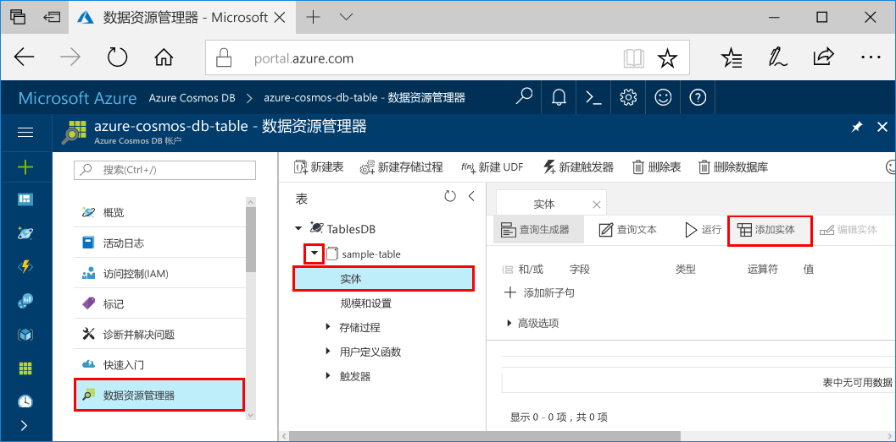
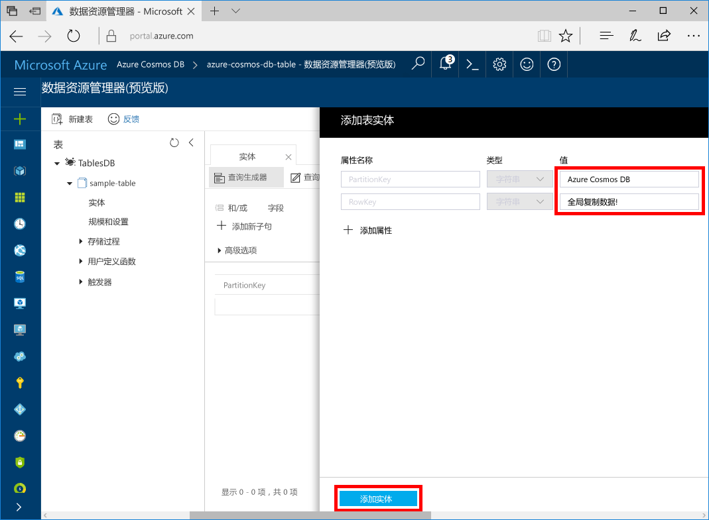
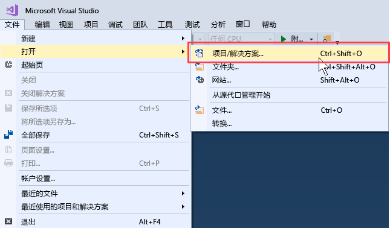
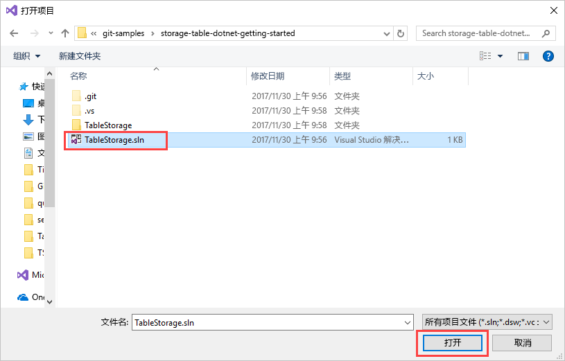
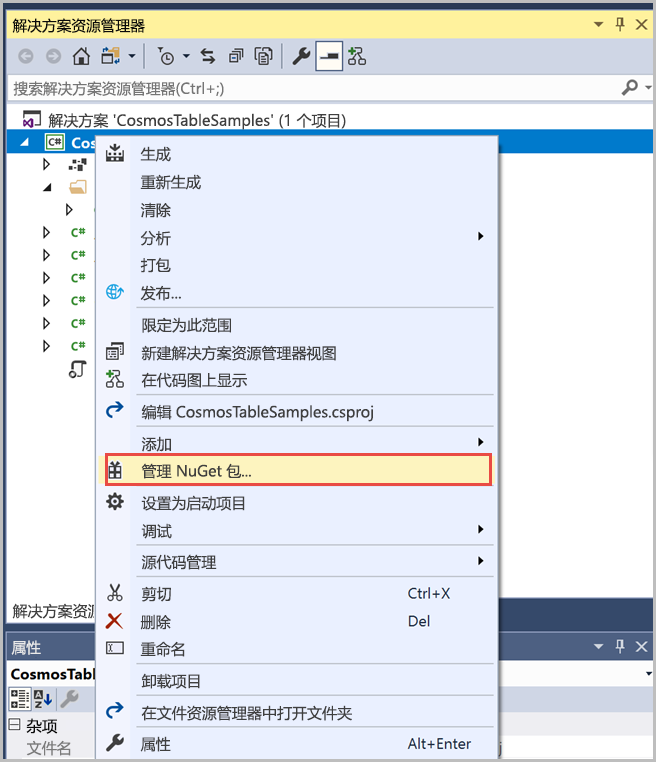
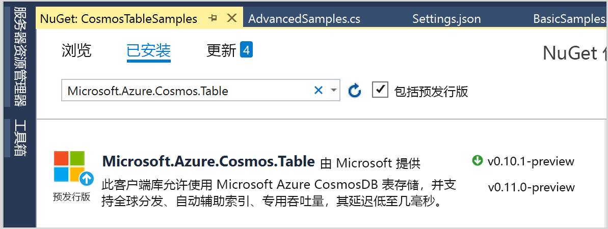
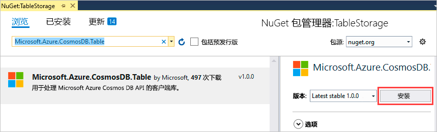
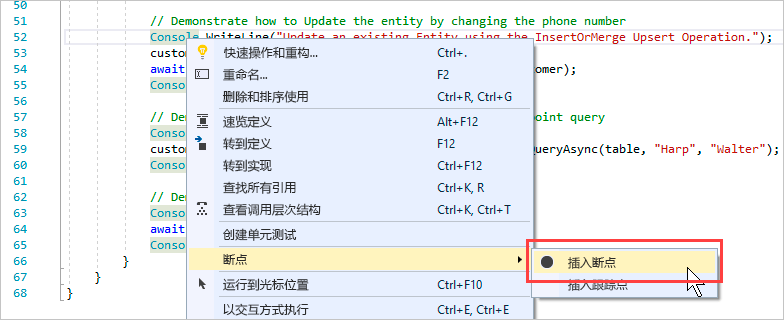
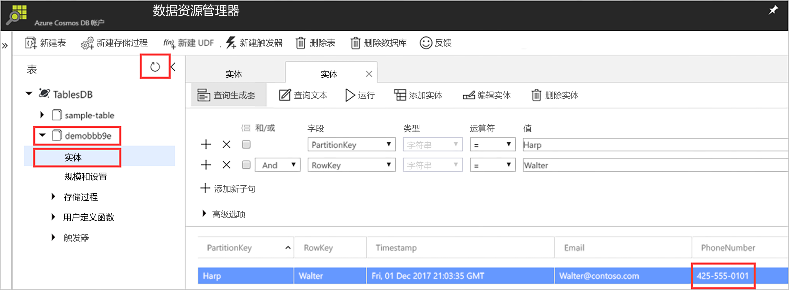

# <a name="quickstart-build-a-table-api-app-with-net-and-azure-cosmos-db"></a>快速入门：使用 .NET 和 Azure Cosmos DB 生成表 API 应用 

本快速入门介绍如何使用 .NET 和 Azure Cosmos DB [表 API](table-introduction.md)，通过克隆 GitHub 中的示例来生成应用。 此外，本快速入门还介绍了如何创建 Azure Cosmos DB 帐户，以及如何在基于 Web 的 Azure 门户中使用数据资源管理器创建表和实体。

Azure Cosmos DB 是 Microsoft 提供的全球分布式多模型数据库服务。 可快速创建和查询文档、键/值和图形数据库，所有这些都受益于 Azure Cosmos DB 核心的全球分布和水平缩放功能。 

## <a name="prerequisites"></a>先决条件

如果尚未安装 Visual Studio 2017，可以下载并使用**免费的** [Visual Studio 2017 Community Edition](https://www.visualstudio.com/downloads/)。 在安装 Visual Studio 的过程中，请确保启用“Azure 开发”。

[!INCLUDE [quickstarts-free-trial-note](../../includes/quickstarts-free-trial-note.md)]

## <a name="create-a-database-account"></a>创建数据库帐户

> [!IMPORTANT] 
> 必须新建表 API 帐户，才能使用正式发布的表 API SDK。 正式发布的 SDK 不支持在预览期间创建的表 API 帐户。
>

[!INCLUDE [cosmos-db-create-dbaccount-table](../../includes/cosmos-db-create-dbaccount-table.md)]

## <a name="add-a-table"></a>添加表

[!INCLUDE [cosmos-db-create-table](../../includes/cosmos-db-create-table.md)]

## <a name="add-sample-data"></a>添加示例数据

现在可以使用数据资源管理器将数据添加到新表。

1. 在数据资源管理器中，展开 **sample-table**，单击“实体”，然后单击“添加实体”。

   
2. 现在请将数据添加到 PartitionKey 值框和 RowKey 值框，然后单击“添加实体”。

   
  
    现在可以在数据资源管理器中将更多实体添加到表、编辑实体或查询数据。 使用数据资源管理器还可以缩放吞吐量，并将存储过程、用户定义的函数和触发器添加到表中。

## <a name="clone-the-sample-application"></a>克隆示例应用程序

现在让我们从 GitHub 克隆表应用，设置连接字符串，然后运行该应用。 会看到以编程方式处理数据是多么容易。 

1. 打开诸如 Git Bash 之类的 Git 终端窗口，然后使用 `cd` 命令转到示例应用安装文件夹。 

    ```bash
    cd "C:\git-samples"
    ```

2. 运行下列命令以克隆示例存储库。 此命令在计算机上创建示例应用程序的副本。 

    ```bash
    git clone https://github.com/Azure-Samples/storage-table-dotnet-getting-started.git
    ```
## <a name="open-the-sample-application-in-visual-studio"></a>在 Visual Studio 中打开示例应用程序

1. 在 Visual Studio 的“文件”菜单中选择“打开”，然后选择“项目/解决方案”。 

    

2. 导航到克隆示例应用程序的文件夹，然后打开 TableStorage.sln 文件。

    

## <a name="update-your-connection-string"></a>更新连接字符串

现在返回到 Azure 门户，获取连接字符串信息，并将其复制到应用。 这样，应用程序就可以与托管的数据库进行通信。 

1. 在 [Azure 门户](http://portal.azure.com/)中，单击“连接字符串”。 

    使用窗口右侧的复制按钮复制“主连接字符串”。

    

2. 在 Visual Studio 中打开 App.config 文件。 

3. 取消注释第 8 行的 StorageConnectionString，注释掉第 7 行的 StorageConnectionString，因为本教程不使用 Azure SDK 存储模拟器。 第 7 行和第 8 行现在应如下所示：

    ```
    <!--key="StorageConnectionString" value="UseDevelopmentStorage=true;" />-->
    <add key="StorageConnectionString" value="DefaultEndpointsProtocol=https;AccountName=[AccountName];AccountKey=[AccountKey]" />
    ```

4. 将主连接字符串从门户粘贴到第 8 行的 StorageConnectionString 值。 粘贴引号内的字符串。 

    > [!IMPORTANT]
    > 如果终结点使用 documents.azure.com，表示已有预览帐户。必须[新建表 API 帐户](#create-a-database-account)，才能使用正式版表 API SDK。 
    > 

    第 8 行现在应类似于：

    ```
    <add key="StorageConnectionString" value="DefaultEndpointsProtocol=https;AccountName=<account name>;AccountKey=txZACN9f...==;TableEndpoint=https://<account name>.table.cosmosdb.azure.com;" />
    ```

5. 按 CTRL+S 保存 App.config 文件。

现已使用与 Azure Cosmos DB 进行通信所需的所有信息更新应用。 

## <a name="build-and-deploy-the-app"></a>生成并部署应用

1. 在 Visual Studio 中，右键单击“解决方案资源管理器”中的“TableStorage”项目，并单击“管理 NuGet 包”。 

   
2. 在 NuGet“浏览”框中，键入 *Microsoft.Azure.CosmosDB.Table*。 这样会查找 Cosmos DB 表 API 客户端库。
   
   

3. 单击“安装”，安装 **Microsoft.Azure.CosmosDB.Table** 库。 这会安装 Azure Cosmos DB 表 API 包和所有依赖项。

    

4. 打开 BasicSamples.cs。 右键单击第 52 行，选择“断点”，然后选择“插入断点”。 在第 55 行中插入另一个断点。

    

5. 按 F5 运行应用程序。

    控制台窗口显示 Azure Cosmos DB 中新的表数据库的名称（在本示例中为 demo91ab4）。 
    
    

    如果收到依赖关系相关错误，请参阅[故障排除](table-sdk-dotnet.md#troubleshooting)。

    点击第一个断点后，返回到 Azure 门户中的数据资源管理器。 单击“刷新”按钮，展开 demo* 表，然后单击“实体”。 右侧的“实体”选项卡将显示为 Walter Harp 添加的新实体。 请注意，新实体的电话号码为 425-555-0101。

    
    
6. 关闭数据资源管理器中的“实体”选项卡。
    
7. 按 F5，运行应用到下一个断点。 

    点击该断点后，切换回 Azure 门户，再次单击“实体”以打开“实体”选项卡，请注意该电话号码已更新为 425-555-0105。

8. 按 F5 运行该应用。 
 
   该应用添加的实体可在表 API 目前不支持的高级示例应用中使用。 该应用然后会删除示例应用创建的表。

9. 在控制台窗口中，按 Enter 结束应用的执行。 
  

## <a name="review-slas-in-the-azure-portal"></a>在 Azure 门户中查看 SLA

[!INCLUDE [cosmosdb-tutorial-review-slas](../../includes/cosmos-db-tutorial-review-slas.md)]

## <a name="clean-up-resources"></a>清理资源

[!INCLUDE [cosmosdb-delete-resource-group](../../includes/cosmos-db-delete-resource-group.md)]

## <a name="next-steps"></a>后续步骤

在本快速入门教程中，已了解如何创建 Azure Cosmos DB 帐户、使用数据资源管理器创建表和运行应用。  现在可以使用表 API 进行数据查询了。  

> [!div class="nextstepaction"]
> [将表数据导入表 API](table-import.md)

