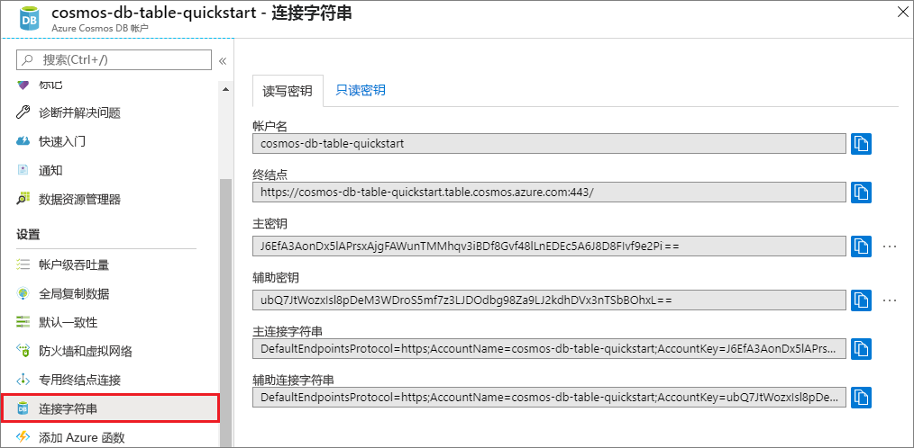

# <a name="quickstart-build-a-table-api-app-with-python-and-azure-cosmos-db"></a>快速入门：使用 Python 和 Azure Cosmos DB 生成表 API 应用

> [!div class="op_single_selector"]
> * [.NET](create-table-dotnet.md)
> * [Java](create-table-java.md)
> * [Node.js](create-table-nodejs.md)
> * [Python](create-table-python.md)
> 

在本快速入门中，我们通过 Azure 门户创建和管理 Azure Cosmos DB 表 API 帐户，并通过 Visual Studio 使用从 GitHub 克隆的 Python 应用。 Azure Cosmos DB 是一种多模型数据库服务，你可以借助其全球分布和水平缩放功能快速创建和查询文档、表、键/值和图数据库。

## <a name="prerequisites"></a>必备条件

- 具有活动订阅的 Azure 帐户。 [免费创建一个](https://azure.microsoft.com/free/?ref=microsoft.com&utm_source=microsoft.com&utm_medium=docs&utm_campaign=visualstudio)。 或者[免费试用 Azure Cosmos DB](https://azure.microsoft.com/try/cosmosdb/) 而无需 Azure 订阅。 你还可以使用 [Azure Cosmos DB 模拟器](https://aka.ms/cosmosdb-emulator)以及 URI `https://localhost:8081` 和密钥 `C2y6yDjf5/R+ob0N8A7Cgv30VRDJIWEHLM+4QDU5DE2nQ9nDuVTqobD4b8mGGyPMbIZnqyMsEcaGQy67XIw/Jw==`。
- [Visual Studio 2019](https://www.visualstudio.com/downloads/)，在安装过程中选择了“Azure 开发”和“Python 开发”工作负载。   
- [Git](https://git-scm.com/downloads)。

## <a name="create-a-database-account"></a>创建数据库帐户

> [!IMPORTANT] 
> 必须新建表 API 帐户，才能使用正式发布的表 API SDK。 正式发布的 SDK 不支持在预览期间创建的表 API 帐户。
>

[!INCLUDE [cosmos-db-create-dbaccount-table](../../includes/cosmos-db-create-dbaccount-table.md)]

## <a name="add-a-table"></a>添加表

[!INCLUDE [cosmos-db-create-table](../../includes/cosmos-db-create-table.md)]

## <a name="add-sample-data"></a>添加示例数据

[!INCLUDE [cosmos-db-create-table-add-sample-data](../../includes/cosmos-db-create-table-add-sample-data.md)]

## <a name="clone-the-sample-application"></a>克隆示例应用程序

现在让我们从 GitHub 克隆表应用，设置连接字符串，然后运行该应用。 会看到以编程方式处理数据是多么容易。 

1. 打开命令提示符，新建一个名为“git-samples”的文件夹，然后关闭命令提示符。

    ```bash
    md "C:\git-samples"
    ```

2. 打开诸如 git bash 之类的 git 终端窗口，并使用 `cd` 命令更改为要安装示例应用的新文件夹。

    ```bash
    cd "C:\git-samples"
    ```

3. 运行下列命令以克隆示例存储库。 此命令在计算机上创建示例应用程序的副本。 

    ```bash
    git clone https://github.com/Azure-Samples/storage-python-getting-started.git
    ```

3. 然后在 Visual Studio 中打开解决方案文件。 

## <a name="update-your-connection-string"></a>更新连接字符串

现在返回到 Azure 门户，获取连接字符串信息，并将其复制到应用。 这样，应用程序就可以与托管的数据库进行通信。 

1. 在 [Azure 门户](https://portal.azure.com/)的 Azure Cosmos DB 帐户中，选择“连接字符串”  。 

    

2. 使用右侧的按钮复制帐户名称。

3. 打开 *config.py* 文件，将帐户名称从门户粘贴到第 19 行的 STORAGE_ACCOUNT_NAME 值中。

4. 返回到门户，然后复制主键。

5. 将主键从门户复制到第 20 行的 STORAGE_ACCOUNT_KEY 值中。

6. 保存 config.py  文件。

## <a name="run-the-app"></a>运行应用

1. 在 Visual Studio 中右键单击“解决方案资源管理器”中的项目。 

2. 选择当前 Python 环境，然后右键单击。

2. 选择“安装 Python 包”，然后输入 *azure-storage-table*。 

3. 按 F5 运行应用程序。 应用会显示在浏览器中。 

现可返回到数据资源管理器，查看查询、修改和处理此新数据。 

## <a name="review-slas-in-the-azure-portal"></a>在 Azure 门户中查看 SLA

[!INCLUDE [cosmosdb-tutorial-review-slas](../../includes/cosmos-db-tutorial-review-slas.md)]

## <a name="clean-up-resources"></a>清理资源

[!INCLUDE [cosmosdb-delete-resource-group](../../includes/cosmos-db-delete-resource-group.md)]

## <a name="next-steps"></a>后续步骤

在本快速入门中，你了解了如何创建 Azure Cosmos DB 帐户、如何使用数据资源管理器创建表，以及如何在 Visual Studio 中运行 Python 应用来添加表数据。  现在可以使用表 API 进行数据查询了。  

> [!div class="nextstepaction"]
> [将表数据导入表 API](table-import.md)
