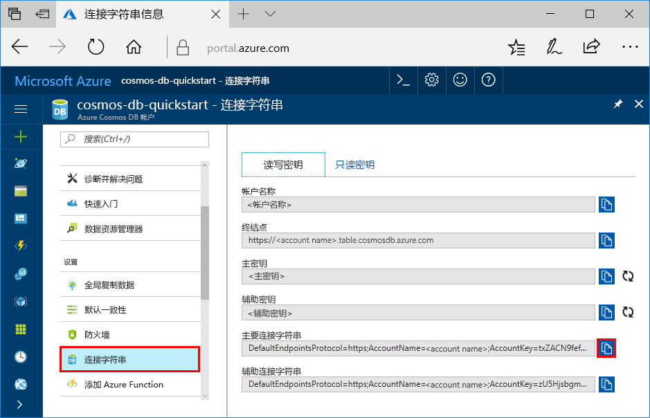

# <a name="quickstart-build-a-table-api-app-with-python-and-azure-cosmos-db"></a>快速入门：使用 Python 和 Azure Cosmos DB 生成表 API 应用

本快速入门介绍如何使用 Python 和 Azure Cosmos DB [表 API](table-introduction.md)，通过克隆 GitHub 中的示例来生成应用。 此外，本快速入门还介绍了如何创建 Azure Cosmos DB 帐户，以及如何在基于 Web 的 Azure 门户中使用数据资源管理器创建表和实体。

Azure Cosmos DB 是 Microsoft 提供的全球分布式多模型数据库服务。 可快速创建和查询文档、键/值、宽列和图形数据库，它们都受益于以 Azure Cosmos DB 为核心的全球分布和水平缩放功能。 

## <a name="prerequisites"></a>先决条件

[!INCLUDE [quickstarts-free-trial-note](../../includes/quickstarts-free-trial-note.md)]
[!INCLUDE [cosmos-db-emulator-docdb-api](../../includes/cosmos-db-emulator-docdb-api.md)]

此外：

* 如果尚未安装 Visual Studio 2017，可以下载并使用**免费的** [Visual Studio 2017 Community Edition](https://www.visualstudio.com/downloads/)。 在安装 Visual Studio 的过程中，请确保启用“Azure 开发”。
* 来自 [GitHub](http://microsoft.github.io/PTVS/)的 Python Tools for Visual Studio。 本教程使用的是 Python Tools for VS 2015。
* 来自 [python.org](https://www.python.org/downloads/release/python-2712/) 的 Python 2.7

## <a name="create-a-database-account"></a>创建数据库帐户

> [!IMPORTANT] 
> 必须新建表 API 帐户，才能使用正式发布的表 API SDK。 正式发布的 SDK 不支持在预览期间创建的表 API 帐户。
>

[!INCLUDE [cosmos-db-create-dbaccount-table](../../includes/cosmos-db-create-dbaccount-table.md)]

## <a name="add-a-table"></a>添加表

[!INCLUDE [cosmos-db-create-table](../../includes/cosmos-db-create-table.md)]

## <a name="add-sample-data"></a>添加示例数据

[!INCLUDE [cosmos-db-create-table-add-sample-data](../../includes/cosmos-db-create-table-add-sample-data.md)]

## <a name="clone-the-sample-application"></a>克隆示例应用程序

现在让我们从 github 克隆表应用、设置连接字符串，并运行。 会看到以编程方式处理数据是多么容易。 

1. 打开命令提示符，新建一个名为“git-samples”的文件夹，然后关闭命令提示符。

    ```bash
    md "C:\git-samples"
    ```

2. 打开诸如 git bash 之类的 git 终端窗口，并使用 `cd` 命令更改为要安装示例应用的新文件夹。

    ```bash
    cd "C:\git-samples"
    ```

3. 运行下列命令以克隆示例存储库。 此命令在计算机上创建示例应用程序的副本。 

    ```bash
    git clone https://github.com/Azure-Samples/storage-python-getting-started.git
    ```

3. 然后在 Visual Studio 中打开解决方案文件。 

## <a name="update-your-connection-string"></a>更新连接字符串

现在返回到 Azure 门户，获取连接字符串信息，并将其复制到应用。 这样，应用程序就可以与托管的数据库进行通信。 

1. 在 [Azure 门户](http://portal.azure.com/)中，单击“连接字符串”。 

    

2. 使用右侧的按钮复制帐户名称。

3. 打开 config.py 文件，并将帐户名称从门户粘贴到第 19 行的 STORAGE_ACCOUNT_NAME 中。

4. 返回到门户，然后复制主键。

5. 将主键从门户复制到第 20 行的 STORAGE_ACCOUNT_KEY 值中。

3. 保存 config.py 文件。

## <a name="run-the-app"></a>运行应用程序

1. 在 Visual Studio 中，右键单击**解决方案资源管理器**中的项目，选择当前 Python 环境，并右键单击。

2. 选择“安装 Python 包”，并键入 **azure-storage-table**

3. 按 F5 运行应用程序。 应用会显示在浏览器中。 

现可返回到数据资源管理器，查看查询、修改和处理此新数据。 

## <a name="review-slas-in-the-azure-portal"></a>在 Azure 门户中查看 SLA

[!INCLUDE [cosmosdb-tutorial-review-slas](../../includes/cosmos-db-tutorial-review-slas.md)]

## <a name="clean-up-resources"></a>清理资源

[!INCLUDE [cosmosdb-delete-resource-group](../../includes/cosmos-db-delete-resource-group.md)]

## <a name="next-steps"></a>后续步骤

在本快速入门教程中，已了解如何创建 Azure Cosmos DB 帐户、使用数据资源管理器创建表和运行应用。  现在可以使用表 API 进行数据查询了。  

> [!div class="nextstepaction"]
> [将表数据导入表 API](table-import.md)
