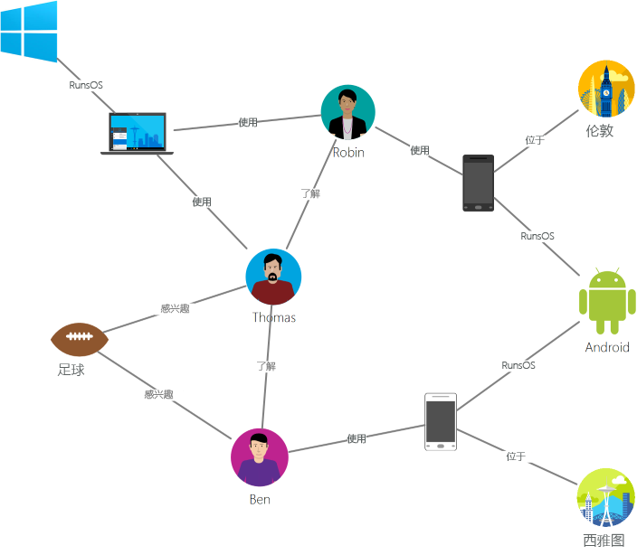
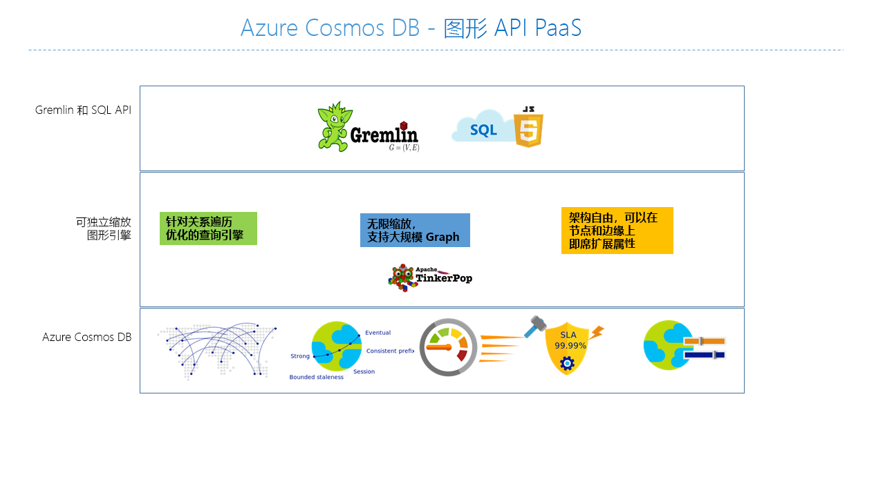

# Azure Cosmos DB 简介：图形 API

[Azure Cosmos DB](introduction.md) 是 Microsoft 针对任务关键型应用程序提供的全局分布式多模型数据库服务。 Azure Cosmos DB 在全球范围内提供[统包全局分发](distribute-data-globally.md)、[吞吐量和存储的弹性扩展](partition-data.md)、99% 的情况下低至个位数的毫秒级延迟、[五个妥善定义的一致性级别](consistency-levels.md)以及得到保证的高可用性，所有这些均由[行业领先的 SLA](https://azure.microsoft.com/support/legal/sla/cosmos-db/) 提供支持。 Azure Cosmos DB [自动为数据编制索引](http://www.vldb.org/pvldb/vol8/p1668-shukla.pdf)，无需客户管理架构和索引。 它是多模型的，支持文档、键-值、图形和纵栏表数据模型。

建议通过观看以下视频了解入门知识，Kirill Gavrylyuk 在视频中说明了如何开始使用 Azure Cosmos DB 上的图。

> [!VIDEO https://channel9.msdn.com/Shows/Azure-Friday/Graphs-with-Azure-Cosmos-DB-Gremlin-API/player]
> 
> 
Azure Cosmos DB 图形 API 可提供：

- 图形建模
- 遍历 API
- 统包全局分发
- 存储和吞吐量的弹性缩放，其读取延迟小于 10 毫秒，并且在 99% 的情况下小于 15 毫秒
- 自动索引编制，可使用即时查询
- 可优化的一致性级别
- 全面的 SLA（包括 99.99% 可用性）

若要查询 Azure Cosmos DB，可以使用 [Apache TinkerPop](http://tinkerpop.apache.org) 图形遍历语言 [Gremlin](http://tinkerpop.apache.org/docs/current/reference/#graph-traversal-steps)，或其他 TinkerPop 兼容的图形系统（如 [Apache Spark GraphX](spark-connector-graph.md)）。

本文提供 Azure Cosmos DB 图形 API 概述，并说明如何使用它存储具有数十亿顶点和边缘的大量图形。 可以使用毫秒级延迟的情况下查询图形，并轻松扩展图形结构和架构。

## 图形数据库
现实世界中的数据存在必然的联系。 传统数据建模以实体为重心。 对于许多应用程序，还需要进行建模，或是自然地为实体和关系建模。

[图形](http://mathworld.wolfram.com/Graph.html)是由[顶点](http://mathworld.wolfram.com/GraphVertex.html)和[边缘](http://mathworld.wolfram.com/GraphEdge.html)组成的结构。 顶点和边缘可以包含任意数目的属性。 顶点表示人员、地点或事件等离散对象。 边缘表示顶点之间的关系。 例如，一个人可能认识其他人、涉及到某个事件以及最近处于某个位置。 属性表示有关顶点和边缘的信息。 属性示例包括具有姓名和年龄的顶点，以及具有时间戳和/或权重的边缘。 更准确地讲，此模型称为[属性图形](http://tinkerpop.apache.org/docs/current/reference/#intro)。 Azure Cosmos DB 支持属性图形模型。

例如，以下示例图形显示了人员、移动设备、兴趣和操作系统之间的关系。

图形非常有助于理解科学、技术和企业中的各种数据集。 使用图形数据库可以轻松高效地存储图形并为其建模，使图形可用于许多场合。 图形数据库通常是 NoSQL 数据库，因为这些用例通常还需要架构灵活性和快速迭代。

图形是一种奇妙而强大的数据建模技术。 但这种事实本身并不是使用图形数据库的充分理由。 对于涉及到图形遍历的许多用例和模式，图形的优势要比传统的 SQL 和 NoSQL 数据库高出几个数量级。 在遍历多个关系（例如朋友的朋友）时，这种性能差异会进一步放大。

可以将图形数据库提供的高速遍历与深度优先搜索、广度优先搜索和 Dijkstra 算法等图形算法相结合，解决社交网络、内容管理、地理空间和推荐等各个领域存在的问题。

## Azure Cosmos DB 的全球级图形
Azure Cosmos DB 是一个完全托管的图形数据库，提供全局分发、存储和吞吐量弹性缩放、自动索引编制与查询、可优化的一致性级别，并支持 TinkerPop 标准。  

与市场中的其他图形数据库相比，Azure Cosmos DB 提供以下独特功能：

* 可弹性缩放的吞吐量和存储

 现实世界中的图形需要扩展到超越单个服务器的容量。 使用 Azure Cosmos DB 可跨多个服务器无缝缩放图形。 还可以根据访问模式独立缩放图形的吞吐量。 Azure Cosmos DB 支持几乎可以扩展到无限存储大小和预配吞吐量的图形数据库。

* 多区域复制

 Azure Cosmos DB 以透明方式将图形数据复制到与你的帐户关联的所有区域。 通过复制可以开发需要访问数据全局访问权限的应用程序。 在一致性、可用性和性能以及对应保证的领域中，需要进行权衡。 Azure Cosmos DB 通过多宿主 API 提供透明区域故障转移。 可以在全球范围内灵活缩放吞吐量和存储。

* 使用熟悉的 Gremlin 语法的快速查询和遍历

 存储异类顶点和边缘，并通过熟悉的 Gremlin 语法查询这些文档。 Azure Cosmos DB 使用高并发、无锁、日志结构化索引技术为所有内容自动编制索引。 此功能可以实现丰富的实时查询和遍历，而无需指定架构提示、二级索引或视图。 在[使用 Gremlin 查询图形](gremlin-support.md)中了解详细信息。

* 完全托管

 通过 Azure Cosmos DB 无需管理数据库和计算机资源。 Azure Cosmos DB 是完全托管的 Microsoft Azure 服务，无需管理虚拟机、部署并配置软件、管理数据库和资源的增减，或处理复杂的数据层升级。 每个图形会自动备份，以防受到区域故障的影响。 你可以轻松添加 Azure Cosmos DB 帐户并根据需要预配容量，以便可以专注于应用程序而不是操作和管理数据库。

* 自动索引编制

 默认情况下，Azure Cosmos DB 自动为图形中的节点和边缘包含的所有属性编制索引，无需任何架构或创建二级索引。

* 与 Apache TinkerPop 兼容

 Azure Cosmos DB 原生支持开源 Apache TinkerPop 标准，可与其他支持 TinkerPop 的图形系统集成。 因此，你可以轻松地从 Titan 或 Neo4j 等其他图形数据库迁移，或者将 Azure Cosmos DB 与 [Apache Spark GraphX](spark-connector-graph.md) 等图形分析框架配合使用。

* 可优化的一致性级别

 从五个妥善定义的一致性级别中选择，实现一致性与性能之间的最佳平衡。 对于查询和读取操作，Azure Cosmos DB 提供五种不同的一致性级别：强、有限过时、会话、一致前缀和最终。 通过这些细化的妥善定义的一致性级别，可以在一致性、可用性与延迟之间实现合理的平衡。 有关详细信息，请参阅 [使用一致性级别最大化 DocumentDB 中的可用性和性能](consistency-levels.md)。

Azure Cosmos DB 还可以在相同的容器/数据库中使用多个模型（例如文档和图形）。 可以使用文档集合将图形数据与文档一起存储。 可以使用 JSON 上的 SQL 查询和 Gremlin 查询来查询与图形相同的数据。

## 入门
可以使用支持图形 API 的 Azure 命令行接口 (CLI)、Azure Powershell 或 Azure 门户创建 Azure Cosmos DB 帐户。 创建帐户后，Azure 门户将提供类似于 `https://<youraccount>.graphs.azure.com` 的、充当 Gremlin 的 WebSocket 前端的服务终结点。 可以将 TinkerPop 兼容的工具（例如 [Gremin 控制台](http://tinkerpop.apache.org/docs/current/reference/#gremlin-console)）配置为连接到此终结点，并在 Java、Node.js 或任何 Gremlin 客户端驱动程序中生成应用程序。

下表显示可以对 Azure Cosmos DB 使用的常用 Gremlin 驱动程序：

| 下载 | 文档 |
| --- | --- |
| [Java](https://mvnrepository.com/artifact/com.tinkerpop.gremlin/gremlin-java) |[Gremlin JavaDoc](http://tinkerpop.apache.org/javadocs/current/full/) |
| [Node.js](https://www.npmjs.com/package/gremlin) |[Github 上的 Gremlin-JavaScript](https://github.com/jbmusso/gremlin-javascript) |
| [Gremlin 控制台](https://tinkerpop.apache.org/downloads.html) |[TinkerPop 文档](http://tinkerpop.apache.org/docs/current/reference/#gremlin-console) |

Azure Cosmos DB 还通过 NuGet 提供基于 [Azure Cosmos DB SDK](documentdb-sdk-dotnet.md) 的、包含 Gremlin 扩展方法的 .NET 库。 此库提供一个可用于直接连接到 DocumentDB 数据分区的“进程中”Gremlin 服务器。

| 下载 | 文档 |
| --- | --- |
| [.NET](https://www.nuget.org/packages/Microsoft.Azure.Graphs/) |[Microsoft.Azure.Graphs](https://msdn.microsoft.com/library/azure/dn948556.aspx) |

使用 [Azure Cosmos DB 仿真器](local-emulator.md)可以通过图形 API 在本地进行开发和测试，无需创建 Azure 订阅，也不会产生任何费用。 如果对应用程序在模拟器中的工作情况感到满意，则可以切换到在云中使用 Azure Cosmos DB 帐户。

## Azure Cosmos DB 图形支持的使用场合
下面是可以使用 Azure Cosmos DB 图形支持的一些场合：

* 社交网络

 通过合并有关客户及其与其他人的互动的数据，可以开发个性化的体验、预测客户行为，或者将某些人员与其他具有类似兴趣的人员相连接。 使用 Azure Cosmos DB 可以管理社交网络以及跟踪客户的喜好与数据。

* 推荐引擎

 此场合通常用于零售行业。 通过合并有关产品、用户和用户互动（例如购买、浏览某件商品或者为商品评分）的信息，可以生成自定义的推荐内容。 Azure Cosmos DB 的低延迟、弹性缩放和原生图形支持是为这些互动建模的理想选择。

* 地理空间

 电信、物流和旅行规划行业中的许多应用程序需要在某个区域中查找兴趣点，或者查找两个地点之间最短/最佳的路线。 Azure Cosmos DB 天生就很适合解决这些问题。

* 物联网

 将 IoT 设备之间的网络和连接建模为图形后，可以更好地了解设备和资产的状态，以及了解网络的一个部分发生的更改可能对另一个部分造成的影响。

## 后续步骤
若要详细了解 Azure Cosmos DB 中的图形支持，请参阅：

* [Azure Cosmos DB 图形入门教程](create-graph-dotnet.md)。
* 了解如何[使用 Gremlin 在 Azure Cosmos DB 中查询图形](gremlin-support.md)。

