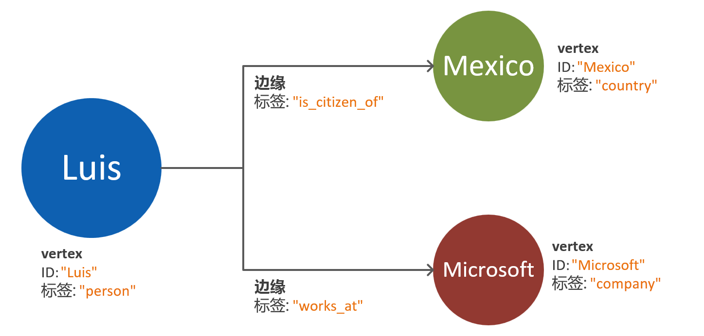
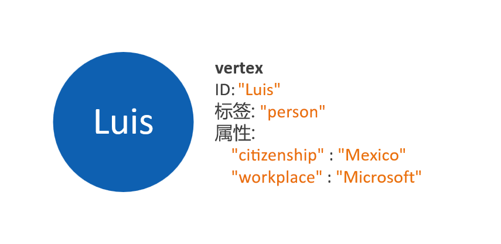
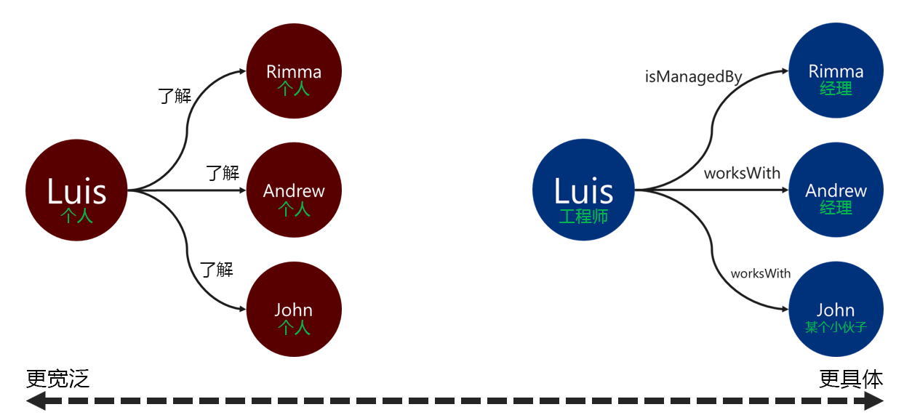

# Azure Cosmos DB Gremlin API 的图形数据建模

以下文档旨在提供图形数据建模建议。 此步骤对于确保数据变化时图形数据库系统的可伸缩性和性能至关重要。 高效的数据模型对于大型图形尤其重要。

## 要求

本指南中概述的过程基于以下假设：
 * 识别了问题空间中的实体  。 每个请求以原子方式使用这些实体  。 换句话说，数据库系统不会在多个查询请求中检索单个实体的数据。
 * 了解数据库系统的读取和写入要求  。 这些要求将指导图形数据模型所需的优化。
 * 充分了解 [Apache Tinkerpop 属性图形标准](http://tinkerpop.apache.org/docs/current/reference/#graph-computing)的原则。

## 何时需要图形数据库？

如果数据域中的实体和关系具有以下任何特征，则可以最佳地应用图形数据库解决方案： 

* 实体通过描述性关系彼此联系紧密  。 这种情况的好处是关系在存储中永久存在。
* 有循环关系或自引用实体   。 使用关系数据库或文档数据库时，这种模式通常是一个挑战。
* 实体之间存在动态发展的关系 **。** 此模式特别适用于具有多个级别的分层或树状结构数据。
* 实体之间存在多对多关系 **。**
* 对实体和关系都有写入和读取要求  。 

如果满足上述条件，则图形数据库方法可能会为查询复杂性、数据模型可伸缩性和查询性能提供优势    。

下一步是确定图形是否将用于分析或事务目的。 如果图形将用于繁重的计算和数据处理工作负载，则值得探索 [Cosmos DB Spark 连接器](https://docs.microsoft.com/azure/cosmos-db/spark-connector)以及 [GraphX 库](https://spark.apache.org/graphx/)的使用。 

## 如何使用图形对象

[Apache Tinkerpop 属性图形标准](http://tinkerpop.apache.org/docs/current/reference/#graph-computing)定义了两种类型的对象：顶点和边缘   。 

以下是图形对象中属性的最佳实践：

| Object | 属性 | Type | 说明 |
| --- | --- | --- |  --- |
| 顶点 | ID | String | 每个分区唯一强制执行。 如果插入时未提供值，则将存储自动生成的 GUID。 |
| 顶点 | label | String | 此属性用于定义顶点表示的实体类型。 如果未提供值，则将使用默认值 vertex。 |
| 顶点 | properties | 字符串、布尔值、数字 | 在每个顶点中存储为键值对的单独属性的列表。 |
| 顶点 | 分区键 | 字符串、布尔值、数字 | 此属性定义顶点及其传出边缘的存储位置。 有关更多信息，请参阅[图形分区](graph-partitioning.md)。 |
| Microsoft Edge | ID | String | 每个分区唯一强制执行。 默认情况下自动生成。 边缘通常不需要通过 ID 唯一检索。 |
| Microsoft Edge | label | String | 此属性用于定义两个顶点具有的关系类型。 |
| Microsoft Edge | properties | 字符串、布尔值、数字 | 在每个边缘中存储为键值对的单独属性的列表。 |

> [!NOTE]
> 边缘不需要分区键值，因为它的值是根据其源顶点自动分配的。 有关详细信息，请参阅[图形分区](graph-partitioning.md)一文。

## 实体和关系建模指南

以下是一组用于处理 Azure Cosmos DB Gremlin API 图形数据库的数据建模的指南。 这些指南假设存在数据域的现有定义并对其进行查询。

> [!NOTE]
> 下面列出的步骤作为建议提出。 在考虑用于生产之前，应对最终模型进行评估和测试。 此外，以下建议特定于 Azure Cosmos DB Gremlin API 实现。 

### 对顶点和属性建模 

图形数据模型的第一步是将每个已识别的实体映射到顶点对象  。 第一步应为所有实体到顶点的一对一映射，但可能发生变化。

一个常见的缺陷是将单个实体的属性映射为单独的顶点。 请考虑下面的示例，其中相同的实体以两种不同的方式表示：

* **基于顶点属性**：在这种方法中，实体使用三个单独的顶点和两个边缘来描述其属性。 虽然这种方法可以减少冗余，但会增加模型复杂性。 模型复杂性的增加可能会导致延迟、查询复杂性和计算成本增加。 此模型还可能在分区方面带来挑战。

* **属性嵌入式顶点**：这种方法利用键值对列表来表示顶点内实体的所有属性。 这种方法降低了模型复杂性，使查询更简单、遍历成本更低。

> [!NOTE]
> 上面的示例显示了一个简化的图形模型，仅对划分实体属性的两种方法进行了比较。

属性嵌入式顶点模式通常提供更高的性能和可缩放的方法  。 新图形数据模型的默认方法应该倾向于这种模式。

但是，在某些情况下，引用属性可能会带来优势。 例如：如果引用的属性经常更新。 使用单独的顶点来表示不断更改的属性将最大程度地减少更新所需的写入操作量。

### 与边缘方向的关系建模

对顶点建模之后，可以添加边缘，以表示它们之间的关系。 需要评估的第一个方面是关系的方向 **。** 

边缘对象具有默认方向，在使用 `out()` 或 `outE()` 函数时后跟遍历。 使用这种自然方向可以实现高效操作，因为所有顶点都与其传出边缘一起存储。 

但是，使用 `in()` 函数在边缘的相反方向遍历将始终导致跨分区查询。 有关详细信息，请参阅[图形分区](graph-partitioning.md)。 如果需要使用 `in()` 函数不断遍历，建议在两个方向上添加边缘。

你可以通过在 `.addE()` Gremlin 步骤中使用 `.to()` 或 `.from()` 谓词来确定边缘方向。 或通过使用[适用于 Gremlin API 的批量执行程序库](bulk-executor-graph-dotnet.md)来确定。

> [!NOTE]
> 边缘对象默认具有方向。

### 关系标签

使用描述性关系标签可以提高边缘解析操作的效率。 可以通过以下方式应用此模式：
* 使用非通用术语来标记关系。
* 使用关系名称将源顶点的标签与目标顶点的标签相关联。

遍历器用于筛选边缘的标签越具体越好。 此决定也会对查询成本产生显著影响。 可以 [使用 executionProfile 步骤](graph-execution-profile.md)随时评估查询成本。

## 后续步骤： 
* 签出支持的 [Gremlin 步骤](gremlin-support.md)列表。
* 了解[图形数据库分区](graph-partitioning.md)以处理大型图形。
* 使用 [executionProfile 步骤](graph-execution-profile.md)评估 Gremlin 查询。
