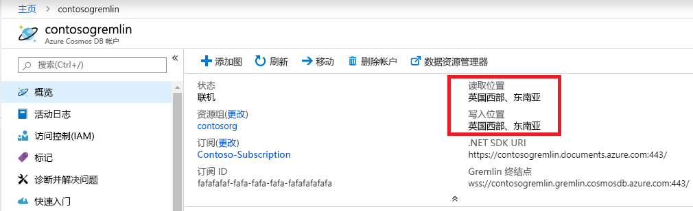

# <a name="regional-endpoints-for-azure-cosmos-db-graph-account"></a>Azure Cosmos DB Graph 帐户的区域终结点
Azure Cosmos DB Graph 数据库是[全局分布](distribute-data-globally.md)的，因此应用程序可以使用多个读取终结点。 需要在多个位置具有写入访问权限的应用程序应启用[多主数据库](how-to-multi-master.md)功能。

选择多个区域的原因：
1. **水平读取可伸缩性** - 随着应用程序负载的增加，将读取流量路由到不同的 Azure 区域可能是明智的做法。
2. **延迟较低** - 可以将读取和写入流量路由到最近的 Azure 区域，从而减少每个遍历的网络延迟开销。

**数据驻留**要求通过在 Cosmos DB 帐户上设置 Azure 资源管理器策略来实现。 客户可限制 Cosmos DB 将数据复制到其中的区域。

## <a name="traffic-routing"></a>流量路由

Cosmos DB Graph 数据库引擎正在多个区域中运行，其中每个区域都包含多个群集。 每个群集都有数百台计算机。 Cosmos DB 图形帐户 DNS CNAME accountname.gremlin.cosmos.azure.com  解析为群集的 DNS A 记录。 负载平衡器的单个 IP 地址将隐藏内部群集拓扑。

将为 Cosmos DB Graph 帐户的每个区域创建一个区域 DNS CNAME 记录。 区域终结点的格式是 accountname-region.gremlin.cosmos.azure.com  。 通过删除 [Azure 区域](https://azure.microsoft.com/global-infrastructure/regions)名称中的所有空格获取区域终结点的区域段。 例如，`"contoso"` 全局数据库帐户的 `"East US 2"` 区域将具有 DNS CNAME contoso-eastus2.gremlin.cosmos.azure.com 

TinkerPop Gremlin 客户端设计用于单台服务器。 应用程序可将全局可写入 DNS CNAME 用于读取和写入流量。 可识别区域的应用程序应使用区域终结点来读取流量。 仅在特定区域配置为接受写入时，才将区域终结点用于写入流量。 

> [!NOTE]
> Cosmos DB Graph 引擎可以通过将流量代理到写入区域来接受读取区域中的写入操作。 建议不要将写入发送到只读区域，因为这会增加遍历延迟，并且会在将来受到限制。

全局数据库帐户 CNAME 始终指向有效的写入区域。 在写入区域的服务器端故障转移过程中，Cosmos DB 将全局数据库帐户 CNAME 更新为指向新区域。 如果应用程序在故障转移后无法处理流量重新路由，则应使用全局数据库帐户 DNS CNAME。

> [!NOTE]
> Cosmos DB 不会根据调用方的地理位置来路由流量。 根据独特的应用程序需求，将由每个应用程序选择适当的区域。

## <a name="portal-endpoint-discovery"></a>门户终结点发现

获取 Azure Cosmos DB Graph 帐户区域列表的最简单的方法是 Azure 门户中的“概述”边栏选项卡。 它适用于不经常更改区域的应用程序，或者可以通过应用程序配置来更新列表。



下面的示例演示了访问区域 Gremlin 终结点的一般原则。 应用程序应考虑将流量发送到的区域数量，以及要实例化的相应 Gremlin 客户端的数量。

```csharp
// Example value: Central US, West US and UK West. This can be found in the overview blade of you Azure Cosmos DB Gremlin Account. 
// Look for Write Locations in the overview blade. You can click to copy and paste.
string[] gremlinAccountRegions = new string[] {"Central US", "West US" ,"UK West"};
string gremlinAccountName = "PUT-COSMOSDB-ACCOUNT-NAME-HERE";
string gremlinAccountKey = "PUT-ACCOUNT-KEY-HERE";
string databaseName = "PUT-DATABASE-NAME-HERE";
string graphName = "PUT-GRAPH-NAME-HERE";

foreach (string gremlinAccountRegion in gremlinAccountRegions)
{
  // Convert preferred read location to the form "[acountname]-[region].gremlin.cosmos.azure.com".
  string regionalGremlinEndPoint = $"{gremlinAccountName}-{gremlinAccountRegion.ToLowerInvariant().Replace(" ", string.Empty)}.gremlin.cosmos.azure.com";

  GremlinServer regionalGremlinServer = new GremlinServer(
    hostname: regionalGremlinEndPoint, 
    port: 443,
    enableSsl: true,
    username: "/dbs/" + databaseName + "/colls/" + graphName,
    password: gremlinAccountKey);

  GremlinClient regionalGremlinClient = new GremlinClient(
    gremlinServer: regionalGremlinServer,
    graphSONReader: new GraphSON2Reader(),
    graphSONWriter: new GraphSON2Writer(),
    mimeType: GremlinClient.GraphSON2MimeType);
}
```

## <a name="sdk-endpoint-discovery"></a>SDK 终结点发现

应用程序可以使用 [Azure Cosmos DB SDK](sql-api-sdk-dotnet.md) 来发现 Graph 帐户的读取和写入位置。 这些位置可以通过在服务器端进行手动重新配置或通过自动故障转移随时进行更改。

TinkerPop Gremlin SDK 没有 API 来发现 Cosmos DB Graph 数据库帐户区域。 需要运行时终结点发现的应用程序需要在进程空间中托管 2 个单独的 SDK。

```csharp
// Depending on the version and the language of the SDK (.NET vs Java vs Python)
// the API to get readLocations and writeLocations may vary.
IDocumentClient documentClient = new DocumentClient(
    new Uri(cosmosUrl),
    cosmosPrimaryKey,
    connectionPolicy,
    consistencyLevel);

DatabaseAccount databaseAccount = await cosmosClient.GetDatabaseAccountAsync();

IEnumerable<DatabaseAccountLocation> writeLocations = databaseAccount.WritableLocations;
IEnumerable<DatabaseAccountLocation> readLocations = databaseAccount.ReadableLocations;

// Pick write or read locations to construct regional endpoints for.
foreach (string location in readLocations)
{
  // Convert preferred read location to the form "[acountname]-[region].gremlin.cosmos.azure.com".
  string regionalGremlinEndPoint = location
    .Replace("http:\/\/", string.Empty)
    .Replace("documents.azure.com:443/", "gremlin.cosmos.azure.com");
  
  // Use code from the previous sample to instantiate Gremlin client.
}
```

## <a name="next-steps"></a>后续步骤
* [了解如何在 Azure Cosmos DB 中管理数据库帐户](how-to-manage-database-account.md)
* Azure Cosmos DB 中的[高可用性](high-availability.md)
* [Azure Cosmos DB 全局分布 - 揭秘](global-dist-under-the-hood.md)
* Azure Cosmos DB 的 [Azure CLI 示例](cli-samples.md)
