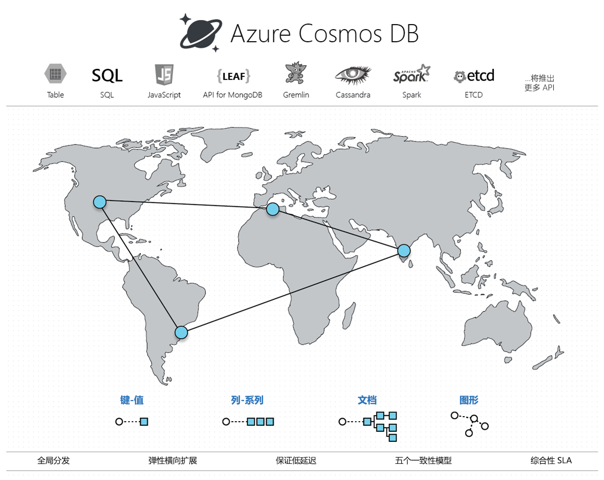

# 欢迎使用 Azure Cosmos DB

Azure Cosmos DB 由 Microsoft 提供，是全球分布式多模型数据库。 只需单击一个按钮，即可通过 Azure Cosmos DB 跨任意数量的 Azure 地理区域灵活且独立地缩放吞吐量和存储。 它通过综合[服务级别协议](https://aka.ms/acdbsla) (SLA) 提供吞吐量、延迟、可用性和一致性保证，这是其他数据库服务无法提供的。

Azure Cosmos DB 包含一个与架构无关、已经过写入优化、资源受到管理的数据库引擎，该引擎本身支持多个数据模型：键值、文档、图和列式数据模型。 它还以可扩展的方式支持许多用于访问数据的 API，包括 [MongoDB](mongodb-introduction.md)、[DocumentDB SQL](documentdb-introduction.md)、[Gremlin](graph-introduction.md)（预览版）和 [Azure 表](table-introduction.md)（预览版）。 

Azure Cosmos DB 在 2010 年末开始解决 Microsoft 内部大型应用程序开发人员所面临的难题。 由于构建全球分布式应用程序不是 Microsoft 的独家问题，因此我们让该服务以 Azure DocumentDB 的形式供外部所有的 Azure 开发人员使用。 Azure Cosmos DB 是 DocumentDB 发展过程中的下一个重大飞跃，现在我们要让使它能为你所用。 随着 Azure Cosmos DB 的此次发布，DocumentDB 客户连同其数据将自动成为 Azure Cosmos DB 客户。 该转换是无缝进行的，这些客户现在有权访问 Azure Cosmos DB 提供的更广泛的新功能。 

## 功能比较

Azure Cosmos DB 提供关系数据库和非关系数据库的最佳功能。

| 功能 | 关系 DB    | 非关系 (NoSQL) DB |     Azure Cosmos DB |
| --- | --- | --- | --- |
| 全球分布 | x | x | ✓ 统包式解决方案，30 个以上的区域，多宿主 |
| 横向缩放 | x | ✓ | ✓ 独立缩放存储和吞吐量 | 
| 延迟保证 | x | ✓ | ✓ 在 99% 的情况下，读取操作的延迟 < 10 毫秒，写入操作的延迟 < 15 毫秒 | 
| 高可用性 | x | ✓ | ✓ 始终可用，PACELC 权衡，自动和手动故障转移 |
| 数据模型 + API | 关系 + SQL | 多模型 + OSS API | 多模型 + SQL + OSS API（即将推出更多） |
| SLA | ✓ | x | ✓ 有关延迟、吞吐量、一致性和可用性的综合 SLA |

## 关键功能
作为一种全球分布式数据库服务，Azure Cosmos DB 提供以下功能，帮助构建可缩放的、具有高响应性的全球分布式应用程序：

* [**统包式全球分布**](#global-distribution)
    * 应用程序在任何地方都可以即时提供给用户使用。 现在，数据也可以这样。
    * 不必担心硬件以及添加节点、VM 或内核等问题。 只需点击一下，即可获得数据。 

* [**多个数据模型和用于访问及查询数据的常用 API**](#data-models)
    * 支持多个数据模型，包括键值、文档、图和列式数据模型。
    * 用于 Node.js、Java、.NET、.NET Core、Python 和 MongoDB 的可扩展 API。
    * 用于查询的 SQL 和 Gremlin。 

* [**在全球范围内按需求灵活缩放吞吐量和存储**](#horizontal-scale)
    * 以[秒](request-units.md)和[分钟](https://aka.ms/acdbrupm)为时间粒度轻松缩放吞吐量，并可以随时对其进行更改。 
    * [透明且自动地](partition-data.md)缩放存储以满足现在和将来对大小的要求。

* [**构建具有高响应性的任务关键型应用程序**](#low-latency) 
    * 在全球任意位置均可访问你的数据，99% 的情况下延迟仅为几毫秒。 

* [**确保“始终可用”可用性**](#high-availability)
    * 在单个区域内可用性为 99.99%。
    * 部署到任意数量的 [Azure 区域](https://azure.microsoft.com/regions)以提高可用性。
    * [模拟一个或多个区域的故障](regional-failover.md)而保证不丢失任何数据。 

* [**编写全球分布式应用程序的正确方式**](#consistency)
    * [五个一致性模型](consistency-levels.md)提供类似于 SQL 的非常一致性到类似于 NoSQL 的最终一致性，以及介于两者之间的一致性。 
  
* [**退款保证**](#sla) 
    * 要么数据快速到达，要么退款。 
    * 有关可用性、延迟、吞吐量和一致性的[服务级别协议](https://aka.ms/acdbsla)。 

* [**无数据库架构/索引管理**](#schema-free)
    * 无需担心将数据库架构和索引与应用程序架构保持同步的问题。 我们免架构。 

* [**拥有成本低廉**](#tco)
    * 比非托管解决方案的[成本效益](https://aka.ms/documentdb-tco-paper)高 5 到 10 倍。
    * 比 DynamoDB 便宜 3 倍。

## 全球分布
Azure Cosmos DB 容器沿两个维度分布： 

1. 在给定区域中，所有资源均使用资源分区进行横向分区（本地分布）。 
2. 每个资源分区还将跨地理区域进行复制（全球分布）。 

 

存储和吞吐量需要缩放时，Cosmos DB 以透明方式跨所有区域执行分区管理操作。 无论缩放、分布或故障情况如何，Cosmos DB 都将继续提供全球分布式资源的单个系统映像。 

Cosmos DB 中资源的全球分布是[统包](distribute-data-globally.md)式的。 在任何时候单击几下按钮（或以编程方式使用单个 API 调用），即可将任意数量的地理区域与你的数据库帐户相关联。 

无论数据量或区域数量如何，Cosmos DB 都保证 99% 的情况下每个新关联的区域在一小时之内开始处理客户端请求。 这是通过将种子设定与将数据从所有源资源分区复制到新关联区域进行并行化来完成的。 客户还可以删除现有区域或将以前与其数据库帐户关联的区域脱机。

## 多模型、多 API 支持
 Azure Cosmos DB 本身支持包括文档、键值、图和列系列在内的多个数据模型。 Cosmos DB 数据库引擎的核心内容模型基于 Atom 记录序列 (ARS)。 Atom 包含一小组基元类型，如 string、bool 和 number。 记录是组成这些类型的结构。 序列是包含 Atom、记录或序列的数组。 
 
 数据库引擎可以将不同数据模型有效地转换并投影到基于 ARS 的数据模型。 Cosmos DB 的核心数据模型本身可从动态类型化编程语言访问，并且可以作为 JSON 按现状公开。 
 
 该服务还支持用于数据访问和查询的常用数据库 API。 Cosmos DB 的数据库引擎当前支持 [DocumentDB SQL](documentdb-introduction.md)、[MongoDB](mongodb-introduction.md)、[Azure 表](table-introduction.md)（预览版）和 [Gremlin](graph-introduction.md)（预览版）。 可以继续使用常用 OSS API 构建应用程序并获得已经过考验且完全托管的全球分布式数据库服务的全部优势。 

## 横向缩放存储和吞吐量
Cosmos DB 容器（例如，文档集合、表或图）中的所有数据均横向分区，并按资源分区以透明方式管理。 资源分区是按[客户指定的分区键](partition-data.md)分区的数据的容器，具有一致性和高可用性。 它为它所管理的一组资源提供单个系统映像，是缩放和分布的基本单位。 Cosmos DB 已设计为允许基于各不同地理区域的应用程序流量模式灵活缩放吞吐量，以支持因地理位置和时间而异的波动工作负荷。 该服务以透明方式管理分区，而不影响 Cosmos DB 容器的可用性、一致性、延迟或吞吐量。  
 
 

可以通过使用[每秒请求单位 (RU/s)](request-units.md) 以编程方式预配吞吐量来灵活缩放 Azure Cosmos DB 容器的吞吐量。 在内部，该服务以透明方式管理资源分区，以在给定容器上提供吞吐量。 Cosmos DB 确保该吞吐量可跨与容器关联的所有区域使用。 新的吞吐量在配置的吞吐量值发生更改的 5 秒内生效。 

可以在每秒和[每分钟 (RU/m)](request-units-per-minute.md) 粒度上预配 Cosmos DB 容器的吞吐量。 在每分钟粒度上预配的吞吐量用于管理工作负荷中在每秒粒度上出现的意外高峰。 

## 保证 99% 的情况下的低延迟
作为 Cosmos DB SLA 的一部分，Cosmos DB 向其客户保证了 99% 的情况下端到端的低延迟。 对于典型的 1 KB 项，Cosmos DB 保证，在 99% 的情况下，同一 Azure 区域内读取操作的端到端延迟和已索引写入操作的端到端延迟分别低于 10 毫秒和 15 毫秒。 中间延迟明显更低（低于 5 毫秒）。  利用每个数据库事务上处理的请求的上限，Cosmos DB 使客户端可以明确区分事务存在高延迟与数据库不可用这两种情况。

## 透明多宿主和 99.99% 的高可用性
可以动态地将“优先级”关联到与 Azure Cosmos DB 数据库帐户关联的区域。 优先级用于在发生区域性故障时将请求定向到特定区域。 区域性灾难不大可能发生，如果发生，Cosmos DB 将自动按优先级顺序进行故障转移。

若要测试应用程序的端到端可用性，可以[手动触发故障转移](regional-failover.md)（速率限制为一小时内两个操作）。 Cosmos DB 保证在手动执行区域性故障转移期间不会丢失任何数据。 在发生区域性灾难的情况下，Cosmos DB 保证在系统启动的自动故障转移期间不超过一个有关数据丢失的上限。 在区域性故障转移后无需重新部署应用程序，Azure Cosmos DB 会保持履行可用性 SLA。 

对于这种情况，DocumentDB 允许使用逻辑（与区域无关）终结点或物理（特定于区域）终结点与资源交互。 前者确保在发生故障转移时，应用程序可以透明方式采用多个宿主。 后者提供对应用程序的细粒度控制，以将读取和写入重定向到特定区域。 Cosmos DB 保证为每个数据库帐户履行 99.99% 可用性 SLA。 可用性保证与规模（预配的吞吐量和存储）、区域数目或与给定的数据库相关联的区域之间的地理距离无关。 

## 多个妥善定义的一致性模型
商用分布式数据库分为两类：根本不提供妥善定义的可证明一致性选择的数据库，以及提供两种极端可编程性选择（非常一致性与最终一致性）的数据库。 前者使应用程序开发人员为复制协议的细节所累，需要他们在一致性、可用性、延迟和吞吐量之间做出困难的权衡。 后者则迫使用户选择两个极端之一。 尽管有了 50 个以上的一致性模型的大量研究和建议，分布式数据库社区尚未能够将非常一致性和最终一致性之外的一致性级别商业化。 

使用 Cosmos DB 可以沿一致性系列在[五个妥善定义的一致性模型](consistency-levels.md)（非常、有限过期、[会话](http://dl.acm.org/citation.cfm?id=383631)、一致前缀和最终）之间进行选择。 

下表说明了每个一致性级别提供的特定保证。
 
**一致性级别和保证**

| 一致性级别    | 保证 |
| --- | --- |
| 非常 | 可线性化 |
| 有限过期    | 一致前缀。 读取操作落后写入操作 k 个前缀或 t 时间间隔 |
| 会话    | 一致前缀。 单调读取、单调写入、读取你的写入、写入跟随读取 |
| 一致前缀    | 返回的更新是全部更新的某些前缀，不带间隔 |
| 最终    | 失序读取 |

可以在 Cosmos DB 帐户上配置默认一致性级别（并且可在以后对特定读取请求重写一致性）。 在内部，默认一致性级别适用于可能跨地区的分区集内的数据。 

## 有保证的服务级别协议

Cosmos DB 是第一个针对可用性、吞吐量、低延迟和一致性提供 99.99% [SLA 保证](https://aka.ms/acdbsla)的托管数据库服务。
* 可用性：为每一个数据和控制平面操作提供 99.99% 的运行时间可用性 SLA。
* 吞吐量：99.99% 的请求会成功完成 
* 延迟：在 99% 的情况下，99.99% 的延迟 < 10 毫秒
* 一致性：100% 的读取请求将满足你请求的一致性级别的一致性保证。

## 免架构

关系数据库和 NoSQL 数据库强制你处理架构和索引管理、版本控制和迁移，所有这些在全球分布式设置中非常具有挑战性。 但请不要担心 -- Cosmos DB 让这一问题消失！ 有了 Cosmos DB，便无需管理架构和索引、处理架构版本控制或在迁移架构时担心应用程序无法正常工作。 Cosmos DB 的数据库引擎完全与架构无关 – 它自动索引它引入的所有数据而无需任何架构或索引，并提供速度超快的快速查询。 

## 拥有成本低廉

 考虑到总拥有成本 (TCO) 的全部因素时，诸如 Azure Cosmos DB 之类的托管云服务的成本效益可比在本地或虚拟机上运行的 OSS 相应服务高 5 到 10 倍。 对于大量的工作负荷而言，Azure Cosmos DB 最多可比 DynamoDB 便宜 2 到 3 倍。 请在 [TCO 白皮书](https://aka.ms/documentdb-tco-paper)中了解详细信息。 

## 后续步骤
请通过阅读以下快速入门文章之一，来开始使用 Azure Cosmos DB：

* [开始使用 Azure Cosmos DB 的 DocumentDB API](create-documentdb-dotnet.md)
* [开始使用 Azure Cosmos DB 的 MongoDB API](create-mongodb-nodejs.md)
* [开始使用 Azure Cosmos DB 的图形 API](create-graph-dotnet.md)
* [开始使用 Azure Cosmos DB 的表 API](create-table-dotnet.md)

