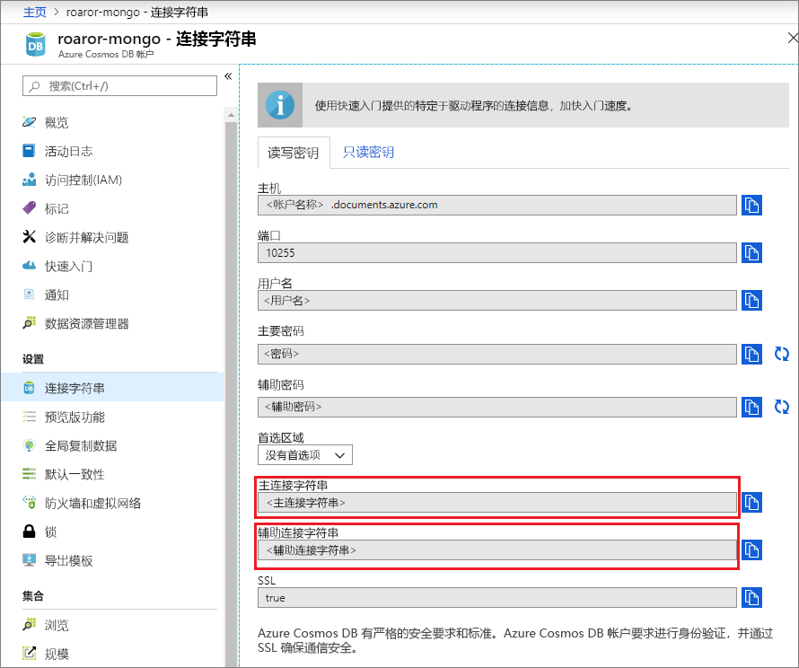
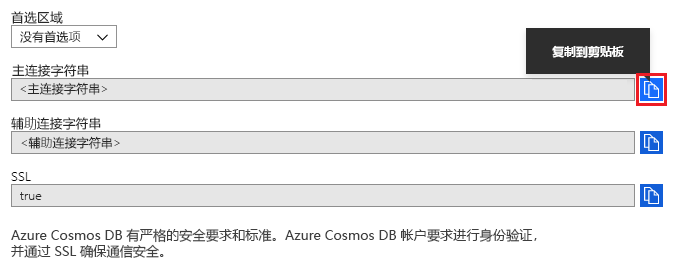

# 使用 MongoDB Compass 连接到 Azure Cosmos DB 的 API for MongoDB 

本教程演示在 Cosmos DB 中存储和/或管理数据时如何使用 [MongoDB Compass](https://www.mongodb.com/products/compass)。 我们使用 Azure Cosmos DB 的 API for MongoDB 来执行本演练。 对于不熟悉的人来说，Compass 是 MongoDB 的 GUI。 它通常用于直观显示数据、运行即席查询以及管理数据。 

Cosmos DB 是 Microsoft 提供的全球分布式多模型数据库服务。 可快速创建和查询文档、键/值和图形数据库，所有这些都受益于 Cosmos DB 核心的全球分布和水平缩放功能。

## 先决条件 
若要使用 Robo 3T 连接到 Cosmos DB 帐户，必须：

* 下载并安装 [Compass](https://www.mongodb.com/download-center/compass?jmp=hero)
* 获得 Cosmos DB [连接字符串](connect-mongodb-account.md)信息

## 连接到 Cosmos DB 的 API for MongoDB 
若要将 Cosmos DB 帐户连接到 Compass，可以执行以下步骤：

1. 使用[此处](connect-mongodb-account.md)的说明检索使用 Azure Cosmos DB 的 API MongoDB 配置的 Cosmos 帐户的连接信息。

    

2. 单击 Cosmos DB 中**主要/辅助连接字符串**旁边的“复制到剪贴板”  按钮。 单击此按钮会将整个连接字符串复制到剪贴板。 

    

3. 在桌面/计算机上打开 Compass，然后依次单击“连接”  、“连接到...”  。 

4. Compass 将自动检测剪贴板中的连接字符串，并提示你是否要使用该字符串进行连接。 单击“是”，如下面的屏幕截图所示  。

    

5. 在上述步骤中单击“是”  后，将自动填充连接字符串中的详细信息。 删除“副本集名称”  字段中自动填充的值，以确保将其留空。 

    

6. 单击页面底部的“连接”  。 你的 Cosmos DB 帐户和数据库现在应该在 MongoDB Compass 中可见。

## 后续步骤

- 了解如何将 [Studio 3T](mongodb-mongochef.md) 与 Azure Cosmos DB 的用于 MongoDB 的 API 配合使用。
- 使用 Azure Cosmos DB 的用于 MongoDB 的 API 浏览 MongoDB [示例](mongodb-samples.md)。