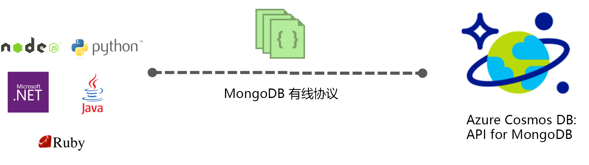

# Azure Cosmos DB 的用于 MongoDB 的 API

[Azure Cosmos DB](introduction.md) 是 Microsoft 针对任务关键型应用程序提供的全球分布式多模型数据库服务。 Azure Cosmos DB 在全球范围内提供[统包全局分发](distribute-data-globally.md)、[吞吐量和存储的弹性扩展](partition-data.md)、99% 的情况下低至个位数的毫秒级延迟以及得到保证的高可用性，所有这些均由[行业领先的 SLA](https://azure.microsoft.com/support/legal/sla/cosmos-db/) 提供支持。 Azure Cosmos DB [自动为数据编制索引](https://www.vldb.org/pvldb/vol8/p1668-shukla.pdf)，无需客户管理架构和索引。 它是多模型的，支持文档、键-值、图和列式数据模型。 默认情况下，可以使用 SQL API 来与 Cosmos DB 交互。 此外，Cosmos DB 服务对 Cassandra、MongoDB、Gremlin 和 Azure 表存储等常见 NoSQL API 实现网络协议。 这样，你便可以使用熟悉的 NoSQL 客户端驱动程序和工具来与 Cosmos 数据库交互。

## 网络协议兼容性

Azure Cosmos DB 服务对 Cassandra、MongoDB、Gremlin 和 Azure 表存储等常见的 NoSQL 数据库实现网络协议。 它在 Cosmos DB 中直接有效地提供网络协议的本机实现，使 NoSQL 数据库的现有客户端 SDK、驱动程序和工具能够以透明方式与 Cosmos DB 交互。 Cosmos DB 不使用数据库的任何源代码来为任何 NoSQL 数据库提供网络兼容的 API。

默认情况下，使用 Azure Cosmos DB 的 API for MongoDB 创建的新帐户与 MongoDB 线路协议 3.6 版兼容。 任何识别此协议版本的 MongoDB 客户端驱动程序应该可以本机连接到 Cosmos DB。

## 主要优点

[此文](introduction.md)介绍了 Cosmos DB（完全托管的全局分布式数据库即服务）的主要优势。 此外，Cosmos DB 通过本机实现流行 NoSQL API 的网络协议来提供以下优势：

* 轻松将应用程序迁移到 Cosmos DB，同时保留应用程序逻辑的重要部分。
* 使应用程序保持可移植性，并继续保持云供应商的不可知性。
* 为 Cosmos DB 支持的常用 NoSQL API 获取行业领先的、有资金保障的 SLA。
* 根据需求弹性缩放 Cosmos 数据库的预配吞吐量和存储，并且只需为使用的吞吐量和存储付费。 这可以大幅节省成本。
* 通过多主数据库复制实现统包全局分布。

## Cosmos DB 的用于 MongoDB 的 API

遵循快速入门创建 Azure Cosmos 帐户，并迁移现有 MongoDB 应用程序以使用 Azure Cosmos DB，或者生成一个新的应用程序：

* [迁移现有的 MongoDB Node.js Web 应用](create-mongodb-nodejs.md)。
* [使用 Azure Cosmos DB 的用于 MongoDB 的 API 和 .NET SDK 生成 Web 应用](create-mongodb-dotnet.md)
* [使用 Azure Cosmos DB 的用于 MongoDB 的 API 和 Java SDK 生成控制台应用](create-mongodb-java.md)

## 后续步骤

下面是一些可帮助你入门的指南：

* 在[将 MongoDB 应用程序连接到 Azure Cosmos DB](connect-mongodb-account.md) 教程中了解如何获取帐户连接字符串信息。
* 在[将 Studio 3T 与 Azure Cosmos DB 配合使用](mongodb-mongochef.md)教程中了解如何在 Studio 3T 中创建 Cosmos 数据库与 MongoDB 应用之间的连接。
* 在[将 MongoDB 数据导入 Azure Cosmos DB](mongodb-migrate.md) 教程中了解如何将数据导入 Cosmos 数据库。
* 使用 [Robo 3T](mongodb-robomongo.md) 连接到 Cosmos 帐户。
* 了解如何[配置全局分布式应用的读取首选项](../cosmos-db/tutorial-global-distribution-mongodb.md)。

注意：本文介绍了可与 MongoDB 数据库实现网络协议兼容的 Azure Cosmos DB 功能。Microsoft 不会运行 MongoDB 数据库来提供此服务。Azure Cosmos DB 并不隶属于 MongoDB, inc.
