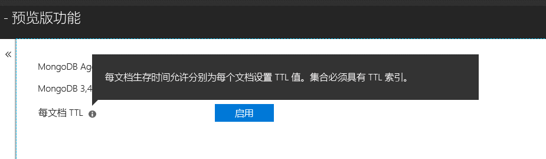

# <a name="expire-data-in-azure-cosmos-db-mongodb-api"></a>使 Azure Cosmos DB MongoDB API 中的数据过期

生存时间 (TTL) 功能允许数据库将数据自动过期。 MongoDB API 使用 Azure Cosmos DB 的 TTL 功能。 支持两种模式：一是在整个集合上设置默认的 TTL 值，二是为每个文档设置单独的 TTL 值。 MongoDB API 中的控制 TTL 索引和按文档 TTL 值的逻辑与 [Azure Cosmos DB 中的相同](../cosmos-db/mongodb-indexing.md)。

## <a name="ttl-indexes"></a>TTL 索引
若要在集合上普遍启用 TTL，需创建[“TTL 索引”（生存时间索引）](../cosmos-db/mongodb-indexing.md)。 TTL 索引是 _ts 字段上的索引，其值为“expireAfterSeconds”。

示例：
```JavaScript
globaldb:PRIMARY> db.coll.createIndex({"_ts":1}, {expireAfterSeconds: 10})
{
        "_t" : "CreateIndexesResponse",
        "ok" : 1,
        "createdCollectionAutomatically" : true,
        "numIndexesBefore" : 1,
        "numIndexesAfter" : 4
}
```

以上示例中的命令将通过 TTL 功能创建一个索引。 创建索引以后，数据库会自动删除集合中未在过去 10 秒内修改的任何文档。 

> [!NOTE]
> **_ts** 是特定于 Cosmos DB 的字段，不可从 MongoDB 客户端访问。 它是一个保留（系统）属性，其中包含文档上一次修改的时间戳。
>
    
另外，C# 示例可以： 
```C# 
var options = new CreateIndexOptions {ExpireAfter = TimeSpan.FromSeconds(10)}; 
var field = new StringFieldDefinition<BsonDocument>("_ts"); 
var indexDefinition = new IndexKeysDefinitionBuilder<BsonDocument>().Ascending(field); 
await collection.Indexes.CreateOneAsync(indexDefinition, options); 
``` 

## <a name="set-time-to-live-value-for-a-document"></a>设置文档的生存时间值 
按文档 TTL 值也受支持。 文档必须包含根级属性“ttl”（小写），系统必须为该集合创建如上所述的 TTL 索引。 在文档上设置的 TTL 值将替代集合的 TTL 值。

TTL 值必须是 int32。 也可以是属于 int32 的 int64，或者是没有任何小数部分属于 int32 的 double。 不符合这些规范的 TTL 属性值是允许的，但不会被系统视为有意义的文档 TTL 值。

文档的 TTL 值为可选；没有 TTL 值的文档可以插入集合中。  在这种情况下，将使用集合的 TTL 值。 

以下文档具有有效的 TTL 值。 插入文档以后，文档 TTL 值会替代集合的 TTL 值。 因此，会在 20 秒后删除文档。  

```JavaScript 
globaldb:PRIMARY> db.coll.insert({id:1, location: "Paris", ttl: 20.0}) 
globaldb:PRIMARY> db.coll.insert({id:1, location: "Paris", ttl: NumberInt(20)}) 
globaldb:PRIMARY> db.coll.insert({id:1, location: "Paris", ttl: NumberLong(20)}) 
```

以下文档的 TTL 值无效。 文档可以插入，但文档 TTL 值不会被接受。 因此，文档会在 10 秒后被删除，因为使用的是集合的 TTL 值。 

```JavaScript 
globaldb:PRIMARY> db.coll.insert({id:1, location: "Paris", ttl: 20.5}) //TTL value contains non-zero decimal part. 
globaldb:PRIMARY> db.coll.insert({id:1, location: "Paris", ttl: NumberLong(2147483649)}) //TTL value is greater than Int32.MaxValue (2,147,483,648). 
``` 

## <a name="how-to-activate-the-per-document-ttl-feature"></a>如何激活按文档 TTL 功能
按文档 TTL 功能可以在 Azure 门户中通过 MongoDB API 帐户的“预览版功能”选项卡激活。

 

## <a name="next-steps"></a>后续步骤
* [利用生存时间使 Azure Cosmos DB 集合中的数据自动过期](../cosmos-db/time-to-live.md)
* [Azure Cosmos DB MongoDB API 中的索引编制](../cosmos-db/mongodb-indexing.md)
